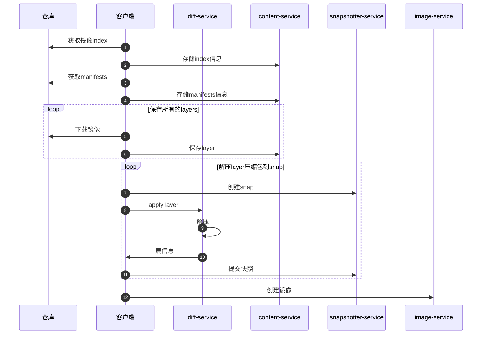

title: containerd
author: Nature丿灵然
tags:
  - 模版
categories:
  - 运维
date: 2020-12-14 15:15:00
---
<简介，将显示在首页>

<!--more-->

#### OCI镜像格式

##### 类型mediaType

最顶级的类型是index每个index类型下有多个manifest，区别是系统和架构不同


```shell
skopeo copy docker://docker.io/alpine:3.18.3 oci:alpine-oci --override-os linux --override-arch amd64
```

```shell
❯ tree                                                                   
.
├── blobs
│   └── sha256
│       ├── 7264a8db6415046d36d16ba98b79778e18accee6ffa71850405994cffa9be7de
│       ├── 913cf3a39d377faf89ed388ad913a318a390488c9f34c46e43424795cdabffe8
│       └── cf4e5bc0709f07284518b287f570c47bdb2afc14b8ae4f14077e9ff810a0120b
├── index.json
└── oci-layout

3 directories, 5 files

```

- cat index.json |jq

```json
{
  "schemaVersion": 2,
  "manifests": [
    {
      "mediaType": "application/vnd.oci.image.manifest.v1+json",
      "digest": "sha256:cf4e5bc0709f07284518b287f570c47bdb2afc14b8ae4f14077e9ff810a0120b",
      "size": 405
    }
  ]
}

```

#### containerd存储方式

#### 目录结构

- 其目录命名格式以`类型.id`的格式

- 有些目录根据插件并没内有显示

```shell
tree -L 2
.
├── io.containerd.content.v1.content # 存放从hub上下载的源文件
│   ├── blobs                        # 存放下载完毕的文件
│   └── ingest                       # 存放下载未完成的文件
├── io.containerd.grpc.v1.cri        # cri插件存放的文件
│   ├── containers                   # cri创建的容器
│   └── sandboxes
├── io.containerd.metadata.v1.bolt   # 存放containerd的数据文件
│   └── meta.db           
├── io.containerd.runtime.v1.linux
├── io.containerd.runtime.v2.task    # 运行的容器
│   └── k8s.io                       # namespace
├── io.containerd.snapshotter.v1.native
│   └── snapshots
├── io.containerd.snapshotter.v1.overlayfs # 存放解压过后的文件
│   ├── metadata.db                        # 解压数据库文件
│   └── snapshots                          # 解压的文件
└── tmpmounts                              # 临时挂载目录

15 directories, 2 files
```

- 使用ctr命令拉取镜像

```shell
ctr images pull docker.io/library/alpine:3.18.3
# docker.io/library/alpine:3.18.3:                                                  resolved       |++++++++++++++++++++++++++++++++++++++|
# index-sha256:7144f7bab3d4c2648d7e59409f15ec52a18006a128c733fcff20d3a4a54ba44a:    done           |++++++++++++++++++++++++++++++++++++++|
# manifest-sha256:c5c5fda71656f28e49ac9c5416b3643eaa6a108a8093151d6d1afc9463be8e33: done           |++++++++++++++++++++++++++++++++++++++|
# layer-sha256:7264a8db6415046d36d16ba98b79778e18accee6ffa71850405994cffa9be7de:    done           |++++++++++++++++++++++++++++++++++++++|
# config-sha256:7e01a0d0a1dcd9e539f8e9bbd80106d59efbdf97293b3d38f5d7a34501526cdb:   done           |++++++++++++++++++++++++++++++++++++++|
# elapsed: 4.6 s                                                                    total:  3.2 Mi (719.6 KiB/s)
# unpacking linux/amd64 sha256:7144f7bab3d4c2648d7e59409f15ec52a18006a128c733fcff20d3a4a54ba44a...
# done
```

oci镜像格式的`mediaType`参考[这里](https://github.com/opencontainers/image-spec/blob/main/media-types.md)

- 查看第一个sha256内容,每一个index下包含多个manifests,manifests主要用于区分操作系统和架构

```json
{
    "manifests": [
        {
            "digest": "sha256:c5c5fda71656f28e49ac9c5416b3643eaa6a108a8093151d6d1afc9463be8e33",
            "mediaType": "application/vnd.docker.distribution.manifest.v2+json",
            "platform": {
                "architecture": "amd64",
                "os": "linux"
            },
            "size": 528
        },
        {
            "digest": "sha256:f748290eb66ad6f938e25dd348acfb3527a422e280b7547b1cdfaf38d4492c4b",
            "mediaType": "application/vnd.docker.distribution.manifest.v2+json",
            "platform": {
                "architecture": "arm",
                "os": "linux",
                "variant": "v6"
            },
            "size": 528
        },
        {
            "digest": "sha256:16e86b2388774982fbdf230101a72201691b1f97cb0066c2099abf30dd7e6d59",
            "mediaType": "application/vnd.docker.distribution.manifest.v2+json",
            "platform": {
                "architecture": "arm",
                "os": "linux",
                "variant": "v7"
            },
            "size": 528
        },
        {
            "digest": "sha256:b312e4b0e2c665d634602411fcb7c2699ba748c36f59324457bc17de485f36f6",
            "mediaType": "application/vnd.docker.distribution.manifest.v2+json",
            "platform": {
                "architecture": "arm64",
                "os": "linux",
                "variant": "v8"
            },
            "size": 528
        },
        {
            "digest": "sha256:1fd62556954250bac80d601a196bb7fd480ceba7c10e94dd8fd4c6d1c08783d5",
            "mediaType": "application/vnd.docker.distribution.manifest.v2+json",
            "platform": {
                "architecture": "386",
                "os": "linux"
            },
            "size": 528
        },
        {
            "digest": "sha256:c75ede79e457d6454bca6fc51967a247a4b9daff9f31197cfbef69b1a651cada",
            "mediaType": "application/vnd.docker.distribution.manifest.v2+json",
            "platform": {
                "architecture": "ppc64le",
                "os": "linux"
            },
            "size": 528
        },
        {
            "digest": "sha256:5febc00b4d2a84af2a077bc34ea90659b6570110a54253f19c5dca8164b1dbf6",
            "mediaType": "application/vnd.docker.distribution.manifest.v2+json",
            "platform": {
                "architecture": "s390x",
                "os": "linux"
            },
            "size": 528
        }
    ],
    "mediaType": "application/vnd.docker.distribution.manifest.list.v2+json",
    "schemaVersion": 2
}

```

- content所有下载的文件叫content,存储在`/var/lib/containerd/io.containerd.content.v1.content/blobs/sha256`文件夹中

```json
{
   "schemaVersion": 2,
   "mediaType": "application/vnd.docker.distribution.manifest.v2+json",
   "config": {
      "mediaType": "application/vnd.docker.container.image.v1+json",
      "size": 1471,
      "digest": "sha256:7e01a0d0a1dcd9e539f8e9bbd80106d59efbdf97293b3d38f5d7a34501526cdb"
   },
   "layers": [
      {
         "mediaType": "application/vnd.docker.image.rootfs.diff.tar.gzip",
         "size": 3401613,
         "digest": "sha256:7264a8db6415046d36d16ba98b79778e18accee6ffa71850405994cffa9be7de"
      }
   ]
}
```

- 上面config下面的7e01a0d0a1dcd9e539f8e9bbd80106d59efbdf97293b3d38f5d7a34501526cdb可以用cat命令查看其中配置

```shell
cat 7e01a0d0a1dcd9e539f8e9bbd80106d59efbdf97293b3d38f5d7a34501526cdb
```

- 输出如下

```json
{
    "architecture": "amd64",
    "config": {
        "Hostname": "",
        "Domainname": "",
        "User": "",
        "AttachStdin": false,
        "AttachStdout": false,
        "AttachStderr": false,
        "Tty": false,
        "OpenStdin": false,
        "StdinOnce": false,
        "Env": [
            "PATH=/usr/local/sbin:/usr/local/bin:/usr/sbin:/usr/bin:/sbin:/bin"
        ],
        "Cmd": [
            "/bin/sh"
        ],
        "Image": "sha256:39dfd593e04b939e16d3a426af525cad29b8fc7410b06f4dbad8528b45e1e5a9",
        "Volumes": null,
        "WorkingDir": "",
        "Entrypoint": null,
        "OnBuild": null,
        "Labels": null
    },
    "container": "ba09fe2c8f99faad95871d467a22c96f4bc8166bd01ce0a7c28dd5472697bfd1",
    "container_config": {
        "Hostname": "ba09fe2c8f99",
        "Domainname": "",
        "User": "",
        "AttachStdin": false,
        "AttachStdout": false,
        "AttachStderr": false,
        "Tty": false,
        "OpenStdin": false,
        "StdinOnce": false,
        "Env": [
            "PATH=/usr/local/sbin:/usr/local/bin:/usr/sbin:/usr/bin:/sbin:/bin"
        ],
        "Cmd": [
            "/bin/sh",
            "-c",
            "#(nop) ",
            "CMD [\"/bin/sh\"]"
        ],
        "Image": "sha256:39dfd593e04b939e16d3a426af525cad29b8fc7410b06f4dbad8528b45e1e5a9",
        "Volumes": null,
        "WorkingDir": "",
        "Entrypoint": null,
        "OnBuild": null,
        "Labels": {}
    },
    "created": "2023-08-07T19:20:20.894140623Z",
    "docker_version": "20.10.23",
    "history": [
        {
            "created": "2023-08-07T19:20:20.71894984Z",
            "created_by": "/bin/sh -c #(nop) ADD file:32ff5e7a78b890996ee4681cc0a26185d3e9acdb4eb1e2aaccb2411f922fed6b in / "
        },
        {
            "created": "2023-08-07T19:20:20.894140623Z",
            "created_by": "/bin/sh -c #(nop)  CMD [\"/bin/sh\"]",
            "empty_layer": true
        }
    ],
    "os": "linux",
    "rootfs": {
        "type": "layers",
        "diff_ids": [
            "sha256:4693057ce2364720d39e57e85a5b8e0bd9ac3573716237736d6470ec5b7b7230"
        ]
    }
}
```

- 类型application/vnd.docker.image.rootfs.diff.tar.gzip可以用tar tf命令目录结构

```shell
tar tf 7264a8db6415046d36d16ba98b79778e18accee6ffa71850405994cffa9be7de
# bin/
# bin/arch
# bin/ash
# bin/base64
# bin/bbconfig
# bin/busybox
# bin/cat
# bin/chattr
# bin/chgrp
# bin/chmod
# ...
```

### 下载镜过程



### chanid怎么得出来的

sha256(sha256 + sha256)

### 参考

<https://blog.csdn.net/alex_yangchuansheng/article/details/111829103>
<https://www.myway5.com/index.php/2021/05/24/containerd-storage>
<https://www.myway5.com/index.php/2021/05/18/container-image>
<https://www.myway5.com/index.php/2021/05/24/containerd-storage/>
<https://github.com/containerd/containerd/blob/main/docs/content-flow.md>
<https://blog.csdn.net/weixin_40864891/article/details/107330218>
