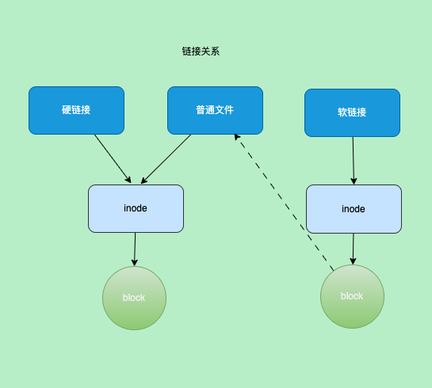

title: containerd源码-下载镜像
author: Nature丿灵然
tags:
  - k8s
  - containerd
categories:
  - 开发
date: 2023-10-26 15:15:00
---

前面介绍了插件注册以及启动,本次介绍下载镜像的过程

<!--more-->

#### Ctr命令下载镜像

> 主要依据ctr命令行工具来

##### 下载

- 老套路，直接点进去看`app.New()`

```go
// cmd/ctr/main.go
func main() {
  app := app.New()
  app.Commands = append(app.Commands, pluginCmds...)
  if err := app.Run(os.Args); err != nil {
    fmt.Fprintf(os.Stderr, "ctr: %s\n", err)
    os.Exit(1)
  }
}
```

- 这里面手机了很多子命令，我们主要关注`images.Command`

```go
// cmd/ctr/app/main.go
app.Commands = append([]cli.Command{
    plugins.Command,
    versionCmd.Command,
    containers.Command,
    content.Command,
    events.Command,
    images.Command,
    leases.Command,
    namespacesCmd.Command,
    pprof.Command,
    run.Command,
    snapshots.Command,
    tasks.Command,
    install.Command,
    ociCmd.Command,
  }, extraCmds...)
```

- 依然是收集命令的结构，点击去查看`pullCommand`

```go
// cmd/ctr/commands/images/images.go
var Command = cli.Command{
  Name:    "images",
  Aliases: []string{"image", "i"},
  Usage:   "manage images",
  Subcommands: cli.Commands{
    checkCommand,
    exportCommand,
    importCommand,
    listCommand,
    mountCommand,
    unmountCommand,
    pullCommand,
    pushCommand,
    removeCommand,
    tagCommand,
    setLabelsCommand,
    convertCommand,
  },
}
```

- 这里开始进入pull相关代码，主要在`Action`下,精简了下代码
- 首先创建了一个客户端，然后客户端获取了一个lease
- 最后开始下载，点进去`Fetch`

```go
// cmd/ctr/commands/images/pull.go

client, ctx, cancel, err := commands.NewClient(context)
    defer cancel()

    ctx, done, err := client.WithLease(ctx)
    defer done(ctx)

    config, err := content.NewFetchConfig(ctx, context)

    img, err := content.Fetch(ctx, client, ref, config)

```

- 开始处理了下是否使用`TraceHTTP`,然后创建了一个显示进度的，这个显示进度得就是使用`ctr i pull`时显示的进度，从这里可以看到另外开了个携程负责显示
- 紧接着根据配置文件将相关操作放到`opts`这个切片中,最后调用`client.Fetch()`

```shell
docker.io/library/alpine:3.18.3:                                                  resolved       |++++++++++++++++++++++++++++++++++++++|
index-sha256:7144f7bab3d4c2648d7e59409f15ec52a18006a128c733fcff20d3a4a54ba44a:    done           |++++++++++++++++++++++++++++++++++++++|
manifest-sha256:c5c5fda71656f28e49ac9c5416b3643eaa6a108a8093151d6d1afc9463be8e33: done           |++++++++++++++++++++++++++++++++++++++|
layer-sha256:7264a8db6415046d36d16ba98b79778e18accee6ffa71850405994cffa9be7de:    done           |++++++++++++++++++++++++++++++++++++++|
config-sha256:7e01a0d0a1dcd9e539f8e9bbd80106d59efbdf97293b3d38f5d7a34501526cdb:   done           |++++++++++++++++++++++++++++++++++++++|
elapsed: 9.9 s                                                                    total:  3.1 Mi (322.3 KiB/s)
unpacking linux/amd64 sha256:7144f7bab3d4c2648d7e59409f15ec52a18006a128c733fcff20d3a4a54ba44a...
done: 294.389123ms
```

```go
// cmd/ctr/commands/content/fetch.go

// Fetch loads all resources into the content store and returns the image
func Fetch(ctx context.Context, client *containerd.Client, ref string, config *FetchConfig) (images.Image, error) {
ongoing := NewJobs(ref)

  if config.TraceHTTP {
    ctx = httptrace.WithClientTrace(ctx, commands.NewDebugClientTrace(ctx))
  }

  // 进度条
  pctx, stopProgress := context.WithCancel(ctx)
  progress := make(chan struct{})

  go func() {
    if config.ProgressOutput != nil {
      // no progress bar, because it hides some debug logs
      ShowProgress(pctx, ongoing, client.ContentStore(), config.ProgressOutput)
    }
    close(progress)
  }()

  h := images.HandlerFunc(func(ctx context.Context, desc ocispec.Descriptor) ([]ocispec.Descriptor, error) {
    if desc.MediaType != images.MediaTypeDockerSchema1Manifest {
      ongoing.Add(desc)
    }
    return nil, nil
  })

  log.G(pctx).WithField("image", ref).Debug("fetching")
  labels := commands.LabelArgs(config.Labels)
  opts := []containerd.RemoteOpt{
    containerd.WithPullLabels(labels),
    containerd.WithResolver(config.Resolver),
    containerd.WithImageHandler(h),
    containerd.WithSchema1Conversion,
  }
  opts = append(opts, config.RemoteOpts...)

  if config.AllMetadata {
    opts = append(opts, containerd.WithAllMetadata())
  }

  if config.PlatformMatcher != nil {
    opts = append(opts, containerd.WithPlatformMatcher(config.PlatformMatcher))
  } else {
    for _, platform := range config.Platforms {
      opts = append(opts, containerd.WithPlatform(platform))
    }
  }

  img, err := client.Fetch(pctx, ref, opts...)
  stopProgress()
  if err != nil {
    return images.Image{}, err
  }

  <-progress
  return img, nil
}
```

- 这里首先创建一个`fetchCtx`并将将上面一些`opts`执行到fetcCtx中
- 然后判断是不是下载时就进行解包，ctr命令里是先下载所有layer到content存储，然后在解压到快照服务，如果这个为真则下载一个layer就解压一个，在这里不支持边下载边解压
- 随后根据配置来决定下载的平台()
- 最终执行`c.fetch`，点进去

```go
// client.go

func (c *Client) Fetch(ctx context.Context, ref string, opts ...RemoteOpt) (images.Image, error) {
  fetchCtx := defaultRemoteContext() // 申明最终用于下载的组件
  for _, o := range opts {
    if err := o(c, fetchCtx); err != nil {
      return images.Image{}, err
    }
  }

  if fetchCtx.Unpack {
    return images.Image{}, errors.Wrap(errdefs.ErrNotImplemented, "unpack on fetch not supported, try pull")
  }

  if fetchCtx.PlatformMatcher == nil {
    if len(fetchCtx.Platforms) == 0 {
      fetchCtx.PlatformMatcher = platforms.All
    } else {
      var ps []ocispec.Platform
      for _, s := range fetchCtx.Platforms {
        p, err := platforms.Parse(s)
        if err != nil {
          return images.Image{}, errors.Wrapf(err, "invalid platform %s", s)
        }
        ps = append(ps, p)
      }
      fetchCtx.PlatformMatcher = platforms.Any(ps...)
    }
  }

  ctx, done, err := c.WithLease(ctx)
  defer done(ctx)

  img, err := c.fetch(ctx, fetchCtx, ref, 0)

  return c.createNewImage(ctx, img)
}
```

- 通过客户创建另一个cotent，为下载存储做准备
- `rCtx.Resolver.Resolve()`镜像名字来解析index等信息
- 接下来都是根据解析出来的`desc`解析出来的类型判断是否需要需要转换格式，主要是早期docker格式的v1版本转换,
- 随后对`childerHadner`进行变量的判断来处理
- 所有的hander都放到`handlers`这个切片中，然后后丢给`images.Handlers`处理
- `images.Dispatch`对desc遍历并递归调用每层都会经过上面的hander处理
- 最终返回一个`images.Image`对象,到此下下载镜像完成

```go
// pull.go

func (c *Client) fetch(ctx context.Context, rCtx *RemoteContext, ref string, limit int) (images.Image, error) {
  store := c.ContentStore()

  name, desc, err := rCtx.Resolver.Resolve(ctx, ref)

  fetcher, err := rCtx.Resolver.Fetcher(ctx, name)

  var (
    handler images.Handler
    isConvertible bool
    converterFunc func(context.Context, ocispec.Descriptor) (ocispec.Descriptor, error)
    limiter       *semaphore.Weighted
  )

  if desc.MediaType == images.MediaTypeDockerSchema1Manifest && rCtx.ConvertSchema1 {
    schema1Converter := schema1.NewConverter(store, fetcher)
    handler = images.Handlers(append(rCtx.BaseHandlers, schema1Converter)...)
    isConvertible = true
    converterFunc = func(ctx context.Context, _ ocispec.Descriptor) (ocispec.Descriptor, error) {
      return schema1Converter.Convert(ctx)
    }
  } else {
    // Get all the children for a descriptor
    childrenHandler := images.ChildrenHandler(store)
    // Set any children labels for that content
    childrenHandler = images.SetChildrenMappedLabels(store, childrenHandler, rCtx.ChildLabelMap)
    if rCtx.AllMetadata {
      // Filter manifests by platforms but allow to handle manifest
      // and configuration for not-target platforms
      childrenHandler = remotes.FilterManifestByPlatformHandler(childrenHandler, rCtx.PlatformMatcher)
    } else {
      // Filter children by platforms if specified.
      childrenHandler = images.FilterPlatforms(childrenHandler, rCtx.PlatformMatcher)
    }
    // Sort and limit manifests if a finite number is needed
    if limit > 0 {
      childrenHandler = images.LimitManifests(childrenHandler, rCtx.PlatformMatcher, limit)
    }

    // set isConvertible to true if there is application/octet-stream media type
    convertibleHandler := images.HandlerFunc(
      func(_ context.Context, desc ocispec.Descriptor) ([]ocispec.Descriptor, error) {
        if desc.MediaType == docker.LegacyConfigMediaType {
          isConvertible = true
        }

        return []ocispec.Descriptor{}, nil
      },
    )

    appendDistSrcLabelHandler, err := docker.AppendDistributionSourceLabel(store, ref)

    handlers := append(rCtx.BaseHandlers,
      remotes.FetchHandler(store, fetcher), // 负责下载
      convertibleHandler,
      childrenHandler,
      appendDistSrcLabelHandler,
    )

    handler = images.Handlers(handlers...)

    converterFunc = func(ctx context.Context, desc ocispec.Descriptor) (ocispec.Descriptor, error) {
      return docker.ConvertManifest(ctx, store, desc)
    }
  }

  if rCtx.HandlerWrapper != nil {
    handler = rCtx.HandlerWrapper(handler)
  }

  if rCtx.MaxConcurrentDownloads > 0 {
    limiter = semaphore.NewWeighted(int64(rCtx.MaxConcurrentDownloads))
  }

  // 递归调用
  if err := images.Dispatch(ctx, handler, limiter, desc); err != nil {
    return images.Image{}, err
  }

  if isConvertible {
    if desc, err = converterFunc(ctx, desc); err != nil {
      return images.Image{}, err
    }
  }

  return images.Image{
    Name:   name,
    Target: desc,
    Labels: rCtx.Labels,
  }, nil
}
```

- 其中主要下载的函数是`remotes.FetchHandler(store, fetcher)`,这个函数首先判断MediaType,docker v1的直接报错报错返回
主要看`fetch`

```go
// remotes/handlers.go

// FetchHandler returns a handler that will fetch all content into the ingester
// discovered in a call to Dispatch. Use with ChildrenHandler to do a full
// recursive fetch.
func FetchHandler(ingester content.Ingester, fetcher Fetcher) images.HandlerFunc {
  return func(ctx context.Context, desc ocispec.Descriptor) (subdescs []ocispec.Descriptor, err error) {
    ctx = log.WithLogger(ctx, log.G(ctx).WithFields(logrus.Fields{
      "digest":    desc.Digest,
      "mediatype": desc.MediaType,
      "size":      desc.Size,
    }))

    switch desc.MediaType {
    case images.MediaTypeDockerSchema1Manifest:
      return nil, fmt.Errorf("%v not supported", desc.MediaType)
    default:
      err := fetch(ctx, ingester, fetcher, desc) // 真正用来干活的
      return nil, err
    }
  }
}
```

- 调用`content.OpenWriter()`创建了cw,通过错误判断是不是已经存在了
- 调用`Status()`获取状态，然后判断是content-service中大小，如果相同则提交
- 随后调用`fetcher.Fetch()`开始真正的下载内容然后通过流式拷贝到`content.Writer()`

```go
func fetch(ctx context.Context, ingester content.Ingester, fetcher Fetcher, desc ocispec.Descriptor) error {
  
  cw, err := content.OpenWriter(ctx, ingester, content.WithRef(MakeRefKey(ctx, desc)), content.WithDescriptor(desc))
  if err != nil {
    if errdefs.IsAlreadyExists(err) {
      return nil
    }
    return err
  }
  defer cw.Close()

  ws, err := cw.Status()

  if desc.Size == 0 {
    // most likely a poorly configured registry/web front end which responded with no
    // Content-Length header; unable (not to mention useless) to commit a 0-length entry
    // into the content store. Error out here otherwise the error sent back is confusing
    return errors.Wrapf(errdefs.ErrInvalidArgument, "unable to fetch descriptor (%s) which reports content size of zero", desc.Digest)
  }
  if ws.Offset == desc.Size {
    // If writer is already complete, commit and return
    err := cw.Commit(ctx, desc.Size, desc.Digest)
    if err != nil && !errdefs.IsAlreadyExists(err) {
      return errors.Wrapf(err, "failed commit on ref %q", ws.Ref)
    }
    return nil
  }

  rc, err := fetcher.Fetch(ctx, desc) // 下载数据

  defer rc.Close()

  return content.Copy(ctx, cw, rc, desc.Size, desc.Digest) // 拷贝数据
}
```

- 镜像layer下载完成之后需要解压因此回到Fetch函数，执行完c.fetch之后根据返回的image对象创建了一个image,可以看到其实是根据客户端创建了一个ImagesService
然后创建了个imags,

```go
func (c *Client) Fetch(ctx context.Context, ref string, opts ...RemoteOpt) (images.Image, error) {
  // 省略
  img, err := c.fetch(ctx, fetchCtx, ref, 0)
  return c.createNewImage(ctx, img)
}


func (c *Client) createNewImage(ctx context.Context, img images.Image) (images.Image, error) {
  is := c.ImageService()
  for {
    if created, err := is.Create(ctx, img); err != nil {
      if !errdefs.IsAlreadyExists(err) {
        return images.Image{}, err
      }

      updated, err := is.Update(ctx, img)
      if err != nil {
        // if image was removed, try create again
        if errdefs.IsNotFound(err) {
          continue
        }
        return images.Image{}, err
      }

      img = updated
    } else {
      img = created
    }

    return img, nil
  }
}
```

##### 解压

- 回到Action中,根据`content.Fetch`中返回的img,然后根据配置参数是否全平台来遍历
- 循环中调用了`containerd.NewImageWithPlatform()`创建了一个`containerd.Image`类型的i,然后调用`i.Unpack()`开始解压,

```go
// cmd/ctr/commands/images/pull.go
Action: func(context *cli.Context) error {
// 省略

img, err := content.Fetch(ctx, client, ref, config)

var p []ocispec.Platform
    if context.Bool("all-platforms") {
      p, err = images.Platforms(ctx, client.ContentStore(), img.Target)
      if err != nil {
        return errors.Wrap(err, "unable to resolve image platforms")
      }
    } else {
      for _, s := range context.StringSlice("platform") {
        ps, err := platforms.Parse(s)
        if err != nil {
          return errors.Wrapf(err, "unable to parse platform %s", s)
        }
        p = append(p, ps)
      }
    }
    if len(p) == 0 {
      p = append(p, platforms.DefaultSpec())
    }

    start := time.Now()
    for _, platform := range p {
      fmt.Printf("unpacking %s %s...\n", platforms.Format(platform), img.Target.Digest)
      i := containerd.NewImageWithPlatform(client, img, platforms.Only(platform))

      err = i.Unpack(ctx, context.String("snapshotter"))

      if context.Bool("print-chainid") {
        diffIDs, err := i.RootFS(ctx)

        chainID := identity.ChainID(diffIDs).String()
        fmt.Printf("image chain ID: %s\n", chainID)
      }
    }
    fmt.Printf("done: %s\t\n", time.Since(start))
    return nil
}
```

- 首先获取一个lease,然后执行opt传参
- 调用`i.getManifest()`获取manifest，调用`i.getLayers()`获取layers
- 申明一个`DiffService`和`ContentStore`以及一个`snapshotter`
- 遍历layers,开始调用`rootfs.ApplyLayerWithOpts`开始对每一层进行解压

```go
// image.go
func (i *image) Unpack(ctx context.Context, snapshotterName string, opts ...UnpackOpt) error {
  ctx, done, err := i.client.WithLease(ctx)
  defer done(ctx)

  var config UnpackConfig
  for _, o := range opts {
    if err := o(ctx, &config); err != nil {
      return err
    }
  }

  manifest, err := i.getManifest(ctx, i.platform)

  layers, err := i.getLayers(ctx, i.platform, manifest)

  var (
    a  = i.client.DiffService()
    cs = i.client.ContentStore()

    chain    []digest.Digest
    unpacked bool
  )
  snapshotterName, err = i.client.resolveSnapshotterName(ctx, snapshotterName)

  sn, err := i.client.getSnapshotter(ctx, snapshotterName)

  if config.CheckPlatformSupported {
    if err := i.checkSnapshotterSupport(ctx, snapshotterName, manifest); err != nil {
      return err
    }
  }

  for _, layer := range layers {
    unpacked, err = rootfs.ApplyLayerWithOpts(ctx, layer, chain, sn, a, config.SnapshotOpts, config.ApplyOpts)
    if unpacked {
      // Set the uncompressed label after the uncompressed
      // digest has been verified through apply.
      cinfo := content.Info{
        Digest: layer.Blob.Digest,
        Labels: map[string]string{
          "containerd.io/uncompressed": layer.Diff.Digest.String(),
        },
      }
      if _, err := cs.Update(ctx, cinfo, "labels.containerd.io/uncompressed"); err != nil {
        return err
      }
    }

    chain = append(chain, layer.Diff.Digest)
  }

  desc, err := i.i.Config(ctx, cs, i.platform)

  rootfs := identity.ChainID(chain).String()

  cinfo := content.Info{
    Digest: desc.Digest,
    Labels: map[string]string{
      fmt.Sprintf("containerd.io/gc.ref.snapshot.%s", snapshotterName): rootfs,
    },
  }

  _, err = cs.Update(ctx, cinfo, fmt.Sprintf("labels.containerd.io/gc.ref.snapshot.%s", snapshotterName))
  return err
}
```

- 这里会请求snapshot的Stst()查看状态，通过判断错误是不是已存在来决定是否进行下一步，若一切没问题则调用`applyLayers()`正式解压
- 这里需要注意这个`chainID`,chainID是通过每个layer的`sha256(sha256+sha256)`计算得来，其中这些sha256就是config类型的layer中`diff_ids`

```go
// rootfs/apply.go

// ApplyLayerWithOpts applies a single layer on top of the given provided layer chain,
// using the provided snapshotter, applier, and apply opts. If the layer was unpacked true
// is returned, if the layer already exists false is returned.
func ApplyLayerWithOpts(ctx context.Context, layer Layer, chain []digest.Digest, sn snapshots.Snapshotter, a diff.Applier, opts []snapshots.Opt, applyOpts []diff.ApplyOpt) (bool, error) {
  var (
    chainID = identity.ChainID(append(chain, layer.Diff.Digest)).String()
    applied bool
  )

  if _, err := sn.Stat(ctx, chainID); err != nil {
    if !errdefs.IsNotFound(err) {
      return false, errors.Wrapf(err, "failed to stat snapshot %s", chainID)
    }

    if err := applyLayers(ctx, []Layer{layer}, append(chain, layer.Diff.Digest), sn, a, opts, applyOpts); err != nil {
      if !errdefs.IsAlreadyExists(err) {
        return false, err
      }
    } else {
      applied = true
    }
  }
  return applied, nil

}
```

- 主要发送请求`snapshots.Prepare()`接口,获取到`mount`作为参数请求apply参数,随后`snapshots.Commit()`
- 到此整个解压完成

```go
func applyLayers(ctx context.Context, layers []Layer, chain []digest.Digest, sn snapshots.Snapshotter, a diff.Applier, opts []snapshots.Opt, applyOpts []diff.ApplyOpt) error {
  var (
    parent  = identity.ChainID(chain[:len(chain)-1])
    chainID = identity.ChainID(chain)
    layer   = layers[len(layers)-1]
    diff    ocispec.Descriptor
    key     string
    mounts  []mount.Mount
    err     error
  )
  
  for {
    key = fmt.Sprintf(snapshots.UnpackKeyFormat, uniquePart(), chainID)// 生成请求的key格式

    // Prepare snapshot with from parent, label as root
    mounts, err = sn.Prepare(ctx, key, parent.String(), opts...)
    if err != nil {
      if errdefs.IsNotFound(err) && len(layers) > 1 {
        if err := applyLayers(ctx, layers[:len(layers)-1], chain[:len(chain)-1], sn, a, opts, applyOpts); err != nil {
          if !errdefs.IsAlreadyExists(err) {
            return err
          }
        }
        // Do no try applying layers again
        layers = nil
        continue
      } else if errdefs.IsAlreadyExists(err) {
        // Try a different key
        continue
      }

      // Already exists should have the caller retry
      return errors.Wrapf(err, "failed to prepare extraction snapshot %q", key)

    }
    break
  }
  defer func() {
    if err != nil {
      if !errdefs.IsAlreadyExists(err) {
        log.G(ctx).WithError(err).WithField("key", key).Infof("apply failure, attempting cleanup")
      }

      if rerr := sn.Remove(ctx, key); rerr != nil {
        log.G(ctx).WithError(rerr).WithField("key", key).Warnf("extraction snapshot removal failed")
      }
    }
  }()

  diff, err = a.Apply(ctx, layer.Blob, mounts, applyOpts...)
  if err != nil {
    err = errors.Wrapf(err, "failed to extract layer %s", layer.Diff.Digest)
    return err
  }
  if diff.Digest != layer.Diff.Digest {
    err = errors.Errorf("wrong diff id calculated on extraction %q", diff.Digest)
    return err
  }

  if err = sn.Commit(ctx, chainID.String(), key, opts...); err != nil {
    err = errors.Wrapf(err, "failed to commit snapshot %s", key)
    return err
  }

  return nil
}
```

- 回到Unpack这里获取镜像的config通过chan计算出id并更新到content的标签中

```go
func (i *image) Unpack(ctx context.Context, snapshotterName string, opts ...UnpackOpt) error {
// ...

  desc, err := i.i.Config(ctx, cs, i.platform)
  if err != nil {
    return err
  }

  rootfs := identity.ChainID(chain).String()

  cinfo := content.Info{
    Digest: desc.Digest,
    Labels: map[string]string{
      fmt.Sprintf("containerd.io/gc.ref.snapshot.%s", snapshotterName): rootfs,
    },
  }

  _, err = cs.Update(ctx, cinfo, fmt.Sprintf("labels.containerd.io/gc.ref.snapshot.%s", snapshotterName))
}
```

##### chanid怎么得出来的

sha256(sha256 + sha256)

#### 服务端

- 所有的服务都是通过插件的形式注册到grpc等服务中,都会有三种类型 grpc,service,和具体类型(content,snapshots等)

##### content

> content主要负责存储下载的layer接口定义在`content/content.go`中

```go
// content/content.go

type ReaderAt interface {
  io.ReaderAt
  io.Closer
  Size() int64
}

type Provider interface {
  ReaderAt(ctx context.Context, desc ocispec.Descriptor) (ReaderAt, error)
}

type Ingester interface {
  Writer(ctx context.Context, opts ...WriterOpt) (Writer, error)
}

type Info struct {
  Digest    digest.Digest
  Size      int64
  CreatedAt time.Time
  UpdatedAt time.Time
  Labels    map[string]string
}

// Status of a content operation
type Status struct {
  Ref       string
  Offset    int64
  Total     int64
  Expected  digest.Digest
  StartedAt time.Time
  UpdatedAt time.Time
}


type WalkFunc func(Info) error
type Manager interface {
  Info(ctx context.Context, dgst digest.Digest) (Info, error)
  Update(ctx context.Context, info Info, fieldpaths ...string) (Info, error)
  Walk(ctx context.Context, fn WalkFunc, filters ...string) error
  Delete(ctx context.Context, dgst digest.Digest) error
}
type IngestManager interface {
  Status(ctx context.Context, ref string) (Status, error)
  ListStatuses(ctx context.Context, filters ...string) ([]Status, error)
  Abort(ctx context.Context, ref string) error
}


type Writer interface {
  io.WriteCloser
  Digest() digest.Digest
  Commit(ctx context.Context, size int64, expected digest.Digest, opts ...Opt) error
  Status() (Status, error)
  Truncate(size int64) error
}

type Store interface {
  Manager
  Provider
  IngestManager
  Ingester
}
```

###### content grpc类型

- grpc类型的content注册在这里,使用统一的注册，申明名字类型以及依赖
- 然后从initcontent中获取所有service的插件,然后拿到一个`ContentService`实例
- 使用这个实例调用`contentserver.New()`,`contentserver.New()`实现了grpc相关方法

```go
// services/content/service.go
func init() {
  plugin.Register(&plugin.Registration{
    Type: plugin.GRPCPlugin,
    ID:   "content",
    Requires: []plugin.Type{
      plugin.ServicePlugin,
    },
    InitFn: func(ic *plugin.InitContext) (interface{}, error) {
      plugins, err := ic.GetByType(plugin.ServicePlugin)
      if err != nil {
        return nil, err
      }

      p, ok := plugins[services.ContentService]
      if !ok {
        return nil, errors.New("content store service not found")
      }
      cs, err := p.Instance()
      if err != nil {
        return nil, err
      }
      return contentserver.New(cs.(content.Store)), nil
    },
  })
}
```

- `service`就是抽象了`content.Store`

- `New()`设置了上层

```go
// services/content/contentserver/contentserver.go

type service struct {
  store content.Store
}

// New returns the content GRPC server
func New(cs content.Store) api.ContentServer {
  return &service{store: cs}
}

func (s *service) Register(server *grpc.Server) error {
  api.RegisterContentServer(server, s)
  return nil
}
```

- 由于接口很多就不一样介绍了，这里只介绍一个简单的接口
- 可以看到grpc请求来的参数传到`store.Status()`然后再将返回的组装成grpc结果并返回，其他api也是类似这种

```go
// services/content/contentserver/contentserver.go

func (s *service) Status(ctx context.Context, req *api.StatusRequest) (*api.StatusResponse, error) {
  status, err := s.store.Status(ctx, req.Ref)
  if err != nil {
    return nil, errdefs.ToGRPCf(err, "could not get status for ref %q", req.Ref)
  }

  var resp api.StatusResponse
  resp.Status = &api.Status{
    StartedAt: status.StartedAt,
    UpdatedAt: status.UpdatedAt,
    Ref:       status.Ref,
    Offset:    status.Offset,
    Total:     status.Total,
    Expected:  status.Expected,
  }

  return &resp, nil
}
```

###### content service类型

- 这里他依赖`plugin.MetadataPlugin`这个类型,然后将获取的meteada传入`meatadata.ContentStore()`

```go
// services/content/store.go

func init() {
  plugin.Register(&plugin.Registration{
    Type: plugin.ServicePlugin,
    ID:   services.ContentService,
    Requires: []plugin.Type{
      plugin.MetadataPlugin,
    },
    InitFn: func(ic *plugin.InitContext) (interface{}, error) {
      m, err := ic.Get(plugin.MetadataPlugin)
      if err != nil {
        return nil, err
      }

      // 这里注册 content的svc
      s, err := newContentStore(m.(*metadata.DB).ContentStore(), ic.Events)
      return s, err
    },
  })
}


func newContentStore(cs content.Store, publisher events.Publisher) (content.Store, error) {
  return &store{
    Store:     cs,
    publisher: publisher,
  }, nil
}
```

- 可以看到前面调用的`ContentStore()`返回的就是初始化,而meteadata创建的注册在`services/server/server.go`前面介绍启动过程介绍过

```go
// metadata/db.go


// NewDB creates a new metadata database using the provided
// bolt database, content store, and snapshotters.
func NewDB(db *bolt.DB, cs content.Store, ss map[string]snapshots.Snapshotter, opts ...DBOpt) *DB {
  m := &DB{
    db:      db,
    ss:      make(map[string]*snapshotter, len(ss)),
    dirtySS: map[string]struct{}{},
    dbopts: dbOptions{
      shared: true,
    },
  }

  for _, opt := range opts {
    opt(&m.dbopts)
  }

  // Initialize data stores
  m.cs = newContentStore(m, m.dbopts.shared, cs)
  for name, sn := range ss {
    m.ss[name] = newSnapshotter(m, name, sn)
  }

  return m
}

// ContentStore returns a namespaced content store
// proxied to a content store.
func (m *DB) ContentStore() content.Store {
  if m.cs == nil {
    return nil
  }
  return m.cs
}
```

- 同样实现了content的很多方法,下面得了例子可以看到这里先读取数据库，然后在调用`store.Status()`

```go
// metadata/content.go

func (cs *contentStore) Status(ctx context.Context, ref string) (content.Status, error) {
  ns, err := namespaces.NamespaceRequired(ctx)

  var bref string
  if err := view(ctx, cs.db, func(tx *bolt.Tx) error {
    bref = getRef(tx, ns, ref)
    if bref == "" {
      return errors.Wrapf(errdefs.ErrNotFound, "reference %v", ref)
    }

    return nil
  }); err != nil {
    return content.Status{}, err
  }

  st, err := cs.Store.Status(ctx, bref)
  if err != nil {
    return content.Status{}, err
  }
  st.Ref = ref
  return st, nil
}
```

###### content类型

> content有2中实现,一种本地(local),一种prox(远程)

- local:就是本地实现,目前可以理解为真正实现
- proxy:则是调用远程的实现，因为content有插件

- 注册则在`loadPlugin()`中首先会将本地的注册，随后读取配置文件中的`proxy_plugin`配置在注册proxy类型的，
需要注意的是插件在整理之后会返回第一个可能导致你注册的content需要再配置文件中`disabled_plugins`参数关闭local强制使用proxy类型的

```go
// services/server/server.go

  plugin.Register(&plugin.Registration{
    Type: plugin.ContentPlugin,
    ID:   "content",
    InitFn: func(ic *plugin.InitContext) (interface{}, error) {
      ic.Meta.Exports["root"] = ic.Root
      return local.NewStore(ic.Root)
    },
  })

  clients := &proxyClients{}
  for name, pp := range config.ProxyPlugins {
    var (
      t plugin.Type
      f func(*grpc.ClientConn) interface{}

      address = pp.Address
    )

    // nsap逻辑

    case string(plugin.ContentPlugin), "content":
      t = plugin.ContentPlugin
      f = func(conn *grpc.ClientConn) interface{} {
        return csproxy.NewContentStore(csapi.NewContentClient(conn))
      }
    default:
      log.G(ctx).WithField("type", pp.Type).Warn("unknown proxy plugin type")
    }

    plugin.Register(&plugin.Registration{
      Type: t,
      ID:   name,
      InitFn: func(ic *plugin.InitContext) (interface{}, error) {
        ic.Meta.Exports["address"] = address
        conn, err := clients.getClient(address)
        if err != nil {
          return nil, err
        }
        return f(conn), nil
      },
    })
```

- 接口实现本质就是读取存储的文件一些信息,然后返回

```go
// content/local/store.go

// status works like stat above except uses the path to the ingest.
func (s *store) status(ingestPath string) (content.Status, error) {
  dp := filepath.Join(ingestPath, "data")
  fi, err := os.Stat(dp)

  ref, err := readFileString(filepath.Join(ingestPath, "ref"))

  startedAt, err := readFileTimestamp(filepath.Join(ingestPath, "startedat"))
 
  updatedAt, err := readFileTimestamp(filepath.Join(ingestPath, "updatedat"))
 
  // because we don't write updatedat on every write, the mod time may
  // actually be more up to date.
  if fi.ModTime().After(updatedAt) {
    updatedAt = fi.ModTime()
  }

  return content.Status{
    Ref:       ref,
    Offset:    fi.Size(),
    Total:     s.total(ingestPath),
    UpdatedAt: updatedAt,
    StartedAt: startedAt,
  }, nil
}
```

##### snapshot

> snapshot和content的结构类似,其接口定义如下

```go
// snapshots/snapshotter.go

type Snapshotter interface {
  Stat(ctx context.Context, key string) (Info, error)
  Update(ctx context.Context, info Info, fieldpaths ...string) (Info, error)
  Usage(ctx context.Context, key string) (Usage, error)
  Mounts(ctx context.Context, key string) ([]mount.Mount, error) // 只是返回了mount参数并没有真正的mount
  Prepare(ctx context.Context, key, parent string, opts ...Opt) ([]mount.Mount, error) 
  View(ctx context.Context, key, parent string, opts ...Opt) ([]mount.Mount, error) // 和commit一样只不过是只读的
  Commit(ctx context.Context, name, key string, opts ...Opt) erro
  Remove(ctx context.Context, key string) erro
  Walk(ctx context.Context, fn WalkFunc, filters ...string) erro
  Close() error
}
```

###### snapshot grpc类型

- 注册插件，他依赖于service类型,同样实现了Register方法调用了grpc进行api注册服务

```go
// services/snapshots/service.go
func init() {
  plugin.Register(&plugin.Registration{
    Type: plugin.GRPCPlugin,
    ID:   "snapshots",
    Requires: []plugin.Type{
      plugin.ServicePlugin,
    },
    InitFn: newService,
  })
}

func newService(ic *plugin.InitContext) (interface{}, error) {
  plugins, err := ic.GetByType(plugin.ServicePlugin)
  if err != nil {
    return nil, err
  }
  p, ok := plugins[services.SnapshotsService]
  if !ok {
    return nil, errors.New("snapshots service not found")
  }
  i, err := p.Instance()
  if err != nil {
    return nil, err
  }
  ss := i.(map[string]snapshots.Snapshotter)
  return &service{ss: ss}, nil
}

func (s *service) Register(gs *grpc.Server) error {
  snapshotsapi.RegisterSnapshotsServer(gs, s)
  return nil
}
```

- snapshot的service有个map,因为snapshotter有很多实现，比如默认的`overlayfs`还有`devmapper`等

```go
type service struct {
  ss map[string]snapshots.Snapshotter
}
```

- 我们看下其中一个api的实现，主要是处理grpc的请求和响应操作，需要注意的是传入的参数中有`Snapshotter`id,然后执行对应的snap的api,后面就到了service层处理

```go
func (s *service) Prepare(ctx context.Context, pr *snapshotsapi.PrepareSnapshotRequest) (*snapshotsapi.PrepareSnapshotResponse, error) {
  log.G(ctx).WithField("parent", pr.Parent).WithField("key", pr.Key).Debugf("prepare snapshot")
  sn, err := s.getSnapshotter(pr.Snapshotter)

  var opts []snapshots.Opt
  if pr.Labels != nil {
    opts = append(opts, snapshots.WithLabels(pr.Labels))
  }
  mounts, err := sn.Prepare(ctx, pr.Key, pr.Parent, opts...)

  return &snapshotsapi.PrepareSnapshotResponse{
    Mounts: fromMounts(mounts),
  }, nil
}
```

###### snapshot service类型

- 依赖MetadataPlugin类型吗,调用`db.Snapshotters()`拿到snap,meterdata里通过NewDB()传值

```go
func init() {
// services/snapshots/snapshotters.go
  plugin.Register(&plugin.Registration{
    Type: plugin.ServicePlugin,
    ID:   services.SnapshotsService,
    Requires: []plugin.Type{
      plugin.MetadataPlugin,
    },
    InitFn: func(ic *plugin.InitContext) (interface{}, error) {
      m, err := ic.Get(plugin.MetadataPlugin)

      db := m.(*metadata.DB)
      ss := make(map[string]snapshots.Snapshotter)
      for n, sn := range db.Snapshotters() {
        ss[n] = newSnapshotter(sn, ic.Events)
      }
      return ss, nil
    },
  })
}
```

- 实际调用了metedata的`Prepare()`,这里进行了大量的数据库操作

```go
func (s *snapshotter) Prepare(ctx context.Context, key, parent string, opts ...snapshots.Opt) ([]mount.Mount, error) {
  mounts, err := s.Snapshotter.Prepare(ctx, key, parent, opts...)
  if err := s.publisher.Publish(ctx, "/snapshot/prepare", &eventstypes.SnapshotPrepare{
    Key:    key,
    Parent: parent,
  }); err != nil {
    return nil, err
  }
  return mounts, nil
}
```

- 这可以可以看到prepare和view实现都是一样的只不过view是只读的
- 源码很长这里不放了,其主要在数据存记录snap相关信息
- 随后调用真正的snap实现

```go
// containerd/metadata/snapshot.go

func (s *snapshotter) Prepare(ctx context.Context, key, parent string, opts ...snapshots.Opt) ([]mount.Mount, error) {
  return s.createSnapshot(ctx, key, parent, false, opts)
}

func (s *snapshotter) View(ctx context.Context, key, parent string, opts ...snapshots.Opt) ([]mount.Mount, error) {
  return s.createSnapshot(ctx, key, parent, true, opts)
}

func (s *snapshotter) createSnapshot(ctx context.Context, key, parent string, readonly bool, opts []snapshots.Opt) ([]mount.Mount, error) {
  // 校验参数以及复制等代码略过

  if readonly {
    m, err = s.Snapshotter.View(ctx, bkey, bparent, bopts...)
  } else {
    m, err = s.Snapshotter.Prepare(ctx, bkey, bparent, bopts...)
  }
}
```

###### snapshot类型

- 直接返回了`overlay.NewSnapshotter()`

```go
// snapshots/overlay/plugin/plugin.go

func init() {
  plugin.Register(&plugin.Registration{
    Type:   plugin.SnapshotPlugin,
    ID:     "overlayfs",
    Config: &Config{},
    InitFn: func(ic *plugin.InitContext) (interface{}, error) {
      ic.Meta.Platforms = append(ic.Meta.Platforms, platforms.DefaultSpec())
      config, ok := ic.Config.(*Config)

      root := ic.Root
      if config.RootPath != "" {
        root = config.RootPath
      }

      ic.Meta.Exports["root"] = root
      return overlay.NewSnapshotter(root, overlay.AsynchronousRemove)
    },
  })
}
```

- New函数中依然执行opt相关的操作,然后创建了目录随后创建数据库文件到这个目录中，注意这个数据库不metedata的数据库而是snap自己的数据库
- 读取了一些overlay相关参数

```go
// snapshots/overlay/overlay.go

func NewSnapshotter(root string, opts ...Opt) (snapshots.Snapshotter, error) {
  var config SnapshotterConfig
  for _, opt := range opts {
    if err := opt(&config); err != nil {
      return nil, err
    }
  }

  if err := os.MkdirAll(root, 0700); err != nil {


  ms, err := storage.NewMetaStore(filepath.Join(root, "metadata.db"))

  if err := os.Mkdir(filepath.Join(root, "snapshots"), 0700); err != nil && !os.IsExist(err) {
    return nil, err
  }

  // figure out whether "userxattr" option is recognized by the kernel && needed
  userxattr, err := overlayutils.NeedsUserXAttr(root)
  if err != nil {
    logrus.WithError(err).Warnf("cannot detect whether \"userxattr\" option needs to be used, assuming to be %v", userxattr)
  }

  return &snapshotter{
    root:        root,
    ms:          ms,
    asyncRemove: config.asyncRemove,
    indexOff:    indexOff,
    userxattr:   userxattr,
  }, nil
}
```

- 和前面调用的PrePare结构很相似,也只是传递的是否只读不一样

```go
func (o *snapshotter) Prepare(ctx context.Context, key, parent string, opts ...snapshots.Opt) ([]mount.Mount, error) {
  return o.createSnapshot(ctx, snapshots.KindActive, key, parent, opts)
}

func (o *snapshotter) View(ctx context.Context, key, parent string, opts ...snapshots.Opt) ([]mount.Mount, error) {
  return o.createSnapshot(ctx, snapshots.KindView, key, parent, opts)
}
```

- 首先创建一个临时目录然后数据中创建snap记录,如果有parent则修改guid,然后修改名字为正式的snap目录
- 最后通过mount函数返回

```go
// snapshots/overlay/overlay.go

func (o *snapshotter) createSnapshot(ctx context.Context, kind snapshots.Kind, key, parent string, opts []snapshots.Opt) (_ []mount.Mount, err error) {
  if err := o.ms.WithTransaction(ctx, true, func(ctx context.Context) (err error) {
    td, err = o.prepareDirectory(ctx, snapshotDir, kind)

    s, err = storage.CreateSnapshot(ctx, kind, key, parent, opts...)
 
    if len(s.ParentIDs) > 0 {
      st, err := os.Stat(o.upperPath(s.ParentIDs[0]))

      stat := st.Sys().(*syscall.Stat_t)
      if err := os.Lchown(filepath.Join(td, "fs"), int(stat.Uid), int(stat.Gid)); err != nil {}
    }

    path = filepath.Join(snapshotDir, s.ID)
    if err = os.Rename(td, path); err != nil {
      return fmt.Errorf("failed to rename: %w", err)
    }
    td = ""

    return nil
  }); err != nil {
    return nil, err
  }

  return o.mounts(s), nil
}
}
```

- mount函数根据snapshotter的ParentIDs来判断是否返回读写的bind类型挂载
- 通过判断是否是active来返回只读的bind类型挂载
- 最后通过ParentIDs组合overlay的参数

```go
// snapshots/overlay/overlay.go
func (o *snapshotter) mounts(s storage.Snapshot) []mount.Mount {
  if len(s.ParentIDs) == 0 {
    // if we only have one layer/no parents then just return a bind mount as overlay
    // will not work
    roFlag := "rw"
    if s.Kind == snapshots.KindView {
      roFlag = "ro"
    }

    return []mount.Mount{
      {
        Source: o.upperPath(s.ID),
        Type:   "bind",
        Options: []string{
          roFlag,
          "rbind",
        },
      },
    }
  }

  options := o.options
  if s.Kind == snapshots.KindActive {
    options = append(options,
      fmt.Sprintf("workdir=%s", o.workPath(s.ID)),
      fmt.Sprintf("upperdir=%s", o.upperPath(s.ID)),
    )
  } else if len(s.ParentIDs) == 1 {
    return []mount.Mount{
      {
        Source: o.upperPath(s.ParentIDs[0]),
        Type:   "bind",
        Options: []string{
          "ro",
          "rbind",
        },
      },
    }
  }
  parentPaths := make([]string, len(s.ParentIDs))
  for i := range s.ParentIDs {
    parentPaths[i] = o.upperPath(s.ParentIDs[i])
  }
  options = append(options, fmt.Sprintf("lowerdir=%s", strings.Join(parentPaths, ":")))
  return []mount.Mount{
    {
      Type:    "overlay",
      Source:  "overlay",
      Options: options,
    },
  }

}
```

###### bind mount

- bind的mount类型是linux内核实现的一种挂载他和链接(`link`)实现的功能很像,但是他实现更底层在vfs之下
- 参数rbind表示目录下的目录递归挂载到而不是这是这个一个,
- ro则表示只读



- bind相当于修改了文件的inode到挂载的目录上


```shell
mkdir test1 test2
ls -li
# 总用量 0
# 34260425 drwxr-xr-x 2 root root 6 10月 31 17:32 test1
# 50339286 drwxr-xr-x 2 root root 6 10月 31 17:32 test2

mount --bind ./test1 ./test2/

ll -ti
# 总用量 0
# 34260425 drwxr-xr-x 2 root root 6 10月 31 17:32 test1
# 34260425 drwxr-xr-x 2 root root 6 10月 31 17:32 test2

echo "foo"> ./test1/test
cat ./test2/test
# foo

# 显示的挂载是vda1而是test1
mount -l |grep test
# /dev/vda1 on /data/test/test2 type xfs (rw,relatime,attr2,inode64,noquota)
```

##### diff

- 接口比较少只有2个

```go
// diff/diff.go
type Applier interface {
  // Apply applies the content referred to by the given descriptor to
  // the provided mount. The method of applying is based on the
  // implementation and content descriptor. For example, in the common
  // case the descriptor is a file system difference in tar format,
  // that tar would be applied on top of the mounts.
  Apply(ctx context.Context, desc ocispec.Descriptor, mount []mount.Mount, opts ...ApplyOpt) (ocispec.Descriptor, error)
}

type Comparer interface {
  // Compare computes the difference between two mounts and returns a
  // descriptor for the computed diff. The options can provide
  // a ref which can be used to track the content creation of the diff.
  // The media type which is used to determine the format of the created
  // content can also be provided as an option.
  Compare(ctx context.Context, lower, upper []mount.Mount, opts ...Opt) (ocispec.Descriptor, error)
}
```

##### diff grpc类型

```go
func init() {
  plugin.Register(&plugin.Registration{
    Type: plugin.GRPCPlugin,
    ID:   "diff",
    Requires: []plugin.Type{
      plugin.ServicePlugin,
    },
    InitFn: func(ic *plugin.InitContext) (interface{}, error) {
      plugins, err := ic.GetByType(plugin.ServicePlugin)

      p, ok := plugins[services.DiffService]
 
      i, err := p.Instance()

      return &service{local: i.(diffapi.DiffClient)}, nil
    },
  })
}
```

##### diff service类型

- 这里注册的时候添加了一个config

```go
// services/diff/local.go
func init() {
  plugin.Register(&plugin.Registration{
    Type: plugin.ServicePlugin,
    ID:   services.DiffService,
    Requires: []plugin.Type{
      plugin.DiffPlugin,
    },
    Config: defaultDifferConfig,
    InitFn: func(ic *plugin.InitContext) (interface{}, error) {
      differs, err := ic.GetByType(plugin.DiffPlugin)
  
      orderedNames := ic.Config.(*config).Order
      ordered := make([]differ, len(orderedNames))
      for i, n := range orderedNames {
        differp, ok := differs[n]
    
        d, err := differp.Instance()
   
        ordered[i], ok = d.(differ)

      }
      return &local{
        differs: ordered,
      }, nil
    },
  })
}
```

##### diff类型

```go
func init() {
  plugin.Register(&plugin.Registration{
    Type: plugin.DiffPlugin,
    ID:   "walking",
    Requires: []plugin.Type{
      plugin.MetadataPlugin,
    },
    InitFn: func(ic *plugin.InitContext) (interface{}, error) {
      md, err := ic.Get(plugin.MetadataPlugin)
      if err != nil {
        return nil, err
      }

      ic.Meta.Platforms = append(ic.Meta.Platforms, platforms.DefaultSpec())
      cs := md.(*metadata.DB).ContentStore()

      return diffPlugin{
        Comparer: walking.NewWalkingDiff(cs),
        Applier:  apply.NewFileSystemApplier(cs),
      }, nil
    },
  })
}
```

```go
// diff/apply/apply.go

// NewFileSystemApplier returns an applier which simply mounts
// and applies diff onto the mounted filesystem.
func NewFileSystemApplier(cs content.Provider) diff.Applier {
  return &fsApplier{
    store: cs,
  }
}

func (s *fsApplier) Apply(ctx context.Context, desc ocispec.Descriptor, mounts []mount.Mount, opts ...diff.ApplyOpt) (d ocispec.Descriptor, err error) {

  // 从content读取
  ra, err := s.store.ReaderAt(ctx, desc)
  defer ra.Close()

  var processors []diff.StreamProcessor
  processor := diff.NewProcessorChain(desc.MediaType, content.NewReader(ra))
  processors = append(processors, processor)
  for {
    if processor, err = diff.GetProcessor(ctx, processor, config.ProcessorPayloads); err != nil {
      return emptyDesc, errors.Wrapf(err, "failed to get stream processor for %s", desc.MediaType)
    }
    processors = append(processors, processor)
    if processor.MediaType() == ocispec.MediaTypeImageLayer {
      break
    }
  }
  defer processor.Close()

  digester := digest.Canonical.Digester()
  rc := &readCounter{
    r: io.TeeReader(processor, digester.Hash()),
  }

  //真正开始apply
  if err := apply(ctx, mounts, rc); err != nil {
    return emptyDesc, err
  }

  // Read any trailing data
  if _, err := io.Copy(io.Discard, rc); err != nil {
    return emptyDesc, err
  }

  for _, p := range processors {
    if ep, ok := p.(interface{ Err() error }); ok {
      if err := ep.Err(); err != nil {
        return emptyDesc, err
      }
    }
  }
  return ocispec.Descriptor{
    MediaType: ocispec.MediaTypeImageLayer,
    Size:      rc.c,
    Digest:    digester.Digest(),
  }, nil
}
```

```go
func apply(ctx context.Context, mounts []mount.Mount, r io.Reader) error {
  switch {
  case len(mounts) == 1 && mounts[0].Type == "overlay":
    // OverlayConvertWhiteout (mknod c 0 0) doesn't work in userns.
    // https://github.com/containerd/containerd/issues/3762
    if userns.RunningInUserNS() {
      break
    }
    path, parents, err := getOverlayPath(mounts[0].Options)
    if err != nil {
      if errdefs.IsInvalidArgument(err) {
        break
      }
      return err
    }
    opts := []archive.ApplyOpt{
      archive.WithConvertWhiteout(archive.OverlayConvertWhiteout),
    }
    if len(parents) > 0 {
      opts = append(opts, archive.WithParents(parents))
    }
    _, err = archive.Apply(ctx, path, r, opts...)
    return err
  case len(mounts) == 1 && mounts[0].Type == "aufs":
    path, parents, err := getAufsPath(mounts[0].Options)
    if err != nil {
      if errdefs.IsInvalidArgument(err) {
        break
      }
      return err
    }
    opts := []archive.ApplyOpt{
      archive.WithConvertWhiteout(archive.AufsConvertWhiteout),
    }
    if len(parents) > 0 {
      opts = append(opts, archive.WithParents(parents))
    }
    _, err = archive.Apply(ctx, path, r, opts...)
    return err
  }
  return mount.WithTempMount(ctx, mounts, func(root string) error {
    _, err := archive.Apply(ctx, root, r)
    return err
  })
}
```

```go
// WithTempMount mounts the provided mounts to a temp dir, and pass the temp dir to f.
// The mounts are valid during the call to the f.
// Finally we will unmount and remove the temp dir regardless of the result of f.
func WithTempMount(ctx context.Context, mounts []Mount, f func(root string) error) (err error) {
  root, uerr := ioutil.TempDir(tempMountLocation, "containerd-mount")
  if uerr != nil {
    return errors.Wrapf(uerr, "failed to create temp dir")
  }
  // We use Remove here instead of RemoveAll.
  // The RemoveAll will delete the temp dir and all children it contains.
  // When the Unmount fails, RemoveAll will incorrectly delete data from
  // the mounted dir. However, if we use Remove, even though we won't
  // successfully delete the temp dir and it may leak, we won't loss data
  // from the mounted dir.
  // For details, please refer to #1868 #1785.
  defer func() {
    if uerr = os.Remove(root); uerr != nil {
      log.G(ctx).WithError(uerr).WithField("dir", root).Errorf("failed to remove mount temp dir")
    }
  }()

  // We should do defer first, if not we will not do Unmount when only a part of Mounts are failed.
  defer func() {
    if uerr = UnmountAll(root, 0); uerr != nil {
      uerr = errors.Wrapf(uerr, "failed to unmount %s", root)
      if err == nil {
        err = uerr
      } else {
        err = errors.Wrap(err, uerr.Error())
      }
    }
  }()

  // [{bind /root/snapshotter/snapshots/1/fs [rw rbind]}] /var/lib/containerd/tmpmounts/containerd-mount4278343774
  if uerr = All(mounts, root); uerr != nil {
    return errors.Wrapf(uerr, "failed to mount %s", root)
  }
  return errors.Wrapf(f(root), "mount callback failed on %s", root)
}
```

```go
unc (m *Mount) Mount(target string) (err error) {
  d, _ := json.Marshal(m)
  fmt.Println("====== mount target", target, string(d))

  for _, helperBinary := range allowedHelperBinaries {
    // helperBinary = "mount.fuse", typePrefix = "fuse."
    typePrefix := strings.TrimPrefix(helperBinary, "mount.") + "."
    if strings.HasPrefix(m.Type, typePrefix) {
      return m.mountWithHelper(helperBinary, typePrefix, target)
    }
  }
  var (
    chdir   string
    options = m.Options
  )

  // avoid hitting one page limit of mount argument buffer
  //
  // NOTE: 512 is a buffer during pagesize check.
  if m.Type == "overlay" && optionsSize(options) >= pagesize-512 {
    chdir, options = compactLowerdirOption(options)
  }

  flags, data, losetup := parseMountOptions(options)
  fmt.Println("=========parseMountOptions(options)", flags, data, losetup)
  if len(data) > pagesize {
    return errors.Errorf("mount options is too long")
  }

  // propagation types.
  const ptypes = unix.MS_SHARED | unix.MS_PRIVATE | unix.MS_SLAVE | unix.MS_UNBINDABLE

  // Ensure propagation type change flags aren't included in other calls.
  oflags := flags &^ ptypes

  // In the case of remounting with changed data (data != ""), need to call mount (moby/moby#34077).
  if flags&unix.MS_REMOUNT == 0 || data != "" {
    // Initial call applying all non-propagation flags for mount
    // or remount with changed data
    source := m.Source
    if losetup {
      loFile, err := setupLoop(m.Source, LoopParams{
        Readonly:  oflags&unix.MS_RDONLY == unix.MS_RDONLY,
        Autoclear: true})
      if err != nil {
        return err
      }
      defer loFile.Close()

      // Mount the loop device instead
      source = loFile.Name()
    }
    if err := mountAt(chdir, source, target, m.Type, uintptr(oflags), data); err != nil { // TODO
      return err
    }
    fmt.Println("挂载完成")
  }
```


```go
// archive/tar.go

// Apply applies a tar stream of an OCI style diff tar.
// See https://github.com/opencontainers/image-spec/blob/master/layer.md#applying-changesets
func Apply(ctx context.Context, root string, r io.Reader, opts ...ApplyOpt) (int64, error) {
  root = filepath.Clean(root)

  var options ApplyOptions
  for _, opt := range opts {
    if err := opt(&options); err != nil {
      return 0, errors.Wrap(err, "failed to apply option")
    }
  }
  if options.Filter == nil {
    options.Filter = all
  }
  if options.applyFunc == nil {
    options.applyFunc = applyNaive // 这里调用了applyNaive
  }

  return options.applyFunc(ctx, root, r, options)
}
```

```go
// archive/tar.go

// applyNaive applies a tar stream of an OCI style diff tar to a directory
// applying each file as either a whole file or whiteout.
// See https://github.com/opencontainers/image-spec/blob/master/layer.md#applying-changesets
func applyNaive(ctx context.Context, root string, r io.Reader, options ApplyOptions) (size int64, err error) {
  var (
    dirs []*tar.Header

    tr = tar.NewReader(r)

    // Used for handling opaque directory markers which
    // may occur out of order
    unpackedPaths = make(map[string]struct{})

    convertWhiteout = options.ConvertWhiteout
  )

  if convertWhiteout == nil {
    // handle whiteouts by removing the target files
    convertWhiteout = func(hdr *tar.Header, path string) (bool, error) {
      base := filepath.Base(path)
      dir := filepath.Dir(path)
      if base == whiteoutOpaqueDir {
        _, err := os.Lstat(dir)
        if err != nil {
          return false, err
        }
        err = filepath.Walk(dir, func(path string, info os.FileInfo, err error) error {
          if err != nil {
            if os.IsNotExist(err) {
              err = nil // parent was deleted
            }
            return err
          }
          if path == dir {
            return nil
          }
          if _, exists := unpackedPaths[path]; !exists {
            err := os.RemoveAll(path)
            return err
          }
          return nil
        })
        return false, err
      }

      if strings.HasPrefix(base, whiteoutPrefix) {
        originalBase := base[len(whiteoutPrefix):]
        originalPath := filepath.Join(dir, originalBase)

        return false, os.RemoveAll(originalPath)
      }

      return true, nil
    }
  }

  // Iterate through the files in the archive.
  for {
    select {
    case <-ctx.Done():
      return 0, ctx.Err()
    default:
    }

    hdr, err := tr.Next()
    if err == io.EOF {
      // end of tar archive
      break
    }
    if err != nil {
      return 0, err
    }

    size += hdr.Size

    // Normalize name, for safety and for a simple is-root check
    hdr.Name = filepath.Clean(hdr.Name)

    accept, err := options.Filter(hdr)
    if err != nil {
      return 0, err
    }
    if !accept {
      continue
    }

    if skipFile(hdr) {
      log.G(ctx).Warnf("file %q ignored: archive may not be supported on system", hdr.Name)
      continue
    }

    // Split name and resolve symlinks for root directory.
    ppath, base := filepath.Split(hdr.Name)
    ppath, err = fs.RootPath(root, ppath)
    if err != nil {
      return 0, errors.Wrap(err, "failed to get root path")
    }

    // Join to root before joining to parent path to ensure relative links are
    // already resolved based on the root before adding to parent.
    path := filepath.Join(ppath, filepath.Join("/", base))
    if path == root {
      log.G(ctx).Debugf("file %q ignored: resolved to root", hdr.Name)
      continue
    }

    // If file is not directly under root, ensure parent directory
    // exists or is created.
    if ppath != root {
      parentPath := ppath
      if base == "" {
        parentPath = filepath.Dir(path)
      }
      if err := mkparent(ctx, parentPath, root, options.Parents); err != nil {
        return 0, err
      }
    }

    // Naive whiteout convert function which handles whiteout files by
    // removing the target files.
    if err := validateWhiteout(path); err != nil {
      return 0, err
    }
    writeFile, err := convertWhiteout(hdr, path)
    if err != nil {
      return 0, errors.Wrapf(err, "failed to convert whiteout file %q", hdr.Name)
    }
    if !writeFile {
      continue
    }
    // If path exits we almost always just want to remove and replace it.
    // The only exception is when it is a directory *and* the file from
    // the layer is also a directory. Then we want to merge them (i.e.
    // just apply the metadata from the layer).
    if fi, err := os.Lstat(path); err == nil {
      if !(fi.IsDir() && hdr.Typeflag == tar.TypeDir) {
        if err := os.RemoveAll(path); err != nil {
          return 0, err
        }
      }
    }

    srcData := io.Reader(tr)
    srcHdr := hdr

    if err := createTarFile(ctx, path, root, srcHdr, srcData); err != nil {
      return 0, err
    }

    // Directory mtimes must be handled at the end to avoid further
    // file creation in them to modify the directory mtime
    if hdr.Typeflag == tar.TypeDir {
      dirs = append(dirs, hdr)
    }
    unpackedPaths[path] = struct{}{}
  }

  for _, hdr := range dirs {
    path, err := fs.RootPath(root, hdr.Name)
    if err != nil {
      return 0, err
    }
    if err := chtimes(path, boundTime(latestTime(hdr.AccessTime, hdr.ModTime)), boundTime(hdr.ModTime)); err != nil {
      return 0, err
    }
  }

  return size, nil
}
```


#### 总结


#### 参考

<https://blog.csdn.net/alex_yangchuansheng/article/details/111829103>
<https://www.myway5.com/index.php/2021/05/24/containerd-storage>
<https://www.myway5.com/index.php/2021/05/18/container-image>
<https://www.myway5.com/index.php/2021/05/24/containerd-storage/>
<https://github.com/containerd/containerd/blob/main/docs/content-flow.md>
<https://blog.csdn.net/weixin_40864891/article/details/107330218>
