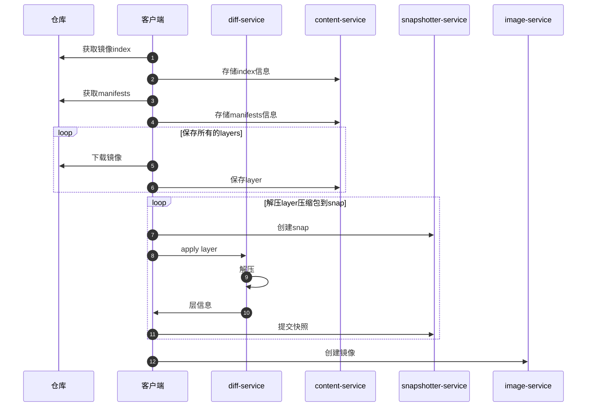

title: containerd源码-下载镜像
author: Nature丿灵然
tags:
  - k8s
  - containerd
categories:
  - 开发
date: 2023-10-26 15:15:00
---

前面介绍了插件注册以及启动,本次介绍下载镜像的过程

<!--more-->

#### 下载镜过程

##### chanid怎么得出来的

sha256(sha256 + sha256)

#### 参考

<https://blog.csdn.net/alex_yangchuansheng/article/details/111829103>
<https://www.myway5.com/index.php/2021/05/24/containerd-storage>
<https://www.myway5.com/index.php/2021/05/18/container-image>
<https://www.myway5.com/index.php/2021/05/24/containerd-storage/>
<https://github.com/containerd/containerd/blob/main/docs/content-flow.md>
<https://blog.csdn.net/weixin_40864891/article/details/107330218>
