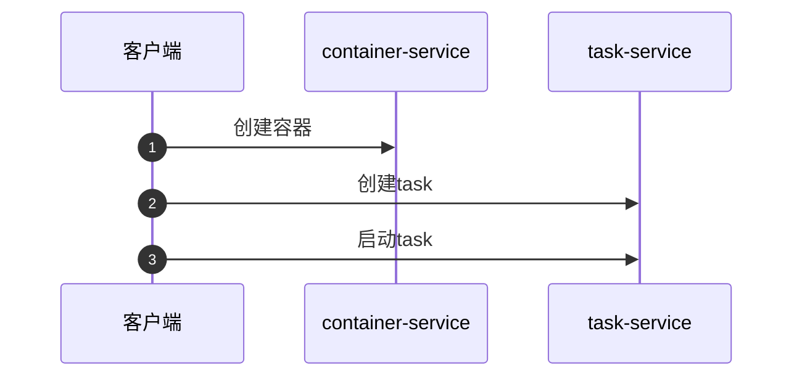

layout: draft
title: containerd源码-启动容器
author: Nature丿灵然
tags:
  - containerd
  - k8s
categories:
  - 开发
date: 2023-11-02 19:26:00
---
<简介，将显示在首页>

<!--more-->

> 说明，模版文件不要发布出来

#### 总结

#### 参考资料

<http://blog.naturelr.cc>
