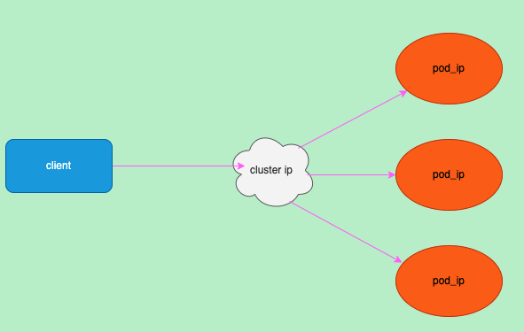
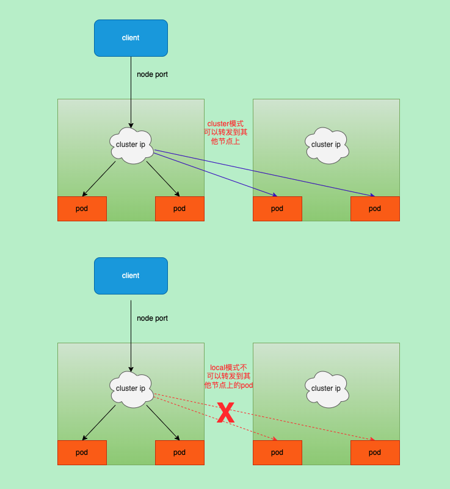
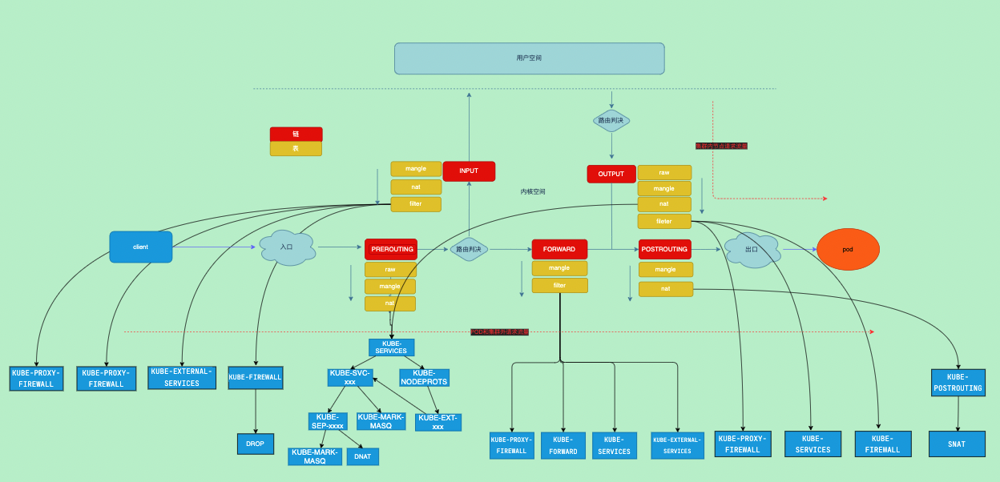
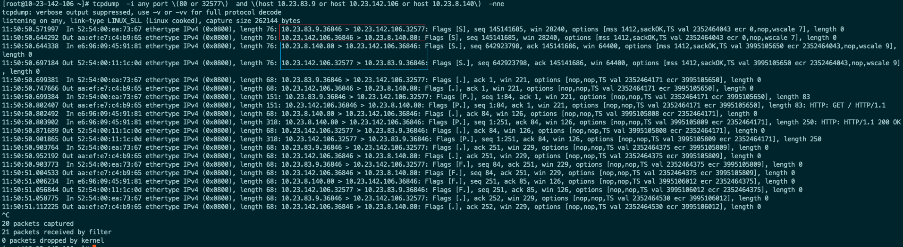
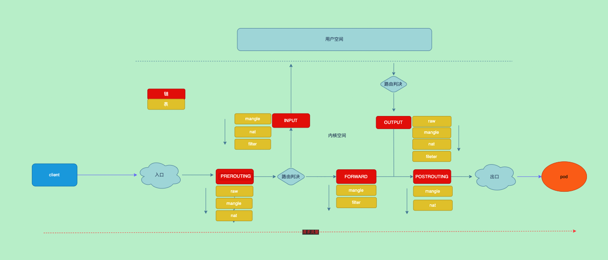
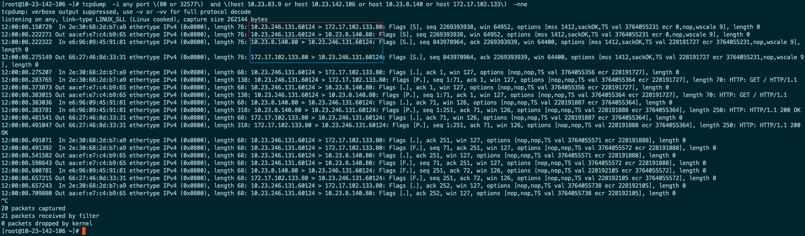

layout: draft
title: k8s-service网络
author: Nature丿灵然
tags:
  - k8s
  - 网络
categories:
  - 运维
date: 2021-06-11 15:05:00
---
k8s service是对一组pod进行抽象的方法

<!--more-->

> pod并不是永久的随时可以销毁的，那么他ip也会变的，这样的话就需要一种方法来作为pod的”前端“来转发到pod上去

#### 实现方式

service的ip是虚拟的他的具体实现程序是`kube-proxy`



如图，流量被service给负载到后端当中，对于用户来说只要访问service即可

kub-proxy有目前主要有四种

- 用户空间: 早期的方案，所有策略都在用户空间效率比较差
- iptables: iptables在内核空间，主要通过nat实现，由于iptables是一个一个匹配所有规则多时效果延迟比较大
- ipvs: 和iptables类似只不过使用了ipvs
- ebpf: 最新的技术速度快效率高，但对内核版本要求比较高

目前主流使用iptables和ipvs，所以主要说iptables和ipvs


##### kube-proxy

#### 使用

```yaml
apiVersion: v1
kind: Service
metadata:
  name: foo
spec:
  selector: # 选择需要负载到pod
    app: foo
  ports:
  - port: 80 # 服务的端口
    targetPort: 80 # pod的端口
  type: ClusterIP # 类型，默认ClusterIP
```

将上面的保存为foo.yaml然后执行`kubectl apply -f foo.yaml`即可创建一个svc

#### 类型

k8s的服务类型拥有很多种，根据实际情况选择

##### ClusterIP

默认的类型,创建一个虚拟的ip并将选择器选择的pod的ip作为这个虚拟ip的后端

##### NodePort

和ClusterIP基本一致，但是会将端口映射到所有集群中所有的节点上,端口范围默认是3000以上

```yaml
apiVersion: v1
kind: Service
metadata:
  name: foo
spec:
  externalTrafficPolicy: Cluster
  ports:
  - name: http
    port: 8080
    protocol: TCP
    targetPort: 8080
  selector:
    app: foo
  type: NodePort
```

##### Headless

和ClusterIP基本一致，只是没有虚拟ip同时失去了lb的功能,`kube-proxy`不会处理此svc且dns返回对应ep的所有地址，常用于`服务发现`

```yaml
apiVersion: v1
kind: Service
metadata:
  name: foo
spec:
  selector: 
    app: foo
  clusterIP: None # 指定为none
  ports:
  - port: 80 
    targetPort: 80 
  type: ClusterIP
```

##### LoadBalancer

这个类型一般只有云服务商只能使用，创建这个服务的同时在云服务商的lb服务商上创建了一个实例

```yaml
apiVersion: v1
kind: Service
metadata:
  name: foo-loadbalancer
spec:
  externalTrafficPolicy: Cluster
  ports:
  - name: http
    nodePort: 80
    port: 80
    protocol: TCP
    targetPort: 800
  selector:
    app: foo
  sessionAffinity: None
  type: LoadBalancer
```

##### ExternalName

外部的服务对内部的一个别名，比如web的域名是10.23.83.9.sslip.io，则在集群中可以使用web来访问10.23.83.9.sslip.io,

没有选择器,kube-proxy不会创建规则,仅在dns层面完成

externalName为dns地址如果是ip的话dns无法解析,而且如果是http(s)将可能无法访问，因为你访问的是`a`,而对应的服务只接受`b`域名

解决方法使用类似<sslip.io>这种域名来通过域名动态解析到ip上

```yaml
apiVersion: v1
kind: Service
metadata:
  name: web
spec:
  externalName: 10.23.83.9.sslip.io
  ports:
  - name: tcp
    port: 80
    protocol: TCP
    targetPort: 80
  sessionAffinity: None
  type: ExternalName
```

##### 外部IP

可以将一个外部地址导入到集群内部对应的服务里,在本地请求

```yaml
apiVersion: v1
kind: Service
metadata:
  name: my-service
spec:
  selector:
    app: cdebug
  ports:
    - name: http
      protocol: TCP
      port: 80
      targetPort: 80
  externalIPs:
    - 1.1.1.1
```

- 使用效果如下

```shell
[root@10-23-141-183 ~]# kubectl get svc my-service
NAME         TYPE        CLUSTER-IP     EXTERNAL-IP   PORT(S)   AGE
my-service   ClusterIP   172.17.4.228   1.1.1.1       80/TCP    19h
[root@10-23-141-183 ~]# curl 1.1.1.1
ClientAddr: 10.23.141.183:52416
ClientReqPath: /
ClientReqMeth: GET
ServerHostName: cdebug-77cc4fc98f-rv9hn
ServerAddr: 10.23.8.140
[root@10-23-141-183 ~]#                                                                                 
```

#### 流量策略

流量策略主要解决在拥有众多ep的服务在转发流量时有些pod距离访问的node比较远导致延迟增大

目前拥有2种策略，`cluster`和`local`

- cluster(默认):会将流量转发到所有节点的pod当中,但有可能pod在其他节点或者其他地域上会导致延迟

- local: 只会将流量转发本地的pod上，不会转发到其他node上的pod,拥有较好的性能



##### internalTrafficPolicy

- 主要针对pod访问svc的策略

##### externalTrafficPolicy

- 针对外面通过node port访问集群的svc

#### 实现

##### iptables

##### 规则分析

###### PREROUTING

- `PREROUTING`链的nat表是所有svc的入口,进入的流量都会到`KUBE-SERVICES`这条自定义链

```shell
root@minikube:~# iptables -nvL PREROUTING -t nat
Chain PREROUTING (policy ACCEPT 1 packets, 60 bytes)
 pkts bytes target     prot opt in     out     source               destination         
   57  3492 KUBE-SERVICES  all  --  *      *       0.0.0.0/0            0.0.0.0/0            /* kubernetes service portals */
    2   192 DOCKER_OUTPUT  all  --  *      *       0.0.0.0/0            192.168.65.2        
   57  3420 DOCKER     all  --  *      *       0.0.0.0/0            0.0.0.0/0            ADDRTYPE match dst-type LOCAL
```

- 在`KUBE-SERVICES`中就是我们定义的svc对应的规则,来源地址是任何目标地址是`clusterIP`时,匹配对应svc的自定义链
- 其中`KUBE-NODEPORTS`是处理nodePort类型的规则

```shell
root@minikube:~# iptables -nvL KUBE-SERVICES -t nat 
Chain KUBE-SERVICES (2 references)
 pkts bytes target     prot opt in     out     source               destination         
    0     0 KUBE-SVC-NPX46M4PTMTKRN6Y  tcp  --  *      *       0.0.0.0/0            10.96.0.1            /* default/kubernetes:https cluster IP */ tcp dpt:443
    0     0 KUBE-SVC-JD5MR3NA4I4DYORP  tcp  --  *      *       0.0.0.0/0            10.96.0.10           /* kube-system/kube-dns:metrics cluster IP */ tcp dpt:9153
    0     0 KUBE-SVC-TCOU7JCQXEZGVUNU  udp  --  *      *       0.0.0.0/0            10.96.0.10           /* kube-system/kube-dns:dns cluster IP */ udp dpt:53
    0     0 KUBE-SVC-ERIFXISQEP7F7OF4  tcp  --  *      *       0.0.0.0/0            10.96.0.10           /* kube-system/kube-dns:dns-tcp cluster IP */ tcp dpt:53
    0     0 KUBE-SVC-ZZYI5KMAZUYAMTQ6  tcp  --  *      *       0.0.0.0/0            10.98.178.225        /* default/cdebug cluster IP */ tcp dpt:80
 1043 62580 KUBE-NODEPORTS  all  --  *      *       0.0.0.0/0            0.0.0.0/0            /* kubernetes service nodeports; NOTE: this must be the last rule in this chain */ ADDRTYPE match dst-type LOCAL
```

- 在`KUBE-SVC-ZZYI5KMAZUYAMTQ6`这条自定义链中定义了具体的nat地址,当原地址不是10.244.0.0/16目标是clusterIP时会进入一个打标签的自定义链
- 下面2条是每一条分别对应`svc`的`ep`,进入第一条的几率是50%通过`random`,实现了负载均衡
- 10.244.0.0/16是`kube-proxy`的`clusterCIDR`设置,作用是区别流量是否是pod的流量以用来直接访问svc参考<https://blog.csdn.net/shida_csdn/article/details/104334372>

```shell
root@minikube:~# iptables -nvL KUBE-SVC-ZZYI5KMAZUYAMTQ6 -t nat
Chain KUBE-SVC-ZZYI5KMAZUYAMTQ6 (2 references)
 pkts bytes target     prot opt in     out     source               destination         
    0     0 KUBE-MARK-MASQ  tcp  --  *      *      !10.244.0.0/16        10.98.178.225        /* default/cdebug cluster IP */ tcp dpt:80
    0     0 KUBE-SEP-36ZFR6ZLFG6NGI5P  all  --  *      *       0.0.0.0/0            0.0.0.0/0            /* default/cdebug -> 172.17.0.4:80 */ statistic mode random probability 0.50000000000
    0     0 KUBE-SEP-4E32UMZN7V2DQATS  all  --  *      *       0.0.0.0/0            0.0.0.0/0            /* default/cdebug -> 172.17.0.5:80 */
```

- 在`KUBE-MARK-MASQ`是个标记的链他会将流量打上`0x4000`标签,该流量将在`PODTROUTNG`链中的`KUBE-POSTROUTING`被执行snat

```shell
root@minikube:~# iptables -nvL KUBE-MARK-MASQ -t nat
Chain KUBE-MARK-MASQ (8 references)
 pkts bytes target     prot opt in     out     source               destination         
    0     0 MARK       all  --  *      *       0.0.0.0/0            0.0.0.0/0            MARK or 0x4000
```

- 这里对来源是`172.17.0.4(ep)`的进行打标签，同时进行了DNAT到了ep

```shell
root@minikube:~# iptables -nvL KUBE-SEP-36ZFR6ZLFG6NGI5P -t nat
Chain KUBE-SEP-36ZFR6ZLFG6NGI5P (1 references)
 pkts bytes target     prot opt in     out     source               destination         
    0     0 KUBE-MARK-MASQ  all  --  *      *       172.17.0.4           0.0.0.0/0            /* default/cdebug */
    0     0 DNAT       tcp  --  *      *       0.0.0.0/0            0.0.0.0/0            /* default/cdebug */ tcp to:172.17.0.4:80
```

- `KUBE-NODEPORTS`下是存放nodePort的规则,打标签之后进入了svc

```shell
root@minikube:~# iptables -nvL KUBE-NODEPORTS -t nat
Chain KUBE-NODEPORTS (1 references)
 pkts bytes target     prot opt in     out     source               destination         
    0     0 KUBE-EXT-ZZYI5KMAZUYAMTQ6  tcp  --  *      *       0.0.0.0/0            0.0.0.0/0            /* default/cdebug */ tcp dpt:32753
```

- 具体内容和`KUBE-SERVICES`里一样的规则复用了每个svc创建的链

```shell
root@minikube:~# iptables -nvL KUBE-EXT-ZZYI5KMAZUYAMTQ6  -t nat
Chain KUBE-EXT-ZZYI5KMAZUYAMTQ6 (1 references)
 pkts bytes target     prot opt in     out     source               destination         
    2   120 KUBE-MARK-MASQ  all  --  *      *       0.0.0.0/0            0.0.0.0/0            /* masquerade traffic for default/cdebug external destinations */
    2   120 KUBE-SVC-ZZYI5KMAZUYAMTQ6  all  --  *      *       0.0.0.0/0            0.0.0.0/0           
```

###### INPUT

- 这里主要实现了一些防火墙规则

```shell
root@minikube:~# iptables -nvL INPUT -t filter
Chain INPUT (policy ACCEPT 279K packets, 37M bytes)
 pkts bytes target     prot opt in     out     source               destination         
 647K   39M KUBE-PROXY-FIREWALL  all  --  *      *       0.0.0.0/0            0.0.0.0/0            ctstate NEW /* kubernetes load balancer firewall */
  75M   10G KUBE-NODEPORTS  all  --  *      *       0.0.0.0/0            0.0.0.0/0            /* kubernetes health check service ports */
 647K   39M KUBE-EXTERNAL-SERVICES  all  --  *      *       0.0.0.0/0            0.0.0.0/0            ctstate NEW /* kubernetes externally-visible service portals */
  75M   10G KUBE-FIREWALL  all  --  *      *       0.0.0.0/0            0.0.0.0/0
```

```shell
root@minikube:~# iptables -nvL  KUBE-PROXY-FIREWALL -t filter 
Chain KUBE-PROXY-FIREWALL (3 references)
 pkts bytes target     prot opt in     out     source               destination         
```

```shell
root@minikube:~# iptables -nvL  KUBE-NODEPORTS -t filter
Chain KUBE-NODEPORTS (1 references)
 pkts bytes target     prot opt in     out     source               destination         
```

```shell
root@minikube:~# iptables -nvL  KUBE-EXTERNAL-SERVICES -t filter
Chain KUBE-EXTERNAL-SERVICES (2 references)
 pkts bytes target     prot opt in     out     source               destination
```

- 这个将丢弃标签为`0x8000`的流量还有源头不是`127.0.0.0/8`目标是`127.0.0.0/8`状态是RELATED,ESTABLISHED,DNAT的流量

```shell
root@minikube:~# iptables -nvL KUBE-FIREWALL -t filter
Chain KUBE-FIREWALL (2 references)
 pkts bytes target     prot opt in     out     source               destination         
    0     0 DROP       all  --  *      *      !127.0.0.0/8          127.0.0.0/8          /* block incoming localnet connections */ ! ctstate RELATED,ESTABLISHED,DNAT
    0     0 DROP       all  --  *      *       0.0.0.0/0            0.0.0.0/0            /* kubernetes firewall for dropping marked packets */ mark match 0x8000/0x8000
```

###### FORWARD

```shell
root@minikube:~# iptables -nvL FORWARD -t filter
Chain FORWARD (policy ACCEPT 0 packets, 0 bytes)
 pkts bytes target     prot opt in     out     source               destination         
    0     0 KUBE-PROXY-FIREWALL  all  --  *      *       0.0.0.0/0            0.0.0.0/0            ctstate NEW /* kubernetes load balancer firewall */
    0     0 KUBE-FORWARD  all  --  *      *       0.0.0.0/0            0.0.0.0/0            /* kubernetes forwarding rules */
    0     0 KUBE-SERVICES  all  --  *      *       0.0.0.0/0            0.0.0.0/0            ctstate NEW /* kubernetes service portals */
    0     0 KUBE-EXTERNAL-SERVICES  all  --  *      *       0.0.0.0/0            0.0.0.0/0            ctstate NEW /* kubernetes externally-visible service portals */
    0     0 DOCKER-USER  all  --  *      *       0.0.0.0/0            0.0.0.0/0           
    0     0 DOCKER-ISOLATION-STAGE-1  all  --  *      *       0.0.0.0/0            0.0.0.0/0           
    0     0 ACCEPT     all  --  *      docker0  0.0.0.0/0            0.0.0.0/0            ctstate RELATED,ESTABLISHED
    0     0 DOCKER     all  --  *      docker0  0.0.0.0/0            0.0.0.0/0           
    0     0 ACCEPT     all  --  docker0 !docker0  0.0.0.0/0            0.0.0.0/0           
    0     0 ACCEPT     all  --  docker0 docker0  0.0.0.0/0            0.0.0.0/0  
```

```shell
root@minikube:~# iptables -nvL  KUBE-FORWARD  -t filter
Chain KUBE-FORWARD (1 references)
 pkts bytes target     prot opt in     out     source               destination         
    0     0 DROP       all  --  *      *       0.0.0.0/0            0.0.0.0/0            ctstate INVALID
    0     0 ACCEPT     all  --  *      *       0.0.0.0/0            0.0.0.0/0            /* kubernetes forwarding rules */ mark match 0x4000/0x4000
    0     0 ACCEPT     all  --  *      *       0.0.0.0/0            0.0.0.0/0            /* kubernetes forwarding conntrack rule */ ctstate RELATED,ESTABLISHED
```

###### OUTPUT

- 这里继续会有一个`KUBE-SERVICES`这个链用于处理节点上访问svc

```shell
root@minikube:~# iptables -nvL OUTPUT -t nat
Chain OUTPUT (policy ACCEPT 3995 packets, 240K bytes)
 pkts bytes target     prot opt in     out     source               destination         
 748K   45M KUBE-SERVICES  all  --  *      *       0.0.0.0/0            0.0.0.0/0            /* kubernetes service portals */
  130  8116 DOCKER_OUTPUT  all  --  *      *       0.0.0.0/0            192.168.65.2        
 499K   30M DOCKER     all  --  *      *       0.0.0.0/0           !127.0.0.0/8          ADDRTYPE match dst-type LOCAL
```

```shell
root@minikube:~# iptables -nvL OUTPUT -t filter
Chain OUTPUT (policy ACCEPT 368K packets, 49M bytes)
 pkts bytes target     prot opt in     out     source               destination         
 748K   45M KUBE-PROXY-FIREWALL  all  --  *      *       0.0.0.0/0            0.0.0.0/0            ctstate NEW /* kubernetes load balancer firewall */
 748K   45M KUBE-SERVICES  all  --  *      *       0.0.0.0/0            0.0.0.0/0            ctstate NEW /* kubernetes service portals */
  75M 9999M KUBE-FIREWALL  all  --  *      *       0.0.0.0/0            0.0.0.0/0           
```

###### POSTROUTING

- 整个流程中最后一个地点，这里主要对前面打了`0x4000/0x4000`的标签进行snat

```shell
root@minikube:~# iptables -nvL POSTROUTING -t nat   
Chain POSTROUTING (policy ACCEPT 4112 packets, 247K bytes)
 pkts bytes target     prot opt in     out     source               destination         
 748K   45M KUBE-POSTROUTING  all  --  *      *       0.0.0.0/0            0.0.0.0/0            /* kubernetes postrouting rules */
    0     0 MASQUERADE  all  --  *      !docker0  172.17.0.0/16        0.0.0.0/0           
    0     0 DOCKER_POSTROUTING  all  --  *      *       0.0.0.0/0            192.168.65.2
```

```shell
root@minikube:~# iptables -nvL KUBE-POSTROUTING -t nat
Chain KUBE-POSTROUTING (1 references)
 pkts bytes target     prot opt in     out     source               destination         
 4253  255K RETURN     all  --  *      *       0.0.0.0/0            0.0.0.0/0            mark match ! 0x4000/0x4000
    0     0 MARK       all  --  *      *       0.0.0.0/0            0.0.0.0/0            MARK xor 0x4000
    0     0 MASQUERADE  all  --  *      *       0.0.0.0/0            0.0.0.0/0            /* kubernetes service traffic requiring SNAT */ random-fully
```

###### 概览



##### 集群外访问NodePort

集群外部一台服务器(10.23.83.9)通过`nodePort`请求集群的cdebug这个服务

cdebug服务详情

```shell
❯ k get svc -o wide
NAME         TYPE        CLUSTER-IP       EXTERNAL-IP   PORT(S)        AGE    SELECTOR
cdebug       NodePort    172.17.102.133   <none>        80:32577/TCP   5d2h   app=cdebug
kubernetes   ClusterIP   172.17.0.1       <none>        443/TCP        5d2h   <none>

❯ k get po -l app=cdebug -o wide
NAME                      READY   STATUS    RESTARTS   AGE    IP            NODE            NOMINATED NODE   READINESS GATES
cdebug-77cc4fc98f-rv9hn   1/1     Running   0          5d1h   10.23.8.140   10.23.142.106   <none>           <none>

❯ kubectl get po nginx -o wide
NAME    READY   STATUS    RESTARTS   AGE   IP              NODE            NOMINATED NODE   READINESS GATES
nginx   1/1     Running   0          22h   10.23.246.131   10.23.142.106   <none>           <none>
```

- 这是在请求的node上抓包

```text
发送
10.23.83.9:36848 > 10.23.142.106:32577
10.23.142.106:36848 > 10.23.8.140:80

返回
10.23.8.140:80 > 10.23.142.106:36848
10.23.142.106:32577 > 10.23.83.9:36848
```



可以看到客户端请求集群的nodePort，iptables目的地址改为对应的pod地址,源地址则是nodePort的地址,所以pod`不知道真正的客户端是谁`
即pod看到的请求来自`请求的nodePort所在的node`
这里做了

- 在netfilter流向,这里充当了一个路由器防火墙



##### 集群内节点访问NodePort

和集群外访问NodePort差不多,最终pod的看到的源地址为访问所在的node的地址

##### POD访问SVC

发送
10.23.246.131:38906 > 172.17.102.133:80
10.23.246.131:38906 > 10.23.8.140:80

响应
10.23.8.140:80    > 10.23.246.131:38906
172.17.102.133:80 > 10.23.246.131:38906



路径和访问NodePort差不都只不过没有做SNAT只做了DNAT,也就是说集群POD访问SVC是可以知道客户端的真实地址

##### 集群内访问外部域名的svc

##### ipvs

#### 参考资料

<https://kubernetes.io/zh/docs/concepts/services-networking/service/>
<https://draveness.me/kubernetes-service/>
