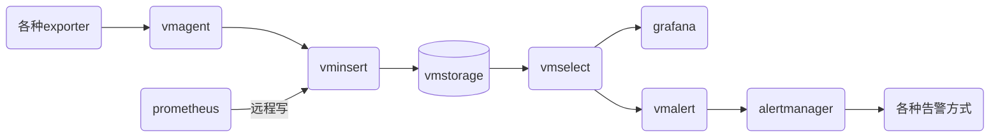

victoria-metrics是一个兼容Prometheus的监控，和Prometheus性能优于Prometheus同时支持集群模式横向扩容

<!--more-->

#### 单点模式

##### 单点模式部署

```shell
helm repo add vm https://victoriametrics.github.io/helm-charts/
helm repo update
```

- 默认就是单节点模式

```shell
helm install vm vm/victoria-metrics-k8s-stack -n victoria-metrics --create-namespace 
```

##### 单节点模式访问报表

###### grafana

- 获取grafana的密码，用户名默认为`admin`

```shell
kubectl get secrets vm-grafana -o jsonpath="{.data.admin-password}" | base64 -d
```

- 转发grafana

```shell
kubectl -n victoria-metrics port-forward svc/vm-grafana 3000:80
```

###### vmui

- 访问vmui

```shell
kubectl -n victoria-metrics port-forward svc/vmsingle-vm-victoria-metrics-k8s-stack 8429:8429
```

#### 集群模式

- 集群模式架构


- vminsert负责将数据写入到vmstore中
- vmsotre负责存储数据
- vmselect负责数据查询
- vmalert负责告警规则执行
- vmagent负责抓取数据并通过vminsert写数据

- 全部链路



##### 集群模式部署

- 添加vm仓库

```shell
helm repo add vm https://victoriametrics.github.io/helm-charts/
helm repo update
```

- 通过命令行设置为集群模式

```shell
helm install vm vm/victoria-metrics-k8s-stack -n victoria-metrics --create-namespace --set vmcluster.enabled=true --set vmsingle.enabled=false
```

- 导出默认的values文件通过values文件来设置

```shell
helm show values vm/victoria-metrics-k8s-stack > values.yaml
```

- 修改values.yaml中的配置

```yaml
vmsingle:
  enabled: false
vmcluster:
  enabled: true
```

```shell
helm install vm  vm/victoria-metrics-k8s-stack -n victoria-metrics -f values.yaml
```

##### 集群模式访问报表

集群模式访访问grafana和单节点一样参考[grafana](#grafana)

###### 查询ui

- 访问查询ui,查询是vmselect负责的所以转发vmselect，访问路径是：<http://127.0.0.1:8481/select/0/vmui>

```shell
kubectl -n victoria-metrics port-forward svc/vmselect-vm-victoria-metrics-k8s-stack 8481:8481
```

###### 收集metrics的ui

```shell
kubectl -n victoria-metrics port-forward svc/vmagent-vm-victoria-metrics-k8s-stack 8429:8429
```

- <http://127.0.0.1:8429/targets>
- 服务发现<http://127.0.0.1:8429/service-discovery>

#### 参考资料

<https://docs.victoriametrics.com>
