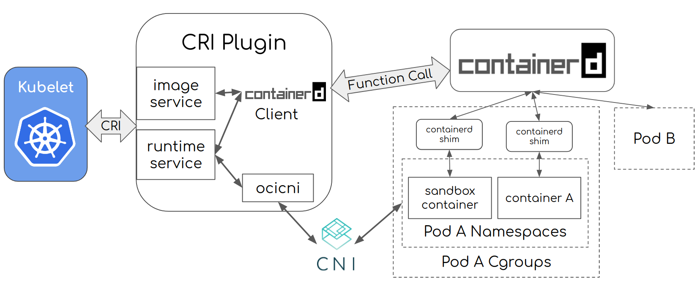

layout: draft
title: containerd基本使用
author: Nature丿灵然
tags:
  - containerd
  - k8s
categories:
  - 运维
date: 2023-10-24 23:35:00
---

containerd是一个容器运行时标准,也是k8s目前主流的运行时，本文介绍历史，存储方式，和oci

<!--more-->

#### containerd历史

containerd是一个运行时，最开始集成在docker中拆解出来捐赠给cncf，同样被拆解出来的还有runc，以及根据docker镜像v2制定的oci镜像规范

- 1.24版本之前k8s的kubelet内置了dokcer-shim插件负责和docker通讯，之后则只能通过cri


- 因为cri是一个单独的进程导致效率太差


- 最后将cri已插件的形式集成到containerd中


#### 架构

- 全局架构


- containerd与kubelet



- 内部插件架构


#### containerd下载安装

- docker官方打包的rpm[地址](https://download.docker.com/linux/centos/7/x86_64/stable/Packages/)

- 官方仓库下载<https://github.com/containerd/containerd/releases>

- 一般安装docker的时候自动安装

#### ctr使用

> containerd可以使用的客户端有很多比如crictl，nerdctl命令

- --address value, -a value 指定 containerd's GRPC server，默认 /run/containerd/containerd.sock

- 查看K8S命名空间下的镜像,-n指定namespace

```shell
ctr -n k8s.io images ls
```

- 查看所有namespace

```shell
ctr ns ls
```

- 下载镜像

```shell
ctr images pull docker.io/library/alpine:3.18.3
```

- 创建 container

```shell
ctr c create docker.io/library/alpine:3.18.3 alpine
```

- 查看

```shell
ctr c ls
```

- 后台启动

```shell
ctr t start -d alpine
```

- 查看container

```shell
ctr t ls
```

- 查看 k8s 中正在运行的容器

```shell
ctr -n k8s.io task ls
```

- 打tag

```shell
ctr images tag docker.io/library/alpine:3.18.3 <仓库>/alpine:3.18.3
```

- push 上传镜像

```shell
ctr images push <镜像>
```

- 打印containerd默认配置

```shell
containerd config default
```

#### OCI镜像格式

- 各个类型的关系

oci镜像格式的`mediaType`参考[这里](https://github.com/opencontainers/image-spec/blob/main/media-types.md)


##### 类型mediaType

> 所有例子基于alpine:3.18.3

###### index

- 最顶级的类型主要存放各个操作系统和平台对应的manifest类型

<details>

<summary>例子</summary>

```json
{
    "manifests": [
        {
            "digest": "sha256:c5c5fda71656f28e49ac9c5416b3643eaa6a108a8093151d6d1afc9463be8e33",
            "mediaType": "application/vnd.docker.distribution.manifest.v2+json",
            "platform": {
                "architecture": "amd64",
                "os": "linux"
            },
            "size": 528
        },
        {
            "digest": "sha256:f748290eb66ad6f938e25dd348acfb3527a422e280b7547b1cdfaf38d4492c4b",
            "mediaType": "application/vnd.docker.distribution.manifest.v2+json",
            "platform": {
                "architecture": "arm",
                "os": "linux",
                "variant": "v6"
            },
            "size": 528
        },
        {
            "digest": "sha256:16e86b2388774982fbdf230101a72201691b1f97cb0066c2099abf30dd7e6d59",
            "mediaType": "application/vnd.docker.distribution.manifest.v2+json",
            "platform": {
                "architecture": "arm",
                "os": "linux",
                "variant": "v7"
            },
            "size": 528
        },
        {
            "digest": "sha256:b312e4b0e2c665d634602411fcb7c2699ba748c36f59324457bc17de485f36f6",
            "mediaType": "application/vnd.docker.distribution.manifest.v2+json",
            "platform": {
                "architecture": "arm64",
                "os": "linux",
                "variant": "v8"
            },
            "size": 528
        },
        {
            "digest": "sha256:1fd62556954250bac80d601a196bb7fd480ceba7c10e94dd8fd4c6d1c08783d5",
            "mediaType": "application/vnd.docker.distribution.manifest.v2+json",
            "platform": {
                "architecture": "386",
                "os": "linux"
            },
            "size": 528
        },
        {
            "digest": "sha256:c75ede79e457d6454bca6fc51967a247a4b9daff9f31197cfbef69b1a651cada",
            "mediaType": "application/vnd.docker.distribution.manifest.v2+json",
            "platform": {
                "architecture": "ppc64le",
                "os": "linux"
            },
            "size": 528
        },
        {
            "digest": "sha256:5febc00b4d2a84af2a077bc34ea90659b6570110a54253f19c5dca8164b1dbf6",
            "mediaType": "application/vnd.docker.distribution.manifest.v2+json",
            "platform": {
                "architecture": "s390x",
                "os": "linux"
            },
            "size": 528
        }
    ],
    "mediaType": "application/vnd.docker.distribution.manifest.list.v2+json",
    "schemaVersion": 2
}
```

</details>

###### manifest

- 主要定义镜像相关的清单，主要包含config类型和layers类型

```json
{
  "schemaVersion": 2,
  "mediaType": "application/vnd.docker.distribution.manifest.v2+json",
  "config": {
    "mediaType": "application/vnd.docker.container.image.v1+json",
    "size": 1471,
    "digest": "sha256:7e01a0d0a1dcd9e539f8e9bbd80106d59efbdf97293b3d38f5d7a34501526cdb"
  },
  "layers": [
    {
      "mediaType": "application/vnd.docker.image.rootfs.diff.tar.gzip",
      "size": 3401613,
      "digest": "sha256:7264a8db6415046d36d16ba98b79778e18accee6ffa71850405994cffa9be7de"
    }
  ]
}
```

###### config

- 记录镜像的历史，启动参数环境变量以及最重要的解压后的层等信息

<details>

<summary>例子</summary>

```json
{
    "architecture": "amd64",
    "config": {
        "Hostname": "",
        "Domainname": "",
        "User": "",
        "AttachStdin": false,
        "AttachStdout": false,
        "AttachStderr": false,
        "Tty": false,
        "OpenStdin": false,
        "StdinOnce": false,
        "Env": [
            "PATH=/usr/local/sbin:/usr/local/bin:/usr/sbin:/usr/bin:/sbin:/bin"
        ],
        "Cmd": [
            "/bin/sh"
        ],
        "Image": "sha256:39dfd593e04b939e16d3a426af525cad29b8fc7410b06f4dbad8528b45e1e5a9",
        "Volumes": null,
        "WorkingDir": "",
        "Entrypoint": null,
        "OnBuild": null,
        "Labels": null
    },
    "container": "ba09fe2c8f99faad95871d467a22c96f4bc8166bd01ce0a7c28dd5472697bfd1",
    "container_config": {
        "Hostname": "ba09fe2c8f99",
        "Domainname": "",
        "User": "",
        "AttachStdin": false,
        "AttachStdout": false,
        "AttachStderr": false,
        "Tty": false,
        "OpenStdin": false,
        "StdinOnce": false,
        "Env": [
            "PATH=/usr/local/sbin:/usr/local/bin:/usr/sbin:/usr/bin:/sbin:/bin"
        ],
        "Cmd": [
            "/bin/sh",
            "-c",
            "#(nop) ",
            "CMD [\"/bin/sh\"]"
        ],
        "Image": "sha256:39dfd593e04b939e16d3a426af525cad29b8fc7410b06f4dbad8528b45e1e5a9",
        "Volumes": null,
        "WorkingDir": "",
        "Entrypoint": null,
        "OnBuild": null,
        "Labels": {}
    },
    "created": "2023-08-07T19:20:20.894140623Z",
    "docker_version": "20.10.23",
    "history": [
        {
            "created": "2023-08-07T19:20:20.71894984Z",
            "created_by": "/bin/sh -c #(nop) ADD file:32ff5e7a78b890996ee4681cc0a26185d3e9acdb4eb1e2aaccb2411f922fed6b in / "
        },
        {
            "created": "2023-08-07T19:20:20.894140623Z",
            "created_by": "/bin/sh -c #(nop)  CMD [\"/bin/sh\"]",
            "empty_layer": true
        }
    ],
    "os": "linux",
    "rootfs": {
        "type": "layers",
        "diff_ids": [
            "sha256:4693057ce2364720d39e57e85a5b8e0bd9ac3573716237736d6470ec5b7b7230"
        ]
    }
}
```

</details>

###### layer

- 记录压缩过后的层sha256信息,是真正层的内容一般采用tar.gz压缩

##### 下载保存oci镜像格式

使用skopeo可以和方便的保存到本地，之前介绍过

```shell
skopeo copy docker://docker.io/alpine:3.18.3 oci:alpine-oci --override-os linux --override-arch amd64
```

```shell
❯ tree                                                                   
.
├── blobs
│   └── sha256
│       ├── 7264a8db6415046d36d16ba98b79778e18accee6ffa71850405994cffa9be7de
│       ├── 913cf3a39d377faf89ed388ad913a318a390488c9f34c46e43424795cdabffe8
│       └── cf4e5bc0709f07284518b287f570c47bdb2afc14b8ae4f14077e9ff810a0120b
├── index.json
└── oci-layout

3 directories, 5 files

```

#### Containerd存储方式

##### 目录结构

- 其目录命名格式以`类型.id`的格式

- 有些目录根据插件并没有显示

- 默认数据存放在`/var/lib/containerd/`中

```shell
tree -L 2
.
├── io.containerd.content.v1.content # 存放从hub上下载的源文件
│   ├── blobs                        # 存放下载完毕的文件
│   └── ingest                       # 存放下载未完成的文件
├── io.containerd.grpc.v1.cri        # cri插件存放的文件
│   ├── containers                   # cri创建的容器
│   └── sandboxes
├── io.containerd.metadata.v1.bolt   # 存放containerd的数据文件
│   └── meta.db           
├── io.containerd.runtime.v1.linux
├── io.containerd.runtime.v2.task    # 运行的容器
│   └── k8s.io                       # namespace
├── io.containerd.snapshotter.v1.native
│   └── snapshots
├── io.containerd.snapshotter.v1.overlayfs # 存放解压过后的文件
│   ├── metadata.db                        # 解压数据库文件
│   └── snapshots                          # 解压的文件
└── tmpmounts                              # 临时挂载目录

15 directories, 2 files
```

#### 参考

<https://blog.frognew.com/2021/04/relearning-container-01.html>
