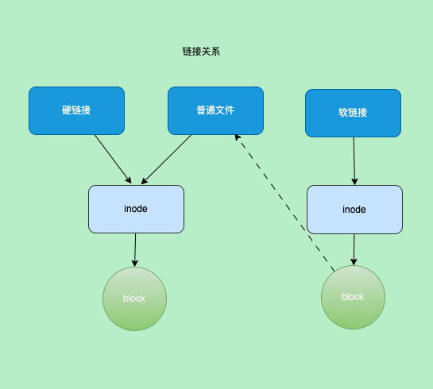
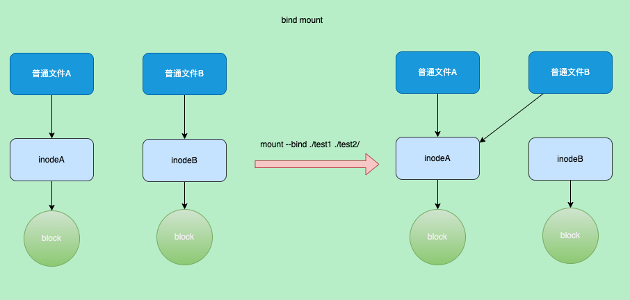

layout: draft
title: containerd源码-snapshots
author: Nature丿灵然
tags:
  - containerd
  - k8s
date: 2023-11-03 14:48:00
---

snapshots主要负责存储解压层之后的存储

<!--more-->

代码版本为v.17.5

> snapshot和content的结构类似,其接口定义如下

#### 接口定义

```go
// snapshots/snapshotter.go
type Snapshotter interface {
  Stat(ctx context.Context, key string) (Info, error)
  Update(ctx context.Context, info Info, fieldpaths ...string) (Info, error)
  Usage(ctx context.Context, key string) (Usage, error)
  Mounts(ctx context.Context, key string) ([]mount.Mount, error) // 只是返回了mount参数并没有真正的mount
  Prepare(ctx context.Context, key, parent string, opts ...Opt) ([]mount.Mount, error) // 创建snap
  View(ctx context.Context, key, parent string, opts ...Opt) ([]mount.Mount, error) // 和commit一样只不过是只读的
  Commit(ctx context.Context, name, key string, opts ...Opt) error // 提交
  Remove(ctx context.Context, key string) error // 删除
  Walk(ctx context.Context, fn WalkFunc, filters ...string) error
  Close() error
}
```

#### snapshot grpc类型

- 注册插件，他依赖于service类型,同样实现了Register方法调用了grpc进行api注册服务

```go
// services/snapshots/service.go
func init() {
  plugin.Register(&plugin.Registration{
    Type: plugin.GRPCPlugin,
    ID:   "snapshots",
    Requires: []plugin.Type{
      plugin.ServicePlugin,
    },
    InitFn: newService,
  })
}

func newService(ic *plugin.InitContext) (interface{}, error) {
  plugins, err := ic.GetByType(plugin.ServicePlugin)
  if err != nil {
    return nil, err
  }
  p, ok := plugins[services.SnapshotsService]
  if !ok {
    return nil, errors.New("snapshots service not found")
  }
  i, err := p.Instance()
  if err != nil {
    return nil, err
  }
  ss := i.(map[string]snapshots.Snapshotter)
  return &service{ss: ss}, nil
}

func (s *service) Register(gs *grpc.Server) error {
  snapshotsapi.RegisterSnapshotsServer(gs, s)
  return nil
}
```

- snapshot的service有个map,因为snapshotter有很多实现，比如默认的`overlayfs`还有`devmapper`等

```go
type service struct {
  ss map[string]snapshots.Snapshotter
}
```

- 我们看下其中一个api的实现，主要是处理grpc的请求和响应操作，需要注意的是传入的参数中有`Snapshotter`id,然后执行对应的snap的api,后面就到了service层处理

```go
func (s *service) Prepare(ctx context.Context, pr *snapshotsapi.PrepareSnapshotRequest) (*snapshotsapi.PrepareSnapshotResponse, error) {
  log.G(ctx).WithField("parent", pr.Parent).WithField("key", pr.Key).Debugf("prepare snapshot")
  sn, err := s.getSnapshotter(pr.Snapshotter)

  var opts []snapshots.Opt
  if pr.Labels != nil {
    opts = append(opts, snapshots.WithLabels(pr.Labels))
  }
  mounts, err := sn.Prepare(ctx, pr.Key, pr.Parent, opts...)

  return &snapshotsapi.PrepareSnapshotResponse{
    Mounts: fromMounts(mounts),
  }, nil
}
```

#### snapshot service类型

- 依赖MetadataPlugin类型吗,调用`db.Snapshotters()`拿到snap,meterdata里通过NewDB()传值

```go
func init() {
// services/snapshots/snapshotters.go
  plugin.Register(&plugin.Registration{
    Type: plugin.ServicePlugin,
    ID:   services.SnapshotsService,
    Requires: []plugin.Type{
      plugin.MetadataPlugin,
    },
    InitFn: func(ic *plugin.InitContext) (interface{}, error) {
      m, err := ic.Get(plugin.MetadataPlugin)

      db := m.(*metadata.DB)
      ss := make(map[string]snapshots.Snapshotter)
      for n, sn := range db.Snapshotters() {
        ss[n] = newSnapshotter(sn, ic.Events)
      }
      return ss, nil
    },
  })
}
```

- 实际调用了metedata的`Prepare()`,这里进行了大量的数据库操作

```go
func (s *snapshotter) Prepare(ctx context.Context, key, parent string, opts ...snapshots.Opt) ([]mount.Mount, error) {
  mounts, err := s.Snapshotter.Prepare(ctx, key, parent, opts...)
  if err := s.publisher.Publish(ctx, "/snapshot/prepare", &eventstypes.SnapshotPrepare{
    Key:    key,
    Parent: parent,
  }); err != nil {
    return nil, err
  }
  return mounts, nil
}
```

- 这可以可以看到prepare和view实现都是一样的只不过view是只读的
- 源码很长这里不放了,其主要在数据存记录snap相关信息
- 随后调用真正的snap实现

```go
// containerd/metadata/snapshot.go

func (s *snapshotter) Prepare(ctx context.Context, key, parent string, opts ...snapshots.Opt) ([]mount.Mount, error) {
  return s.createSnapshot(ctx, key, parent, false, opts)
}

func (s *snapshotter) View(ctx context.Context, key, parent string, opts ...snapshots.Opt) ([]mount.Mount, error) {
  return s.createSnapshot(ctx, key, parent, true, opts)
}

func (s *snapshotter) createSnapshot(ctx context.Context, key, parent string, readonly bool, opts []snapshots.Opt) ([]mount.Mount, error) {
  // 校验参数以及复制等代码略过

  if readonly {
    m, err = s.Snapshotter.View(ctx, bkey, bparent, bopts...)
  } else {
    m, err = s.Snapshotter.Prepare(ctx, bkey, bparent, bopts...)
  }
}
```

#### snapshot类型

- 直接返回了`overlay.NewSnapshotter()`

```go
// snapshots/overlay/plugin/plugin.go

func init() {
  plugin.Register(&plugin.Registration{
    Type:   plugin.SnapshotPlugin,
    ID:     "overlayfs",
    Config: &Config{},
    InitFn: func(ic *plugin.InitContext) (interface{}, error) {
      ic.Meta.Platforms = append(ic.Meta.Platforms, platforms.DefaultSpec())
      config, ok := ic.Config.(*Config)

      root := ic.Root
      if config.RootPath != "" {
        root = config.RootPath
      }

      ic.Meta.Exports["root"] = root
      return overlay.NewSnapshotter(root, overlay.AsynchronousRemove)
    },
  })
}
```

- New函数中依然执行opt相关的操作,然后创建了目录随后创建数据库文件到这个目录中，注意这个数据库不metedata的数据库而是snap自己的数据库
- 读取了一些overlay相关参数

```go
// snapshots/overlay/overlay.go

func NewSnapshotter(root string, opts ...Opt) (snapshots.Snapshotter, error) {
  var config SnapshotterConfig
  for _, opt := range opts {
    if err := opt(&config); err != nil {
      return nil, err
    }
  }

  if err := os.MkdirAll(root, 0700); err != nil {


  ms, err := storage.NewMetaStore(filepath.Join(root, "metadata.db"))

  if err := os.Mkdir(filepath.Join(root, "snapshots"), 0700); err != nil && !os.IsExist(err) {
    return nil, err
  }

  // figure out whether "userxattr" option is recognized by the kernel && needed
  userxattr, err := overlayutils.NeedsUserXAttr(root)
  if err != nil {
    logrus.WithError(err).Warnf("cannot detect whether \"userxattr\" option needs to be used, assuming to be %v", userxattr)
  }

  return &snapshotter{
    root:        root,
    ms:          ms,
    asyncRemove: config.asyncRemove,
    indexOff:    indexOff,
    userxattr:   userxattr,
  }, nil
}
```

- 和前面调用的PrePare结构很相似,也只是传递的是否只读不一样

```go
func (o *snapshotter) Prepare(ctx context.Context, key, parent string, opts ...snapshots.Opt) ([]mount.Mount, error) {
  return o.createSnapshot(ctx, snapshots.KindActive, key, parent, opts)
}

func (o *snapshotter) View(ctx context.Context, key, parent string, opts ...snapshots.Opt) ([]mount.Mount, error) {
  return o.createSnapshot(ctx, snapshots.KindView, key, parent, opts)
}
```

- 首先创建一个临时目录然后数据中创建snap记录,如果有parent则修改guid,然后修改名字为正式的snap目录
- 最后通过mount函数返回

```go
// snapshots/overlay/overlay.go

func (o *snapshotter) createSnapshot(ctx context.Context, kind snapshots.Kind, key, parent string, opts []snapshots.Opt) (_ []mount.Mount, err error) {
  if err := o.ms.WithTransaction(ctx, true, func(ctx context.Context) (err error) {
    td, err = o.prepareDirectory(ctx, snapshotDir, kind)

    s, err = storage.CreateSnapshot(ctx, kind, key, parent, opts...)
 
    if len(s.ParentIDs) > 0 {
      st, err := os.Stat(o.upperPath(s.ParentIDs[0]))

      stat := st.Sys().(*syscall.Stat_t)
      if err := os.Lchown(filepath.Join(td, "fs"), int(stat.Uid), int(stat.Gid)); err != nil {}
    }

    path = filepath.Join(snapshotDir, s.ID)
    if err = os.Rename(td, path); err != nil {
      return fmt.Errorf("failed to rename: %w", err)
    }
    td = ""

    return nil
  }); err != nil {
    return nil, err
  }

  return o.mounts(s), nil
}
}
```

- mount函数根据snapshotter的ParentIDs来判断是否返回读写的bind类型挂载
- 通过判断是否是active来返回只读的bind类型挂载
- 最后通过ParentIDs组合overlay的参数

```go
// snapshots/overlay/overlay.go
func (o *snapshotter) mounts(s storage.Snapshot) []mount.Mount {
  if len(s.ParentIDs) == 0 {
    // if we only have one layer/no parents then just return a bind mount as overlay
    // will not work
    roFlag := "rw"
    if s.Kind == snapshots.KindView {
      roFlag = "ro"
    }

    return []mount.Mount{
      {
        Source: o.upperPath(s.ID),
        Type:   "bind",
        Options: []string{
          roFlag,
          "rbind",
        },
      },
    }
  }

  options := o.options
  if s.Kind == snapshots.KindActive {
    options = append(options,
      fmt.Sprintf("workdir=%s", o.workPath(s.ID)),
      fmt.Sprintf("upperdir=%s", o.upperPath(s.ID)),
    )
  } else if len(s.ParentIDs) == 1 {
    return []mount.Mount{
      {
        Source: o.upperPath(s.ParentIDs[0]),
        Type:   "bind",
        Options: []string{
          "ro",
          "rbind",
        },
      },
    }
  }
  parentPaths := make([]string, len(s.ParentIDs))
  for i := range s.ParentIDs {
    parentPaths[i] = o.upperPath(s.ParentIDs[i])
  }
  options = append(options, fmt.Sprintf("lowerdir=%s", strings.Join(parentPaths, ":")))
  return []mount.Mount{
    {
      Type:    "overlay",
      Source:  "overlay",
      Options: options,
    },
  }

}
```

#### bind mount

- bind的mount类型是linux内核实现的一种挂载他和链接(`link`)实现的功能很像,但是他实现更底层在vfs之下
- 参数rbind表示目录下的目录递归挂载到而不是这是这个一个,
- ro则表示只读



- bind相当于修改了文件的inode到挂载的目录上



```shell
mkdir test1 test2
ls -li
# 总用量 0
# 34260425 drwxr-xr-x 2 root root 6 10月 31 17:32 test1
# 50339286 drwxr-xr-x 2 root root 6 10月 31 17:32 test2

mount --bind ./test1 ./test2/

ll -ti
# 总用量 0
# 34260425 drwxr-xr-x 2 root root 6 10月 31 17:32 test1
# 34260425 drwxr-xr-x 2 root root 6 10月 31 17:32 test2

echo "foo"> ./test1/test
cat ./test2/test
# foo

# 显示的挂载是vda1而是test1
mount -l |grep test
# /dev/vda1 on /data/test/test2 type xfs (rw,relatime,attr2,inode64,noquota)
```

#### 参考

<https://blog.csdn.net/weixin_40864891/article/details/107330218>
