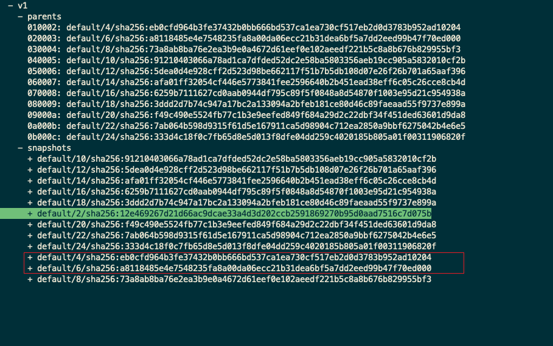
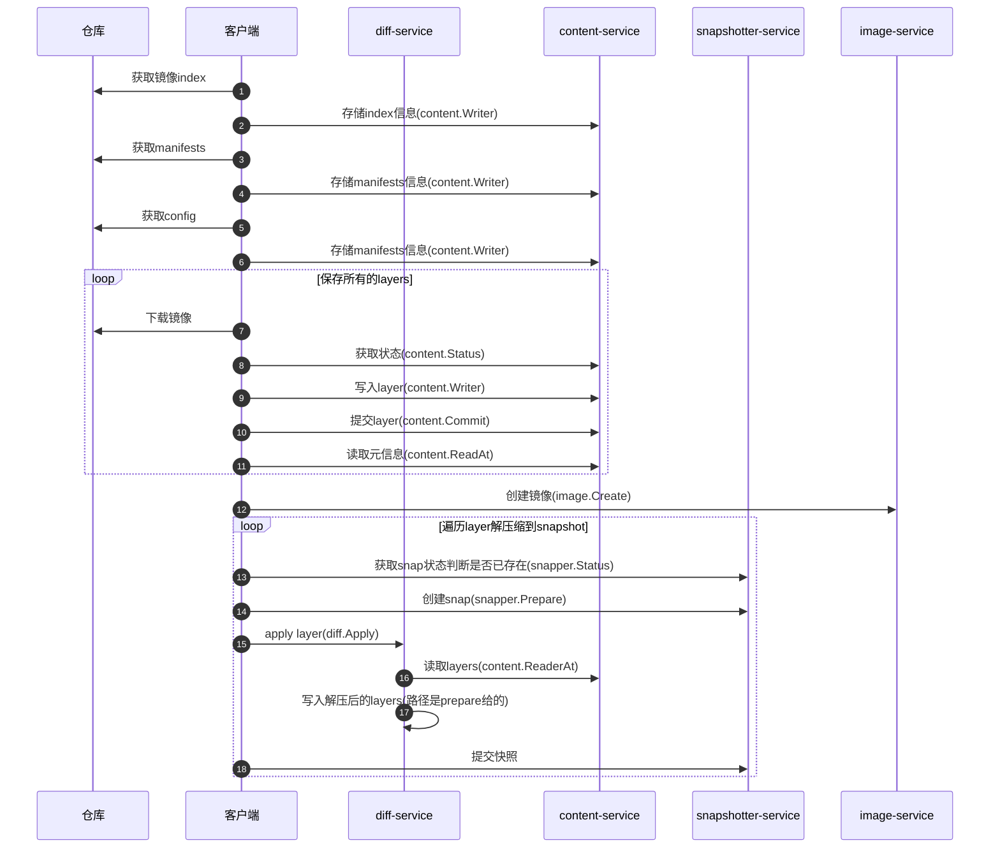

title: containerd源码-下载镜像
author: Nature丿灵然
tags:
  - k8s
  - containerd
date: 2023-11-03 14:11:00
---

前面介绍了插件注册以及启动,本次介绍下载镜像的过程

<!--more-->

代码版本为v.17.5

> 主要依据ctr命令行工具的代码来阅读(cri还有套逻辑)，本文视角视角主要在客户端，服务端在后面的解析

#### 下载

##### 命令行处理

- 老套路，直接点进去看`app.New()`

```go
// cmd/ctr/main.go
func main() {
  app := app.New()
  app.Commands = append(app.Commands, pluginCmds...)
  if err := app.Run(os.Args); err != nil {
    fmt.Fprintf(os.Stderr, "ctr: %s\n", err)
    os.Exit(1)
  }
}
```

- 这里面手机了很多子命令，我们主要关注`images.Command`

```go
// cmd/ctr/app/main.go
app.Commands = append([]cli.Command{
    plugins.Command,
    versionCmd.Command,
    containers.Command,
    content.Command,
    events.Command,
    images.Command,
    leases.Command,
    namespacesCmd.Command,
    pprof.Command,
    run.Command,
    snapshots.Command,
    tasks.Command,
    install.Command,
    ociCmd.Command,
  }, extraCmds...)
```

- 依然是收集命令的结构，点击去查看`pullCommand`

```go
// cmd/ctr/commands/images/images.go
var Command = cli.Command{
  Name:    "images",
  Aliases: []string{"image", "i"},
  Usage:   "manage images",
  Subcommands: cli.Commands{
    checkCommand,
    exportCommand,
    importCommand,
    listCommand,
    mountCommand,
    unmountCommand,
    pullCommand,
    pushCommand,
    removeCommand,
    tagCommand,
    setLabelsCommand,
    convertCommand,
  },
}
```

- 这里开始进入pull相关代码，主要在`Action`下,精简了下代码
- 首先创建了一个客户端，然后客户端获取了一个lease
- 最后开始下载，点进去`Fetch()`

```go
// cmd/ctr/commands/images/pull.go

client, ctx, cancel, err := commands.NewClient(context)
    defer cancel()

    ctx, done, err := client.WithLease(ctx)
    defer done(ctx)

    config, err := content.NewFetchConfig(ctx, context)

    img, err := content.Fetch(ctx, client, ref, config)

```

##### fetch

- 开始处理了下是否使用`TraceHTTP`,然后创建了一个显示进度的，这个显示进度得就是使用`ctr i pull`时显示的进度，从这里可以看到另外开了个携程负责显示
- 紧接着根据配置文件将相关操作放到`opts`这个切片中,最后调用`client.Fetch()`

```shell
docker.io/library/alpine:3.18.3:                                                  resolved       |++++++++++++++++++++++++++++++++++++++|
index-sha256:7144f7bab3d4c2648d7e59409f15ec52a18006a128c733fcff20d3a4a54ba44a:    done           |++++++++++++++++++++++++++++++++++++++|
manifest-sha256:c5c5fda71656f28e49ac9c5416b3643eaa6a108a8093151d6d1afc9463be8e33: done           |++++++++++++++++++++++++++++++++++++++|
layer-sha256:7264a8db6415046d36d16ba98b79778e18accee6ffa71850405994cffa9be7de:    done           |++++++++++++++++++++++++++++++++++++++|
config-sha256:7e01a0d0a1dcd9e539f8e9bbd80106d59efbdf97293b3d38f5d7a34501526cdb:   done           |++++++++++++++++++++++++++++++++++++++|
elapsed: 9.9 s                                                                    total:  3.1 Mi (322.3 KiB/s)
unpacking linux/amd64 sha256:7144f7bab3d4c2648d7e59409f15ec52a18006a128c733fcff20d3a4a54ba44a...
done: 294.389123ms
```

```go
// cmd/ctr/commands/content/fetch.go

// Fetch loads all resources into the content store and returns the image
func Fetch(ctx context.Context, client *containerd.Client, ref string, config *FetchConfig) (images.Image, error) {
ongoing := NewJobs(ref)

  if config.TraceHTTP {
    ctx = httptrace.WithClientTrace(ctx, commands.NewDebugClientTrace(ctx))
  }

  // 进度条
  pctx, stopProgress := context.WithCancel(ctx)
  progress := make(chan struct{})

  go func() {
    if config.ProgressOutput != nil {
      // no progress bar, because it hides some debug logs
      ShowProgress(pctx, ongoing, client.ContentStore(), config.ProgressOutput)
    }
    close(progress)
  }()

  h := images.HandlerFunc(func(ctx context.Context, desc ocispec.Descriptor) ([]ocispec.Descriptor, error) {
    if desc.MediaType != images.MediaTypeDockerSchema1Manifest {
      ongoing.Add(desc)
    }
    return nil, nil
  })

  log.G(pctx).WithField("image", ref).Debug("fetching")
  labels := commands.LabelArgs(config.Labels)
  opts := []containerd.RemoteOpt{
    containerd.WithPullLabels(labels),
    containerd.WithResolver(config.Resolver),
    containerd.WithImageHandler(h),
    containerd.WithSchema1Conversion,
  }
  opts = append(opts, config.RemoteOpts...)

  if config.AllMetadata {
    opts = append(opts, containerd.WithAllMetadata())
  }

  if config.PlatformMatcher != nil {
    opts = append(opts, containerd.WithPlatformMatcher(config.PlatformMatcher))
  } else {
    for _, platform := range config.Platforms {
      opts = append(opts, containerd.WithPlatform(platform))
    }
  }

  img, err := client.Fetch(pctx, ref, opts...)
  stopProgress()
  if err != nil {
    return images.Image{}, err
  }

  <-progress
  return img, nil
}
```

- 这里首先创建一个`fetchCtx`并将将上面一些`opts`执行到fetcCtx中
- 然后判断是不是下载时就进行解包，ctr命令里是先下载所有layer到content存储，然后在解压到快照服务，如果这个为真则下载一个layer就解压一个，在这里不支持边下载边解压
- 随后根据配置来决定下载的平台()
- 最终执行`c.fetch()`，点进去

```go
// client.go

func (c *Client) Fetch(ctx context.Context, ref string, opts ...RemoteOpt) (images.Image, error) {
  fetchCtx := defaultRemoteContext() // 申明最终用于下载的组件
  for _, o := range opts {
    if err := o(c, fetchCtx); err != nil {
      return images.Image{}, err
    }
  }

  if fetchCtx.Unpack {
    return images.Image{}, errors.Wrap(errdefs.ErrNotImplemented, "unpack on fetch not supported, try pull")
  }

  if fetchCtx.PlatformMatcher == nil {
    if len(fetchCtx.Platforms) == 0 {
      fetchCtx.PlatformMatcher = platforms.All
    } else {
      var ps []ocispec.Platform
      for _, s := range fetchCtx.Platforms {
        p, err := platforms.Parse(s)
        if err != nil {
          return images.Image{}, errors.Wrapf(err, "invalid platform %s", s)
        }
        ps = append(ps, p)
      }
      fetchCtx.PlatformMatcher = platforms.Any(ps...)
    }
  }

  ctx, done, err := c.WithLease(ctx)
  defer done(ctx)

  img, err := c.fetch(ctx, fetchCtx, ref, 0)

  return c.createNewImage(ctx, img)
}
```

- 通过客户创建另一个cotent，为下载存储做准备
- `rCtx.Resolver.Resolve()`镜像名字来解析index等信息
- 接下来都是根据解析出来的`desc`解析出来的类型判断是否需要需要转换格式，主要是早期docker格式的v1版本转换,
- 随后对`childerHadner`进行变量的判断来处理
- 所有的hander都放到`handlers`这个切片中，然后后丢给`images.Handlers`处理
- `images.Dispatch`对desc遍历并递归调用每层都会经过上面的hander处理
- 最终返回一个`images.Image`对象,到此下下载镜像完成

```go
// pull.go

func (c *Client) fetch(ctx context.Context, rCtx *RemoteContext, ref string, limit int) (images.Image, error) {
  store := c.ContentStore()

  name, desc, err := rCtx.Resolver.Resolve(ctx, ref)

  fetcher, err := rCtx.Resolver.Fetcher(ctx, name)

  var (
    handler images.Handler
    isConvertible bool
    converterFunc func(context.Context, ocispec.Descriptor) (ocispec.Descriptor, error)
    limiter       *semaphore.Weighted
  )

  if desc.MediaType == images.MediaTypeDockerSchema1Manifest && rCtx.ConvertSchema1 {
    schema1Converter := schema1.NewConverter(store, fetcher)
    handler = images.Handlers(append(rCtx.BaseHandlers, schema1Converter)...)
    isConvertible = true
    converterFunc = func(ctx context.Context, _ ocispec.Descriptor) (ocispec.Descriptor, error) {
      return schema1Converter.Convert(ctx)
    }
  } else {
    // Get all the children for a descriptor
    childrenHandler := images.ChildrenHandler(store)
    // Set any children labels for that content
    childrenHandler = images.SetChildrenMappedLabels(store, childrenHandler, rCtx.ChildLabelMap)
    if rCtx.AllMetadata {
      // Filter manifests by platforms but allow to handle manifest
      // and configuration for not-target platforms
      childrenHandler = remotes.FilterManifestByPlatformHandler(childrenHandler, rCtx.PlatformMatcher)
    } else {
      // Filter children by platforms if specified.
      childrenHandler = images.FilterPlatforms(childrenHandler, rCtx.PlatformMatcher)
    }
    // Sort and limit manifests if a finite number is needed
    if limit > 0 {
      childrenHandler = images.LimitManifests(childrenHandler, rCtx.PlatformMatcher, limit)
    }

    // set isConvertible to true if there is application/octet-stream media type
    convertibleHandler := images.HandlerFunc(
      func(_ context.Context, desc ocispec.Descriptor) ([]ocispec.Descriptor, error) {
        if desc.MediaType == docker.LegacyConfigMediaType {
          isConvertible = true
        }

        return []ocispec.Descriptor{}, nil
      },
    )

    appendDistSrcLabelHandler, err := docker.AppendDistributionSourceLabel(store, ref)

    handlers := append(rCtx.BaseHandlers,
      remotes.FetchHandler(store, fetcher), // 负责下载
      convertibleHandler,
      childrenHandler,
      appendDistSrcLabelHandler,
    )

    handler = images.Handlers(handlers...)

    converterFunc = func(ctx context.Context, desc ocispec.Descriptor) (ocispec.Descriptor, error) {
      return docker.ConvertManifest(ctx, store, desc)
    }
  }

  if rCtx.HandlerWrapper != nil {
    handler = rCtx.HandlerWrapper(handler)
  }

  if rCtx.MaxConcurrentDownloads > 0 {
    limiter = semaphore.NewWeighted(int64(rCtx.MaxConcurrentDownloads))
  }

  // 递归调用
  if err := images.Dispatch(ctx, handler, limiter, desc); err != nil {
    return images.Image{}, err
  }

  if isConvertible {
    if desc, err = converterFunc(ctx, desc); err != nil {
      return images.Image{}, err
    }
  }

  return images.Image{
    Name:   name,
    Target: desc,
    Labels: rCtx.Labels,
  }, nil
}
```

- 其中主要下载的函数是`remotes.FetchHandler(store, fetcher)`,这个函数首先判断MediaType,docker v1的直接报错报错返回
主要看`fetch`

```go
// remotes/handlers.go

// FetchHandler returns a handler that will fetch all content into the ingester
// discovered in a call to Dispatch. Use with ChildrenHandler to do a full
// recursive fetch.
func FetchHandler(ingester content.Ingester, fetcher Fetcher) images.HandlerFunc {
  return func(ctx context.Context, desc ocispec.Descriptor) (subdescs []ocispec.Descriptor, err error) {
    ctx = log.WithLogger(ctx, log.G(ctx).WithFields(logrus.Fields{
      "digest":    desc.Digest,
      "mediatype": desc.MediaType,
      "size":      desc.Size,
    }))

    switch desc.MediaType {
    case images.MediaTypeDockerSchema1Manifest:
      return nil, fmt.Errorf("%v not supported", desc.MediaType)
    default:
      err := fetch(ctx, ingester, fetcher, desc) // 真正用来干活的
      return nil, err
    }
  }
}
```

- 调用`content.OpenWriter()`创建了cw,通过错误判断是不是已经存在了
- 调用`Status()`获取状态，然后判断是content-service中大小，如果相同则提交
- 随后调用`fetcher.Fetch()`开始真正的下载内容然后通过流式拷贝到`content.Writer()`

```go
func fetch(ctx context.Context, ingester content.Ingester, fetcher Fetcher, desc ocispec.Descriptor) error {
  
  cw, err := content.OpenWriter(ctx, ingester, content.WithRef(MakeRefKey(ctx, desc)), content.WithDescriptor(desc))
  if err != nil {
    if errdefs.IsAlreadyExists(err) {
      return nil
    }
    return err
  }
  defer cw.Close()

  ws, err := cw.Status()

  if desc.Size == 0 {
    // most likely a poorly configured registry/web front end which responded with no
    // Content-Length header; unable (not to mention useless) to commit a 0-length entry
    // into the content store. Error out here otherwise the error sent back is confusing
    return errors.Wrapf(errdefs.ErrInvalidArgument, "unable to fetch descriptor (%s) which reports content size of zero", desc.Digest)
  }
  if ws.Offset == desc.Size {
    // If writer is already complete, commit and return
    err := cw.Commit(ctx, desc.Size, desc.Digest)
    if err != nil && !errdefs.IsAlreadyExists(err) {
      return errors.Wrapf(err, "failed commit on ref %q", ws.Ref)
    }
    return nil
  }

  rc, err := fetcher.Fetch(ctx, desc) // 下载数据

  defer rc.Close()

  return content.Copy(ctx, cw, rc, desc.Size, desc.Digest) // 拷贝数据
}
```

##### 创建IMAGE

- 镜像layer下载完成之后需要解压因此回到Fetch函数，执行完c.fetch之后根据返回的image对象创建了一个image,可以看到其实是根据客户端创建了一个ImagesService
然后创建了个imags,

```go
func (c *Client) Fetch(ctx context.Context, ref string, opts ...RemoteOpt) (images.Image, error) {
  // 省略
  img, err := c.fetch(ctx, fetchCtx, ref, 0)
  return c.createNewImage(ctx, img)
}


func (c *Client) createNewImage(ctx context.Context, img images.Image) (images.Image, error) {
  is := c.ImageService()
  for {
    if created, err := is.Create(ctx, img); err != nil {
      if !errdefs.IsAlreadyExists(err) {
        return images.Image{}, err
      }

      updated, err := is.Update(ctx, img)
      if err != nil {
        // if image was removed, try create again
        if errdefs.IsNotFound(err) {
          continue
        }
        return images.Image{}, err
      }

      img = updated
    } else {
      img = created
    }

    return img, nil
  }
}
```

#### 解压

- 回到Action中,根据`content.Fetch`中返回的img,然后根据配置参数是否全平台来遍历
- 循环中调用了`containerd.NewImageWithPlatform()`创建了一个`containerd.Image`类型的i,然后调用`i.Unpack()`开始解压,

```go
// cmd/ctr/commands/images/pull.go
Action: func(context *cli.Context) error {
// 省略

img, err := content.Fetch(ctx, client, ref, config)

var p []ocispec.Platform
    if context.Bool("all-platforms") {
      p, err = images.Platforms(ctx, client.ContentStore(), img.Target)
      if err != nil {
        return errors.Wrap(err, "unable to resolve image platforms")
      }
    } else {
      for _, s := range context.StringSlice("platform") {
        ps, err := platforms.Parse(s)
        if err != nil {
          return errors.Wrapf(err, "unable to parse platform %s", s)
        }
        p = append(p, ps)
      }
    }
    if len(p) == 0 {
      p = append(p, platforms.DefaultSpec())
    }

    start := time.Now()
    for _, platform := range p {
      fmt.Printf("unpacking %s %s...\n", platforms.Format(platform), img.Target.Digest)
      i := containerd.NewImageWithPlatform(client, img, platforms.Only(platform))

      err = i.Unpack(ctx, context.String("snapshotter"))

      if context.Bool("print-chainid") {
        diffIDs, err := i.RootFS(ctx)

        chainID := identity.ChainID(diffIDs).String()
        fmt.Printf("image chain ID: %s\n", chainID)
      }
    }
    fmt.Printf("done: %s\t\n", time.Since(start))
    return nil
}
```

- 首先获取一个lease,然后执行opt传参
- 调用`i.getManifest()`获取manifest，调用`i.getLayers()`获取layers
- 申明一个`DiffService`和`ContentStore`以及一个`snapshotter`
- 遍历layers,开始调用`rootfs.ApplyLayerWithOpts`开始对每一层进行解压

```go
// image.go
func (i *image) Unpack(ctx context.Context, snapshotterName string, opts ...UnpackOpt) error {
  ctx, done, err := i.client.WithLease(ctx)
  defer done(ctx)

  var config UnpackConfig
  for _, o := range opts {
    if err := o(ctx, &config); err != nil {
      return err
    }
  }

  manifest, err := i.getManifest(ctx, i.platform)

  layers, err := i.getLayers(ctx, i.platform, manifest)

  var (
    a  = i.client.DiffService()
    cs = i.client.ContentStore()

    chain    []digest.Digest
    unpacked bool
  )
  snapshotterName, err = i.client.resolveSnapshotterName(ctx, snapshotterName)

  sn, err := i.client.getSnapshotter(ctx, snapshotterName)

  if config.CheckPlatformSupported {
    if err := i.checkSnapshotterSupport(ctx, snapshotterName, manifest); err != nil {
      return err
    }
  }

  for _, layer := range layers {
    unpacked, err = rootfs.ApplyLayerWithOpts(ctx, layer, chain, sn, a, config.SnapshotOpts, config.ApplyOpts)
    if unpacked {
      // Set the uncompressed label after the uncompressed
      // digest has been verified through apply.
      cinfo := content.Info{
        Digest: layer.Blob.Digest,
        Labels: map[string]string{
          "containerd.io/uncompressed": layer.Diff.Digest.String(),
        },
      }
      if _, err := cs.Update(ctx, cinfo, "labels.containerd.io/uncompressed"); err != nil {
        return err
      }
    }

    chain = append(chain, layer.Diff.Digest)
  }

  desc, err := i.i.Config(ctx, cs, i.platform)

  rootfs := identity.ChainID(chain).String()

  cinfo := content.Info{
    Digest: desc.Digest,
    Labels: map[string]string{
      fmt.Sprintf("containerd.io/gc.ref.snapshot.%s", snapshotterName): rootfs,
    },
  }

  _, err = cs.Update(ctx, cinfo, fmt.Sprintf("labels.containerd.io/gc.ref.snapshot.%s", snapshotterName))
  return err
}
```

- 这里会请求snapshot的Stst()查看状态，通过判断错误是不是已存在来决定是否进行下一步，若一切没问题则调用`applyLayers()`正式解压
- 这里需要注意这个`chainID`,chainID是通过每个layer的`sha256(sha256+sha256)`计算得来，其中这些sha256就是config类型的layer中`diff_ids`

```go
// rootfs/apply.go

// ApplyLayerWithOpts applies a single layer on top of the given provided layer chain,
// using the provided snapshotter, applier, and apply opts. If the layer was unpacked true
// is returned, if the layer already exists false is returned.
func ApplyLayerWithOpts(ctx context.Context, layer Layer, chain []digest.Digest, sn snapshots.Snapshotter, a diff.Applier, opts []snapshots.Opt, applyOpts []diff.ApplyOpt) (bool, error) {
  var (
    chainID = identity.ChainID(append(chain, layer.Diff.Digest)).String()
    applied bool
  )

  if _, err := sn.Stat(ctx, chainID); err != nil {
    if !errdefs.IsNotFound(err) {
      return false, errors.Wrapf(err, "failed to stat snapshot %s", chainID)
    }

    if err := applyLayers(ctx, []Layer{layer}, append(chain, layer.Diff.Digest), sn, a, opts, applyOpts); err != nil {
      if !errdefs.IsAlreadyExists(err) {
        return false, err
      }
    } else {
      applied = true
    }
  }
  return applied, nil

}
```

- 主要发送请求`snapshots.Prepare()`接口,获取到`mount`作为参数请求apply参数,随后`snapshots.Commit()`
- 到此整个解压完成

```go
func applyLayers(ctx context.Context, layers []Layer, chain []digest.Digest, sn snapshots.Snapshotter, a diff.Applier, opts []snapshots.Opt, applyOpts []diff.ApplyOpt) error {
  var (
    parent  = identity.ChainID(chain[:len(chain)-1])
    chainID = identity.ChainID(chain)
    layer   = layers[len(layers)-1]
    diff    ocispec.Descriptor
    key     string
    mounts  []mount.Mount
    err     error
  )
  
  for {
    key = fmt.Sprintf(snapshots.UnpackKeyFormat, uniquePart(), chainID)// 生成请求的key格式

    // Prepare snapshot with from parent, label as root
    mounts, err = sn.Prepare(ctx, key, parent.String(), opts...)
    if err != nil {
      if errdefs.IsNotFound(err) && len(layers) > 1 {
        if err := applyLayers(ctx, layers[:len(layers)-1], chain[:len(chain)-1], sn, a, opts, applyOpts); err != nil {
          if !errdefs.IsAlreadyExists(err) {
            return err
          }
        }
        // Do no try applying layers again
        layers = nil
        continue
      } else if errdefs.IsAlreadyExists(err) {
        // Try a different key
        continue
      }

      // Already exists should have the caller retry
      return errors.Wrapf(err, "failed to prepare extraction snapshot %q", key)

    }
    break
  }
  defer func() {
    if err != nil {
      if !errdefs.IsAlreadyExists(err) {
        log.G(ctx).WithError(err).WithField("key", key).Infof("apply failure, attempting cleanup")
      }

      if rerr := sn.Remove(ctx, key); rerr != nil {
        log.G(ctx).WithError(rerr).WithField("key", key).Warnf("extraction snapshot removal failed")
      }
    }
  }()

  diff, err = a.Apply(ctx, layer.Blob, mounts, applyOpts...)
  if err != nil {
    err = errors.Wrapf(err, "failed to extract layer %s", layer.Diff.Digest)
    return err
  }
  if diff.Digest != layer.Diff.Digest {
    err = errors.Errorf("wrong diff id calculated on extraction %q", diff.Digest)
    return err
  }

  if err = sn.Commit(ctx, chainID.String(), key, opts...); err != nil {
    err = errors.Wrapf(err, "failed to commit snapshot %s", key)
    return err
  }

  return nil
}
```

- 回到Unpack这里获取镜像的config通过chan计算出id并更新到content的标签中

```go
func (i *image) Unpack(ctx context.Context, snapshotterName string, opts ...UnpackOpt) error {
  // ...
  desc, err := i.i.Config(ctx, cs, i.platform)
  if err != nil {
    return err
  }

  rootfs := identity.ChainID(chain).String()

  cinfo := content.Info{
    Digest: desc.Digest,
    Labels: map[string]string{
      fmt.Sprintf("containerd.io/gc.ref.snapshot.%s", snapshotterName): rootfs,
    },
  }

  _, err = cs.Update(ctx, cinfo, fmt.Sprintf("labels.containerd.io/gc.ref.snapshot.%s", snapshotterName))
}
```

##### chanid计算

- 下面这个diff_ids是从镜像uhub.service.ucloud.cn/library/nginx:1.9.7中的config截取

```json
{
"linux": {
  "rootfs": {
    "type": "layers",
    "diff_ids": [
      "sha256:12e469267d21d66ac9dcae33a4d3d202ccb2591869270b95d0aad7516c7d075b",
      "sha256:5f70bf18a086007016e948b04aed3b82103a36bea41755b6cddfaf10ace3c6ef",
      "sha256:5f70bf18a086007016e948b04aed3b82103a36bea41755b6cddfaf10ace3c6ef",
      "sha256:031458dc7254bd4da9c9ca8186b60aef311d0c921a846c6d2b281779035e2c7c",
      "sha256:ebfc3a74f1601ad380e5e5a09738e952a5f86861a24e6efc00d0e03c0bd47d93",
      "sha256:5f70bf18a086007016e948b04aed3b82103a36bea41755b6cddfaf10ace3c6ef",
      "sha256:673cf6d9dedba7cfb37ebd2c06f2373d16a29504976ca7e40335fb53e81cab16",
      "sha256:40f240c1cbdb8a32ef21e2ec9154e65cc84027f238e453d69a7bb33246d6890b",
      "sha256:0b3fbb980e2d51043bd23f9af674a536225fe023605cc485bac77dbb6111b433",
      "sha256:5f70bf18a086007016e948b04aed3b82103a36bea41755b6cddfaf10ace3c6ef",
      "sha256:5f70bf18a086007016e948b04aed3b82103a36bea41755b6cddfaf10ace3c6ef",
      "sha256:5f70bf18a086007016e948b04aed3b82103a36bea41755b6cddfaf10ace3c6ef"
      ]
    }
  }
}
```

- 如果只有一层的话就是自己

- 拿第一层的sha256的值加上空格加上第二层的sha256的值然后使用sha256,我们发现结果是`a8118485e4e7548235fa8a00da06ecc21b31dea6bf5a7dd2eed99b47f70ed000`

```shell
echo -n "sha256:12e469267d21d66ac9dcae33a4d3d202ccb2591869270b95d0aad7516c7d075b sha256:5f70bf18a086007016e948b04aed3b82103a36bea41755b6cddfaf10ace3c6ef" |shasum -a 256
eb0cfd964b3fe37432b0bb666bd537ca1ea730cf517eb2d0d3783b952ad10204  -
```

- 同样用上一层的chan_id加上第三层的id

```shell
echo -n "sha256:eb0cfd964b3fe37432b0bb666bd537ca1ea730cf517eb2d0d3783b952ad10204 sha256:5f70bf18a086007016e948b04aed3b82103a36bea41755b6cddfaf10ace3c6ef" |shasum -a 256
a8118485e4e7548235fa8a00da06ecc21b31dea6bf5a7dd2eed99b47f70ed000  -
```

- 我们可以验证下,使用[boltbrowser](https://github.com/br0xen/boltbrowser)打开位于在`/var/lib/containerd/io.containerd.snapshotter.v1.overlayfs/metadata.db`的snap的数据库，如下图所示符合预期



- 所谓diff_id是当前层和父层的变化,将所有的diff_id组合起来就是一个我们在dockerfile中编写的镜像

#### 总结



#### 参考

<https://blog.csdn.net/alex_yangchuansheng/article/details/111829103>
<https://www.myway5.com/index.php/2021/05/24/containerd-storage>
<https://www.myway5.com/index.php/2021/05/18/container-image>
<https://www.myway5.com/index.php/2021/05/24/containerd-storage/>
<https://github.com/containerd/containerd/blob/main/docs/content-flow.md>
<https://blog.csdn.net/weixin_40864891/article/details/107330218>
