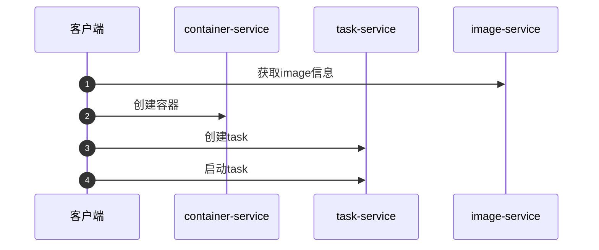

layout: draft
title: containerd源码-启动容器
author: Nature丿灵然
tags:
  - containerd
  - k8s
date: 2023-11-20 11:18:00
---

containerd得启动也分为服务端和客户端

<!--more-->

代码版本为v.17.5

#### 客户端

> ctr启动一个pod有两种方式，一个是是run命令直接启动一个pod，还有一种先创建container，在创建task在启动,run命令指示把contaIner和task一块处理了

#### container create

- 入口这里

```go
// cmd/ctr/commands/containers/containers.go
var createCommand = cli.Command{
  Name:      "create",
  Usage:     "create container",
  ArgsUsage: "[flags] Image|RootFS CONTAINER [COMMAND] [ARG...]",
  Flags:     append(commands.SnapshotterFlags, commands.ContainerFlags...),
  Action: func(context *cli.Context) error {
    // 参数处理
    client, ctx, cancel, err := commands.NewClient(context)
    if err != nil {
      return err
    }
    defer cancel()
    _, err = run.NewContainer(ctx, client, context)
    if err != nil {
      return err
    }
    return nil
  },
}
```

- 去除配置相关的主要是查看snapshotter中有没有解压如果没有则解压，然后将处理后的配置信息传递给`client.NewContainer()`

```go
// cmd/ctr/commands/run/run_unix.go

func NewContainer(ctx gocontext.Context, client *containerd.Client, context *cli.Context) (containerd.Container, error) {
      // ...
      i, err := client.ImageService().Get(ctx, ref)
      if ps := context.String("platform"); ps != "" {
        platform, err := platforms.Parse(ps)
        image = containerd.NewImageWithPlatform(client, i, platforms.Only(platform))
      } else {
        image = containerd.NewImage(client, i)

      unpacked, err := image.IsUnpacked(ctx, snapshotter)
      if err != nil {
        return nil, err
      }
      if !unpacked {
        if err := image.Unpack(ctx, snapshotter); err != nil {
          return nil, err
        }
      }

  cOpts = append(cOpts, spec)

  return client.NewContainer(ctx, id, cOpts...)
}
```

- 随后将前面的参数传递到Container，然后调用grpc创建`container`

```go
// client.go


// NewContainer will create a new container in container with the provided id
// the id must be unique within the namespace
func (c *Client) NewContainer(ctx context.Context, id string, opts ...NewContainerOpts) (Container, error) {
  ctx, done, err := c.WithLease(ctx)
  defer done(ctx)

  container := containers.Container{
    ID: id,
    Runtime: containers.RuntimeInfo{
      Name: c.runtime,
    },
  }
  for _, o := range opts {
    if err := o(ctx, c, &container); err != nil {
      return nil, err
    }
  }

  r, err := c.ContainerService().Create(ctx, container)

  return containerFromRecord(c, r), nil
}
```

#### task start

- 前面创建完容器之后就需要创建一个task
- 创建完task之后就启动task，这里处理detach这个参数如果有则不会退出之后删除

```go
// cmd/ctr/commands/tasks/start.go

var startCommand = cli.Command{
  Name:      "start",
  Usage:     "start a container that has been created",
  ArgsUsage: "CONTAINER",
  Flags: []cli.Flag{
    cli.BoolFlag{
      Name:  "null-io",
      Usage: "send all IO to /dev/null",
    },
    cli.StringFlag{
      Name:  "log-uri",
      Usage: "log uri",
    },
    cli.StringFlag{
      Name:  "fifo-dir",
      Usage: "directory used for storing IO FIFOs",
    },
    cli.StringFlag{
      Name:  "pid-file",
      Usage: "file path to write the task's pid",
    },
    cli.BoolFlag{
      Name:  "detach,d",
      Usage: "detach from the task after it has started execution",
    },
  },
  Action: func(context *cli.Context) error {
    client, ctx, cancel, err := commands.NewClient(context)

    defer cancel()
    container, err := client.LoadContainer(ctx, id)

    spec, err := container.Spec(ctx)
    var con console.Console
    if tty {
      con = console.Current()
      defer con.Reset()
      if err := con.SetRaw(); err != nil {
        return err
      }
    }

    task, err := NewTask(ctx, client, container, "", con, context.Bool("null-io"), context.String("log-uri"), ioOpts, opts...)

    var statusC <-chan containerd.ExitStatus
    if !detach {
      defer task.Delete(ctx)
      if statusC, err = task.Wait(ctx); err != nil {
        return err
      }
    }
    if context.IsSet("pid-file") {
      if err := commands.WritePidFile(context.String("pid-file"), int(task.Pid())); err != nil {
        return err
      }
    }
    if err := task.Start(ctx); err != nil {
      return err
    }
    if detach {
      return nil
    }

    status := <-statusC
    code, _, err := status.Result()
    if err != nil {
      return err
    }
    if _, err := task.Delete(ctx); err != nil {
      return err
    }
    if code != 0 {
      return cli.NewExitError("", int(code))
    }
    return nil
  },
}
```

- NewTask处理了下命令行相关，然后调用了container.NewTask()

```go
// cmd/ctr/commands/tasks/tasks_unix.go

func NewTask(ctx gocontext.Context, client *containerd.Client, container containerd.Container, checkpoint string, con console.Console, nullIO bool, logURI string, ioOpts []cio.Opt, opts ...containerd.NewTaskOpts) (containerd.Task, error) {
  stdinC := &stdinCloser{
    stdin: os.Stdin,
  }
  if checkpoint != "" {
    im, err := client.GetImage(ctx, checkpoint)

    opts = append(opts, containerd.WithTaskCheckpoint(im))
  }
  var ioCreator cio.Creator
  if con != nil {
    if nullIO {
      return nil, errors.New("tty and null-io cannot be used together")
    }
    ioCreator = cio.NewCreator(append([]cio.Opt{cio.WithStreams(con, con, nil), cio.WithTerminal}, ioOpts...)...)
  } else if nullIO {
    ioCreator = cio.NullIO
  } else if logURI != "" {
    u, err := url.Parse(logURI)
    ioCreator = cio.LogURI(u)
  } else {
    ioCreator = cio.NewCreator(append([]cio.Opt{cio.WithStreams(stdinC, os.Stdout, os.Stderr)}, ioOpts...)...)
  }
  t, err := container.NewTask(ctx, ioCreator, opts...)

  stdinC.closer = func() {
    t.CloseIO(ctx, containerd.WithStdinCloser)
  }
  return t, nil
}
```

##### run命令

- 基本就是将`container create`和`task start`的逻辑组合到一块

```go
// Command runs a container
var Command = cli.Command{
  Name:           "run",
  Usage:          "run a container",
  ArgsUsage:      "[flags] Image|RootFS ID [COMMAND] [ARG...]",
  SkipArgReorder: true,
  Flags: append([]cli.Flag{
    cli.BoolFlag{
      Name:  "detach,d",
      Usage: "detach from the task after it has started execution",
    },

  }, append(platformRunFlags, append(commands.SnapshotterFlags, commands.ContainerFlags...)...)...),
  Action: func(context *cli.Context) error {

    client, ctx, cancel, err := commands.NewClient(context)
  
    defer cancel()
    container, err := NewContainer(ctx, client, context)
  
    if context.Bool("rm") && !detach {
      defer container.Delete(ctx, containerd.WithSnapshotCleanup)
    }
    var con console.Console
    if tty {
      con = console.Current()
      defer con.Reset()
      if err := con.SetRaw(); err != nil {
        return err
      }
    }
    var network gocni.CNI
    if enableCNI {
      if network, err = gocni.New(gocni.WithDefaultConf); err != nil {
        return err
      }
    }

    opts := getNewTaskOpts(context)
    ioOpts := []cio.Opt{cio.WithFIFODir(context.String("fifo-dir"))}
    task, err := tasks.NewTask(ctx, client, container, context.String("checkpoint"), con, context.Bool("null-io"), context.String("log-uri"), ioOpts, opts...)
 

    var statusC <-chan containerd.ExitStatus
    if !detach {
      defer func() {
        if enableCNI {
          if err := network.Remove(ctx, fullID(ctx, container), ""); err != nil {
            logrus.WithError(err).Error("network review")
          }
        }
        task.Delete(ctx)
      }()

      if statusC, err = task.Wait(ctx); err != nil {
        return err
      }
    }

    if err := task.Start(ctx); err != nil {
      return err
    }
    }
    if tty {
      if err := tasks.HandleConsoleResize(ctx, task, con); err != nil {
        logrus.WithError(err).Error("console resize")
      }
    } else {
      sigc := commands.ForwardAllSignals(ctx, task)
      defer commands.StopCatch(sigc)
    }
    status := <-statusC
    code, _, err := status.Result()
    if err != nil {
      return err
    }
    if _, err := task.Delete(ctx); err != nil {
      return err
    }
    if code != 0 {
      return cli.NewExitError("", int(code))
    }
    return nil
  },
}
```

#### 服务端

##### container

###### container grpc

- 插件注册，依赖一个service

```go
// services/containers/service.go

func init() {
  plugin.Register(&plugin.Registration{
    Type: plugin.GRPCPlugin,
    ID:   "containers",
    Requires: []plugin.Type{
      plugin.ServicePlugin,
    },
    InitFn: func(ic *plugin.InitContext) (interface{}, error) {
      plugins, err := ic.GetByType(plugin.ServicePlugin)
      if err != nil {
        return nil, err
      }
      p, ok := plugins[services.ContainersService]
      if !ok {
        return nil, errors.New("containers service not found")
      }
      i, err := p.Instance()
      if err != nil {
        return nil, err
      }
      return &service{local: i.(api.ContainersClient)}, nil
    },
  })
}
```

- api则直接调用了上层

```go
func (s *service) Create(ctx context.Context, req *api.CreateContainerRequest) (*api.CreateContainerResponse, error) {
  return s.local.Create(ctx, req)
}
```

###### container service

- 插件注册

```go
// services/containers/local.go
func init() {
  plugin.Register(&plugin.Registration{
    Type: plugin.ServicePlugin,
    ID:   services.ContainersService,
    Requires: []plugin.Type{
      plugin.MetadataPlugin,
    },
    InitFn: func(ic *plugin.InitContext) (interface{}, error) {
      m, err := ic.Get(plugin.MetadataPlugin)

      db := m.(*metadata.DB)
      return &local{
        Store:     metadata.NewContainerStore(db),
        db:        db,
        publisher: ic.Events,
      }, nil
    },
  })
}
```

- 主要调用了`Store.Create()`数据库中创建一个`container`,且上传了事件

```go
// services/containers/local.go

func (l *local) Create(ctx context.Context, req *api.CreateContainerRequest, _ ...grpc.CallOption) (*api.CreateContainerResponse, error) {
  var resp api.CreateContainerResponse
  if err := l.withStoreUpdate(ctx, func(ctx context.Context) error {
    container := containerFromProto(&req.Container)
    created, err := l.Store.Create(ctx, container)
    resp.Container = containerToProto(&created)
  }); err != nil {
    return &resp, errdefs.ToGRPC(err)
  }
  if err := l.publisher.Publish(ctx, "/containers/create", &eventstypes.ContainerCreate{
    ID:    resp.Container.ID,
    Image: resp.Container.Image,
    Runtime: &eventstypes.ContainerCreate_Runtime{
      Name:    resp.Container.Runtime.Name,
      Options: resp.Container.Runtime.Options,
    },
  }); err != nil {
    return &resp, err
  }

  return &resp, nil
}
```

- 看下数据中对于Container的实现

```go
// metadata/containers.go

// NewContainerStore returns a Store backed by an underlying bolt DB
func NewContainerStore(db *DB) containers.Store {
  return &containerStore{
    db: db,
  }
}
```

- 首先校验了了一下container,然后在数据库中创建一个记录

```go
// metadata/containers.go

func (s *containerStore) Create(ctx context.Context, container containers.Container) (containers.Container, error) {
  namespace, err := namespaces.NamespaceRequired(ctx)
  if err := validateContainer(&container); err != nil {
    return containers.Container{}, errors.Wrap(err, "create container failed validation")
  }
  if err := update(ctx, s.db, func(tx *bolt.Tx) error {
    bkt, err := createContainersBucket(tx, namespace)
    cbkt, err := bkt.CreateBucket([]byte(container.ID))
    if err != nil {
      if err == bolt.ErrBucketExists {
        err = errors.Wrapf(errdefs.ErrAlreadyExists, "container %q", container.ID)
      }
      return err
    }
    container.CreatedAt = time.Now().UTC()
    container.UpdatedAt = container.CreatedAt
    if err := writeContainer(cbkt, &container); err != nil {
      return errors.Wrapf(err, "failed to write container %q", container.ID)
    }
    return nil
  }); err != nil {
    return containers.Container{}, err
  }
  return container, nil
}
```

#### task

##### task grpc

- 注册依赖于service的插件

```go
// services/tasks/service.go

func init() {
  plugin.Register(&plugin.Registration{
    Type: plugin.GRPCPlugin,
    ID:   "tasks",
    Requires: []plugin.Type{
      plugin.ServicePlugin,
    },
    InitFn: func(ic *plugin.InitContext) (interface{}, error) {
      plugins, err := ic.GetByType(plugin.ServicePlugin)
      p, ok := plugins[services.TasksService]
      if !ok {
        return nil, errors.New("tasks service not found")
      }
      i, err := p.Instance()
      return &service{local: i.(api.TasksClient)}, nil
    },
  })
}
```

- api直接调用上层的插件了

```go
func (s *service) Create(ctx context.Context, r *api.CreateTaskRequest) (*api.CreateTaskResponse, error) {
  return s.local.Create(ctx, r)
}

func (s *service) Start(ctx context.Context, r *api.StartRequest) (*api.StartResponse, error) {
  return s.local.Start(ctx, r)
}

```

###### task serivce

- 初始化的过程根据平台来选,分别有bsd，unix和win主要看unix

```go
func init() {
  plugin.Register(&plugin.Registration{
    Type:     plugin.ServicePlugin,
    ID:       services.TasksService,
    Requires: tasksServiceRequires,
    InitFn:   initFunc,
  })

  timeout.Set(stateTimeout, 2*time.Second)
```

- unix加载的插件

```go
// services/tasks/local_unix.go
var tasksServiceRequires = []plugin.Type{
  plugin.RuntimePlugin,
  plugin.RuntimePluginV2,
  plugin.MetadataPlugin,
  plugin.TaskMonitorPlugin,
}
```

- 根据平台调用`loadV1Runtimes()`加载runtimev1然后遍历
- runtimev2 则是通过`ic.Get(plugin.RuntimePluginV2)`通过插件的形式拿到

```go
// services/tasks/local.go

func initFunc(ic *plugin.InitContext) (interface{}, error) {
  runtimes, err := loadV1Runtimes(ic)

  v2r, err := ic.Get(plugin.RuntimePluginV2)

  m, err := ic.Get(plugin.MetadataPlugin)

  monitor, err := ic.Get(plugin.TaskMonitorPlugin)
  if err != nil {
    if !errdefs.IsNotFound(err) {
      return nil, err
    }
    monitor = runtime.NewNoopMonitor()
  }

  db := m.(*metadata.DB)
  l := &local{
    runtimes:   runtimes,
    containers: metadata.NewContainerStore(db),
    store:      db.ContentStore(),
    publisher:  ic.Events,
    monitor:    monitor.(runtime.TaskMonitor),
    v2Runtime:  v2r.(*v2.TaskManager),
  }
  for _, r := range runtimes {
    tasks, err := r.Tasks(ic.Context, true)
    for _, t := range tasks {
      l.monitor.Monitor(t)
    }
  }
  v2Tasks, err := l.v2Runtime.Tasks(ic.Context, true)
  for _, t := range v2Tasks {
    l.monitor.Monitor(t)
  }
  return l, nil
}
}
```

- 具体api实现方面，通过请求的容器id获取容器，处理下需要恢复路径，因为contaInerd重启容器并不会退出，所以需要contaIner找到之前的容器
- 处理rootfs
- 获取一个`runtime.get()` 获取一个task没然后执行创建task
- 随后调用`monitor.Monitor(c)`监控容器

```go
// services/tasks/local.go

func (l *local) Create(ctx context.Context, r *api.CreateTaskRequest, _ ...grpc.CallOption) (*api.CreateTaskResponse, error) {
  container, err := l.getContainer(ctx, r.ContainerID)
  checkpointPath, err := getRestorePath(container.Runtime.Name, r.Options)

  if checkpointPath == "" && r.Checkpoint != nil {
    checkpointPath, err = ioutil.TempDir(os.Getenv("XDG_RUNTIME_DIR"), "ctrd-checkpoint")
 
    if r.Checkpoint.MediaType != images.MediaTypeContainerd1Checkpoint {
      return nil, fmt.Errorf("unsupported checkpoint type %q", r.Checkpoint.MediaType)
    }
    reader, err := l.store.ReaderAt(ctx, ocispec.Descriptor{
      MediaType:   r.Checkpoint.MediaType,
      Digest:      r.Checkpoint.Digest,
      Size:        r.Checkpoint.Size_,
      Annotations: r.Checkpoint.Annotations,
    })

    _, err = archive.Apply(ctx, checkpointPath, content.NewReader(reader))
    reader.Close()

  }
  opts := runtime.CreateOpts{
    Spec: container.Spec,
    IO: runtime.IO{
      Stdin:    r.Stdin,
      Stdout:   r.Stdout,
      Stderr:   r.Stderr,
      Terminal: r.Terminal,
    },
    Checkpoint:     checkpointPath,
    Runtime:        container.Runtime.Name,
    RuntimeOptions: container.Runtime.Options,
    TaskOptions:    r.Options,
  }
  for _, m := range r.Rootfs {
    opts.Rootfs = append(opts.Rootfs, mount.Mount{
      Type:    m.Type,
      Source:  m.Source,
      Options: m.Options,
    })
  }
  if strings.HasPrefix(container.Runtime.Name, "io.containerd.runtime.v1.") {
    log.G(ctx).Warn("runtime v1 is deprecated since containerd v1.4, consider using runtime v2")
  } else if container.Runtime.Name == plugin.RuntimeRuncV1 {
    log.G(ctx).Warnf("%q is deprecated since containerd v1.4, consider using %q", plugin.RuntimeRuncV1, plugin.RuntimeRuncV2)
  }
  rtime, err := l.getRuntime(container.Runtime.Name)
  _, err = rtime.Get(ctx, r.ContainerID)
  if err != nil && err != runtime.ErrTaskNotExists {
    return nil, errdefs.ToGRPC(err)
  }
  if err == nil {
    return nil, errdefs.ToGRPC(fmt.Errorf("task %s already exists", r.ContainerID))
  }
  c, err := rtime.Create(ctx, r.ContainerID, opts)
  if err != nil {
    return nil, errdefs.ToGRPC(err)
  }
  if err := l.monitor.Monitor(c); err != nil {
    return nil, errors.Wrap(err, "monitor task")
  }
  return &api.CreateTaskResponse{
    ContainerID: r.ContainerID,
    Pid:         c.PID(),
  }, nil
}
```

- start根据上一步创建的task获取进程然后启动进程

```go
// services/tasks/local.go

func (l *local) Start(ctx context.Context, r *api.StartRequest, _ ...grpc.CallOption) (*api.StartResponse, error) {
  t, err := l.getTask(ctx, r.ContainerID)

  p := runtime.Process(t)
  if r.ExecID != "" {
    if p, err = t.Process(ctx, r.ExecID); err != nil {
      return nil, errdefs.ToGRPC(err)
    }
  }
  if err := p.Start(ctx); err != nil {
    return nil, errdefs.ToGRPC(err)
  }
  state, err := p.State(ctx)
  if err != nil {
    return nil, errdefs.ToGRPC(err)
  }
  return &api.StartResponse{
    Pid: state.Pid,
  }, nil
}
```

##### runtime

- runtime有2个版本现在普遍使用v2,他的初始化会根据平台传递一个config，最后拿到的参数传递给`New()`

```go
// runtime/v2/manager.go

func init() {
  plugin.Register(&plugin.Registration{
    Type: plugin.RuntimePluginV2,
    ID:   "task",
    Requires: []plugin.Type{
      plugin.MetadataPlugin,
    },
    Config: &Config{
      Platforms: defaultPlatforms(),
    },
    InitFn: func(ic *plugin.InitContext) (interface{}, error) {
      supportedPlatforms, err := parsePlatforms(ic.Config.(*Config).Platforms)

      ic.Meta.Platforms = supportedPlatforms
      if err := os.MkdirAll(ic.Root, 0711); err != nil {
        return nil, err
      }
      if err := os.MkdirAll(ic.State, 0711); err != nil {
        return nil, err
      }
      m, err := ic.Get(plugin.MetadataPlugin)

      cs := metadata.NewContainerStore(m.(*metadata.DB))

      return New(ic.Context, ic.Root, ic.State, ic.Address, ic.TTRPCAddress, ic.Events, cs)
    },
  })
}
```

- New()创建了文件夹和初始化了一个`TaskManager`,然后调用loadExistingTasks()方法加载已经存在的task

```go
// New task manager for v2 shims
func New(ctx context.Context, root, state, containerdAddress, containerdTTRPCAddress string, events *exchange.Exchange, cs containers.Store) (*TaskManager, error) {
  for _, d := range []string{root, state} {
    if err := os.MkdirAll(d, 0711); err != nil {
      return nil, err
    }
  }
  m := &TaskManager{
    root:                   root,
    state:                  state,
    containerdAddress:      containerdAddress,
    containerdTTRPCAddress: containerdTTRPCAddress,
    tasks:                  runtime.NewTaskList(),
    events:                 events,
    containers:             cs,
  }
  if err := m.loadExistingTasks(ctx); err != nil {
    return nil, err
  }
  return m, nil
}
```

- 最终通过shim创建容器，然后添加task

```go
// Create a new task
func (m *TaskManager) Create(ctx context.Context, id string, opts runtime.CreateOpts) (_ runtime.Task, retErr error) {
  bundle, err := NewBundle(ctx, m.root, m.state, id, opts.Spec.Value)
  defer func() {
    if retErr != nil {
      bundle.Delete()
    }
  }()

  shim, err := m.startShim(ctx, bundle, id, opts)

  defer func() {
    if retErr != nil {
      m.deleteShim(shim)
    }
  }()

  t, err := shim.Create(ctx, opts)

  if err := m.tasks.Add(ctx, t); err != nil {
    return nil, errors.Wrap(err, "failed to add task")
  }

  return t, nil
}
```

- 看了startShim实现。通过bundel等参数构造出一个`binary`,然后调用`start()`方法

```go
// runtime/v2/manager.go

func (m *TaskManager) startShim(ctx context.Context, bundle *Bundle, id string, opts runtime.CreateOpts) (*shim, error) {
  ns, err := namespaces.NamespaceRequired(ctx)

  topts := opts.TaskOptions

  b := shimBinary(ctx, bundle, opts.Runtime, m.containerdAddress, m.containerdTTRPCAddress, m.events, m.tasks)
  shim, err := b.Start(ctx, topts, func() {
    log.G(ctx).WithField("id", id).Info("shim disconnected")

    cleanupAfterDeadShim(context.Background(), id, ns, m.tasks, m.events, b)
    // Remove self from the runtime task list. Even though the cleanupAfterDeadShim()
    // would publish taskExit event, but the shim.Delete() would always failed with ttrpc
    // disconnect and there is no chance to remove this dead task from runtime task lists.
    // Thus it's better to delete it here.
    m.tasks.Delete(ctx, id)
  })

  return shim, nil
}
```

- 这里通过`client.Command()`组装出命令然后启动程序
- 随后创建一个ttrpc客户端返回

```go
func (b *binary) Start(ctx context.Context, opts *types.Any, onClose func()) (_ *shim, err error) {
  args := []string{"-id", b.bundle.ID}
  if logrus.GetLevel() == logrus.DebugLevel {
    args = append(args, "-debug")
  }
  args = append(args, "start")

  cmd, err := client.Command(
    ctx,
    b.runtime,
    b.containerdAddress,
    b.containerdTTRPCAddress,
    b.bundle.Path,
    opts,
    args...,
  )

  // Windows needs a namespace when openShimLog
  ns, _ := namespaces.Namespace(ctx)
  shimCtx, cancelShimLog := context.WithCancel(namespaces.WithNamespace(context.Background(), ns))
  defer func() {
    if err != nil {
      cancelShimLog()
    }
  }()
  f, err := openShimLog(shimCtx, b.bundle, client.AnonDialer)
  if err != nil {
    return nil, errors.Wrap(err, "open shim log pipe")
  }
  defer func() {
    if err != nil {
      f.Close()
    }
  }()
  // open the log pipe and block until the writer is ready
  // this helps with synchronization of the shim
  // copy the shim's logs to containerd's output
  go func() {
    defer f.Close()
    _, err := io.Copy(os.Stderr, f)
    // To prevent flood of error messages, the expected error
    // should be reset, like os.ErrClosed or os.ErrNotExist, which
    // depends on platform.
    err = checkCopyShimLogError(ctx, err)
    if err != nil {
      log.G(ctx).WithError(err).Error("copy shim log")
    }
  }()
  out, err := cmd.CombinedOutput()
  if err != nil {
    return nil, errors.Wrapf(err, "%s", out)
  }
  address := strings.TrimSpace(string(out))
  conn, err := client.Connect(address, client.AnonDialer)
  if err != nil {
    return nil, err
  }
  onCloseWithShimLog := func() {
    onClose()
    cancelShimLog()
    f.Close()
  }
  client := ttrpc.NewClient(conn, ttrpc.WithOnClose(onCloseWithShimLog))
  return &shim{
    bundle:  b.bundle,
    client:  client,
    task:    task.NewTaskClient(client),
    events:  b.events,
    rtTasks: b.rtTasks,
  }, nil
}
```

#### 总结



#### 参考资料

<http://blog.naturelr.cc>
