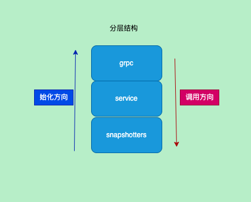
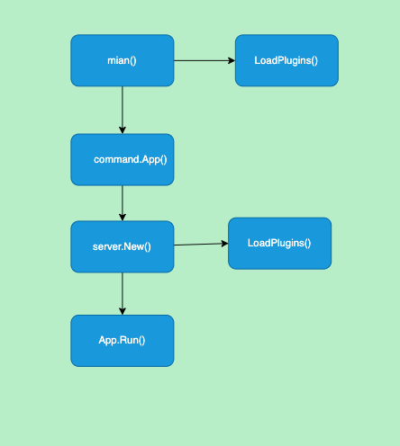

title: containerd源码-启动过程插件注册
author: Nature丿灵然
tags:
  - k8s
  - containerd
categories:
  - 开发
date: 2023-10-27 15:15:00
---

前面介绍了containerd的存储以及oci等,现在将从源码开蓝启动过程和插件的注册

<!--more-->

#### 启动过程

- 入口在/cmd/containerd/main.go,这里申明了一个app并执行了run方法

```go
func main() {
  app := command.App()
  if err := app.Run(os.Args); err != nil {
    fmt.Fprintf(os.Stderr, "containerd: %s\n", err)
    os.Exit(1)
  }
}
```

- 在App函数中主要处理命令行参数以及启动grpc等服务器

```go
// cmd/containerd/main.go
...
  log.G(ctx).WithFields(logrus.Fields{
      "version":  version.Version,
      "revision": version.Revision,
  }).Info("starting containerd")

  server, err := server.New(ctx, config)
  if err != nil {
      return err
  }

  // Launch as a Windows Service if necessary
  if err := launchService(server, done); err != nil {
    logrus.Fatal(err)
  }
```

- 然后就是主要的启动流程了，创建了server这个对象

- 加载插件，加载了配种的procesor插件以及主要的插件

```go
// services/server/server.go
plugins, err := LoadPlugins(ctx, config)
if err != nil {
  return nil, err
}

for id, p := range config.StreamProcessors {
  diff.RegisterProcessor(diff.BinaryHandler(id, p.Returns, p.Accepts, p.Path, p.Args, p.Env)) // 注册 processor
}
```

- 进去LoadPlugins函数,这里主要加载几个重要的创建，首先注册了`content`类型的插件，id是`content`

```go
// services/server/server.go
plugin.Register(&plugin.Registration{
  Type: plugin.ContentPlugin,
  ID:   "content",
  InitFn: func(ic *plugin.InitContext) (interface{}, error) {
    ic.Meta.Exports["root"] = ic.Root
    return local.NewStore(ic.Root)
  },
})

```

- 然后注册了bolt插件，bolt主要负责bolt数据库相关的,初始化第一步获取一个content类型的插件，然后将之前的注册的sn全部放到snapshotters中,
随后根据配置文件创建了一个bolt.Open函数创建一个bolt，传入bolt和snapshotters创建出metadata,metadata主要存储元数据底层是boltDB

```go
// services/server/server.go
plugin.Register(&plugin.Registration{
    Type: plugin.MetadataPlugin,
    ID:   "bolt",
    Requires: []plugin.Type{
        plugin.ContentPlugin,
        plugin.SnapshotPlugin,
    },
    Config: &srvconfig.BoltConfig{
      ContentSharingPolicy: srvconfig.SharingPolicyShared,
    },
    InitFn: func(ic *plugin.InitContext) (interface{}, error) {
      // 返回所有content插件中第一个
      cs, err := ic.Get(plugin.ContentPlugin)

      snapshottersRaw, err := ic.GetByType(plugin.SnapshotPlugin)

      snapshotters := make(map[string]snapshots.Snapshotter)
      for name, sn := range snapshottersRaw {
      sn, err := sn.Instance()
      if err != nil {
        if !plugin.IsSkipPlugin(err) {
          log.G(ic.Context).WithError(err).
          Warnf("could not use snapshotter %v in metadata plugin", name)
        }
        continue
      }
        snapshotters[name] = sn.(snapshots.Snapshotter)
      }
      shared := true
      ic.Meta.Exports["policy"] = srvconfig.SharingPolicyShared
      if cfg, ok := ic.Config.(*srvconfig.BoltConfig); ok {
        if cfg.ContentSharingPolicy != "" {
          if err := cfg.Validate(); err != nil {
            return nil, err
          }
          if cfg.ContentSharingPolicy == srvconfig.SharingPolicyIsolated {
            ic.Meta.Exports["policy"] = srvconfig.SharingPolicyIsolated
            shared = false
          }

          log.L.WithField("policy", cfg.ContentSharingPolicy).Info("metadata content store policy set")
        }
      }

      path := filepath.Join(ic.Root, "meta.db")
      ic.Meta.Exports["path"] = path
      // 创建bolt数据库
      db, err := bolt.Open(path, 0644, nil)
      if err != nil {
          return nil, err
      }

      var dbopts []metadata.DBOpt
      if !shared {
        dbopts = append(dbopts, metadata.WithPolicyIsolated)
      }
      // 初始化metadata 插件
      mdb := metadata.NewDB(db, cs.(content.Store), snapshotters, dbopts...)
      if err := mdb.Init(ic.Context); err != nil {
        return nil, err
      }
      return mdb, nil
    },
  })
... 
```

- 最后读取了配置文件中插件的配置然后初始化插件,先判断插件类型，然后根据不同类型注册插件

```go
// services/server/server.go

clients := &proxyClients{}
  for name, pp := range config.ProxyPlugins {
    var (
      t plugin.Type
      f func(*grpc.ClientConn) interface{}
      address = pp.Address
  )

    switch pp.Type {
    case string(plugin.SnapshotPlugin), "snapshot":
        t = plugin.SnapshotPlugin
        ssname := name
        f = func(conn *grpc.ClientConn) interface{} {
        return ssproxy.NewSnapshotter(ssapi.NewSnapshotsClient(conn), ssname)
        }

    case string(plugin.ContentPlugin), "content":
        t = plugin.ContentPlugin
        f = func(conn *grpc.ClientConn) interface{} {
          return csproxy.NewContentStore(csapi.NewContentClient(conn))
        }
    default:
      log.G(ctx).WithField("type", pp.Type).Warn("unknown proxy plugin type")
    }

    plugin.Register(&plugin.Registration{
      Type: t,
      ID:   name,
      InitFn: func(ic *plugin.InitContext) (interface{}, error) {
        ic.Meta.Exports["address"] = address
        conn, err := clients.getClient(address)
        if err != nil {
          return nil, err
        }
        return f(conn), nil
      },
    })

  }
```

- 最后根据插件的依赖以及类型排序以及根据配置文件过滤关闭的插件

```go
  // services/server/server.go
  filter := srvconfig.V2DisabledFilter
  if config.GetVersion() == 1 {
    filter = srvconfig.V1DisabledFilter
  }
  // return the ordered graph for plugins
  return plugin.Graph(filter(config.DisabledPlugins)), nil
```

- 回到server.go的`New`函数继续往下看，接下来就是初始化grpc，tcp已经ttrp服务器的初始化，然后构造`Server`结构体,同事根据配置文件获取到需要的开启的插件存取`required`中

```go
// services/server/server.go
serverOpts := []grpc.ServerOption{
    grpc.UnaryInterceptor(grpc_prometheus.UnaryServerInterceptor),
    grpc.StreamInterceptor(grpc_prometheus.StreamServerInterceptor),
  }
  if config.GRPC.MaxRecvMsgSize > 0 {
    serverOpts = append(serverOpts, grpc.MaxRecvMsgSize(config.GRPC.MaxRecvMsgSize))
  }
  if config.GRPC.MaxSendMsgSize > 0 {
    serverOpts = append(serverOpts, grpc.MaxSendMsgSize(config.GRPC.MaxSendMsgSize))
  }
  ttrpcServer, err := newTTRPCServer()
  if err != nil {
    return nil, err
  }
  tcpServerOpts := serverOpts
  if config.GRPC.TCPTLSCert != "" {
    log.G(ctx).Info("setting up tls on tcp GRPC services...")
    creds, err := credentials.NewServerTLSFromFile(config.GRPC.TCPTLSCert, config.GRPC.TCPTLSKey)
    if err != nil {
      return nil, err
    }
    tcpServerOpts = append(tcpServerOpts, grpc.Creds(creds))
  }
  var (
    grpcServer = grpc.NewServer(serverOpts...)
    tcpServer  = grpc.NewServer(tcpServerOpts...)

    grpcServices  []plugin.Service
    tcpServices   []plugin.TCPService
    ttrpcServices []plugin.TTRPCService

    s = &Server{
      grpcServer:  grpcServer,
      tcpServer:   tcpServer,
      ttrpcServer: ttrpcServer,
      events:      exchange.NewExchange(),
      config:      config,
    }
    initialized = plugin.NewPluginSet()
    required    = make(map[string]struct{})
  )
  for _, r := range config.RequiredPlugins {
    required[r] = struct{}{}
  }
```

- 接着根据上面`LoadPlugins`获取的插件开始遍历然后初始化
- plugin.NewContext构造初始化需要的参数
- p.Init执行注册插件时候的初始化内容
- initialized.Add将初始化过的插件加入到已经初始化的结构体中，为后面的插件掉用
- result.Instance()获取一个插件实例然后查看是否有grpc等方法实现，有则放到到grpc等服务中
- 同时将required中初始化了的插件删除

```go
  for _, p := range plugins {
    id := p.URI()
    reqID := id
    if config.GetVersion() == 1 {
      reqID = p.ID
    }
    log.G(ctx).WithField("type", p.Type).Infof("loading plugin %q...", id)

    initContext := plugin.NewContext(
      ctx,
      p,
      initialized,
      config.Root,
      config.State,
    )
    initContext.Events = s.events
    initContext.Address = config.GRPC.Address
    initContext.TTRPCAddress = config.TTRPC.Address

    // load the plugin specific configuration if it is provided
    if p.Config != nil {
      pc, err := config.Decode(p)
      if err != nil {
        return nil, err
      }
      initContext.Config = pc
    }
    // 执行初始化
    result := p.Init(initContext)
    // 将已经初始化的插件加入到initialized中，因为后面的插件可能依赖前面的插件
    if err := initialized.Add(result); err != nil {
      return nil, errors.Wrapf(err, "could not add plugin result to plugin set")
    }

    instance, err := result.Instance()
    if err != nil {
      if plugin.IsSkipPlugin(err) {
        log.G(ctx).WithError(err).WithField("type", p.Type).Infof("skip loading plugin %q...", id)
      } else {
        log.G(ctx).WithError(err).Warnf("failed to load plugin %s", id)
      }
      if _, ok := required[reqID]; ok {
        return nil, errors.Wrapf(err, "load required plugin %s", id)
      }
      continue
    }

    delete(required, reqID)
    // check for grpc services that should be registered with the server
    if src, ok := instance.(plugin.Service); ok {
      grpcServices = append(grpcServices, src)
    }
    if src, ok := instance.(plugin.TTRPCService); ok {
      ttrpcServices = append(ttrpcServices, src)
    }
    if service, ok := instance.(plugin.TCPService); ok {
      tcpServices = append(tcpServices, service)
    }

    s.plugins = append(s.plugins, result)
  }
```

- 完成插件初始化后首先判断required是否还有，确认已经需要加载的已经加载
- 依次将初始化插件的相关service注册到对应的服务器中,然后返回server

```go
if len(required) != 0 {
    var missing []string
    for id := range required {
      missing = append(missing, id)
    }
    return nil, errors.Errorf("required plugin %s not included", missing)
  }

  // register services after all plugins have been initialized
  for _, service := range grpcServices {
    if err := service.Register(grpcServer); err != nil {
      return nil, err
    }
  }
  for _, service := range ttrpcServices {
    if err := service.RegisterTTRPC(ttrpcServer); err != nil {
      return nil, err
    }
  }
  for _, service := range tcpServices {
    if err := service.RegisterTCP(tcpServer); err != nil {
      return nil, err
    }
  }
  return s, nil
```

- 至此containerd启动完成

#### 插件注册

- 利用go的import将所有模块的init函数执行
- 在路径在`cmd/containerd`中builtins开头的文件皆是如此

```go
// cmd/containerd/builtins_linux.go
package main

import (
  _ "github.com/containerd/containerd/metrics/cgroups"
  _ "github.com/containerd/containerd/metrics/cgroups/v2"
  _ "github.com/containerd/containerd/runtime/v1/linux"
  _ "github.com/containerd/containerd/runtime/v2"
  _ "github.com/containerd/containerd/runtime/v2/runc/options"
  _ "github.com/containerd/containerd/snapshots/native/plugin"
  _ "github.com/containerd/containerd/snapshots/overlay/plugin"
)
```

- 比如说overlayfs,需要填充类型，ID配置然后是初始化动作并返回,service类型的插他依赖metadata类型的插件

```go
// /containerd/services/snapshots/snapshotters.go
func init() {
  plugin.Register(&plugin.Registration{
    Type: plugin.ServicePlugin,
    ID:   services.SnapshotsService,
    Requires: []plugin.Type{
      plugin.MetadataPlugin,
    },
    InitFn: func(ic *plugin.InitContext) (interface{}, error) {
      m, err := ic.Get(plugin.MetadataPlugin)
      if err != nil {
        return nil, err
      }

      db := m.(*metadata.DB)
      ss := make(map[string]snapshots.Snapshotter)
      for n, sn := range db.Snapshotters() {
        ss[n] = newSnapshotter(sn, ic.Events)
      }
      return ss, nil
    },
  })
}
```

#### 插件类型

- 每一层都有负责的事情
- grpc负责处理grpc协议请求
- svc主要记录到数据中
- 最后是真正干活的



#### 插件

- 插件相关的代码在`/plugin/`中

##### plugin.go

- 其中plugin.go主要负责插件注册,以及定义插件类型

```go
type Registration struct {
  // Type of the plugin
  Type Type
  // ID of the plugin
  ID string
  // Config specific to the plugin
  Config interface{}
  // Requires is a list of plugins that the registered plugin requires to be available
  Requires []Type

  // InitFn is called when initializing a plugin. The registration and
  // context are passed in. The init function may modify the registration to
  // add exports, capabilities and platform support declarations.
  InitFn func(*InitContext) (interface{}, error)
  // Disable the plugin from loading
  Disable bool
}

const (
  // InternalPlugin implements an internal plugin to containerd
  InternalPlugin Type = "io.containerd.internal.v1"
  // RuntimePlugin implements a runtime
  RuntimePlugin Type = "io.containerd.runtime.v1"
  // RuntimePluginV2 implements a runtime v2
  RuntimePluginV2 Type = "io.containerd.runtime.v2"
  // ServicePlugin implements a internal service
  ServicePlugin Type = "io.containerd.service.v1"
  // GRPCPlugin implements a grpc service
  GRPCPlugin Type = "io.containerd.grpc.v1"
  // SnapshotPlugin implements a snapshotter
  SnapshotPlugin Type = "io.containerd.snapshotter.v1"
  // TaskMonitorPlugin implements a task monitor
  TaskMonitorPlugin Type = "io.containerd.monitor.v1"
  // DiffPlugin implements a differ
  DiffPlugin Type = "io.containerd.differ.v1"
  // MetadataPlugin implements a metadata store
  MetadataPlugin Type = "io.containerd.metadata.v1"
  // ContentPlugin implements a content store
  ContentPlugin Type = "io.containerd.content.v1"
  // GCPlugin implements garbage collection policy
  GCPlugin Type = "io.containerd.gc.v1"
)

```

- 其中各个插件都需要使用`Register`注册

```go
// Register allows plugins to register
func Register(r *Registration) {
  register.Lock()
  defer register.Unlock()

  if r.Type == "" {
    panic(ErrNoType)
  }
  if r.ID == "" {
    panic(ErrNoPluginID)
  }
  if err := checkUnique(r); err != nil {
    panic(err)
  }

  var last bool
  for _, requires := range r.Requires {
    if requires == "*" {
      last = true
    }
  }
  if last && len(r.Requires) != 1 {
    panic(ErrInvalidRequires)
  }

  register.r = append(register.r, r)
}
```

- Graph根据注册的插件的依赖关系生成一个有序的切片

```go
func Graph(filter DisableFilter) (ordered []*Registration) {
  register.RLock()
  defer register.RUnlock()

  for _, r := range register.r {
    if filter(r) {
      r.Disable = true
    }
  }

  added := map[*Registration]bool{}

  for _, r := range register.r {
    if r.Disable {
      continue
    }
    children(r, added, &ordered)
    if !added[r] {
      ordered = append(ordered, r)
      added[r] = true
    }
  }
  return ordered
}
```

##### context.go

- context.go主要负责时插件的上下文,Set这个结构体负责存放所有执行过初始化的插件

```go
type Set struct {
  ordered     []*Plugin // order of initialization
  byTypeAndID map[Type]map[string]*Plugin
}
```

- get根据类型获取插件，需要注意的是如果`同一个类型有多个只返回第一个`

```go
// Get returns the first plugin by its type
func (i *InitContext) Get(t Type) (interface{}, error) {
  return i.plugins.Get(t)
}
```

- 添加一个插件到集合里

```go
// Add a plugin to the set
func (ps *Set) Add(p *Plugin) error {
  if byID, typeok := ps.byTypeAndID[p.Registration.Type]; !typeok {
    ps.byTypeAndID[p.Registration.Type] = map[string]*Plugin{
      p.Registration.ID: p,
    }
  } else if _, idok := byID[p.Registration.ID]; !idok {
    byID[p.Registration.ID] = p
  } else {
    return errors.Wrapf(errdefs.ErrAlreadyExists, "plugin %v already initialized", p.Registration.URI())
  }

  ps.ordered = append(ps.ordered, p)
  return nil
}
```

#### 总结

- 整体的代码比较清晰的


