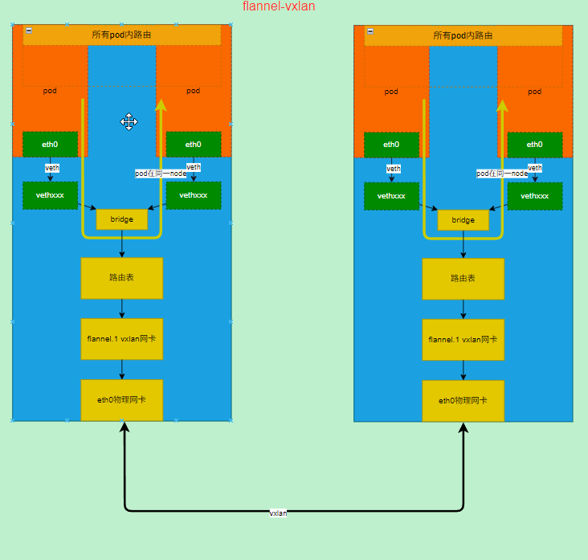

flannel是k8s一个常见的cni

<!--more-->

#### 部署

- 需要注意的是net-conf.json中的pod cidr需要喝集群的kube-controller-manager中的--cluster-cidr配置一致

```yaml
kind: ConfigMap
apiVersion: v1
metadata:
  name: kube-flannel-cfg
  namespace: kube-flannel
  labels:
    tier: node
    k8s-app: flannel
    app: flannel
data:
  cni-conf.json: |
    {
      "name": "cbr0",
      "cniVersion": "0.3.1",
      "plugins": [
        {
          "type": "flannel",
          "delegate": {
            "hairpinMode": true,
            "isDefaultGateway": true
          }
        },
        {
          "type": "portmap",
          "capabilities": {
            "portMappings": true
          }
        }
      ]
    }
  net-conf.json: |
    {
      "Network": "10.244.0.0/16",
      "EnableNFTables": false,
      "Backend": {
        "Type": "vxlan"
      }
    }
```

```shell
kubectl apply -f https://raw.githubusercontent.com/coreos/flannel/master/Documentation/kube-flannel.yml
```

##### ip分配

- 在集群安装的时候有个参数`kubeadm init --pod-network-cidr=10.244.0.0/16`其中`--pod-network-cidr`参数其实就是设置`kube-controller-manager`的`--cluster-cidr=10.244.0.0/16`参数

- kube-controller-manager的`NodeIpamController`会为每个节点从配置的池子分配一个子网

- 查看每个节点分配的子网

```shell
k get no 10-7-111-92 -o jsonpath="{.spec.podCIDR}"
# 10.244.1.0/24
```

```shell
cat /run/flannel/subnet.env
# FLANNEL_NETWORK=10.244.0.0/16
# FLANNEL_SUBNET=10.244.1.1/24
# FLANNEL_MTU=1424
# FLANNEL_IPMASQ=true
```

##### 后端模式

- flannel支持多种模式，根据网络情况选择，官方建议模式选择之后不要在中途修改

- 本文主要针对vxlan等模式，其他模式可以参考官方文档

##### vxlan模式

> vxlan模式是flannel的默认模式

- 节点和pod环境说明：有2个节点3个pod其中有2个pod在同一个节点

```shell
kubectl get po -o wide
# NAME                      READY   STATUS    RESTARTS   AGE   IP           NODE           NOMINATED NODE   READINESS GATES
# ubuntu-664c5f866b-2z472   1/1     Running   0          43m   10.244.0.4   10-7-160-190   <none>           <none>
# ubuntu-664c5f866b-865jb   1/1     Running   0          47h   10.244.1.2   10-7-111-92    <none>           <none>
# ubuntu-664c5f866b-ngdrj   1/1     Running   0          47h   10.244.1.3   10-7-111-92    <none>           <none>
kubectl get no
# NAME           STATUS   ROLES           AGE   VERSION
# 10-7-111-92    Ready    <none>          47h   v1.28.2
# 10-7-160-190   Ready    control-plane   47h   v1.28.2
```

- 选一个pod连续ping和他同节点的ip

```shell
k exec -it ubuntu-664c5f866b-865jb -- ping 10.244.1.3
# PING 10.244.1.3 (10.244.1.3) 56(84) bytes of data.
# 64 bytes from 10.244.1.3: icmp_seq=1 ttl=64 time=0.105 ms
# 64 bytes from 10.244.1.3: icmp_seq=2 ttl=64 time=0.082 ms
# 64 bytes from 10.244.1.3: icmp_seq=3 ttl=64 time=0.102 ms
# 64 bytes from 10.244.1.3: icmp_seq=4 ttl=64 time=0.095 ms
```

- 查看网桥可以看到cni0这个网桥上有2个veth

```shell
brctl show
# bridge name     bridge id               STP enabled     interfaces
# cni0            8000.2ef30b426c49       no              veth4891a1c9
#                                                         vethc408576a
```

- 通过转包可以看到同节点直接通过网桥转发

```shell
tcpdump -i cni0
# tcpdump: verbose output suppressed, use -v or -vv for full protocol decode
# listening on cni0, link-type EN10MB (Ethernet), capture size 262144 bytes
# 18:07:04.005795 IP 10.244.1.2 > 10.244.1.3: ICMP echo request, id 17509, seq 164, length 64
# 18:07:04.005867 IP 10.244.1.3 > 10.244.1.2: ICMP echo reply, id 17509, seq 164, length 64
# 18:07:05.029763 IP 10.244.1.2 > 10.244.1.3: ICMP echo request, id 17509, seq 165, length 64
# 18:07:05.029814 IP 10.244.1.3 > 10.244.1.2: ICMP echo reply, id 17509, seq 165, length 64
```

- 此时抓包flannel.1是没有流量的

```shell
tcpdump -i flannel.1
# tcpdump: verbose output suppressed, use -v or -vv for full protocol decode
# listening on flannel.1, link-type EN10MB (Ethernet), capture size 262144 bytes
```

- 查看cni0可以看到详细信息

```shell
ip -d link show cni0
# 6: cni0: <BROADCAST,MULTICAST,UP,LOWER_UP> mtu 1402 qdisc noqueue state UP mode DEFAULT group default qlen 1000
#     link/ether 2e:f3:0b:42:6c:49 brd ff:ff:ff:ff:ff:ff promiscuity 0
#     bridge forward_delay 1500 hello_time 200 max_age 2000 ageing_time 30000 stp_state 0 priority 32768 vlan_filtering 0 vlan_protocol 802.1Q bridge_id 8000.2e:f3:b:42:6c:49 designated_root 8000.2e:f3:b:42:6c:49 root_port 0 root_path_cost 0 topology_change 0 topology_change_detected 0 hello_timer    0.00 tcn_timer    0.00 topology_change_timer    0.00 gc_timer  291.45 vlan_default_pvid 1 vlan_stats_enabled 0 group_fwd_mask 0 group_address 01:80:c2:00:00:00 mcast_snooping 1 mcast_router 1 mcast_query_use_ifaddr 0 mcast_querier 0 mcast_hash_elasticity 4 mcast_hash_max 512 mcast_last_member_count 2 mcast_startup_query_count 2 mcast_last_member_interval 100 mcast_membership_interval 26000 mcast_querier_interval 25500 mcast_query_interval 12500 mcast_query_response_interval 1000 mcast_startup_query_interval 3125 mcast_stats_enabled 0 mcast_igmp_version 2 mcast_mld_version 1 nf_call_iptables 0 nf_call_ip6tables 0 nf_call_arptables 0 addrgenmode eui64 numtxqueues 1 numrxqueues 1 gso_max_size 65536 gso_max_segs 65535
```

- 查看flannel.1网卡详细信息可以看到他是个vxlan网卡

```shell
 ip -d link show flannel.1
# 5: flannel.1: <BROADCAST,MULTICAST,UP,LOWER_UP> mtu 1402 qdisc noqueue state UNKNOWN mode DEFAULT group default
#     link/ether 06:74:ad:94:9f:06 brd ff:ff:ff:ff:ff:ff promiscuity 0
#     vxlan id 1 local 10.7.111.92 dev eth0 srcport 0 0 dstport 8472 nolearning ageing 300 udpcsum noudp6zerocsumtx noudp6zerocsumrx addrgenmode eui64 numtxqueues 1 numrxqueues 1 gso_max_size 65536 gso_max_segs 65535
```

- 我们改为ping不在同节点的pod

```shell
k exec -it ubuntu-664c5f866b-865jb -- ping 10.244.0.4
# PING 10.244.0.4 (10.244.0.4) 56(84) bytes of data.
# 64 bytes from 10.244.0.4: icmp_seq=1 ttl=62 time=2.14 ms
# 64 bytes from 10.244.0.4: icmp_seq=2 ttl=62 time=0.363 ms
# 64 bytes from 10.244.0.4: icmp_seq=3 ttl=62 time=0.322 ms
# 64 bytes from 10.244.0.4: icmp_seq=4 ttl=62 time=0.362 ms
# 64 bytes from 10.244.0.4: icmp_seq=5 ttl=62 time=0.307 ms
```

- 抓eth0包可以看到Icmp协议

```shell
tcpdump -i cni0
# tcpdump: verbose output suppressed, use -v or -vv for full protocol decode
# listening on cni0, link-type EN10MB (Ethernet), capture size 262144 bytes
# 18:18:14.085771 IP 10.244.1.2 > 10.244.0.4: ICMP echo request, id 17562, seq 354, length 64
# 18:18:14.086116 IP 10.244.0.4 > 10.244.1.2: ICMP echo reply, id 17562, seq 354, length 64
# 18:18:15.109806 IP 10.244.1.2 > 10.244.0.4: ICMP echo request, id 17562, seq 355, length 64
```

- 可以看到flannel.1上可以看到流量

```shell
tcpdump -i flannel.1
# tcpdump: verbose output suppressed, use -v or -vv for full protocol decode
# listening on flannel.1, link-type EN10MB (Ethernet), capture size 262144 bytes
# 18:13:43.749812 IP 10.244.1.2 > 10.244.0.4: ICMP echo request, id 17562, seq 90, length 64
# 18:13:43.750086 IP 10.244.0.4 > 10.244.1.2: ICMP echo reply, id 17562, seq 90, length 64
# 18:13:44.773764 IP 10.244.1.2 > 10.244.0.4: ICMP echo request, id 17562, seq 91, length 64
```

- 抓eth0上的vxlan包可以看到有记录，外面是vxlan的信息里面才是icmp

```shell
tcpdump 'udp[39]=1' -nv -i eth0
# tcpdump: listening on eth0, link-type EN10MB (Ethernet), capture size 262144 bytes
# 18:16:21.445817 IP (tos 0x0, ttl 64, id 55345, offset 0, flags [none], proto UDP (17), length 134)
#     10.7.111.92.28167 > 10.7.160.190.otv: OTV, flags [I] (0x08), overlay 0, instance 1
# IP (tos 0x0, ttl 63, id 33261, offset 0, flags [DF], proto ICMP (1), length 84)
#     10.244.1.2 > 10.244.0.4: ICMP echo request, id 17562, seq 244, length 64
# 18:16:21.446069 IP (tos 0x0, ttl 63, id 23398, offset 0, flags [none], proto UDP (17), length 134)
#     10.7.160.190.59128 > 10.7.111.92.otv: OTV, flags [I] (0x08), overlay 0, instance 1
# IP (tos 0x0, ttl 63, id 24980, offset 0, flags [none], proto ICMP (1), length 84)
#     10.244.0.4 > 10.244.1.2: ICMP echo reply, id 17562, seq 244, length 64
```

- 可以看到10.244.0.0/24从flannel.1这个vxlan网卡中走

```shell
ip r
# default via 10.7.0.1 dev eth0
# 10.7.0.0/16 dev eth0 proto kernel scope link src 10.7.111.92
# 10.244.0.0/24 via 10.244.0.0 dev flannel.1 onlink
# 10.244.1.0/24 dev cni0 proto kernel scope link src 10.244.1.1
# 169.254.0.0/16 dev eth0 scope link metric 1002
```

###### vxlan小结

- 同一节点通过使用网桥进行转发，不同节点则通过vxlan连接，隧道方案



##### host-gw模式

> host-gw模式性能好，但是需要在同一个二层网络中

- 要是用host-gw模式需要修改配置文件`net-conf.json`中的`Backend.Type`字段为`host-gw`

```json
{
  "Network": "10.244.0.0/16",
  "EnableNFTables": false,
  "Backend": {
    "Type": "host-gw"
  }
}
```

- 如果从vxlan切换到host-gw需要重启ds，生产环境不建议切换中途切换后端应该在一开始就确定好

```shell
kubectl -n kube-flannel rollout restart ds kube-flannel-ds
```

- 重启pod

```shell
kubectl rollout restart deploy ubunut
kubectl get po -o wide
# NAME                      READY   STATUS    RESTARTS   AGE   IP           NODE           NOMINATED NODE   READINESS GATES
# ubuntu-6977d854b5-fr84f   1/1     Running   0          22m   10.244.1.8   10-7-111-92    <none>           <none>
# ubuntu-6977d854b5-wx5g2   1/1     Running   0          22m   10.244.1.7   10-7-111-92    <none>           <none>
# ubuntu-6977d854b5-z4zrm   1/1     Running   0          22m   10.244.0.6   10-7-160-190   <none>           <none>
```

- 可以看到这里路由发生了变化，其他节点的子网没有通过finnel.1网卡了

```shell
ip r
# default via 10.7.0.1 dev eth0
# 10.7.0.0/16 dev eth0 proto kernel scope link src 10.7.160.190
# 10.244.0.0/24 dev cni0 proto kernel scope link src 10.244.0.1
# 10.244.1.0/24 via 10.7.111.92 dev eth0
# 169.254.0.0/16 dev eth0 scope link metric 1002
```

- 网桥和vxlan一样

```shell
brctl show
# bridge name     bridge id               STP enabled     interfaces
# cni0            8000.caec2ed8725c       no              veth2bee3635
#                                                         veth71d54f5e
#                                                         vetheb4cd45c
```

- ping下其他节点的pod

```shell
kubectl exec -it ubuntu-6977d854b5-fr84f -- ping 10.244.0.6
# PING 10.244.0.6 (10.244.0.6) 56(84) bytes of data.
# 64 bytes from 10.244.0.6: icmp_seq=1 ttl=61 time=1.68 ms
# 64 bytes from 10.244.0.6: icmp_seq=2 ttl=61 time=0.276 ms
# 64 bytes from 10.244.0.6: icmp_seq=3 ttl=61 time=0.252 ms
# 64 bytes from 10.244.0.6: icmp_seq=4 ttl=61 time=0.305 ms
# 64 bytes from 10.244.0.6: icmp_seq=5 ttl=61 time=0.289 ms
```

- 可以直接在eth0网卡上抓到，证明是直接通过路由走的没有隧道

```shell
# [root@10-7-160-190 ~]# 
tcpdump -i eth0 host 10.244.0.6
# tcpdump: verbose output suppressed, use -v or -vv for full protocol decode
# listening on eth0, link-type EN10MB (Ethernet), capture size 262144 bytes
# 11:38:23.237056 IP 10.244.1.8 > 10.244.0.6: ICMP echo request, id 497, seq 23, length 64
# 11:38:23.237155 IP 10.244.0.6 > 10.244.1.8: ICMP echo reply, id 497, seq 23, length 64
# 11:38:24.261040 IP 10.244.1.8 > 10.244.0.6: ICMP echo request, id 497, seq 24, length 64
# 11:38:24.261123 IP 10.244.0.6 > 10.244.1.8: ICMP echo reply, id 497, seq 24, length 64
# 11:38:25.285108 IP 10.244.1.8 > 10.244.0.6: ICMP echo request, id 497, seq 25, length 64
# 11:38:25.285200 IP 10.244.0.6 > 10.244.1.8: ICMP echo reply, id 497, seq 25, length 64
```

###### host-gw模式小结

- 总体与vxlan模式很像，只是跨节点的时候使用直接路由，这也就导致所有节点必须在同个二层网络中


##### UDP模式

- 修改配置文件`net-conf.json`中的`Backend.Type`字段为`udp`

```json
{
  "Network": "10.244.0.0/16",
  "EnableNFTables": false,
  "Backend": {
    "Type": "udp"
  }
}
```

- 映射tun设备到flannl的pod中，添加一个hostpath volume到容器中,如下

```yaml
apiVersion: apps/v1
kind: DaemonSet
metadata:
  labels:
    app: flannel
    k8s-app: flannel
    tier: node
  name: kube-flannel-ds
  namespace: kube-flannel
spec:
  revisionHistoryLimit: 10
  selector:
    matchLabels:
      app: flannel
  template:
    metadata:
      labels:
        app: flannel
        tier: node
    spec:
      affinity:
        nodeAffinity:
          requiredDuringSchedulingIgnoredDuringExecution:
            nodeSelectorTerms:
            - matchExpressions:
              - key: kubernetes.io/os
                operator: In
                values:
                - linux
      containers:
      - args:
        - --ip-masq
        - --kube-subnet-mgr
        command:
        - /opt/bin/flanneld
        env:
        - name: POD_NAME
          valueFrom:
            fieldRef:
              apiVersion: v1
              fieldPath: metadata.name
        - name: POD_NAMESPACE
          valueFrom:
            fieldRef:
              apiVersion: v1
              fieldPath: metadata.namespace
        - name: EVENT_QUEUE_DEPTH
          value: "5000"
        image: ghcr.io/flannel-io/flannel:v0.26.7
        imagePullPolicy: IfNotPresent
        name: kube-flannel
        resources:
          requests:
            cpu: 100m
            memory: 50Mi
        securityContext:
          capabilities:
            add:
            - NET_ADMIN
            - NET_RAW
          privileged: false
        terminationMessagePath: /dev/termination-log
        terminationMessagePolicy: File
        volumeMounts:
        - mountPath: /run/flannel
          name: run
        - mountPath: /etc/kube-flannel/
          name: flannel-cfg
        - mountPath: /run/xtables.lock
          name: xtables-lock
        - mountPath: /dev/net/ # 添加tun
          name: devnet
      dnsPolicy: ClusterFirst
      hostNetwork: true
      initContainers:
      - args:
        - -f
        - /flannel
        - /opt/cni/bin/flannel
        command:
        - cp
        image: ghcr.io/flannel-io/flannel-cni-plugin:v1.7.1-flannel1
        imagePullPolicy: IfNotPresent
        name: install-cni-plugin
        resources: {}
        terminationMessagePath: /dev/termination-log
        terminationMessagePolicy: File
        volumeMounts:
        - mountPath: /opt/cni/bin
          name: cni-plugin
      - args:
        - -f
        - /etc/kube-flannel/cni-conf.json
        - /etc/cni/net.d/10-flannel.conflist
        command:
        - cp
        image: ghcr.io/flannel-io/flannel:v0.26.7
        imagePullPolicy: IfNotPresent
        name: install-cni
        resources: {}
        terminationMessagePath: /dev/termination-log
        terminationMessagePolicy: File
        volumeMounts:
        - mountPath: /etc/cni/net.d
          name: cni
        - mountPath: /etc/kube-flannel/
          name: flannel-cfg
      priorityClassName: system-node-critical
      restartPolicy: Always
      schedulerName: default-scheduler
      securityContext: {}
      serviceAccount: flannel
      serviceAccountName: flannel
      terminationGracePeriodSeconds: 30
      tolerations:
      - effect: NoSchedule
        operator: Exists
      volumes:
      - hostPath:
          path: /run/flannel
          type: ""
        name: run
      - hostPath:
          path: /opt/cni/bin
          type: ""
        name: cni-plugin
      - hostPath: # 添加tun
          path: /dev/net/
          type: ""
        name: devnet
      - hostPath:
          path: /etc/cni/net.d
          type: ""
        name: cni
      - configMap:
          defaultMode: 420
          name: kube-flannel-cfg
        name: flannel-cfg
      - hostPath:
          path: /run/xtables.lock
          type: FileOrCreate
        name: xtables-lock
  updateStrategy:
    rollingUpdate:
      maxSurge: 0
      maxUnavailable: 1
    type: RollingUpdate
```

- 重启测试pod，以使用udp模式

```shell
kubectl rollout restart deploy ubuntu
kubectl get po -o wide
# NAME                    READY   STATUS    RESTARTS      AGE   IP            NODE           NOMINATED NODE   READINESS GATES
# ubuntu-758c785f-4cc77   1/1     Running   1 (25m ago)   62m   10.244.1.11   10-7-111-92    <none>           <none>
# ubuntu-758c785f-l9xkj   1/1     Running   1 (25m ago)   62m   10.244.1.12   10-7-111-92    <none>           <none>
# ubuntu-758c785f-vfv7z   1/1     Running   1 (33m ago)   62m   10.244.0.10   10-7-160-190   <none>           <none>
```

- 查看网卡可以看到多一个叫flannel0的tun设备,他的ip是本节点pod cidr的网关地址

```shell
ip -d link show flannel0
# 12: flannel0: <POINTOPOINT,MULTICAST,NOARP,UP,LOWER_UP> mtu 1424 qdisc pfifo_fast state UNKNOWN mode DEFAULT group default qlen 500
#     link/none  promiscuity 0
#     tun addrgenmode random numtxqueues 1 numrxqueues 1 gso_max_size 65536 gso_max_segs 65535

ip addr show  flannel0
# 12: flannel0: <POINTOPOINT,MULTICAST,NOARP,UP,LOWER_UP> mtu 1424 qdisc pfifo_fast state UNKNOWN group default qlen 500
#     link/none
#     inet 10.244.0.0/32 scope global flannel0
#        valid_lft forever preferred_lft forever
#     inet6 fe80::2b9d:4669:a8f2:ffed/64 scope link flags 800
#        valid_lft forever preferred_lft forever
```

- 查看路由可以发现多了个`10.244.0.0/16`这条路路有下一跳是`flannel0`这个设备

```shell
ip r
# default via 10.7.0.1 dev eth0
# 10.7.0.0/16 dev eth0 proto kernel scope link src 10.7.160.190
# 10.244.0.0/24 dev cni0 proto kernel scope link src 10.244.0.1
# 10.244.0.0/16 dev flannel0
# 169.254.0.0/16 dev eth0 scope link metric 1002
```

- 测试访问不同节点

```shell
kubectl exec -it ubuntu-758c785f-l9xkj -- ping 10.244.0.10
# PING 10.244.0.10 (10.244.0.10) 56(84) bytes of data.
# 64 bytes from 10.244.0.10: icmp_seq=1 ttl=60 time=0.362 ms
# 64 bytes from 10.244.0.10: icmp_seq=2 ttl=60 time=0.450 ms
# 64 bytes from 10.244.0.10: icmp_seq=3 ttl=60 time=0.448 ms
# 64 bytes from 10.244.0.10: icmp_seq=4 ttl=60 time=0.455 ms
# 64 bytes from 10.244.0.10: icmp_seq=5 ttl=60 time=0.377 ms
# 64 bytes from 10.244.0.10: icmp_seq=6 ttl=60 time=0.373 ms
```

- 抓包flannel0可以看到抓包信息

```shell
tcpdump -i flannel0
# tcpdump: verbose output suppressed, use -v or -vv for full protocol decode
# listening on flannel0, link-type RAW (Raw IP), capture size 262144 bytes
# 14:39:59.659280 IP 10.244.1.12 > 10.244.0.10: ICMP echo request, id 232, seq 289, length 64
# 14:39:59.659339 IP 10.244.0.10 > 10.244.1.12: ICMP echo reply, id 232, seq 289, length 64
# 14:40:00.683366 IP 10.244.1.12 > 10.244.0.10: ICMP echo request, id 232, seq 290, length 64
# 14:40:00.683458 IP 10.244.0.10 > 10.244.1.12: ICMP echo reply, id 232, seq 290, length 64
# 14:40:01.707352 IP 10.244.1.12 > 10.244.0.10: ICMP echo request, id 232, seq 291, length 64
# 14:40:01.707451 IP 10.244.0.10 > 10.244.1.12: ICMP echo reply, id 232, seq 291, length 64
```

##### UDP模式小结

- 和其他两种模式差不多只不过跨节点的时候使用了tun设备和flannel的封装，然后在通过eth0发给对应的节点


#### 参考资料

<https://github.com/flannel-io/flannel/blob/master/Documentation/backends.md>
