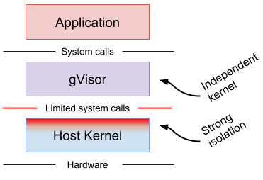
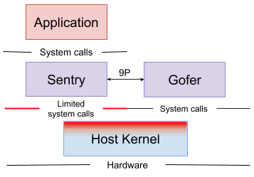

[gVisor](https://github.com/google/gvisor)是谷歌使用go开发的一个容器安全运行时

<!--more-->

使用go实现了内核接口应用程序不直接调用内核

## 架构



- gvisor在内核和应用中间进行一些拦截



- sentry负责运行容器并拦截应用系统调用请求，同时还有系统调用、信号传递、内存管理和页错逻辑、线程模型等。
- gofer负责提供文件系统访问

## 安装

- 国内需要魔法，下面的脚本其实下载了2个二进制，runsc和containerd-shim-runsc-v1

```shell
(
  set -e
  ARCH=$(uname -m)
  URL=https://storage.googleapis.com/gvisor/releases/release/latest/${ARCH}
  wget ${URL}/runsc ${URL}/runsc.sha512 \
    ${URL}/containerd-shim-runsc-v1 ${URL}/containerd-shim-runsc-v1.sha512
  sha512sum -c runsc.sha512 \
    -c containerd-shim-runsc-v1.sha512
  rm -f *.sha512
  chmod a+rx runsc containerd-shim-runsc-v1
  sudo mv runsc containerd-shim-runsc-v1 /usr/local/bin
)
```

### docker

- 配置docker

```shell
/usr/local/bin/runsc install
# 2026/03/11 11:02:09 Runtime runsc not found: adding
# 2026/03/11 11:02:09 Successfully updated config.
sudo systemctl reload docker
```

- 测试下

```shell
docker run --rm --runtime=runsc hello-world
# Unable to find image 'hello-world:latest' locally
# latest: Pulling from library/hello-world
# 17eec7bbc9d7: Pull complete
# Digest: sha256:85404b3c53951c3ff5d40de0972b1bb21fafa2e8daa235355baf44f33db9dbdd
# Status: Downloaded newer image for hello-world:latest
# 
# Hello from Docker!
# This message shows that your installation appears to be working correctly.
# 
# To generate this message, Docker took the following steps:
#  1. The Docker client contacted the Docker daemon.
#  2. The Docker daemon pulled the "hello-world" image from the Docker Hub.
#     (amd64)
#  3. The Docker daemon created a new container from that image which runs the
#     executable that produces the output you are currently reading.
#  4. The Docker daemon streamed that output to the Docker client, which sent it
#     to your terminal.
# 
# To try something more ambitious, you can run an Ubuntu container with:
#  $ docker run -it ubuntu bash
# 
# Share images, automate workflows, and more with a free Docker ID:
#  https://hub.docker.com/
# 
# For more examples and ideas, visit:
#  https://docs.docker.com/get-started/
```

### k8s containerd

- 在containerd的配置中配置`runsc`

```shell
cat <<EOF | sudo tee /etc/containerd/config.toml
version = 2
[plugins."io.containerd.runtime.v1.linux"]
  shim_debug = true
[plugins."io.containerd.grpc.v1.cri".containerd.runtimes.runc]
  runtime_type = "io.containerd.runc.v2"
[plugins."io.containerd.grpc.v1.cri".containerd.runtimes.runsc]
  runtime_type = "io.containerd.runsc.v1"
EOF
```

- containerd需要cni支持，这里时在已经安装了的cni的k8s节点上，且需要cni配置文件在`/etc/cni/net.d`

- 重启contaienrd使配置生效

```shell
sudo systemctl restart containerd
```

- 使用ctr命令测试下

```shell
sudo ctr image pull docker.io/library/hello-world:latest
# docker.io/library/hello-world:latest:                                             resolved       |++++++++++++++++++++++++++++++++++++++|
# docker.io/library/hello-world:latest:                                             resolved       |++++++++++++++++++++++++++++++++++++++|
# index-sha256:85404b3c53951c3ff5d40de0972b1bb21fafa2e8daa235355baf44f33db9dbdd:    done           |++++++++++++++++++++++++++++++++++++++|
# manifest-sha256:2771e37a12b7bcb2902456ecf3f29bf9ee11ec348e66e8eb322d9780ad7fc2df: done           |++++++++++++++++++++++++++++++++++++++|
# layer-sha256:17eec7bbc9d79fa397ac95c7283ecd04d1fe6978516932a3db110c6206430809:    done           |++++++++++++++++++++++++++++++++++++++|
# config-sha256:1b44b5a3e06a9aae883e7bf25e45c100be0bb81a0e01b32de604f3ac44711634:   done           |++++++++++++++++++++++++++++++++++++++|
# elapsed: 4.4 s                                                                    total:  12.6 K (2.9 KiB/s)
# unpacking linux/amd64 sha256:85404b3c53951c3ff5d40de0972b1bb21fafa2e8daa235355baf44f33db9dbdd...
# done: 18.879073ms
sudo ctr run --runtime io.containerd.runsc.v1 -t --rm docker.io/library/hello-world:latest hello-wrold
# 
# Hello from Docker!
# This message shows that your installation appears to be working correctly.
# 
# To generate this message, Docker took the following steps:
#  1. The Docker client contacted the Docker daemon.
#  2. The Docker daemon pulled the "hello-world" image from the Docker Hub.
#     (amd64)
#  3. The Docker daemon created a new container from that image which runs the
#     executable that produces the output you are currently reading.
#  4. The Docker daemon streamed that output to the Docker client, which sent it
#     to your terminal.
# 
# To try something more ambitious, you can run an Ubuntu container with:
#  $ docker run -it ubuntu bash
# 
# Share images, automate workflows, and more with a free Docker ID:
#  https://hub.docker.com/
# 
# For more examples and ideas, visit:
#  https://docs.docker.com/get-started/^C
```

```shell
sudo ctr image pull docker.io/library/busybox:latest
sudo ctr run --runtime io.containerd.run.runsc.v1 -t --rm docker.io/library/busybox:latest gvisord dmesg
# [   0.000000] Starting gVisor...
# [   0.543065] Generating random numbers by fair dice roll...
# [   0.917238] Segmenting fault lines...
# [   1.082058] Gathering forks...
# [   1.304673] Searching for socket adapter...
# [   1.753377] Deleting VFS and rebuilding it from scratch...
# [   1.874194] Reticulating splines...
# [   2.238957] Preparing for the zombie uprising...
# [   2.623573] Politicking the oom killer...
# [   2.700495] Searching for needles in stacks...
# [   2.772464] Reading process obituaries...
# [   2.977811] Ready!
```

- 添加k8s runtime

```shell
cat <<EOF | kubectl apply -f -
apiVersion: node.k8s.io/v1
kind: RuntimeClass
metadata:
  name: gvisor
handler: runsc
EOF
# runtimeclass.node.k8s.io/gvisor created
```

- 测试一下，需要指定`runtimeClassName`

```shell
cat <<EOF | kubectl apply -f -
apiVersion: v1
kind: Pod
metadata:
  name: nginx-gvisor
spec:
  runtimeClassName: gvisor
  containers:
  - name: nginx
    image: nginx
EOF
# pod/nginx-gvisor created
```

- 如果pod跑起来则成功

```shell
kubectl get pod nginx-gvisor -o wide
# NAME           READY   STATUS    RESTARTS   AGE   IP            NODE           NOMINATED NODE   READINESS GATES
# nginx-gvisor   1/1     Running   0          16m   10.7.143.15   10.7.144.212   <none>           <none>
```

- 在对应的节点上用`ps -ef |grep runsc`可以看到相关进程

```shell
ps -ef |grep runsc
# root      615724       1  0 11:33 ?        00:00:00 /usr/local/bin/containerd-shim-runsc-v1 -namespace k8s.io -address /run/containerd/containerd.sock -publish-binary /usr/bin/containerd
# root      615742  615724  0 11:33 ?        00:00:00 runsc-gofer --panic-log=/var/log/pods/default_nginx-gvisor_22fa2e53-5e27-4d33-8814-2485706947c1/gvisor_panic.log --root=/run/containerd/runsc/k8s.io --log=/run/containerd/io.containerd.runtime.v2.task/k8s.io/613b2526c73a51d1740591708f946b86f0e63c04af92857f00246bb31abd4fa2/log.json --log-format=json --log-fd=3 gofer --bundle=/run/containerd/io.containerd.runtime.v2.task/k8s.io/613b2526c73a51d1740591708f946b86f0e63c04af92857f00246bb31abd4fa2 --gofer-mount-confs=lisafs:none,lisafs:none --io-fds=7,8 --mounts-fd=5 --rpc-fd=6 --spec-fd=4 --sync-chroot-fd=-1 --sync-userns-fd=-1 --proc-mount-sync-fd=17 --apply-caps=false --setup-root=false
# root      615746  615724  2 11:33 ?        00:00:24 runsc-sandbox --log=/run/containerd/io.containerd.runtime.v2.task/k8s.io/613b2526c73a51d1740591708f946b86f0e63c04af92857f00246bb31abd4fa2/log.json --log-format=json --panic-log=/var/log/pods/default_nginx-gvisor_22fa2e53-5e27-4d33-8814-2485706947c1/gvisor_panic.log --root=/run/containerd/runsc/k8s.io --log-fd=3 --panic-log-fd=4 boot --apply-caps=false --bundle=/run/containerd/io.containerd.runtime.v2.task/k8s.io/613b2526c73a51d1740591708f946b86f0e63c04af92857f00246bb31abd4fa2 --controller-fd=10 --cpu-num=2 --dev-io-fd=-1 --gofer-mount-confs=lisafs:none,lisafs:none --io-fds=5,6 --mounts-fd=7 --setup-root=false --spec-fd=11 --start-sync-fd=8 --stdio-fds=12,13,14 --total-host-memory=3904032768 --total-memory=3904032768 --user-log-fd=9 --product-name=KVM --host-thp-shmem-enabled=never --host-thp-defrag=madvise --proc-mount-sync-fd=24 613b2526c73a51d1740591708f946b86f0e63c04af92857f00246bb31abd4fa2
# root      615792  615724  0 11:33 ?        00:00:00 runsc --root=/run/containerd/runsc/k8s.io --log=/run/containerd/io.containerd.runtime.v2.task/k8s.io/613b2526c73a51d1740591708f946b86f0e63c04af92857f00246bb31abd4fa2/log.json --log-format=json --panic-log=/var/log/pods/default_nginx-gvisor_22fa2e53-5e27-4d33-8814-2485706947c1/gvisor_panic.log wait 613b2526c73a51d1740591708f946b86f0e63c04af92857f00246bb31abd4fa2
# root      615815       1  0 11:33 ?        00:00:00 /usr/local/bin/containerd-shim-runsc-v1 -namespace k8s.io -address /run/containerd/containerd.sock -publish-binary /usr/bin/containerd
# root      615839  615815  0 11:33 ?        00:00:00 runsc-gofer --root=/run/containerd/runsc/k8s.io --log=/run/containerd/io.containerd.runtime.v2.task/k8s.io/b17f16f539b8964096b9f5b9a720528160c9811bbb6896bab8dd00b9358abb5d/log.json --log-format=json --log-fd=3 gofer --bundle=/run/containerd/io.containerd.runtime.v2.task/k8s.io/b17f16f539b8964096b9f5b9a720528160c9811bbb6896bab8dd00b9358abb5d --gofer-mount-confs=lisafs:self,lisafs:none,lisafs:none,lisafs:none,lisafs:none,lisafs:none --io-fds=7,8,9,10,11,12 --mounts-fd=5 --rpc-fd=6 --spec-fd=4 --sync-chroot-fd=-1 --sync-userns-fd=-1 --proc-mount-sync-fd=22 --apply-caps=false --setup-root=false
# root      615870  615815  0 11:33 ?        00:00:00 runsc --root=/run/containerd/runsc/k8s.io --log=/run/containerd/io.containerd.runtime.v2.task/k8s.io/b17f16f539b8964096b9f5b9a720528160c9811bbb6896bab8dd00b9358abb5d/log.json --log-format=json wait b17f16f539b8964096b9f5b9a720528160c9811bbb6896bab8dd00b9358abb5d
# root      627826   10796  0 11:54 pts/1    00:00:00 grep --color=auto runsc
```

### 参考资料

<https://gvisor.dev/docs/>
