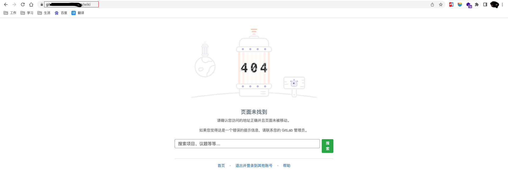
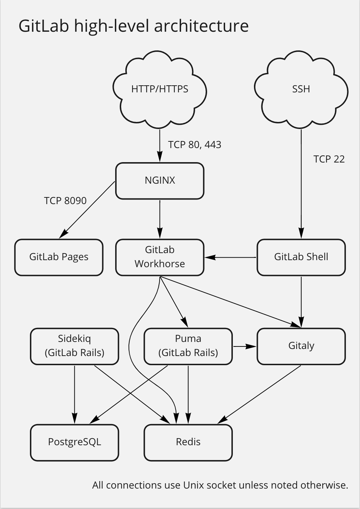

记一次升级gitlab导致的gitlab page 404

<!--more-->

#### 起因

公司gitlab每年都会升级上个大版本的最后一个小版本，按着计划本次从gitlab 13.12.12 升级到14.10.5，按着官方的升级计划升级到14.10.5是:
13.12.15 => 14.0.12 => 14.3.6 => 14.6.2 > 14.9.5 -> 14.10.5
像往常一样准备所需要的安装包,发通知坐等夜晚十点的升级，开始了毕业之后最难查的bug。。。

#### 经过

当晚十点按计划先升级到`13.12.15`,打开用`gitab page`部署的wiki,查看之前写的gitlab升级，备份了一下`gitlab.rb`和`gitlab-secrets.json`，
在熟悉的yum确认界面下了y，gitlab开始执行升级随后在等了几分钟之后显示升级成功，打开gitlab先开始是502过会就正常了

于是继续升级到gitlab14这个大版本，同样执行了升级命令，然后报错检查未过查看报错大概意思是`unicorn[xxx]`参数不再支持unicorn，于是搜索了下gitlab14不在支持unicorn
改为`puma`,夜晚不太想查对应的字段且这些都是优化项于是直接注释了，再次执行`yum install xxx`但是还是报错。然后又试了几次还是报这个错误，仔细看了配置文件unicorn的配置已经被我注释了，为啥还是报这个错了呢，稍微思索了一会突然想到了gitlab.rb这个配置文件修改之后要执行`gitlab-ctl reconfigure`才生效，执行之后再次升级果然没有报错了
同样的等了几分钟之后界面打开了。14版本新增了后台数据库迁移任务在迁移任务没没有完成再升级下个把版本会报错的，所以赶紧使用管理员账号看下后台任务，发现才完成2个还有10来个任务且进度很慢果然和预期的一样是没法一下子升级到目标版本的，遂检查下git clone git push等功能,发现没问题

准备睡觉但是好巧不求随手点了下打开的wiki，然后wiki就404了。。。
开始以为是刚升级完导致的，于是手动刷新了几次还是404此时心里有点纳闷，我都没更改gitlab的配置为什么会404，然后冷静一下首先此问题不是大问题gitlab重要功能没问题，然后对可能出问题的地方进行了一下分析，我只是注释了`unicorn`的一些配置其次14版本的后台字段升级会不会影响，于是查找了`unicorn`对应`puma`配置，修改完成之后重新reconfigure一下，重新打开wiki界面发现还是404。。。那么此时就有可能是14版本的后台迁移任务导致的，查看了下升级任务才玩跑2个第三个还很慢估计得第二天了，但是心里隐隐约约觉得这俩应该没啥关系，于是试探性的查看了下gitlab的nginx日志，发现里面有301返回的日志，此时企信群里有同事已经再说为啥gitlab page打不开了(真卷当时都11点多了)，我没有找到原因就没回他，于是继续顺着301这条线索找，

开始怀疑是gitlab-pages服务返回了个301于是`gitlab-ctl tail gitlab-pages`查看了下gilab-page服务的日志，然后发现没日志。。。查看配置文件原来gitlab-pges的日志文件修改了,于是去了日志目录，从我升级之后日志就没了此时怀疑是gitlab-page服务是不是升级之后有问题。变在浏览器刷新wiki变来查看ngixn和pages日志，随后有报错502，在nginx日志显示是`connection refused`大概意思,发现解析出来的locahost是ipv6的而gitlab-page是监听的ipv4，手动调用下确实，于是将gitlab-page改为监听ipv6
测试一下界面还是404，随后一番操作时候发现和gitlab监听的地址关系不大，又改回监听ipv4，用curl测试`curl localhost:8090`有响应。百思不得其解。在晚上搜索了一番也么结果。此时已经凌晨一点半左右，于是没办法只能先睡觉了，在床上依然很纳闷，我明明没动gitlab-page相关配置为啥会出问题。

第二天上午到公司之后和同事交流了一下问题，她也加入处理问题。在企信群里通知所有人gitlab-page有问题我们再看了，并建立一个相关故障群同步处理情况。做完这些之后我们就开始了处理，她按我提供的情况查了一下未发现问题，唯一的有价值的是gitlab-page升级之后存储方式有变化变成了zipfs，需要迁移。于是执行了一下迁移返回的job是0，也就是说不需要迁移，此时我们查看了gitlab的架构图，觉得可能是nginx的问题，我们一起看了nginx的配置文件没发现啥问题，加上这个nginx文件是gitlab.rb生成的。



中午吃完饭之后，下午我俩分工，我重新部署一套环境来对比，她继续调查gitlab-page的问题。我咋经过一波折腾时候成功在测试环境上访问到了我做测试的page界面，而她那边发现的更多，比如<https://docs.gitlab.com/14.10/ee/administration/pages/index.html#wildcard-domains-with-tls-support>https导致的在经过一波操作测试还是不行，
还有这个issues下的所有方法<https://gitlab.com/gitlab-org/gitlab/-/issues/331699>我们都是尝试了还是404，有点沮丧，此时一下午过得差不多了快要下班了。于是我想先回复一下业务，用go写一个web服务先临时替代一下gitlab-page。但是同事觉得直接用最简单的nginx好了，这里说下gitlab的page其实就是返回一个有规则的目录里的配置文件,于是尝试用nginx实现这个规则发现不行，同时领导也过来问了问帮我们叫来了另一个同事来写ningx，折腾了一个小时之后我们放弃了于是先下班了。满脑子都是404

第二天上午到公司之后继续折腾那个nginx规则，同事则去培训了，然后发现不是不自动跳转就是找不到文件404，在快到中午时我放弃了，使用go配置gin实现了一下，很快就实现了除了一些路径稍微还有些问题，中午吃饭完之后三下午五除二就搞定了，将端口改为8080其他的和gitlab-page规则一致，自己测量下久违的界面出来了终于不是404😄，在群里发了通告。就开始处理问题了。在经过一波分析之后我还是觉得要不是nginx有问题要不就是gitlab-page有问题亦或者是认证有问题导致的跳转异常，于是我查看了gitalb-page的源码发现认证实际上在page上也有处理，于是直接停止了gitlab-page服务，手动在用命令行执行gitlab-page，在此测试发现gitlab-page的日志压根就没日志。那么这就可以百分之百确认是nginx的问题了，将nginx中转发gitlab-page的`cat /var/opt/gitlab/nginx/conf/gitlab-pages.conf`的`proxy_pass http://localhost:8090;`这一行注释，在他的前面增加了`return 200 "test"`来确认请求到了这里，测试之后浏览器并没后返回"test"字样，那么可以确认没有转发到这里！于是琢磨为啥流量没到这里。
同时通过网页f12查看第一个请求，其响应了301发现响应服务器为nginx，于是使用301作为关键字在`/var/opt/gitlab/nginx/conf`查找，发现了下面这一句

```shell
grep -r -n "301" *
gitlab-http.conf:43:    return 301 https://git.example.com:443$request_uri;
```

于是发现这个是80跳转到443的配置，既常见的访问80自动跳转到http的443配置，但是这行监听的是gitlab的配置不是gitlab page的配置，但是我还是注释了此行进行测试，在浏览器测试之后发现界面由gitlab的404变成了nginx的404，也就是说`这行对本不是由他处理的gitab page产生了作用`


但是这只是解释了为啥跳转没解释路由问题，查看了gitla page的配置文件时发现一个奇怪的配置：

```nginx
server_name  ~^(?<group>.*)\.page\.example\.com$;
```

这推测意思是只要是`group`这个组的并且下都是为此gitlab-page匹配的由gitlab-page这个配置文件的内容来处理，我开始以为这个group是nginx的变量之类的gitlab通过某种方式传入到了nginx当中，导致nginx没有匹配到此，所以我就问了公司比较熟悉nginx的同事,在咨询了他时候他说这个group其实是变量赋值，也就说说.page前面的字符串给了`group`这个变量，
遂邀请他来我工位上一起看下，简单说了下我的发现他看了下配置文件，我复盘了一下我的发现。 随后他说将在page的配置文件上添加一下listen参数，将信将疑的问他会是这个导致的吗，他说他遇到ipv4和ipv6监听不一致导致的路由失效，于是添加了下

```conf
listen 192.168.1.1:80;
listen [::]:80;
```

添加完成之后重启，发现还是这个样子。他说估计是缓存，于是我换了个浏览器，久违的界面终于出来。不再是那个讨厌的404了

#### 结果

由于nginx的配置是生成的所以需要修改gitlab.rb的配置才行只需要将page的nignx也监听ipv6即可

```ruby
pages_nginx['listen_addresses'] = ['192.168.1.1', '[::]']
```

#### 疑问

- 为什么老版本没有这个问题？

#### 参考资料

[gitlab架构](https://docs.gitlab.com/ee/development/architecture.html)