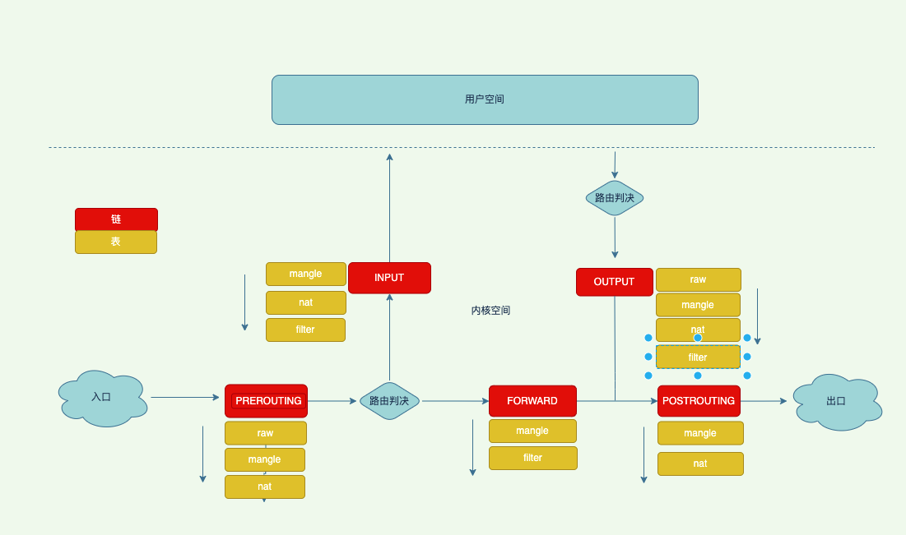
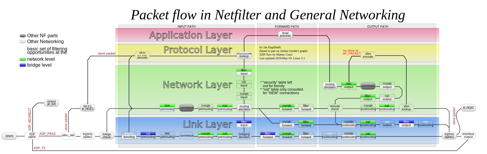
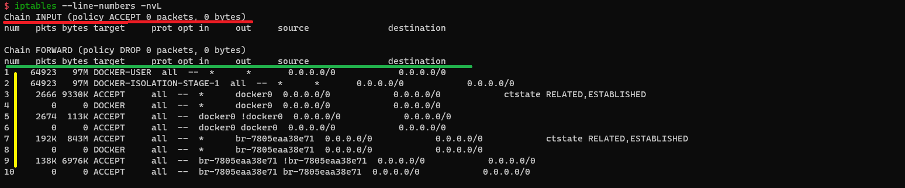

title: iptables
author: Nature丿灵然
tags:
  - linux
  - 网络
date: 2020-12-03 17:16:00
---

Iptables是大多数发型版本中支持的防火墙

<!--more-->

> iptables是个前端其真正的后端是linux的netfilter框架,一些发行版略有区别，centos8中则使用nftables来代替

#### 链

> 在linuxn内核中的五个钩子(hook)，iptable中还可以自定义链，自定义只能被默认链引用才能使用

- INPUT 发送到用户空间的钩子
- OUTPUT 从用户空间发发出的钩子
- PREROUTING 路由前的钩子
- FORWARD 转发的钩子
- POSTROUTING 路由后的钩子

#### 表

> 一些相近功能规则的组

- filter表：负责过滤功能，内核模块：iptables_filter
- nat表：网络地址转换功能；内核模块：iptable_nat
- mangle表：拆解报文，做出修改并重新封装的功能；内核模块：iptable_mangle
- raw表：关闭nat表上启用的连接追踪机制；iptable_raw

#### 链表关系



- 以流量的视角来看


- 全局来看,[原地址](https://upload.wikimedia.org/wikipedia/commons/3/37/Netfilter-packet-flow.svg)



#### 查看规则



##### 命令说明

- -L 列出规则,L后面可也接受指定链
- -v 可以查看更多的信息
- -n 不对地址做名称反解 直接显示原来的IP地址
- -t 执行表名，默认为`filter`表
- --line-numbers 显示规则序列号,缩写为--line
- -x 精确数值

##### 返回说明

- 红色部分：
  - chain：链名，括号里的policy默认策略这里是drop
  - packets：默认策略匹配到的包的数量
  - bytes：当前链默认策略匹配到的所有包的大小总和
- 绿色部分：
  - bytes:对应匹配到的报文包的大小总和
  - target:规则对应的target，往往表示规则对应的"动作"，即规则匹配成功后需要采取的措施
  - prot:表示规则对应的协议，是否只针对某些协议应用此规则
  - opt:表示规则对应的选项
  - in:表示数据包由哪个接口(网卡)流入
  - out:表示数据包由哪个接口(网卡)流出
  - source:表示规则对应的源头IP或网段
  - destination:表示规则对应的目标IP或网段
- 黄色部分：规则序列号

##### 查看所有规则

查看所有链所有表的规则

```shell
iptables --line-numbers -nvL
```

##### 查看指定规则

查看指定表，默认链

```shell
# iptables --line-numbers -nvL -t <表>
iptables --line-numbers -nvL -t nat
```

查看INPUT链的nat表

```shell
# iptables --line-numbers -nvL <链> -t <表>
# iptables --line-numbers -nv -L <链> -t <表>
iptables --line-numbers -nv -L INPUT -t nat
```

查看INPUT链的nat表的序列号是3的规则

```shell
# iptables --line-numbers -nvL <链> 3-t <表>
# iptables --line-numbers -nv -L <链> 3 -t <表>
iptables --line-numbers -nv -L INPUT 3 -t nat
```

#### 增加规则

> iptables是自上而下匹配规则的所以顺序很重要 \
> -A 尾部增加 \
> -I 头部增加 后面加上序列号则是指定序列号位置

##### 尾部增加规则

在 filter表INPUT链中`尾部`增加一条丢弃从192.168.1.1发送过来数据的规则

```Shell
# iptables -t <表名> -A <链名> <匹配条件> -j <动作>
iptables -t filter -A INPUT -s 192.168.1.1 -j DROP
```

##### 头部增加规则

在 filter表INPUT链中`头部`增加一条丢弃从192.168.1.2发送过来数据的规则

```shell
# iptables -t <表名> -I <链名> <匹配条件> -j <动作>
iptables -t filter -I INPUT -s 192.168.1.2 -j DROP
```

##### 指定位置增加规则

在 filter表INPUT链中`指定位置`增加一条丢弃从192.168.1.3发送过来数据的规则

```shell
# iptables -t <表名> -I <链名> <规则序号>  <匹配条件> -j <动作>
iptables -t filter -I INPUT  3 -s 192.168.1.2 -j DROP
```

#### 修改规则

将序列号为2的规则的动作修改为accept

```shell
# iptables -t <表名> -R <链名> <规则序号> <原本的匹配条件> -j <动作>
iptables -t filter -R INPUT 2 -s 192.168.1.146 -j ACCEPT
```

##### 修改默认规则

将INPUT链默认策略设置为DROP,注意不要在生产环境执行此规则会断网

```shell
# iptables -t <表> -P <链> <动作>
# iptables  -P <链> <动作> 表可省略
iptables -t filter -P INPUT DROP
```

#### 删除规则

##### 按照规则序号删除规则

```Shell
# iptables -t <表名> -D <链名> <规则序号>
iptables -t filter -D INPUT 3
```

##### 按照具体的匹配条件与动作删除规则

```Shell
# iptables -t <表名> -D <链名> <匹配条件> -j <动作>
iptables -t filter -D INPUT -s 192.168.1.2 -j DROP
```

##### 删除所有规则

> 谨慎操作！！！

清除filter表

```Shell
# iptables -t <表名> -F
iptables -t filter -F
```

#### 处理动作

> 处理动作在iptables中被称为target，动作也可以分为基本动作和扩展动作默认动作如下

- ACCEPT：允许数据包通过
- DROP：丢弃数据包,客户端会等待
- REJECT：拒绝数据包通过，客户端会立即发现拒绝
- SNAT：源地址转换
- DNAT：目标地址转换
- MASQUERADE：是SNAT的一种特殊形式，适用于动态的、临时会变的ip上
- REDIRECT：在本机做端口映射
- LOG：在/var/log/messages文件中记录日志信息，然后传给下一条

##### 日志

> 日志模块一般用于调试

```shell
# 开启日志
iptables -A INPUT -j LOG

# 设置日志级别
iptables -A INPUT -s 192.168.1.0/24 -j LOG --log-level 7

# 在日志加上前缀
iptables -A INPUT -s 192.168.1.0/24 -j LOG --log-prefix "iptables log: "
```

#### 条件匹配

> 如果有多个规则，则规则之间是`与`关系

##### 源地址匹配

> -s 用于匹配报文的源地址,可以同时指定多个源地址，每个IP之间用逗号隔开，也可以指定为一个网段。

```shell
# 丢弃从192.168.1.1和192.168.1.2发送过来的数据
iptables -t filter -I INPUT -s 192.168.1.1,192.168.1.2 -j DROP
# 允许从192.168.1.0/24发送过来的数据
iptables -t filter -I INPUT -s 192.168.1.0/24 -j ACCEPT
# 允许除了192.168.1.0/24发送过来的数据
iptables -t filter -I INPUT ! -s 192.168.1.0/24 -j ACCEPT
```

##### 目的地址匹配

> -d 用于匹配报文的目标地址,和源地址匹配一样可以同时指定多个目标地址，每个IP之间用逗号隔开，也可以指定为一个网段。

```shell
# 丢弃发送到192.168.1.1和192.168.1.2的数据
iptables -t filter -I OUTPUT -s 192.168.1.1,192.168.1.2 -j DROP
# 允许发送数据到192.168.1.0/24
iptables -t filter -I INPUT -s 192.168.1.0/24 -j ACCEPT
# 允许发送除了192.168.1.0/24数据
iptables -t filter -I INPUT ! -s 192.168.1.0/24 -j ACCEPT
```

##### 端口匹配

> -p 匹配报文的协议类型,可以匹配的协议类型tcp、udp、icmp等

```shell
# 允许发送数据到192.168.1.1的tcp协议
iptables -t filter -I INPUT -p tcp -s 192.168.1.1 -j ACCEPT
# 允许发送数据到192.168.1.1的udp协议
iptables -t filter -I INPUT ! -p udp -s 192.168.1.1 -j ACCEPT
```

##### 网卡流入匹配

> -i 匹配报文是从哪个网卡接口流入本机的，由于匹配条件只是用于匹配报文流入的网卡，所以在OUTPUT链与POSTROUTING链中不能使用此选项。

```shell
#
iptables -t filter -I INPUT -p icmp -i enp0s3 -j DROP
#
iptables -t filter -I INPUT -p icmp ! -i enp0s3 -j DROP
```

##### 网卡流出匹配

> -o 匹配报文将要从哪个网卡接口流出本机，于匹配条件只是用于匹配报文流出的网卡，所以在INPUT链与PREROUTING链中不能使用此选项。

```shell
# 丢弃从enp0s3网卡流出的icmp协议
iptables -t filter -I OUTPUT -p icmp -o enp0s3 -j DROP
# 丢弃除enp0s3网卡流出的icmp协议
iptables -t filter -I OUTPUT -p icmp ! -o enp0s3 -j DROP
```

#### 自定义链

> 在规则比较多时方便管理规则，自定义链需要被默认链引用才能生效

##### 创建自定义链

> 创建一个filter表名字叫TEST的链

```shell
# iptables -t <表> -N <链名>
iptables -t filter -N TEST
```

##### 引用自定义链

> 引用的时候只需要将动作使用自定义链名 \
> 在默认链INPUT中插入一条目标端口是80协议是tcp动作是自定义链TEST的规则

```shell
iptables -t filter -I INPUT -p tcp --dport 80 -j TEST
```

##### 重命名自定义链

> 将TEST自定义链改为TEST2

```shell
# iptables -E <原自定义链名> <目标自定义链名>
iptables -E TEST TEST2
```

##### 删除自定义链

> 删除TEST2的自定义链名

```shell
# iptables -X <自定义链名>
iptables -X TEST2
```

#### 扩展模块

> iptables支持使用扩展模块来进行功能的扩展

##### comment

> 注释模块，顾名思义对规则进行说明

```shell
-m comment --comment "comment" 

iptables -t filter -I INPUT -s 192.168.1.0/24 -m comment --comment "xxxx" -j ACCEPT
```

##### multiport

> 多端口模块，可以设置一条规则匹配多个端口

```shell
-m multiport --dports <端口号>,<端口号>
```

##### ipset

> 可以一条规则匹配ipset里面的地址

```shell
-m set --match-set <ipset名字>
```

##### mark

> 标记流量，需要注意的时候这个标记只在本地标记流量出去之后就没了

```shell
# 设置标签
-j MARK --set-xmark 0x8000/0x8000

# 匹配标签并丢弃
-m MARK --mark 0x8000/0x8000 -j DROP
```

- --set-xmark value[/mask]  mask和value做异或运算
- --set-mark value[/mask]   mask和value做或运算
- --and-mark bits           和nfmark做与运算
- --or-mark bits            和nfmark做或运算
- --xor-mark bits           和nfmark做异或运算

##### conntrack

> 连接跟踪模块可以根据连接的状态匹配

```shell
-m conntrack --ctstate RELATED,ESTABLISHED -j ACCEPT
```

- NEW 新建连接
- ESTABLISHED 已经连接
- RELATED 相关连接
- INVALID 无效连接
- UNTRACKED 人为设置的

参考 <https://www.cnblogs.com/saolv/p/13096965.html>

#### 规则保存导出和还原

##### 保存规则

> centos7以上没有安装`iptables-services`

```shell
# 安装iptables-services
yum install -y iptables-services

# 保存规则
service iptables save
```

##### 导出规则

```shell
iptables-restore > iptable
```

##### 还原规则

```shell
iptables-save < iptable
```

#### 帮助

```shell
iptables -j <target> -help
```

#### 参考资料

[朱双印个人博客](http://www.zsythink.net/archives/category/%e8%bf%90%e7%bb%b4%e7%9b%b8%e5%85%b3/iptables/)
<https://www.frozentux.net/iptables-tutorial/iptables-tutorial.html>
