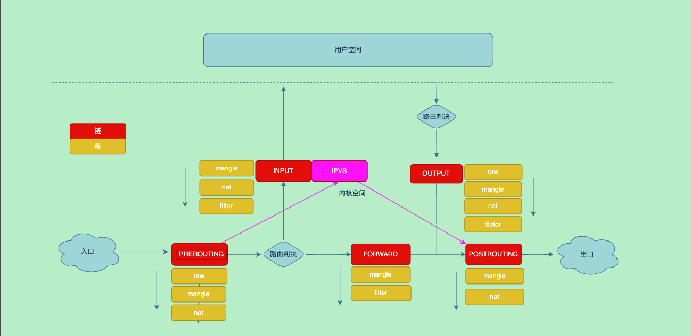
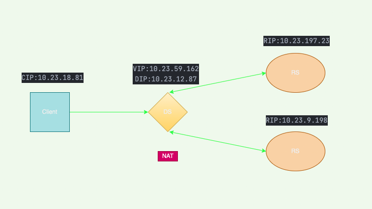
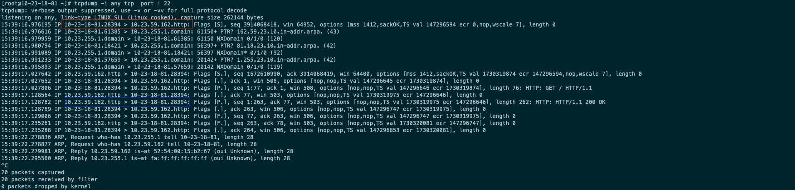
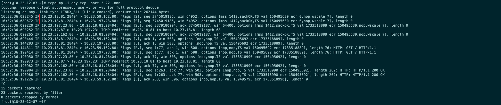
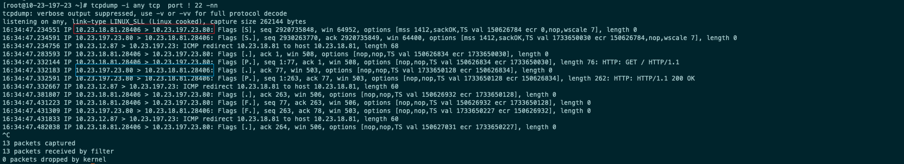
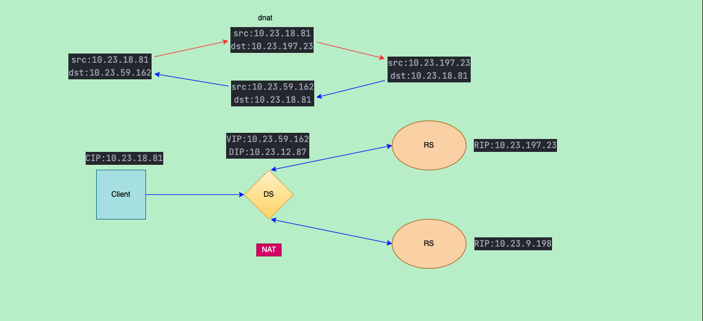
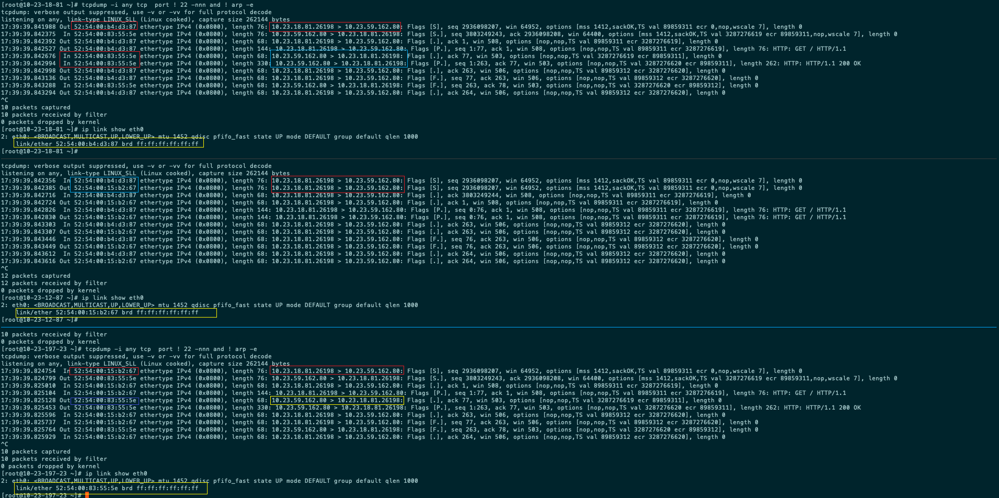
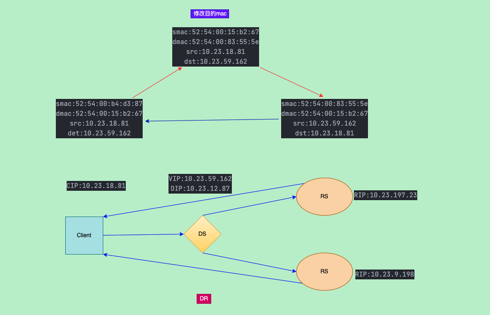
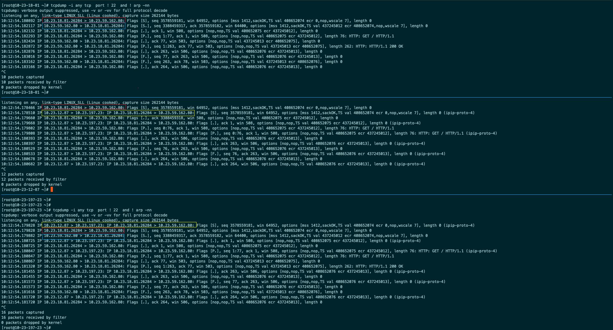
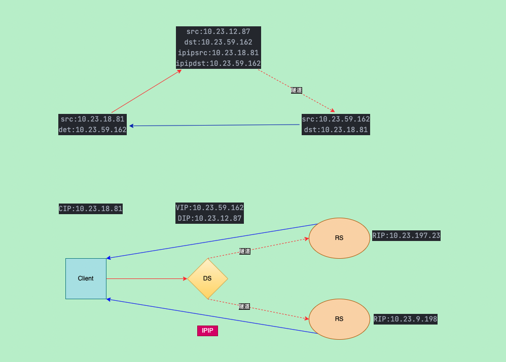

ipvs是个4层负载均衡器，常常用于服务的高可用

<!--more-->

> ipvs已经合并到linux内核当中，用户层面使用ipvsadm

#### 安装ipvsadm

```shell
yum install ipvsadm
```

#### 原理



整个动作在内核态完成,跳过了一些链

#### 术语

|缩写|全写|说明|
|---|------------------|--------------|
|CIP|Client IP         |客户端ip|
|VIP|Virtual IP        |虚拟ip|
|DIP|Director Server IP|负载均衡ip|
|RIP|Real Servier IP   |真正的后端服务ip|
|DS |Director Server   |部署负载均衡的服务器|
|RS |Real Server       |后端服务器|

#### 三种模式

|类型|IP|
|---|-------------|
|CIP|10.23.18.81  |
|VIP|10.23.59.162 |
|DS |10.23.12.87  |
|RS1|10.23.197.23 |
|RS2|10.23.9.198  |

##### NAT

- 本质是个dnat
- 流量出入都经过DR
- 来回流量都从dr过dr会成为瓶颈
- 同一个网段时RS的默认网关需要指向DS,且本网段的路由需要删除不然不会通过默认路由到DR



###### NAT部署

- 在DS配置规则

```shell
echo 1 >/proc/sys/net/ipv4/ip_forward

export VIP=10.23.59.162
export RS1=10.23.197.23
export RS2=10.23.9.198

ipvsadm -A -t $VIP:80 -s rr
ipvsadm -a -t $VIP:80 -r $RS1 -m
ipvsadm -a -t $VIP:80 -r $RS2 -m
```

- 查看规则

```shell
[root@10-23-12-87 ~]# ipvsadm -L -n
IP Virtual Server version 1.2.1 (size=4096)
Prot LocalAddress:Port Scheduler Flags
  -> RemoteAddress:Port           Forward Weight ActiveConn InActConn
TCP  10.23.59.162:80 rr
  -> 10.23.9.198:80               Masq    1      0          2
  -> 10.23.197.23:80              Masq    1      0          1
```

- 在RS上部署一个httpd用于判断访问到哪那台机器

```shell
yum -y install httpd && systemctl start httpd
echo "i am rs $HOSTNAME" > /var/www/html/index.html
```

- 此时在rs上`curl 10.23.59.162`这个vip会轮询访问，此时cip是自己

```shell
[root@10-23-12-87 ~]# curl 10.23.59.162
i am rs 10-23-9-198
[root@10-23-12-87 ~]# curl 10.23.59.162
i am rs 10-23-197-23
[root@10-23-12-87 ~]#
```

###### 同一个网络说明

client此时并不知道vip这个地址在哪,所以需要在dr上绑定vip,让隔壁的邻居知道vip的mac

且由于vip和rs的地址都在同一个网段默认会通过二层直接到client,未经过dr的nat，导致client不认回包而被丢弃因此需要在rs上设置默认网关为dr

- dr执行

```shell
ip addr add 10.23.59.162 dev eth0
```

- RS上执行,将默认路由指向dr

```shell
export DS=10.23.12.87

# 设置默认路由
ip route replace default via $DS
# 删除路由
ip r del 10.23.0.0/16 dev eth0 proto kernel scope link src 10.23.197.23
```

###### 流量转发路径





通过抓包我可以看到client请求vip之后，dr接受到会将vip替换成rip然后发送给rs
rs收到之后因为会路由设置会发送给dr，dr将src地址再改回vip



##### DR

- rs和ds需要在一个二层中

- dr模式中客户端请求vip流量从ds通过修改mac地址来达到负载均衡

- 由于没有修改ip地址所以rs上需要添加vip到lo或者dummy类型的网口上，不然rs发现请求的ip不在本机就会被丢弃

- 由于rs的lo或者dummy的网卡上配置的有vip为了防止rs响应vip的请求，所以需要修改arp配置

- 不支持端口映射

###### DR部署

- DS配置

```shell
export VIP=10.23.59.162
export RS1=10.23.197.23
export RS2=10.23.9.198

ip link add vip type dummy
ip addr add $VIP dev vip

ipvsadm -A -t $VIP:80 -s rr
ipvsadm -a -t $VIP:80 -r $RS1:80 -g
ipvsadm -a -t $VIP:80 -r $RS2:80 -g
```

- 两个RS配置

```shell
# 部署http服务用于区分是否负载均衡
yum -y install httpd && systemctl start httpd
echo "i am rs $HOSTNAME" > /var/www/html/index.html

# 配置arp
echo 1 >/proc/sys/net/ipv4/conf/all/arp_ignore
echo 2 >/proc/sys/net/ipv4/conf/all/arp_announce

export VIP=10.23.59.162

# 配置vip网卡(用dummy和lo都可以)
ip link add vip type dummy
ip addr add $VIP dev vip
```

- Client

添加路由，原则来说因为在同一个交换机中直接通过二层,但是有些vpc的子网不是通过vpc创建的ip不会转发

也可以查看云厂商的文档如vip或者辅助ip等来作为vip

```shell
export VIP=10.23.59.162
export DR=10.23.12.87

ip r add $VIP/32 via $DR dev eth0
```

- 测试

```shell
[root@10-23-18-81 ~]# curl 10.23.59.162
i am rs 10-23-197-23
[root@10-23-18-81 ~]# curl 10.23.59.162
i am rs 10-23-9-198
```

###### 流量抓包





图中可看出dr将mac地址换成类似rs的mac地址

##### 隧道(IPIP)

###### 隧道(IPIP)部署

- DR配置

```shell
export VIP=10.23.59.162
export RS1=10.23.197.23
export RS2=10.23.9.198

ipvsadm -A -t $VIP:80 -s rr
ipvsadm -a -t $VIP:80 -r $RS1:80 -i
ipvsadm -a -t $VIP:80 -r $RS2:80 -i
```

- RS

```shell
# 加载内部模块
modprobe ipip

export VIP=10.23.59.162
# 将vip添加到ipip隧道网卡
ip addr add $VIP dev tunl0
ip link set tunl0 up

# 修改内核参数
echo "1" >/proc/sys/net/ipv4/conf/tunl0/arp_ignore
echo "2" >/proc/sys/net/ipv4/conf/tunl0/arp_announce

echo "1" >/proc/sys/net/ipv4/conf/all/arp_ignore
echo "2" >/proc/sys/net/ipv4/conf/all/arp_announce

echo "0" > /proc/sys/net/ipv4/conf/tunl0/rp_filter
echo "0" > /proc/sys/net/ipv4/conf/all/rp_filter
```

###### IPIP流量分析





由于实验环境在同一个网段所以需要对arp响应进行处理

#### 内核参数

内核参数的文档

<https://www.kernel.org/doc/Documentation/networking/ip-sysctl.txt>

##### arp_ignore

设置使用那个网卡的mac和ip用来请求arp,即arp请求的src_mac和src_ip

- 0(默认):将任何网卡的地址响应出去，而不关系该ip是否在接受的网卡上
- 1:只响应目标ip接受网卡的地址
- 2:只响应目标ip接受网卡的地址，且需要在同网段
- 3:请求的地址作用域为host的不响应，只有作用域为`global`和`link`的才响应
- 4-7:保留
- 8:任何arp都不响应

在dr模式中每个rs上都配置了vip的地址如果不设置arp_ignore为1则会响应vip的arp请求使客户端的请求绕过了ds直接到了rs

##### arp_announce

设置使用那个网卡的mac和ip用来响应arp请求,既arp响应的dst_mac和dst_ip

- 0:使用任何配置在本接口上的地址响应
- 1:尽量避免使用不属于该发送网卡子网的本地地址作为发送arp请求的源IP地址
- 2:忽略IP数据包的源IP地址，选择该发送网卡上最合适的本地地址作为arp请求的源IP地址

##### rp_filter

反向路径过滤

- 0:不校验
- 1(默认):严格的校验，每个数据包都进行校验，校验反向路径通过特定的接口是否是最佳路径，如不是则丢弃
- 2:宽松模式。只校验通过任意接口是否可达，如果不通则丢弃
- 取conf/{all,interface}/rp_filter中的最大值

#### 负载均衡算法

- rr（轮询）
- wrr（权重）
- lc（最后连接）
- wlc（权重）
- lblc（本地最后连接）
- lblcr（带复制的本地最后连接）
- dh（目的地址哈希）
- sh（源地址哈希）
- sed（最小期望延迟）
- nq（永不排队）

#### ipvsadm常用命令

```shell
# 查看规则
ipvsadm -L

# 查看指定规则
ipvsadm -L -t 10.0.0.1:80

# 查看链接
ipvsadm -l -c

# 清理所有规则
ipvsadm -c

# 清空计数器
ipvsadm -Z

# 添加一个虚拟服务器，算法为轮询
ipvsadm -A -t 10.0.0.1:80 -s rr

# 删除一个虚拟服务,同时删除RS
ipvsadm -D -t 10.0.0.1:80

# 修改一个服务，将算法修改为wlc
ipvsadm -E -t 10.0.0.1:80 -s wlc

# 添加一个RS,nat模式
ipvsadm -a -t 10.0.0.1:80 -r 192.168.32.129:80 -m

# 添加一个RS,路由模式,权重为3
ipvsadm -a -t 10.0.0.1:80 -r 192.168.32.129:80 -g -w 3

# 添加一个RS,ipip隧道模式
ipvsadm -a -t 10.0.0.1:80 -r 192.168.32.129:80 -i

# 修改rs 将此rs的模式改为ipip权重为2
ipvsadm -e -t 10.0.0.1:80 -r 192.168.32.129:80 -i -w 2

# 删除一个RS
ipvsadm -d -t 10.0.0.1:80 -r 192.168.32.129:80

# 查看转发情况
ipvsadm -L -n -c

# 保存配置
ipvsadm -S -n >ipvs.conf

# 读取配置
ipvsadm -R < ipvs.conf
```

#### 参考资料

<https://www.cnblogs.com/laolieren/p/lvs_explained.html>
<https://www.cnblogs.com/klb561/p/9215667.html>
<https://www.jianshu.com/p/734640384fda>
<https://www.cnblogs.com/f-ck-need-u/p/8472744.html>
