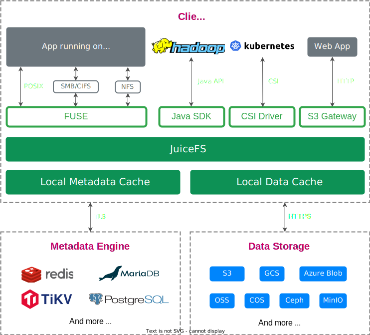

title: juicefs基本使用
author: Nature丿灵然
tags:
  - 存储
date: 2024-05-05 18:24:00
---

juicefs高性能分布式文件系统，能将s3，webdav等协议挂到文件系统中和其他接口，采用换数据和数据分离设计

<!--more-->



#### 安装

- juicefs需要fuse，没有安装需要安装

- 默认安装到 /usr/local/bin

```shell
curl -sSL https://d.juicefs.com/install | sh -
```

#### 基本使用

##### 创建文件系统

- 使用sqlite3作为元数据存储,名字叫dlfs
- 后端使用文件系统，目录为`$HOME/.juicefs/local`，这也是默认的参数

```shell
juicefs format --storage file --bucket $HOME/.juicefs/local sqlite3://dlfs.db dlfs
# 等效
juicefs format sqlite3://dlfs.db dlfs
# 2024/05/05 00:11:26.689029 juicefs[41492] <INFO>: Meta address: sqlite3://dlfs.db [interface.go:497]
# 2024/05/05 00:11:26.690663 juicefs[41492] <INFO>: Data use file:///home/debian/.juicefs/local/dlfs/ [format.go:471]
# 2024/05/05 00:11:27.808629 juicefs[41492] <INFO>: Volume is formatted as {
#   "Name": "dlfs",
#   "UUID": "7df826c4-9850-4591-99cd-1b58261a21c4",
#   "Storage": "file",
#   "Bucket": "/home/debian/.juicefs/local/",
#   "BlockSize": 4096,
#   "Compression": "none",
#   "EncryptAlgo": "aes256gcm-rsa",
#   "TrashDays": 1,
#   "MetaVersion": 1,
#   "MinClientVersion": "1.1.0-A",
#   "DirStats": true
# } [format.go:508]
```

##### 挂载一个卷

- 挂载到当前目录下的jfs,默认是前台的

```shell
juicefs mount sqlite3://dlfs.db ./jfs
# 2024/05/05 00:15:55.623202 juicefs[41499] <INFO>: Meta address: sqlite3://dlfs.db [interface.go:497]
# 2024/05/05 00:15:55.632156 juicefs[41499] <INFO>: Data use file:///home/debian/.juicefs/local/dlfs/ [mount.go:605]
# 2024/05/05 00:15:55.632923 juicefs[41499] <INFO>: Disk cache (/home/debian/.juicefs/cache/7df826c4-9850-4591-99cd-1b58261a21c4/): capacity (102400 MB), free ratio (10%), max pending pages (15) [disk_cache.go:114]
# 2024/05/05 00:15:55.887736 juicefs[41499] <INFO>: Create session 1 OK with version: 1.1.2+2024-02-04.8dbd89a [base.go:494]
# 2024/05/05 00:15:55.890264 juicefs[41499] <INFO>: Prometheus metrics listening on 127.0.0.1:9567 [mount.go:160]
# 2024/05/05 00:15:55.891592 juicefs[41499] <INFO>: Mounting volume dlfs at ./jfs ... [mount_unix.go:269]
# 2024/05/05 00:15:55.893449 juicefs[41499] <WARNING>: setpriority: permission denied [fuse.go:431]
# 2024/05/05 00:15:56.149422 juicefs[41499] <INFO>: OK, dlfs is ready at ./jfs [mount_unix.go:48]
```

- -d参数则为后台

```shell
juicefs mount -d sqlite3://dlfs.db ./jfs
# 2024/05/05 00:17:01.165052 juicefs[41512] <INFO>: Meta address: sqlite3://dlfs.db [interface.go:497]
# 2024/05/05 00:17:01.167909 juicefs[41512] <INFO>: Data use file:///home/debian/.juicefs/local/dlfs/ [mount.go:605]
# 2024/05/05 00:17:01.168481 juicefs[41512] <INFO>: Disk cache (/home/debian/.juicefs/cache/7df826c4-9850-4591-99cd-1b58261a21c4/): capacity (102400 MB), free ratio (10%), max pending pages (15) [disk_cache.go:114]
# 2024/05/05 00:17:01.670775 juicefs[41512] <INFO>: OK, dlfs is ready at ./jfs [mount_unix.go:48]
```

- 开机自动挂载 --update-fstab

##### 卸载挂载点

```shell
juicefs umount ./jfs
```

- 实时统计

```shell
juicefs profile ./jfs
```

- 查看状态

```shell
juicefs status sqlite3://dlfs.db ./jfs/
```

- 查看信息

```shell
juicefs info ./jfs/
# ./jfs/ :
#   inode: 1
#   files: 1
#    dirs: 1
#  length: 0 Bytes
#    size: 8.00 KiB (8192 Bytes)
#    path: /
```

- 调试模式

```shell
juicefs debug ./jfs/
```

```shell
juicefs summary ./jfs/
# ./jfs/: 2                      257.0/s
# ./jfs/: 8.0 KiB (8192 Bytes)   1.5 MiB/s
# +------+---------+------+-------+
# | PATH |   SIZE  | DIRS | FILES |
# +------+---------+------+-------+
# | /    | 8.0 KiB |    1 |     1 |
# | xxxx | 4.0 KiB |    0 |     1 |
# +------+---------+------+-------+
```

- 性能测试

```shell
juicefs bench ./jfs
```

#### 使用webdav和mysql

- 创建一个文件系统，元数据选择mysql存储选择webdav

```shell
juicefs format \
--storage webdav \
--bucket http://home.naturelr.cc:6089/dav/nas/zxz \
--access-key <webdav账号> \
--secret-key <webdav密码> \ 
mysql://<mysql账号>:<mysql密码>@(<mysql地址>:3306)/<mysql数据库> \
juicefs
```

- 挂载目录

```shell
juicefs mount "mysql://<mysql账号>:<mysql密码>@(<mysql地址>:3306)/juicefs" <挂载路径>
```

#### 参考资料

<https://mp.weixin.qq.com/s/Uar9hlaLdlAL6IIhMWNotw>
<https://juicefs.com/docs/zh/community/introduction/>
