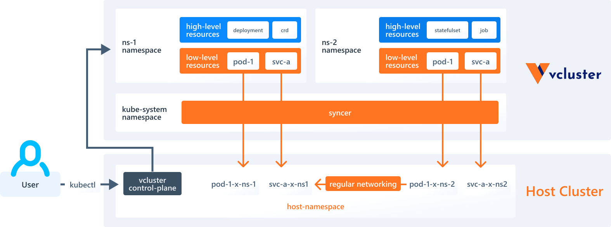

vcluster是一个kink(k8s in k8s)程序即在k8s里创建k8s,和ns相比主要可以随便安装crd等资源且可以获得类似完整的集群体验

<!--more-->

#### 安装

- macos

```shell
curl -L -o vcluster "https://github.com/loft-sh/vcluster/releases/latest/download/vcluster-darwin-arm64" && sudo install -c -m 0755 vcluster /usr/local/bin && rm -f vcluster
```

- 其他的<https://www.vcluster.com/docs/getting-started/setup>

#### 原理



其主要原理是在宿主集群中启动了一个轻量k8s-k3s,然后将k3s的端口通过宿主集群的svc暴漏,在虚拟集群中创建的资源通过同步到宿主集群中由宿主集群来创建具体的pod

#### 常用操作

- 创建集群,创建完成之后会在当前的kubeconfig中添加虚拟机集群的context

```shlel
vcluster create <集群名字>
```

- 查看所有集群

```shell
vcluster list
```

- 删除集群

```shell
vcluster list <集群名字>
```

- 连接集群

```shell
vcluster connect <集群名字>
```

#### 参考资料

<https://www.vcluster.com/docs/what-are-virtual-clusters>
