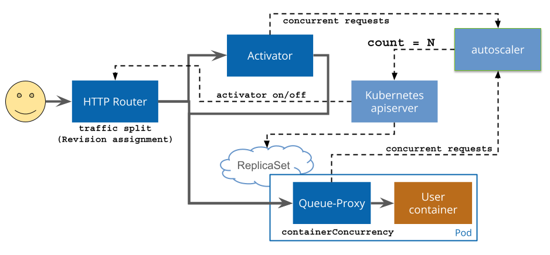

knative是2018年开源的一个Serverless，和普通的k8s原生工作负载相比可以做到0pod，在收到请求时再拉起pod

<!--more-->

#### 架构

- serving主要负责提供服务，快速部署容器基于istio处理路由，只是缩容到0


- 流量图



#### 安装部署

#### 安装istio

- 从<https://github.com/istio/istio/releases>下载istioctl

- 安装istio到集群

```shell
istioctl install -y
```

#### 安装serving

> 需要注意是否兼容的k8s版本

- 安装serving

```shell
kubectl apply -f https://github.com/knative/serving/releases/download/knative-v1.14.0/serving-crds.yaml
kubectl apply -f https://github.com/knative/serving/releases/download/knative-v1.14.0/serving-core.yaml
```

- 网络层

```shell
kubectl apply -f https://github.com/knative/net-istio/releases/download/knative-v1.14.0/net-istio.yaml
```

- 由于镜像在gcr上可能无法启动，可以实现拉取到国内的一些仓库上

```shell
kubectl -n knative-serving get po        
# NAME                                    READY   STATUS    RESTARTS   AGE
# activator-58f4bb476b-l7sjw              1/1     Running   0          3m3s
# autoscaler-84f556f484-xzwff             1/1     Running   0          3m3s
# controller-858485bfbd-jtrpk             1/1     Running   0          3m3s
# net-istio-controller-56d6d4f8ff-s7z5l   1/1     Running   0          2m
# net-istio-webhook-bfd966868-mjcxh       1/1     Running   0          2m
# webhook-6655bf6cbd-ktfv8                1/1     Running   0          3m3s
```

#### 基本使用

- 部署一个服务

```yaml
apiVersion: serving.knative.dev/v1
kind: Service
metadata:
  name: helloworld-go
spec:
  template:
    metadata:
      labels:
        app: helloworld-go
      annotations:
        autoscaling.knative.dev/target: "10"
    spec:
      containers:
        - image: registry.cn-hangzhou.aliyuncs.com/knative-sample/helloworld-go:160e4dc8
          ports:
            - name: http1
              containerPort: 8080
          env:
            - name: TARGET
              value: "World"
```

- 查看服务

```shell
kubectl get ksvc 
# NAME            URL                                              LATESTCREATED         LATESTREADY           READY   REASON
# helloworld-go   http://helloworld-go.default.svc.cluster.local   helloworld-go-00001   helloworld-go-00001   True    
```

- 在集群中任意一个pod中访问，出现hello world 则表示测试成功，仔细观察在没有请求之后则pod会被删除

```shell
curl http://helloworld-go.default.svc.cluster.local
# Hello World!
```

##### 外部访问配置

> 在配置域名之后默认就开启了外部访问

- 集群外部访问需要配置外部域名,删除默认的`_example`,然后添加外部的域名,如下yaml示例
- 生产中要将这个域名解析到isito的ingress gateway
- 同时可以通过标签选择对那些服务生效

```shell
apiVersion: v1
data:
  naturelr.cc: ""
kind: ConfigMap
metadata:
  name: config-domain
  namespace: knative-serving
```

- 查看knative服务可以发现url发生了变化

```shell
k get ksvc                             
# NAME            URL                                        LATESTCREATED         LATESTREADY           READY   REASON
# helloworld-go   http://helloworld-go.default.naturelr.cc   helloworld-go-00001   helloworld-go-00001   True    
```

- 访问测试,这里使用nodeport代替

```shell
curl -H "Host: helloworld-go.default.naturelr.cc" http://192.168.49.2:31733
# Hello World!
```

##### CR之间的关系链

```shell
kubectl tree ksvc helloworld-go
# NAMESPACE  NAME                                                               READY  REASON  AGE
# default    Service/helloworld-go                                              True           30m
# default    ├─Configuration/helloworld-go                                      True           30m
# default    │ └─Revision/helloworld-go-00001                                   True           30m
# default    │   ├─Deployment/helloworld-go-00001-deployment                    -              30m
# default    │   │ └─ReplicaSet/helloworld-go-00001-deployment-7b8765df6b       -              30m
# default    │   │   └─Pod/helloworld-go-00001-deployment-7b8765df6b-zqrt5      True           6s 
# default    │   ├─Image/helloworld-go-00001-cache-user-container               -              30m
# default    │   └─PodAutoscaler/helloworld-go-00001                            True           30m
# default    │     ├─Metric/helloworld-go-00001                                 True           30m
# default    │     └─ServerlessService/helloworld-go-00001                      True           30m
# default    │       ├─Endpoints/helloworld-go-00001                            -              30m
# default    │       │ └─EndpointSlice/helloworld-go-00001-qbm6x                -              30m
# default    │       ├─Service/helloworld-go-00001                              -              30m
# default    │       └─Service/helloworld-go-00001-private                      -              30m
# default    │         └─EndpointSlice/helloworld-go-00001-private-vhvfq        -              30m
# default    └─Route/helloworld-go                                              True           30m
# default      ├─Ingress/helloworld-go                                          True           30m
# default      │ ├─VirtualService/helloworld-go-ingress                         -              30m
# default      │ └─VirtualService/helloworld-go-mesh                            -              30m
# default      └─Service/helloworld-go                                          -              30m
```

#### 灰度

- 发布v1版本(上面创建的需要删除)

```shell
apiVersion: serving.knative.dev/v1
kind: Service
metadata:
  name: helloworld-go
spec:
  template:
    metadata:
      labels:
        app: helloworld-go-v1
      annotations:
        autoscaling.knative.dev/target: "10"
      name: helloworld-go-v1
    spec:
      containers:
        - image: registry.cn-hangzhou.aliyuncs.com/knative-sample/helloworld-go:160e4dc8
          ports:
            - name: http1
              containerPort: 8080
          env:
            - name: TARGET
              value: "World v1"
```

- 发布v2版本

```yaml
apiVersion: serving.knative.dev/v1
kind: Service
metadata:
  name: helloworld-go
spec:
  template:
    metadata:
      labels:
        app: helloworld-go-v2
      annotations:
        autoscaling.knative.dev/target: "10"
      name: helloworld-go-v2 # 必须要以—为版本分隔符
    spec:
      containers:
        - image: registry.cn-hangzhou.aliyuncs.com/knative-sample/helloworld-go:160e4dc8
          ports:
            - name: http1
              containerPort: 8080
          env:
            - name: TARGET
              value: "World v2" # 区分v1
  traffic: # 灰度流量百分比
    - tag: v1
      revisionName: helloworld-go-v1
      percent: 20
    - tag: v2
      revisionName: helloworld-go-v2
      percent: 80
    - tag: latest
      latestRevision: true
      percent: 0
```

- 请求效果

```shell
# root@d5ce4828c4d3:/# curl -H "Host:  helloworld-go.default.naturelr.cc" http://192.168.49.2:31733
# Hello World v2!
# root@d5ce4828c4d3:/# curl -H "Host:  helloworld-go.default.naturelr.cc" http://192.168.49.2:31733
# Hello World v1!
# root@d5ce4828c4d3:/# curl -H "Host:  helloworld-go.default.naturelr.cc" http://192.168.49.2:31733
# Hello World v2!
# root@d5ce4828c4d3:/# curl -H "Host:  helloworld-go.default.naturelr.cc" http://192.168.49.2:31733
# Hello World v1!
```

#### 伸缩配置

- 流量模式分为恐慌模式和稳定模式
  - 稳定模式是以60s为一个周期统计平均并发数，且达到目标并发数的2倍则触发
  - 恐慌模式是以6s为一个周期统计平均并发数

- 全局配置在这里修改

```shell
k -n knative-serving  get cm config-autoscaler
```

- 最大伸缩和最小伸缩,以及目标

```yaml
spec:
  template:
    metadata:
      autoscaling.knative.dev/target: "10"
      autoscaling.knative.dev/minScale: "2"
      autoscaling.knative.dev/maxScale: "10"
```

#### 参考资料

<https://knative.dev/docs/>
<https://knative-sample.com/>
