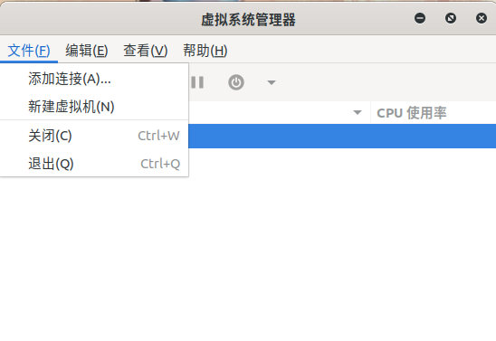
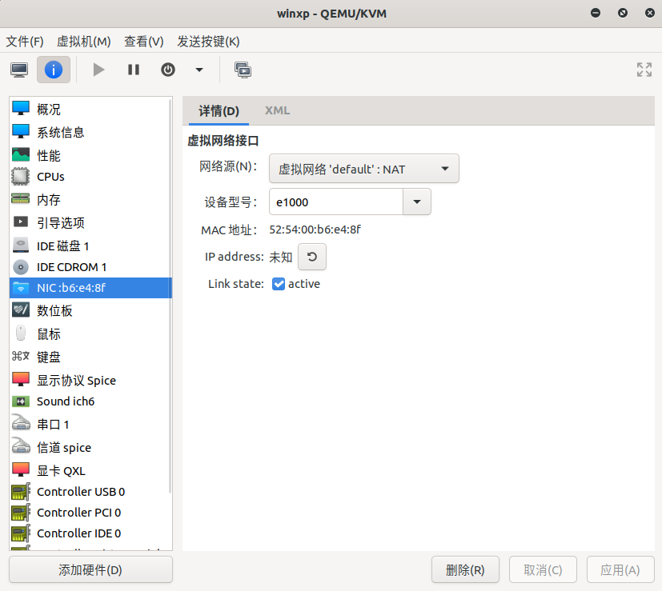

kvm基于linux内核的虚拟化

<!--more-->

> kvm是基于硬件的完全虚拟化，集成在内核中，qemu主要外部设备的虚拟化两者各发挥所长

#### 检查硬件是否支持

```shell
apt install cpu-checker

kvm-ok
INFO: /dev/kvm exists
KVM acceleration can be used
```

> 虚拟机中需要打开虚拟化嵌套支持


#### 安装

```shell
sudo apt install qemu-kvm libvirt-daemon-system libvirt-clients bridge-utils virtinst virt-manager
```

- qemu-kvm -为KVM管理程序提供硬件仿真的软件。
- libvirt-daemon-system -用于将libvirt守护程序作为系统服务运行的配置文件。
- libvirt-clients -用于管理虚拟化平台的软件。
- bridge-utils -一组用于配置以太网桥的命令行工具。
- virtinst -一组用于创建虚拟机的命令行工具。
- virt-manager -易于使用的GUI界面和支持命令行工具，用于通过libvirt管理虚拟机。

查看运行状态

```sehll
sudo systemctl status libvirtd
```

#### 图形化安装操作系统

> 找到虚拟系统管理器


> 点击新建，剩下的和vmware很像



> 选择安装类型


> 指定安装的iso镜像文件


> 自动选择系统类型有问题，无法识别，这里改为通用默认类型


> 启动成功进入了安装界面剩下的不做过多介绍


##### 其他界面说明

> 系统启动引导界面


> 这里可以看到磁盘的信息


> 这里选择可图形服务器


> 网卡配置界面



#### 命令行创建

> 创建一个磁盘容量为15g，类型为qcow2，名字叫centos7.qcow2的虚拟磁盘

```shell
qemu-img create -f qcow2 centos7.qcow2 15G
```

> 创建虚拟机

```shell
sudo virt-install \
 --name=centos7 \
 --disk path=/home/centos7.qcow2 \
 --vcpus=1 --ram=1024 \
 --cdrom=/home/CentOS-7-x86_64-Minimal-2003.iso \
 --network bridge=virbr0 \
 --graphics vnc,listen=0.0.0.0 \
 --os-type=linux \
 --os-variant="centos7.0"
```

> 此时可以通过vnc连接开始安装系统，也可以像图形化界面一样用虚拟机管理器安装


##### 选项说明

> virt-install 中--os-variant可选值

```shell
# ubuntu
sudo apt -y install libosinfo-bin

# cengtos
yum -y install libosinfo
```

##### virsh常用命令

|命令|说明|
|-|-|
|virsh start xxx       |启动名字为x的非活动虚拟机  |
|virsh list  --all     |列出虚拟机|
|virsh create xxx.xml  |创建虚拟机，没有持久化|
|virsh suspend xxx     |暂停虚拟机|
|virsh resume xxxx     |启动暂停的虚拟机|
|virsh shutdown xxxx   |正常关闭虚拟机|
|virsh destroy xxxx    |强制关闭虚拟机|
|virsh undefine xxx    |删除虚拟机，只是从列表中删除，且不会删除活动的虚拟机|
|virsh dominfo xxx     |显示虚拟机的基本信息|
|virsh domname 2       |显示id号为2的虚拟机名|
|virsh domid xxx       |显示虚拟机id号|
|virsh domuuid xxx     |显示虚拟机的uuid|
|virsh domstate xxx    |显示虚拟机的当前状态|
|virsh dumpxml xxx     |显示虚拟机的当前配置文件（可能和定义虚拟机时的配置不同，因为当虚拟机启动时，需要给虚拟机 分配id号、uuid、vnc端口号等等）|
|virsh setmem x 512000 |给不活动虚拟机设置内存大小|
|virsh edit xxx        |编辑配置文件（一般是在刚定义完虚拟机之后）|

#### 参考资料

<https://www.iplayio.cn/post/92661051>
<https://www.cnblogs.com/saryli/p/11827903.html>
