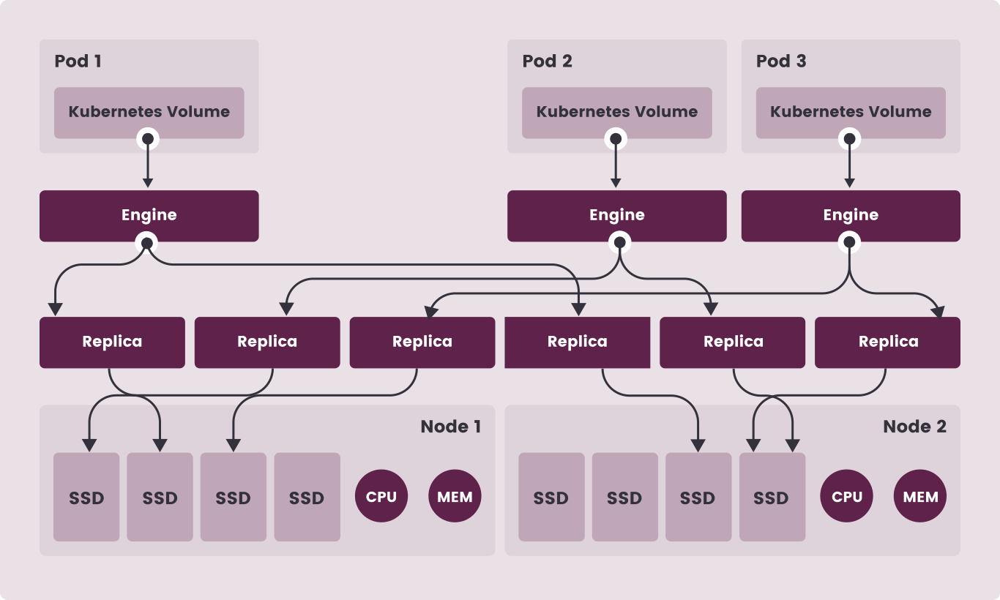
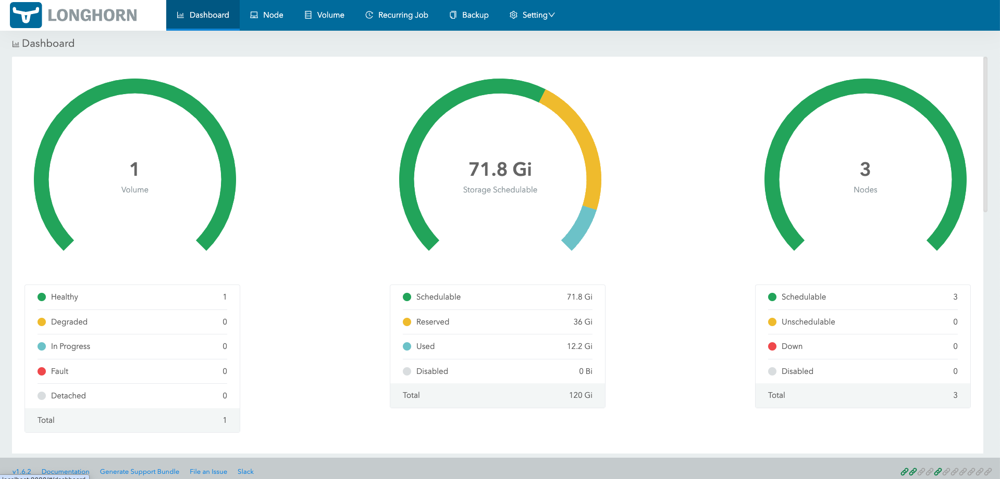

Longhorn是Kubernetes的一个轻量级、可靠且易于使用的分布式块存储系统

<!--more-->

#### 架构



#### 安装

##### 前置依赖

- 部署iscsi

```shell
# 使用k8s安装iscsi
kubectl apply -f https://raw.githubusercontent.com/longhorn/longhorn/v1.6.2/deploy/prerequisite/longhorn-iscsi-installation.yaml

# 手动安装
yum --setopt=tsflags=noscripts install iscsi-initiator-utils
echo "InitiatorName=$(/sbin/iscsi-iname)" > /etc/iscsi/initiatorname.iscsi
systemctl enable iscsid
systemctl start iscsid
modprobe iscsi_tcp
```

- 节点需要nfs服务支持没有则安装

```shell
# 使用k8s安装nfs
kubectl apply -f https://raw.githubusercontent.com/longhorn/longhorn/v1.6.2/deploy/prerequisite/longhorn-nfs-installation.yaml

# 手动安装
cat /boot/config-`uname -r`| grep CONFIG_NFS_V4_1
cat /boot/config-`uname -r`| grep CONFIG_NFS_V4_2
yum install nfs-utils
```

##### 部署longhorn

```shell
kubectl apply -f https://raw.githubusercontent.com/longhorn/longhorn/v1.6.2/deploy/longhorn.yaml
```

- helm安装Longhorn

```shell
helm repo add longhorn https://charts.longhorn.io
helm repo update
helm install longhorn longhorn/longhorn --namespace longhorn-system --create-namespace
```

- 部署测试

```shell
kubectl create -f https://raw.githubusercontent.com/longhorn/longhorn/v1.6.2/examples/pod_with_pvc.yaml
```

##### 访问longhorn

- 转发dashboard,访问`localhost:8080`

```shell
kubectl -n longhorn-system port-forward svc/longhorn-frontend 8080:80
```



#### 参考资料

<https://longhorn.io/docs>
