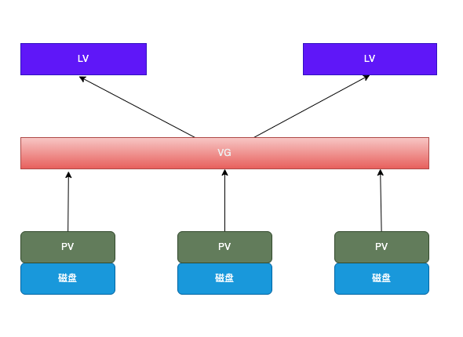

layout: draft
title: lvm使用
author: Nature丿灵然
tags:
  - 存储
date: 2024-07-01 22:35:00
---
lvm(Logical Volume Manager)是linux的逻辑卷，他在物理卷基础上抽象成一个逻辑的卷，这样就可以使用单个或者多个磁盘合并成一个逻辑磁盘

<!--more-->

#### 术语

- PV：物理卷,可以任务就是普通的磁盘
- VG：卷组,蒋垛个PV合并成一个组
- LV：逻辑卷，从VG中分割出的一块空间创建磁盘，可以伸缩容
- PE：物理区域,PV中划分的一些块



#### 创建一个lvm

- 磁盘分区，需要注意最后w保存到磁盘

```shell
fdisk /dev/vdb
# 欢迎使用 fdisk (util-linux 2.23.2)。
# 
# 更改将停留在内存中，直到您决定将更改写入磁盘。
# 使用写入命令前请三思。
# 
# Device does not contain a recognized partition table
# 使用磁盘标识符 0x4ffd3010 创建新的 DOS 磁盘标签。
# 
# 命令(输入 m 获取帮助)：n
# Partition type:
#    p   primary (0 primary, 0 extended, 4 free)
#    e   extended
# Select (default p): p
# 分区号 (1-4，默认 1)：
# 起始 扇区 (2048-41943039，默认为 2048)：
# 将使用默认值 2048
# Last 扇区, +扇区 or +size{K,M,G} (2048-41943039，默认为 41943039)：+1G
# 分区 1 已设置为 Linux 类型，大小设为 1 GiB
# 
# 命令(输入 m 获取帮助)：t
# 已选择分区 1
# Hex 代码(输入 L 列出所有代码)：8e
# 已将分区“Linux”的类型更改为“Linux LVM”
# 
```

- 查看分区的磁盘

```shell
fdisk -l

# 磁盘 /dev/vda：21.5 GB, 21474836480 字节，41943040 个扇区
# Units = 扇区 of 1 * 512 = 512 bytes
# 扇区大小(逻辑/物理)：512 字节 / 512 字节
# I/O 大小(最小/最佳)：512 字节 / 512 字节
# 磁盘标签类型：dos
# 磁盘标识符：0x000be0d0
# 
#    设备 Boot      Start         End      Blocks   Id  System
# /dev/vda1   *        2048    41943039    20970496   83  Linux
# 
# 磁盘 /dev/vdb：21.5 GB, 21474836480 字节，41943040 个扇区
# Units = 扇区 of 1 * 512 = 512 bytes
# 扇区大小(逻辑/物理)：512 字节 / 512 字节
# I/O 大小(最小/最佳)：512 字节 / 512 字节
# 磁盘标签类型：dos
# 磁盘标识符：0x4ffd3010
# 
#    设备 Boot      Start         End      Blocks   Id  System
# /dev/vdb1            2048     2099199     1048576   8e  Linux LVM
# /dev/vdb2         2099200     4196351     1048576   8e  Linux LVM
# /dev/vdb3         4196352     6293503     1048576   8e  Linux LVM
```

- 创建物理卷

```shell
pvcreate /dev/vdb1 /dev/vdb2 /dev/vdb3
#  Physical volume "/dev/vdb1" successfully created.
#  Physical volume "/dev/vdb2" successfully created.
#  Physical volume "/dev/vdb3" successfully created.
```

- 查看物理卷

```shell
 pvdisplay
#  "/dev/vdb3" is a new physical volume of "1.00 GiB"
#  --- NEW Physical volume ---
#  PV Name               /dev/vdb3
#  VG Name
#  PV Size               1.00 GiB
#  Allocatable           NO
#  PE Size               0
#  Total PE              0
#  Free PE               0
#  Allocated PE          0
#  PV UUID               9fri0N-wmH0-I2nr-Vd2y-vr7b-RWxO-3zg7Zt
#
#  "/dev/vdb1" is a new physical volume of "1.00 GiB"
#  --- NEW Physical volume ---
#  PV Name               /dev/vdb1
#  VG Name
#  PV Size               1.00 GiB
#  Allocatable           NO
#  PE Size               0
#  Total PE              0
#  Free PE               0
#  Allocated PE          0
#  PV UUID               3pKwuU-7U1d-Rhwz-7wMS-83nV-f2lq-FABsic
#
#  "/dev/vdb2" is a new physical volume of "1.00 GiB"
#  --- NEW Physical volume ---
#  PV Name               /dev/vdb2
#  VG Name
#  PV Size               1.00 GiB
#  Allocatable           NO
#  PE Size               0
#  Total PE              0
#  Free PE               0
#  Allocated PE          0
#  PV UUID               GkAeEq-wWcW-B1q8-ujUW-qsTm-PQAJ-SZXH1B
```

- 创建逻辑卷组

```shell
vgcreate volume-test /dev/vdb1 /dev/vdb2 /dev/vdb3
#  Volume group "volume-test" successfully created
```

- 查看创建的逻辑卷组

```shell
vgdisplay
#  --- Volume group ---
#  VG Name               volume-test
#  System ID
#  Format                lvm2
#  Metadata Areas        3
#  Metadata Sequence No  1
#  VG Access             read/write
#  VG Status             resizable
#  MAX LV                0
#  Cur LV                0
#  Open LV               0
#  Max PV                0
#  Cur PV                3
#  Act PV                3
#  VG Size               <2.99 GiB
#  PE Size               4.00 MiB
#  Total PE              765
#  Alloc PE / Size       0 / 0
#  Free  PE / Size       765 / <2.99 GiB
#  VG UUID               N0Edem-cvO5-tn1e-qjTD-9Ivk-mLSw-yBEVHp
```

- 创建逻辑卷

```shell
lvcreate -L 200M -n lv1 volume-test
#  Logical volume "lv1" created.
```

- 查看逻辑卷

```shell
lvdisplay
#  --- Logical volume ---
#  LV Path                /dev/volume-test/lv1
#  LV Name                lv1
#  VG Name                volume-test
#  LV UUID                w7DEiD-0Q2r-4zDz-0art-fb6S-P2X4-wLyKOk
#  LV Write Access        read/write
#  LV Creation host, time 10-60-116-80, 2024-07-02 14:56:09 +0800
#  LV Status              available
#  # open                 0
#  LV Size                200.00 MiB
#  Current LE             50
#  Segments               1
#  Allocation             inherit
#  Read ahead sectors     auto
#  - currently set to     8192
#  Block device           252:0
```

- 格式化

```shell
mkfs.ext4 /dev/volume-test/lv1
# mke2fs 1.42.9 (28-Dec-2013)
# 文件系统标签=
# OS type: Linux
# 块大小=1024 (log=0)
# 分块大小=1024 (log=0)
# Stride=0 blocks, Stripe width=0 blocks
# 51200 inodes, 204800 blocks
# 10240 blocks (5.00%) reserved for the super user
# 第一个数据块=1
# Maximum filesystem blocks=33816576
# 25 block groups
# 8192 blocks per group, 8192 fragments per group
# 2048 inodes per group
# Superblock backups stored on blocks:
#         8193, 24577, 40961, 57345, 73729
# 
# Allocating group tables: 完成
# 正在写入inode表: 完成
# Creating journal (4096 blocks): 完成
# Writing superblocks and filesystem accounting information: 完成
```

- 挂载到文件系统

```shell
mount /dev/volume-test/lv1 /mnt/
```

- 查看挂载效果

```shell
df -h
# 文件系统                      容量  已用  可用 已用% 挂载点
# devtmpfs                      411M     0  411M    0% /dev
# tmpfs                         423M     0  423M    0% /dev/shm
# tmpfs                         423M   12M  412M    3% /run
# tmpfs                         423M     0  423M    0% /sys/fs/cgroup
# /dev/vda1                      20G  1.8G   19G    9% /
# tmpfs                          85M     0   85M    0% /run/user/0
# /dev/mapper/volume--test-lv1  190M  1.6M  175M    1% /mnt
```

#### lvm伸缩容

##### 扩容

- umount挂载点

```shell
umount /mnt
```

- 从200m扩容到300m

```shell
lvresize -L 300M /dev/volume-test/lv1
#  Size of logical volume volume-test/lv1 changed from 200.00 MiB (50 extents) to 300.00 MiB (75 extents).
#  Logical volume volume-test/lv1 successfully resized.
```

- 检查磁盘错误

```shell
e2fsck -f /dev/volume-test/lv1
# e2fsck 1.42.9 (28-Dec-2013)
# 第一步: 检查inode,块,和大小
# 第二步: 检查目录结构
# 第3步: 检查目录连接性
# Pass 4: Checking reference counts
# 第5步: 检查簇概要信息
# /dev/volume-test/lv1: 11/51200 files (0.0% non-contiguous), 12115/204800 blocks
```

- 扩容文件系统

```shell
resize2fs /dev/volume-test/lv1
# resize2fs 1.42.9 (28-Dec-2013)
# Resizing the filesystem on /dev/volume-test/lv1 to 307200 (1k) blocks.
# The filesystem on /dev/volume-test/lv1 is now 307200 blocks long.
```

- 查看扩容效果

```shell
lvdisplay
#  --- Logical volume ---
#  LV Path                /dev/volume-test/lv1
#  LV Name                lv1
#  VG Name                volume-test
#  LV UUID                w7DEiD-0Q2r-4zDz-0art-fb6S-P2X4-wLyKOk
#  LV Write Access        read/write
#  LV Creation host, time 10-60-116-80, 2024-07-02 14:56:09 +0800
#  LV Status              available
#  # open                 0
#  LV Size                300.00 MiB
#  Current LE             75
#  Segments               1
#  Allocation             inherit
#  Read ahead sectors     auto
#  - currently set to     8192
#  Block device           252:0
```

- 挂载，可以看到容量变大了

```shell
mount /dev/volume-test/lv1 /mnt/
df -h
# 文件系统                      容量  已用  可用 已用% 挂载点
# devtmpfs                      411M     0  411M    0% /dev
# tmpfs                         423M     0  423M    0% /dev/shm
# tmpfs                         423M   12M  412M    3% /run
# tmpfs                         423M     0  423M    0% /sys/fs/cgroup
# /dev/vda1                      20G  1.8G   19G    9% /
# tmpfs                          85M     0   85M    0% /run/user/0
# /dev/mapper/volume--test-lv1  287M  2.1M  266M    1% /mnt
```

##### 缩容

- 卸载挂载点

```shell
umount /dev/volume-test/lv1
```

- 和扩容一样检查磁盘错误

```shell
e2fsck -f /dev/volume-test/lv1
# e2fsck 1.42.9 (28-Dec-2013)
# 第一步: 检查inode,块,和大小
# 第二步: 检查目录结构
# 第3步: 检查目录连接性
# Pass 4: Checking reference counts
# 第5步: 检查簇概要信息
# /dev/volume-test/lv1: 11/77824 files (0.0% non-contiguous), 15987/307200 blocks
```

- 减少文件系统容量

```shell
resize2fs /dev/volume-test/lv1 200M
# resize2fs 1.42.9 (28-Dec-2013)
# Resizing the filesystem on /dev/volume-test/lv1 to 204800 (1k) blocks.
# The filesystem on /dev/volume-test/lv1 is now 204800 blocks long.

```

- 减小逻辑卷，需要一次确认

```shell
lvresize -L 200M /dev/volume-test/lv1
#   WARNING: Reducing active logical volume to 200.00 MiB.
#   THIS MAY DESTROY YOUR DATA (filesystem etc.)
# Do you really want to reduce volume-test/lv1? [y/n]: y
#   Size of logical volume volume-test/lv1 changed from 300.00 MiB (75 extents) to 200.00 MiB (50 extents).
#   Logical volume volume-test/lv1 successfully resized.
```

- 确认大小

```shell
lvdisplay
#  --- Logical volume ---
#  LV Path                /dev/volume-test/lv1
#  LV Name                lv1
#  VG Name                volume-test
#  LV UUID                w7DEiD-0Q2r-4zDz-0art-fb6S-P2X4-wLyKOk
#  LV Write Access        read/write
#  LV Creation host, time 10-60-116-80, 2024-07-02 14:56:09 +0800
#  LV Status              available
#  # open                 0
#  LV Size                200.00 MiB
#  Current LE             50
#  Segments               1
#  Allocation             inherit
#  Read ahead sectors     auto
#  - currently set to     8192
#  Block device           252:0
```

- 挂载文件系统

```shell
mount /dev/volume-test/lv1 /mnt/
df -h
# 文件系统                      容量  已用  可用 已用% 挂载点
# devtmpfs                      411M     0  411M    0% /dev
# tmpfs                         423M     0  423M    0% /dev/shm
# tmpfs                         423M   12M  412M    3% /run
# tmpfs                         423M     0  423M    0% /sys/fs/cgroup
# /dev/vda1                      20G  1.8G   19G    9% /
# tmpfs                          85M     0   85M    0% /run/user/0
# /dev/mapper/volume--test-lv1  190M  1.6M  175M    1% /mnt
```

#### 扩容逻辑卷组

- 查看当前逻辑卷组状态

```shell
gdisplay volume-test
#  --- Volume group ---
#  VG Name               volume-test
#  System ID
#  Format                lvm2
#  Metadata Areas        3
#  Metadata Sequence No  4
#  VG Access             read/write
#  VG Status             resizable
#  MAX LV                0
#  Cur LV                1
#  Open LV               1
#  Max PV                0
#  Cur PV                3
#  Act PV                3
#  VG Size               <2.99 GiB
#  PE Size               4.00 MiB
#  Total PE              765
#  Alloc PE / Size       50 / 200.00 MiB
#  Free  PE / Size       715 / 2.79 GiB
#  VG UUID               N0Edem-cvO5-tn1e-qjTD-9Ivk-mLSw-yBEVHp
```

```shell
fdisk /dev/vdc
# 欢迎使用 fdisk (util-linux 2.23.2)。
# 
# 更改将停留在内存中，直到您决定将更改写入磁盘。
# 使用写入命令前请三思。
# 
# Device does not contain a recognized partition table
# 使用磁盘标识符 0xfae484d7 创建新的 DOS 磁盘标签。
# 
# 命令(输入 m 获取帮助)：n
# Partition type:
#    p   primary (0 primary, 0 extended, 4 free)
#    e   extended
# Select (default p): p
# 分区号 (1-4，默认 1)：
# 起始 扇区 (2048-41943039，默认为 2048)：
# 将使用默认值 2048
# Last 扇区, +扇区 or +size{K,M,G} (2048-41943039，默认为 41943039)：+2G
# 分区 1 已设置为 Linux 类型，大小设为 2 GiB
# 
# 命令(输入 m 获取帮助)：t
# 已选择分区 1
# Hex 代码(输入 L 列出所有代码)：
# Hex 代码(输入 L 列出所有代码)：8e
# 已将分区“Linux”的类型更改为“Linux LVM”
# 
# 命令(输入 m 获取帮助)：w
# The partition table has been altered!

#Calling ioctl() to re-read partition table.
#正在同步磁盘。
```

- 查看创建的新分区

```shell
lsblk -l
# NAME             MAJ:MIN RM  SIZE RO TYPE MOUNTPOINT
# vdb              253:16   0   20G  0 disk
# vdb2             253:18   0    1G  0 part
# vdb3             253:19   0    1G  0 part
# vdb1             253:17   0    1G  0 part
# volume--test-lv1 252:0    0  200M  0 lvm  /mnt
# vdc              253:32   0   20G  0 disk
# vdc1             253:33   0    2G  0 part
# vda              253:0    0   20G  0 disk
# vda1             253:1    0   20G  0 part /
```

- 创建物理卷

```shell
pvcreate /dev/vdc1
#  Physical volume "/dev/vdc1" successfully created.
```

- 扩容逻辑卷组

```shell
vgextend volume-test /dev/vdc1
#  Volume group "volume-test" successfully extended
```

```shell
vgdisplay
#  --- Volume group ---
#  VG Name               volume-test
#  System ID
#  Format                lvm2
#  Metadata Areas        4
#  Metadata Sequence No  5
#  VG Access             read/write
#  VG Status             resizable
#  MAX LV                0
#  Cur LV                1
#  Open LV               1
#  Max PV                0
#  Cur PV                4
#  Act PV                4
#  VG Size               4.98 GiB
#  PE Size               4.00 MiB
#  Total PE              1276
#  Alloc PE / Size       50 / 200.00 MiB
#  Free  PE / Size       1226 / <4.79 GiB
#  VG UUID               N0Edem-cvO5-tn1e-qjTD-9Ivk-mLSw-yBEVHp
```

#### 快照

- 查看lv信息

```shell
lvdisplay
#  --- Logical volume ---
#  LV Path                /dev/volume-test/lv1
#  LV Name                lv1
#  VG Name                volume-test
#  LV UUID                w7DEiD-0Q2r-4zDz-0art-fb6S-P2X4-wLyKOk
#  LV Write Access        read/write
#  LV Creation host, time 10-60-116-80, 2024-07-02 14:56:09 +0800
#  LV Status              available
#  # open                 1
#  LV Size                200.00 MiB
#  Current LE             50
#  Segments               1
#  Allocation             inherit
#  Read ahead sectors     auto
#  - currently set to     8192
#  Block device           252:2
```

- 写入测试数据

```shell
date > /mnt/data
cat /mnt/data
# 2024年 07月 02日 星期二 16:29:17 CST
```

- 创建快照

```shell
lvcreate --size 200M --snapshot --name snap /dev/volume-test/lv1
```

- 删除数据

```shell
rm -rf /mnt/data
```

- 卸载挂载点

```shell
umount /mnt
```

- 取消逻辑卷激活，确保没写入

```shell
lvchange -an /dev/volume-test/lv1
```

- 恢复快照(合并)

```shell
lvconvert --merge /dev/volume-test/snap
#  Merging of snapshot volume-test/snap will occur on next activation of volume-test/lv1.
```

- 激活逻辑卷,合并将在这个步骤执行

```shell
lvchange -ay /dev/volume-test/lv1
```

```shell
lvdisplay /dev/volume-test/lv1
#  --- Logical volume ---
#  LV Path                /dev/volume-test/lv1
#  LV Name                lv1
#  VG Name                volume-test
#  LV UUID                w7DEiD-0Q2r-4zDz-0art-fb6S-P2X4-wLyKOk
#  LV Write Access        read/write
#  LV Creation host, time 10-60-116-80, 2024-07-02 14:56:09 +0800
#  LV Status              available
#  # open                 0
#  LV Size                200.00 MiB
#  Current LE             50
#  Segments               1
#  Allocation             inherit
#  Read ahead sectors     auto
#  - currently set to     8192
#  Block device           252:2
```

- 挂载磁盘并验证，之前删除的数据恢复了

```shell
mount /dev/volume-test/lv1 /mnt/
cat /mnt/data
2024年 07月 02日 星期二 16:29:17 CST
```

#### 使用缓存加速

- 创建一个使用ssd的pv

```shell
lvcreate --size 100M --name cachevol volume-test /dev/vdc1
```

- 将加速盘附加到逻辑卷

```shell
lvconvert --type cache --cachepool cachevol volume-test/lv1
```

- 验证

```shell
lvs --all --options +devices volume-test
```

#### 参考资料

<https://linux.cn/article-3218-1.html>
<https://docs.redhat.com/zh_hans/documentation/red_hat_enterprise_linux/8/html/configuring_and_managing_logical_volumes/enabling-dm-cache-caching-for-a-logical-volume_enabling-caching-to-improve-logical-volume-performance>
