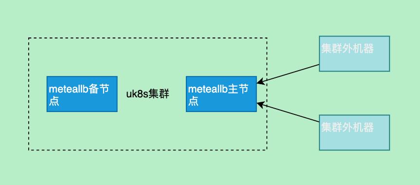

title: metallb
author: Nature丿灵然
tags:
  - 模版
  - k8s
  - 负载均衡
date: 2023-08-18 11:45:00
---

[metallb](https://github.com/metallb/metallb)是一个开源的负载均衡器，主要解决裸金属情况下k8s使用lb类型的service的情况

<!--more-->

#### 部署

```shell
kubectl apply -f https://raw.githubusercontent.com/metallb/metallb/v0.13.10/config/manifests/metallb-native.yaml
```

#### L2模式

> l2只能在同一个二层中使用，且只有容灾没有负载均衡功能，所有访问lb的流量都转发`选举`的主节点上在通过该节点转发到对应的pod



##### 配置

- 获取minikube的网段

```shell
docker network inspect minikube  |grep -i Subnet
#                    "Subnet": "192.168.49.0/24",
```

- 配置lb地址范围

```shell
apiVersion: metallb.io/v1beta1
kind: IPAddressPool
metadata:
  name: first-pool
  namespace: metallb-system
spec:
  addresses:
  #- 192.168.10.0/24
  - 192.168.49.100-192.168.49.200 # docker的网络中拿去一分部给lb
  #- fc00:f853:0ccd:e799::/124
```

- 配置该地址范围的类型

```yaml
apiVersion: metallb.io/v1beta1
kind: L2Advertisement
metadata:
  name: example
  namespace: metallb-system
spec:
  ipAddressPools:
  - first-pool
```

##### 测试

- 部署一个服务器

```shell
kubectl apply -f https://raw.githubusercontent.com/NatureLR/net-echo/master/k8s.yaml
kubectl patch svc net-echo -p '{"spec":{"type": "LoadBalancer"}}'
```

```shell
k get svc net-echo -o wide
NAME       TYPE           CLUSTER-IP       EXTERNAL-IP      PORT(S)        AGE   SELECTOR
net-echo   LoadBalancer   10.103.124.212   192.168.49.100   80:31495/TCP   54s   app=net-echo
```

- 我得测试环境为minikube,创建一个在同一个二层的pod

```shell
# 指定网络为minikube
docker run --net minikube -it  alpine sh
# 安装curl
apk add curl

curl 192.168.49.100
#ClientAddr: 10.244.205.192:48450
#ClientReqPath: /
#ClientReqMeth: GET
#ServerHostName: net-echo-7cccf56f57-8xtcw
#ServerAddr: 10.244.205.194
```

- 查看arp表，192.168.49.100这个vip是`02:42:c0:a8:31:03`响应的

```shell
arp -n
# ? (192.168.49.3) at 02:42:c0:a8:31:03 [ether]  on eth0
# ? (192.168.49.100) at 02:42:c0:a8:31:03 [ether]  on eth0
# ? (192.168.49.1) at 02:42:56:00:61:a6 [ether]  on eth0
```

- 请求最终发送到了minikube-m02这个节点然后再到pod上

```shell
minikube ssh --node="minikube-m02"
ip addr |grep 02:42:c0:a8:31:03

#docker@minikube-m02:~$ ip addr |grep 02:42:c0:a8:31:03
#    link/ether 02:42:c0:a8:31:03 brd ff:ff:ff:ff:ff:ff link-netnsid 0
```

- 在起一个容器,会发现其实都是同一个节点在响应这也是二层的

```shell
docker run --net minikube -it  alpine sh
apk add curl

curl 192.168.49.100
# / #  curl 192.168.49.100
# ClientAddr: 10.244.205.192:61123
# ClientReqPath: /
# ClientReqMeth: GET
# ServerHostName: net-echo-7cccf56f57-8xtcw
# ServerAddr: 10.244.205.194

arp -n
# / # arp -n
# ? (192.168.49.1) at 02:42:56:00:61:a6 [ether]  on eth0
# ? (192.168.49.100) at 02:42:c0:a8:31:03 [ether]  on eth0
# ? (192.168.49.3) at 02:42:c0:a8:31:03 [ether]  on eth0
```

- 可以看到同一个二层的集群外的机器访问lb都是通过mac流向同一个node，从而通过kube-proxy流向pod

#### BGP模式

> bgp模式通过向路由发布bgp路由从而实现vip功能，此功能需要路由器支持bgp协议故无法实验

#### 参考资料

<https://metallb.universe.tf>
