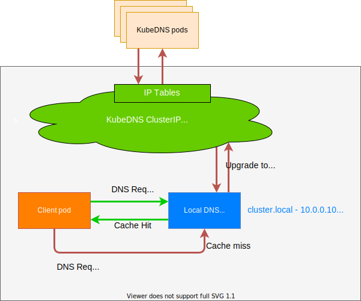

NodeLocal DNSCache通过在使用ds部署一个dns缓存在每个节点上，从而解决pod的dns请求转发到dns所在的节点

<!--more-->

同时解决由于[conntrack 竞争](https://github.com/kubernetes/kubernetes/issues/56903)导致的UDP DNS条目填满conntrack表

dns缓存在请求dns的时候使用tcp而非udp

- 架构图如下



#### 安装

```shell
wget https://raw.githubusercontent.com/kubernetes/kubernetes/master/cluster/addons/dns/nodelocaldns/nodelocaldns.yaml
```

- iptables

```shell
kubedns=`kubectl get svc kube-dns -n kube-system -o jsonpath={.spec.clusterIP}`
domain=cluster.local
localdns=169.254.20.10
sed -i "s/__PILLAR__LOCAL__DNS__/$localdns/g; s/__PILLAR__DNS__DOMAIN__/$domain/g; s/__PILLAR__DNS__SERVER__/$kubedns/g" nodelocaldns.yaml
```

- ipvs

```shell
kubedns=`kubectl get svc kube-dns -n kube-system -o jsonpath={.spec.clusterIP}`
domain=cluster.local
localdns=169.254.20.10
sed -i "s/__PILLAR__LOCAL__DNS__/$localdns/g; s/__PILLAR__DNS__DOMAIN__/$domain/g; s/,__PILLAR__DNS__SERVER__//g; s/__PILLAR__CLUSTER__DNS__/$kubedns/g" nodelocaldns.yaml
```

- 测试pod

```yaml
kubectl run busybox --image=busybox --restart=Never --namespace=default --command -- sleep infinity
```

#### 使用

##### 修改kubelet配置

- 添加下面的参数  
  - --cluster-dns: 创建的pod的中dns地址加上nodelocaldns的地址和本来kubedns地址即可
  - --cluster-domain: 集群的域名，一般是cluster.local

```shell
vim /etc/systemd/system/kubelet.service.d/10-kubeadm.conf 
# 增加 --cluster-dns
# --cluster-dns=169.254.20.10 --cluster-dns=<kube-dns ip> --cluster-domain=<search domain>
```

##### 手动修改pod配置

- 在pod中添加如下配置

```yaml
dnsConfig:
  nameservers:
  - 169.254.20.10
  - 192.168.0.2 # kube-dns地址，根据集群网络配置会有所不同
  options:
  - name: ndots
    value: "3"
  - name: attempts
    value: "2"
  - name: timeout
    value: "1"
  searches: # cluster.local 根据集群domain来替换
  - default.svc.cluster.local
  - svc.cluster.local
  - cluster.local
dnsPolicy: None
```

##### webhook自动注入

已经有开源的webhook来实现了参考此[项目](https://github.com/lixd/nodelocaldns-admission-webhook)

其中cert-mananger如果集群中有了则不需要安装,且此项目的集群domain只支持`cluster.local`

```shell
kubectl apply -f deploy/cert-manager/cert-manager.yaml
kubectl apply -f deploy/cert-manager/serving-cert.yaml
kubectl apply -f deploy/cert-manager/issuer.yaml
kubectl apply -f deploy/
```

- 给默认ns打上标签，并创建测试pod

```shell
kubectl label namespace default node-local-dns-injection=enabled
kubectl run busybox --image=busybox --restart=Never --namespace=default --command -- sleep infinity
```

- 查看测试pod的dnsconfig字段,发现多了一些字段

```shell
kubectl get po busybox  -o jsonpath="{.spec.dnsConfig}" |json_pp
# {
#    "nameservers" : [
#       "169.254.20.10"
#    ],
#    "options" : [
#       {
#          "name" : "ndots",
#          "value" : "2"
#       }
#    ],
#    "searches" : [
#       "default.svc.cluster.local",
#       "svc.cluster.local",
#       "cluster.local"
#    ]
# }
```

#### 性能测试

```yaml
apiVersion: apps/v1
kind: DaemonSet
metadata:
  name: dnsperf
  labels:
    app: dnsperf
spec:
  selector:
    matchLabels:
      app: dnsperf
  template:
    metadata:
      labels:
        app: dnsperf
    spec:
      containers:
      - name: dnsperf
        image: dnsperf:latest
        command: ["/bin/sh", "-c", "sleep infinity"]
        #resources:
        #  limits:
        #    memory: "128Mi"
        #    cpu: "500m"
        #  requests:
        #    memory: "64Mi"
        #    cpu: "250m"
```

- pod内执行下面的命令设置测试域名

```shell
cat <<EOF >records.txt
kubernetes A
kubernetes.default.svc.cluster.local A
kube-dns.kube-system.svc.cluster.local A
EOF
```

- pod内执行以下测试命令

```shell
dnsperf -l 60 -s 169.254.20.10 -Q 100000 -d records.txt
```

- 参数说明
  - -l 测试时间
  - -s 制定dns服务器
  - -Q 最高qps
  - -d 查询的列表

#### 参考资料

<https://kubernetes.io/zh-cn/docs/tasks/administer-cluster/nodelocaldns>
<https://help.aliyun.com/zh/ack/ack-managed-and-ack-dedicated/user-guide/configure-nodelocal-dnscache>
<https://www.lixueduan.com/posts/kubernetes/23-node-local-dns>
