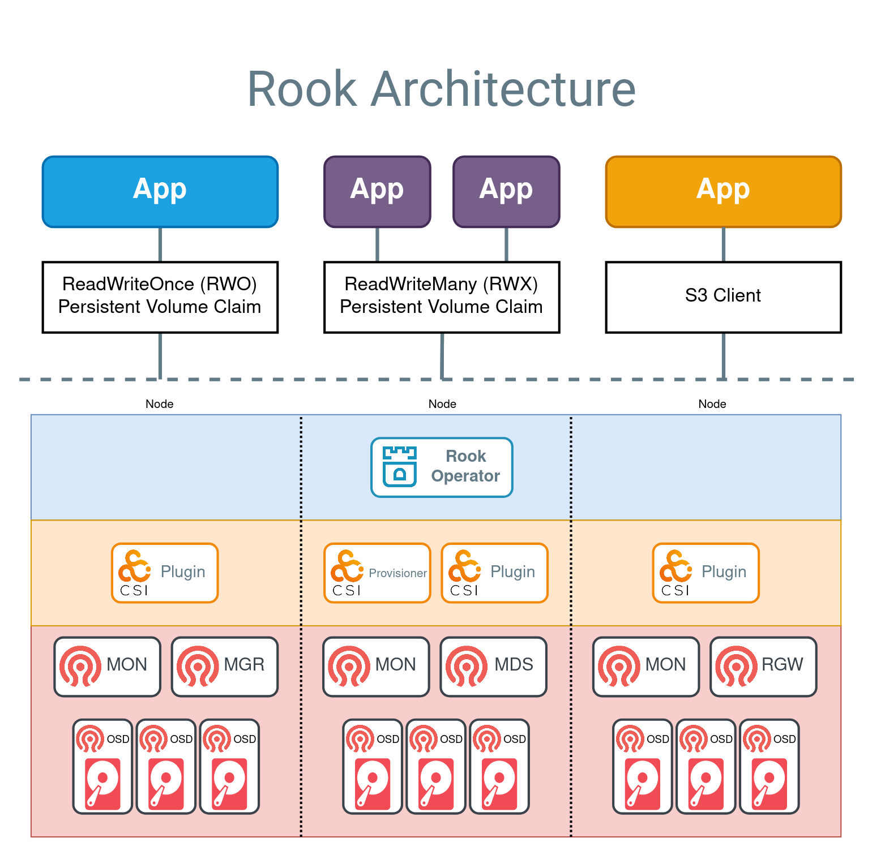

[Ceph](https://ceph.com) 是一种分布式存储系统，提供文件、块和对象存储

<!--more-->

Rook 自动化 Ceph 的部署和管理，提供自我管理、自我扩展和自我修复的存储服务。Rook 运营者通过基于 Kubernetes 资源构建，部署、配置、配置、扩展、升级和监控 Ceph。

## 架构



## 部署

### 部署operator

- 切换部署目录

```shell
cd /deploy/examples
```

- 部署operator

```shell
kubectl create -f crds.yaml -f common.yaml -f operator.yaml
```

### 部署一个demo集群

- `CephCluster`表示创建一个存储集群，配置了一个存储集群的相关配置

```shell
kubectl create -f cluster.yaml
```

- 部分镜像国内无法下载需要转储到国内的镜像仓库,自定义镜像参考<https://rook.io/docs/rook/latest-release/Storage-Configuration/Ceph-CSI/custom-images/>

- 修改完成之后需要重启operator

```shell
kubectl -n rook-ceph rollout restart deployment rook-ceph-operator
```

- 部署ceph工具

```shell
kubectl create -f deploy/examples/toolbox.yaml
```

- 部署rbd storageclass

```shell
kubectl create -f deploy/examples/csi/rbd/storageclass.yaml
```

## 节点管理

ceph支持多种底层存储一般推荐使用未分区的裸磁盘

### 添加osd

- 更新`CephCluster`资源会自动添加

### 移除osd

- 确保移除之后osd存储空间是够用的，且集装状态是active+clean

- 关闭operator

```shell
kubectl -n rook-ceph scale deployment rook-ceph-operator --replicas=0
```

- 编辑CephCluster中的配置,spec.storage.store删除对应的osd，如果设置了`useAllDevices： true`则不需要编辑

- 开启operator

```shell
kubectl -n rook-ceph scale deployment rook-ceph-operator --replicas=1
```

- 提出osd，提出执行之后通过`ceph -w`和`ceph -s`观察状态等待数据恢复

```shell
ceph osd out osd.<ID>
```

- 停止osd

```shell
kubectl -n rook-ceph scale deployment rook-ceph-osd-<ID> --replicas=0
ceph osd down osd.<ID>
```

- 彻底删除osd

```shell
ceph osd purge osd.<ID> --yes-i-really-mean-it
```

### dashboard

- 访问dashboard

```shell
kubectl -n rook-ceph port-forward svc/rook-ceph-mgr-dashboard 8443:8443
```

- 获取dashboard密码

```shell
kubectl -n rook-ceph get secret rook-ceph-dashboard-password -o jsonpath="{['data']['password']}" | base64 --decode && echo
```

### 监控

- 监控相关的文件在`deploy/examples/monitoring`中

```shell
cd deploy/examples/monitoring
```

- 如果已经通过prometheus operator 安装了prometheus部署ceph对应配置即可

```shell
# 监控目标
kubectl create -f service-monitor.yaml
kubectl create -f exporter-service-monitor.yaml
kubectl create -f csi-metrics-service-monitor.yaml
# 告警规则
kubectl create -f localrules.yaml
kubectl create -f externalrules.yaml
```

- 导入grafana报表

```shell
https://rook.io/docs/rook/latest-release/Storage-Configuration/Monitoring/ceph-monitoring/#grafana-dashboards
```

## 常用命令

- 查看集群状态

```shell
ceph -s 
```

- 展示集群实时状态

```shell
ceph -w
```

- 展示集群健康状态的详细信息

```shell
ceph health detail
```

- 集群osd状态

```shell
ceph osd status
```

- 树的形式查看osd

```shell
ceph osd tree
```

- 查看 crash，ceph组件宕机自动恢复之后会有一条日志需要手动清除

```shell
ceph crash ls
```

- 归档crash

```shell
ceph crash archive <crashid>
```

## 参考资料

<https://rook.io/docs/rook/latest-release/Getting-Started/intro/>
