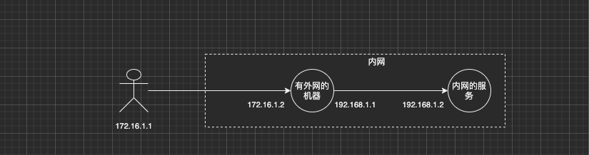
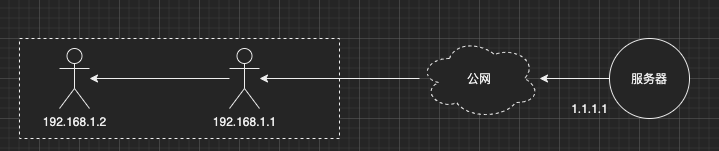

title: ssh隧道
author: Nature丿灵然
tags:
  - ssh
  - 内网穿透
date: 2020-11-12 11:55:00
---
通过ssh端口转发，穿透内网或绕过防火墙，以及tcp流量加密保护

<!--more-->
#### SSH隧道

端口转发默认是开启如果没开启则需要`AllowTcpForwarding=yes`

##### 本地端口转发



> 在192.168.1.1上执行下面的命令
> 通过192.168.1.2的22号端口将本地的3306端口代理到192.168.1.1的3306端口

```shell
ssh -g -f -N -L 3306:192.168.1.2:3306 root@172.16.1.2 -p 22
```

##### 远程端口转发



> 在192.168.1.1上执行下面的命令
> 则表示将192.168.1.2的3306端口转发到1.1.1.1的3306端口上，这样1.1.1.1就能访问192.168.1.2上3306端口的服务了

```shell
ssh -f -N -R 3306:192.168.1.2:3306 root@1.1.1.1 -p 22
```

##### 本地转发和远程转发

`ssh -f -N -<L|R> <映射IP>:<映射端口>:<转发IP>:<转发端口> <服务账号>@<服务IP> -p <服务端口>`

- 不管是本地转发和转成转都是转发端口
- 远程和本地是相对于执行ssh隧道命令的位置来说的
- 本地转发将映射端口映射到ssh客户端，也就是上面命令中的映射IP和映射端口在本地，映射IP可以省略默认为localhost且映射IP只能写本地拥有的IP，-g选项可以将绑定变为0.0.0.0,转发IP和转发端口则是服务端需要转发的地址和端口
- 远程转发则将映射端口映射到ssh服务端，也就是将映射IP和映射端口放在了ssh服务端,转发ip和转发端口是通过ssh客户端执行的

##### 选项解释

- "-L选项"：表示使用本地端口转发创建ssh隧道
- "-R选项"：表示使用远程端口转发创建ssh隧道
- "-N选项"：表示创建隧道以后不连接到sshServer端，通常与"-f"选项连用
- "-f选项"：表示在后台运行ssh隧道，通常与"-N"选项连用
- "-g选项"：表示ssh隧道对应的转发端口将监听在主机的所有IP中，不使用"-g选项"时，转发端口默认只监听在主机的本地回环地址中，"-g"表示开启网关模式，远程端口转发中，无法开启网关功能
