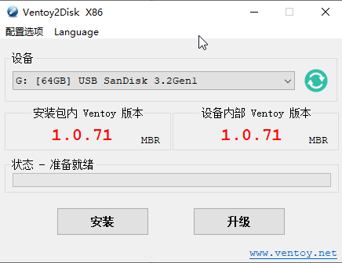
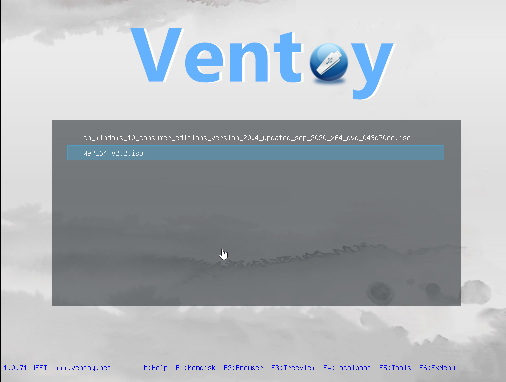

layout: draft
title: ventoy
author: Nature丿灵然
tags:
  - 重装系统
categories:
  - 运维
date: 2022-03-16 10:41:00
---
ventoy是一个国人开发的使用usb安装系统的工具
<!--more-->

> 我们一般安装操作系统使用以下三种方式

- 使用软碟通将官方操作系统刻录到u盘里，这种原生无污染且没有第三方插件和广告等，但是比较麻烦换个操作系统就需要重新烧写且win7以下需要手动打补丁

- 而用别人制作pe则是先进入pe系统然后在用pe的工具安装系统，这种这种需要看pe是否干净

- 之前比较流行的ghosts等一件安装的系统则比较简单快捷，但是容易内置第三方应用

而ventoy则可以在将自己写入到u盘中，将操作系统放入执行的文件夹在启动的时可以选择指定的操作系统，不需要烧写。配合winpe则可以完成日常常用操作，更厉害的时候他支持linux

#### 安装

在<https://www.ventoy.net/cn/download.html>界面下载GitHub的国内比较慢，推荐镜像网站

#### 写到U盘


安装的时候会格式化磁盘


#### 安装系统

1. 将iso文件放到u盘里面
2. 设置启动方式为u盘启动，就可以看到下面的界面使用使用上下键选择要启动的系统回车键安装，则可以进入系统的安装界面

#### 参考资料

<https://www.ventoy.net/cn/index.html>
