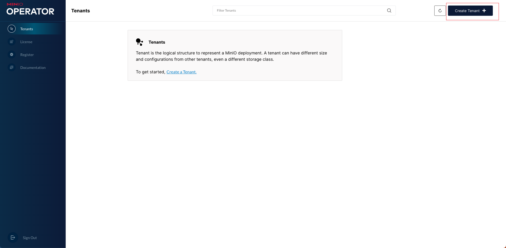
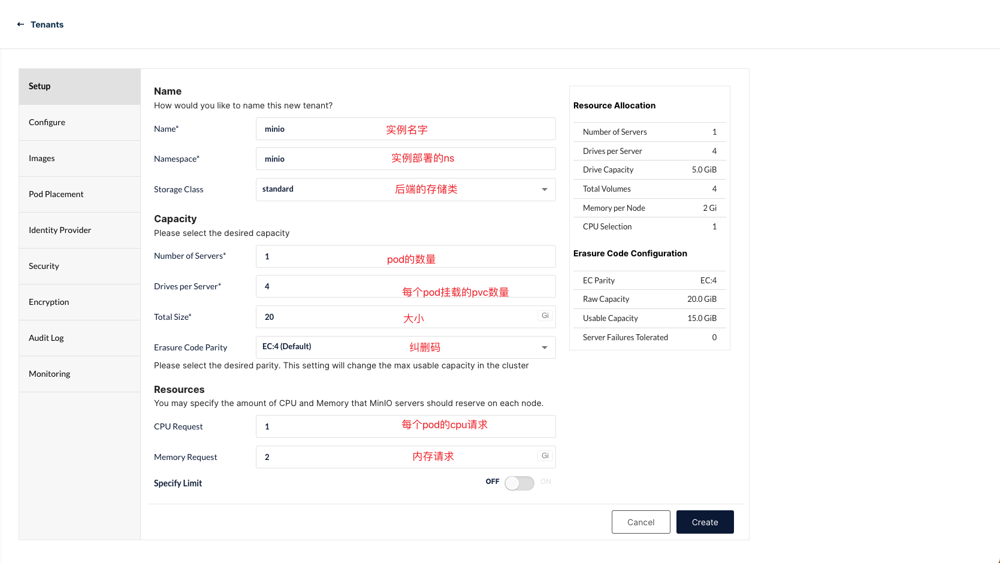
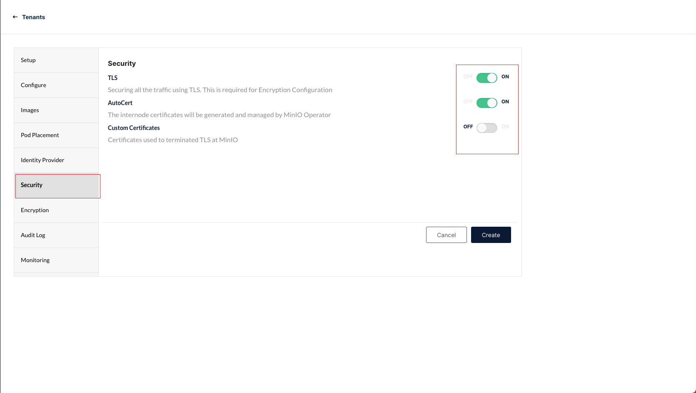
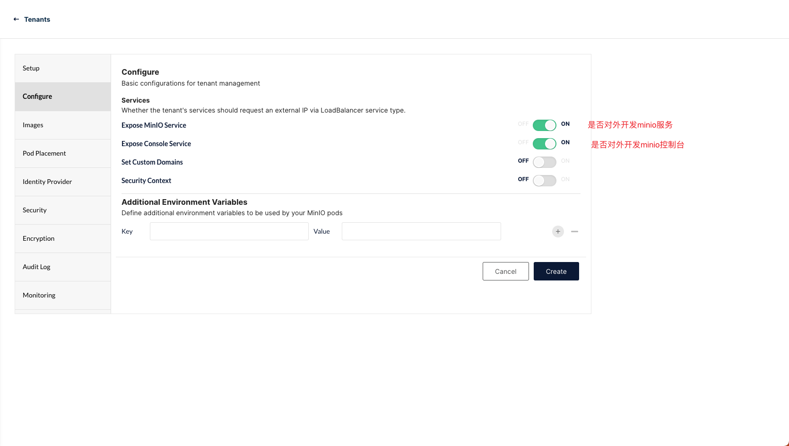
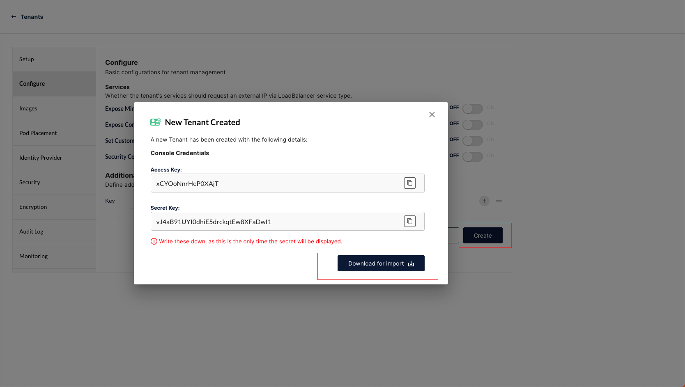
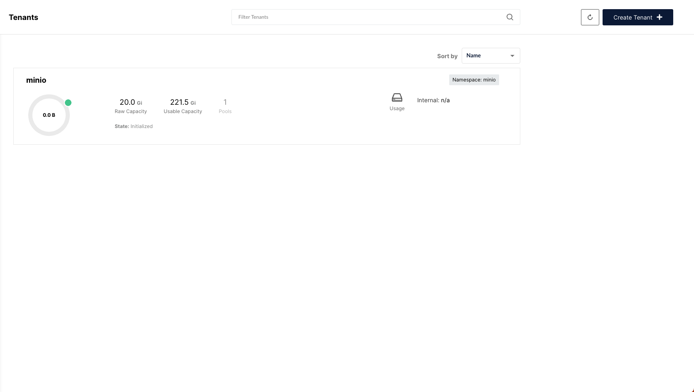

layout: draft
title: 使用minio-operator部署minio
author: Nature丿灵然
tags:
  - 存储
  - k8s
categories:
  - 运维
date: 2022-12-12 14:19:00
---
minio是一个对象存储服务,兼容s3协议

<!--more-->

使用minio-operator部署minio时可以图形化方便的部署

#### 安装

- kubectl安装minio插件

```shell
kubectl krew update

kubectl krew install minio
```

- 安装minio-operator到集群

```shell
kubectl minio init 
```

#### 部署minio

- 打开minio-operator的ui,该命令会打印出token,填写到

```shell
kubectl minio proxy -n minio-operator
```

- 浏览器打开localhost:9090即可打开ui，输入上面的token


- 创建minio namespace,具体ns名字可以自己选择

```shell
kubectl create namespace minio
```

- 点击部署界面



- 填写基本配置



- 配置是否使用https,默认使用https，



- 配置是否对外暴露控制台等服务，其实这个就是配置minio的svc的类型，默认是lb的



- 剩下的还有一些监控和审计日志的配置默认即可

- 点击创建



- 稍等片刻即部署成功



#### 参考资料

<https://min.io/docs/minio/kubernetes/upstream/>
