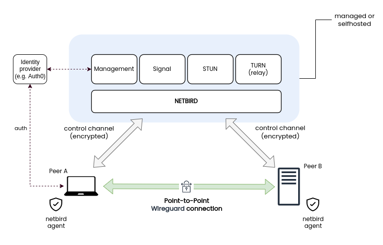
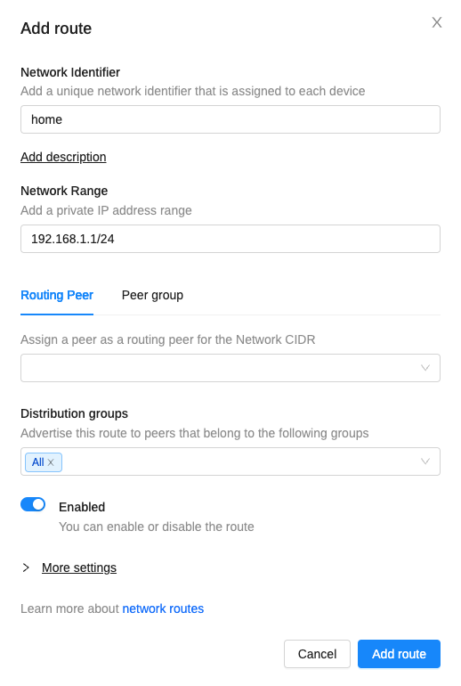
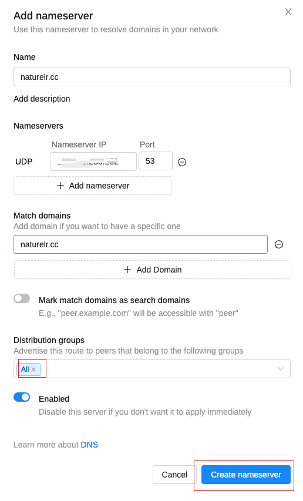

layout: draft
title: 使用netbird异地组网
author: Nature丿灵然
tags:
  - 网络
categories:
  - 运维
date: 2024-01-12 17:36:00
---

netbird是一个基于wireguard的异地组网程序,他可以做到所有的设备通过一个虚拟网络通讯

<!--more-->



#### 自建服务端安装

- 防火墙需要放行tcp的80,443;UDP的3478, 49152-65535

- 执行以下脚本安装

```shell
mkdir netbird && cd netbird
export NETBIRD_DOMAIN=<域名>; curl -fsSL https://github.com/netbirdio/netbird/releases/latest/download/getting-started-with-zitadel.sh | bash
```

##### 设置外网IP

- 由于云服务商的eip是基于nat的导致coturn不知道外网ip所以我们需要告诉他,如果不设置会导致移动端连接失败

```shell
echo "external-ip=<eip>" >>turnserver.conf

docker compose up -d --force-recreate coturn
```

#### 添加客户端

- 在ui中点击add peer有各个系统的对应添加客户端的详细说明

#### 配置路由

- 比如家里的网络是192.168.1.0/24 部署在家里的netbird客户端名字叫home

- 点击network router->add route-->Network Range中填写192.168.1.0/24,route peer选择home(部署在家中的)-->add roure 完成添加

- 添加完成之后则可以访问家中的设备



#### 配置DNS

- 当家里有自己的dns时则可以用家里的dns解析

- dns--> add nameserver-->选择 add custom nameserver--> name随便你写,Nameservers选择你的dns地址，Match domains则选择那些域名解析到这个dns，Distribution groups选择那些gruop生效



#### 参考资料

<https://docs.netbird.io/>
<https://docs.netbird.io/how-to/getting-started#running-net-bird-with-a-setup-key>
