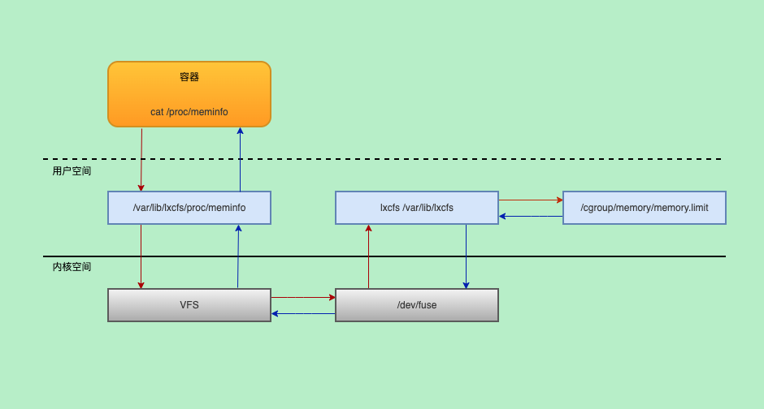

一般在k8s或者docker中我们设置了cpu和内存的使用限制，但是在进入容器的时候执行top和free等命令会发现显示的数值为宿主的，这是因为cgorup只是限制了cpu和内存等资源和使用

并没有将/proc目录下的一些信息同步

<!--more-->

lxcfs是一个使用FUSE实现的一个文件系统，可以让容器的资源显示被限制的资源



#### 安装

```shell
wget https://copr-be.cloud.fedoraproject.org/results/ganto/lxc3/epel-7-x86_64/01041891-lxcfs/lxcfs-3.1.2-0.2.el7.x86_64.rpm;
rpm -ivh lxcfs-3.1.2-0.2.el7.x86_64.rpm --force --nodeps
```

```shell
sudo mkdir -p /var/lib/lxcfs
sudo lxcfs /var/lib/lxcfs
```

- 使用systemd来运行

```shell
cat > /usr/lib/systemd/system/lxcfs.service <<EOF
[Unit]
Description=lxcfs

[Service]
ExecStart=/usr/bin/lxcfs -f /var/lib/lxcfs
Restart=on-failure
#ExecReload=/bin/kill -s SIGHUP $MAINPID

[Install]
WantedBy=multi-user.target
EOF
```

#### docker

```shell
systemctl daemon-reload && systemctl enable lxcfs && systemctl start lxcfs && systemctl status lxcfs 
```

```shell
docker run -it --rm -m 256m  --cpus 1  \
      -v /var/lib/lxcfs/proc/cpuinfo:/proc/cpuinfo:rw \
      -v /var/lib/lxcfs/proc/diskstats:/proc/diskstats:rw \
      -v /var/lib/lxcfs/proc/meminfo:/proc/meminfo:rw \
      -v /var/lib/lxcfs/proc/stat:/proc/stat:rw \
      -v /var/lib/lxcfs/proc/swaps:/proc/swaps:rw \
      -v /var/lib/lxcfs/proc/uptime:/proc/uptime:rw \
      ubuntu:latest /bin/bash

# root@488762b74702:/# free -h
#                total        used        free      shared  buff/cache   available
# Mem:           256Mi       1.4Mi       254Mi          0B          0B       254Mi
# Swap:             0B          0B          0B
# root@488762b74702:/# cat /proc/cpuinfo| grep "processor"| wc -l
# 2
```

#### k8s

- daemonset，也可以在每个节点上使用systemd来启动lxcfs

```yaml
apiVersion: apps/v1
kind: DaemonSet
metadata:
  name: lxcfs
  labels:
    app: lxcfs
  namespace: kube-system
spec:
  selector:
    matchLabels:
      app: lxcfs
  template:
    metadata:
      labels:
        app: lxcfs
    spec:
      hostPID: true
      tolerations:
      - key: node-role.kubernetes.io/master
        effect: NoSchedule
      containers:
      - name: lxcfs
        image: registry.cn-hangzhou.aliyuncs.com/denverdino/lxcfs:3.1.2
        imagePullPolicy: Always
        securityContext:
          privileged: true
        volumeMounts:
        - name: cgroup
          mountPath: /sys/fs/cgroup
        - name: lxcfs
          mountPath: /var/lib/lxcfs
          mountPropagation: Bidirectional
        - name: usr-local
          mountPath: /usr/local
        - name: usr-lib64
          mountPath: /usr/lib64
      volumes:
      - name: cgroup
        hostPath:
          path: /sys/fs/cgroup
      - name: usr-local
        hostPath:
          path: /usr/local
      - name: usr-lib64
        hostPath:
          path: /usr/lib64
      - name: lxcfs
        hostPath:
          path: /var/lib/lxcfs
          type: DirectoryOrCreate
```

- 部署cert-manager，webhook需要用他申请证书

```shell
helm install \
    cert-manager jetstack/cert-manager \
    --namespace cert-manager \
    --create-namespace \
```

- webhook，[lxcfs-admission-webhook](https://github.com/denverdino/lxcfs-admission-webhook)这个项目测试太老了新的没发部署，自己写了个：<https://github.com/NatureLR/lxcfs-admission-webhook>

```shell
git clone https://github.com/NatureLR/lxcfs-admission-webhook.git
cd lxcfs-admission-webhook
make deploy 
```

#### 参考资料

<https://github.com/lxc/lxcfs>
<https://k8s.huweihuang.com/project/resource/lxcfs>
<https://github.com/denverdino/lxcfs-admission-webhook>
