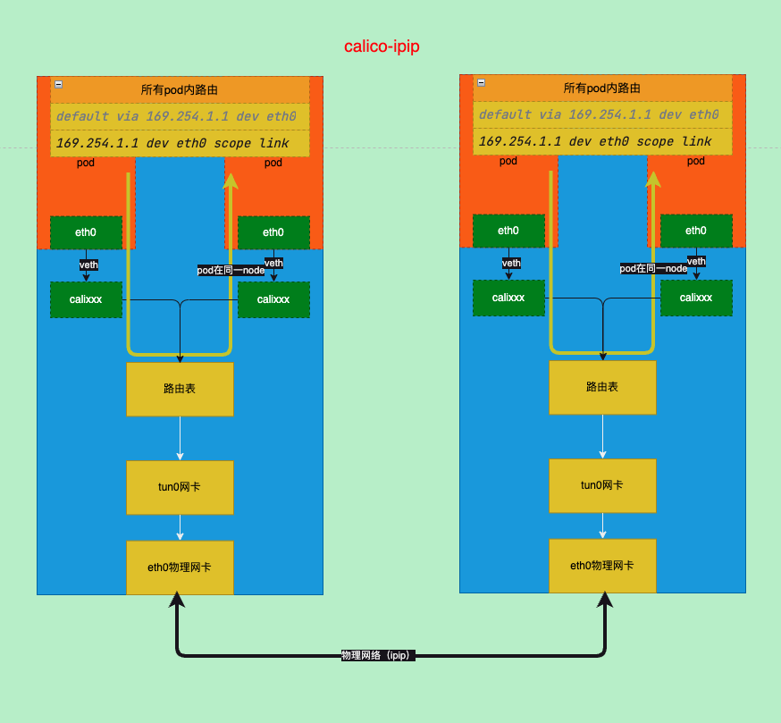
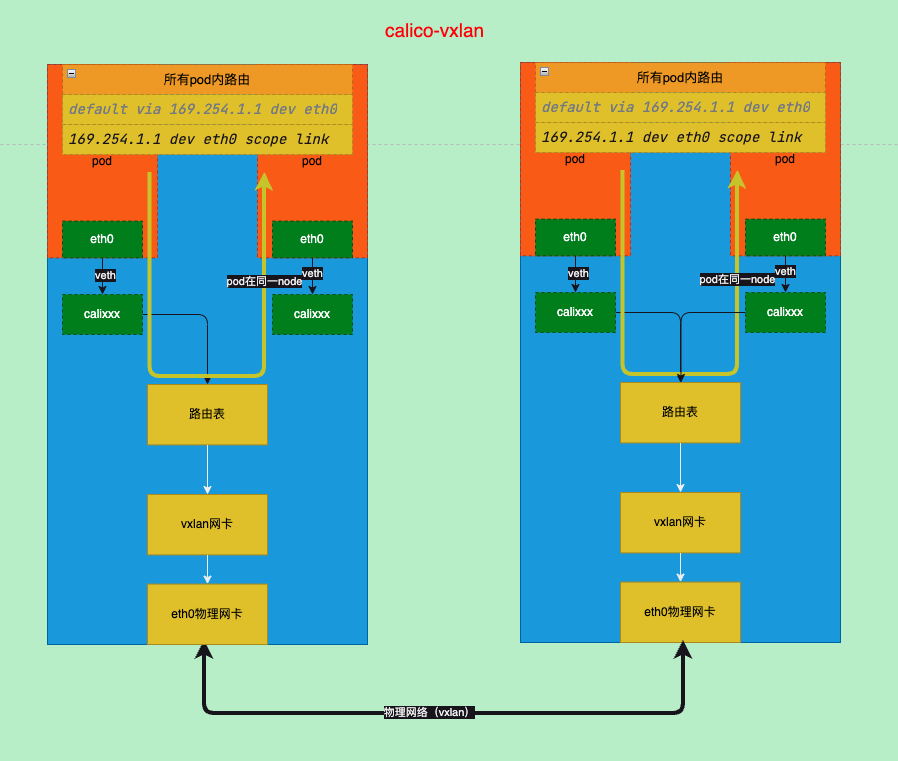
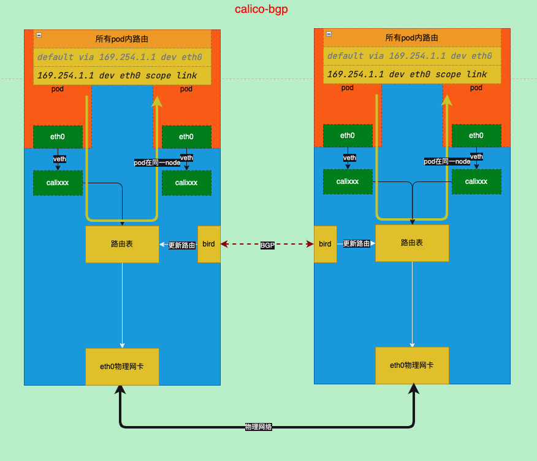
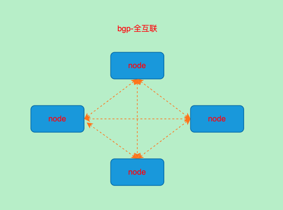
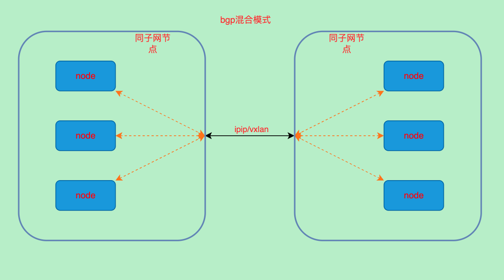
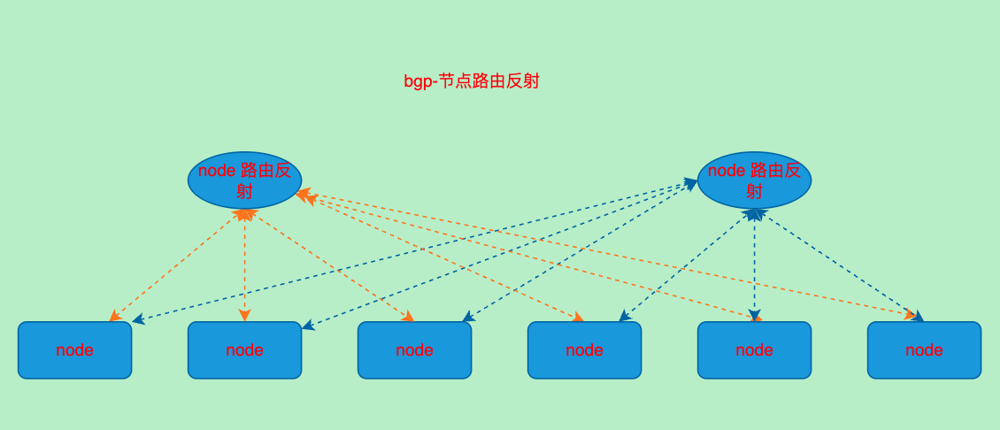
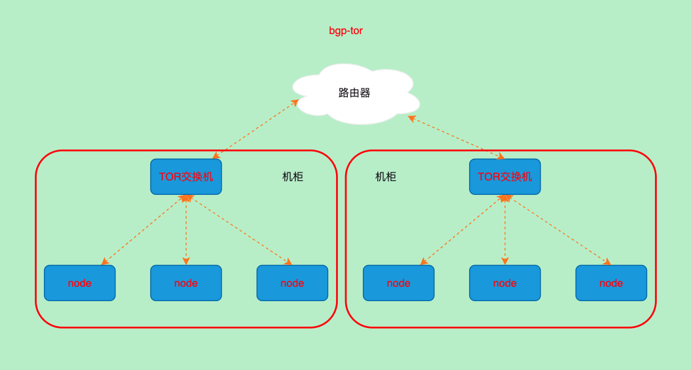

title: 在k8s中calico部署和使用
author: Nature丿灵然
tags:
  - k8s
  - cni
  - 网络
categories:
  - 运维
date: 2023-05-10 16:41:00
---
[calico](https://github.com/projectcalico/calico)是k8s中常见的网络插件,非常灵活,支持ipip,vxlan隧道bgp路由以及ebpf,虚机k8s均可使用

<!--more-->

#### 架构


|组件              |作用       |
|-----------------|----------|
|felix            |状态报告，路由规划，接口管理，acl|
|bird             |负责路由宣告，以及路由反射|
|confd            |监控bgp变更，配置和更新bird的配置|
|储存插件          |存储配置,有etcd和k8s两种选择|
|CNI插件           |为pod配置网络|
|typha            |为confd和felix和后端存储之间提供缓存等增加性能服务|
|calicoctl        |命令行工具|
|dikastes         |配合istio|

##### 术语

###### ippool

- ip池子,默认calico将会从池子中分配给podip

###### ipamblocks

- 从ippool里分割出来的ip段，为了减少路由数量，calico宣告路由时是以块为单位在pod所在的节点进行宣告的

#### 部署calico cni

```shell
curl https://raw.githubusercontent.com/projectcalico/calico/v3.25.1/manifests/calico.yaml -O

kubectl apply -f calico.yaml
```

#### 安装calicoctl

- calicoctl使用calic的命令行客户端攻击可以用来查看一些信息，有三种安装方法选一种即可

##### 用容器的方式运行calicoctl

```shell
curl https://raw.githubusercontent.com/projectcalico/calico/v3.25.1/manifests/calicoctl.yaml -o calicoctl.yaml

kubectl apply -f calicoctl.yaml

echo alias calicoctl="kubectl exec -i -n kube-system calicoctl -- /calicoctl"
```

使用方法:`calicoctl version`

##### 二进制文件

```shell
curl -L https://github.com/projectcalico/calico/releases/latest/download/calicoctl-linux-amd64 -o calicoctl

chmod +x calicoctl
mv calicoctl /usr/local/bin/
```

使用方法:`calicoctl version`

##### kubectl插件

```shell
curl -L https://github.com/projectcalico/calico/releases/latest/download/calicoctl-linux-amd64 -o kubectl-calico
chmod +x kubectl-calico
mv kubectl-calico /usr/local/bin/
```

使用方法: `kubectl calico version`

##### calicoctl常用命令

- 查看ipam分配情况

```shell
calicoctl ipam show
# +----------+---------------+-----------+------------+--------------+
# | GROUPING |     CIDR      | IPS TOTAL | IPS IN USE |   IPS FREE   |
# +----------+---------------+-----------+------------+--------------+
# | IP Pool  | 10.244.0.0/16 |     65536 | 10 (0%)    | 65526 (100%) |
# +----------+---------------+-----------+------------+--------------+
```

- 查看blocks分配情况

```shell
calicoctl ipam show --show-blocks
#+----------+-------------------+-----------+------------+--------------+
#| GROUPING |       CIDR        | IPS TOTAL | IPS IN USE |   IPS FREE   |
#+----------+-------------------+-----------+------------+--------------+
#| IP Pool  | 10.244.0.0/16     |     65536 | 10 (0%)    | 65526 (100%) |
#| Block    | 10.244.120.64/26  |        64 | 5 (8%)     | 59 (92%)     |
#| Block    | 10.244.205.192/26 |        64 | 5 (8%)     | 59 (92%)     |
#+----------+-------------------+-----------+------------+--------------+
```

- 查看ippool

```shell
calicoctl get ippool -o wide
# NAME                  CIDR            NAT    IPIPMODE   VXLANMODE   DISABLED   DISABLEBGPEXPORT   SELECTOR   
# default-ipv4-ippool   10.244.0.0/16   true   Always     Never       false      false              all() 
```

#### IPIP模式

calico的网络模式`默认`是IPIP模式

- 通过calicoctl查看ippool的`IPIPMODE`字段，如下

```shell
calicoctl get ippool -o wide
# NAME                  CIDR               NAT     IPIPMODE   VXLANMODE   DISABLED   DISABLEBGPEXPORT   SELECTOR
# default-ipv4-ippool   10.244.0.0/16      true    Always      Never       false      false              all()
```

- 启动ipipmode分为两种，一种是`Always`，还有一种`CrossSubnet`,
  - always，无论是否跨子网都通过ipip来通讯
  - CrossSubnet，只有在跨子网时使用ipip模式，子网内使用bgp
  - Never,关闭从不使用ipip模式

##### ipip路径分析

- 部署一个nginx

```shell
k get po -l app=nginx -o wide          
# NAME                     READY   STATUS    RESTARTS   AGE     IP               NODE           NOMINATED NODE   READINESS GATES
# nginx-7fc57c59f7-4nxhh   1/1     Running   0          6m30s   10.244.120.68    minikube       <none>           <none>
# nginx-7fc57c59f7-hf2g6   1/1     Running   0          6m43s   10.244.205.195   minikube-m02   <none>           <none>
# nginx-7fc57c59f7-rcdtw   1/1     Running   0          6m30s   10.244.205.196   minikube-m02   <none>           <none>
```

- 进入一个nginx的pod去ping另一个容器

```shell
kubectl exec -it nginx-7fc57c59f7-4nxhh -- ping 10.244.205.195
```

###### ipip-pod到pod所在的node

- 查看容器的网卡和路由信息

```shell
kubectl exec -it nginx-7fc57c59f7-4nxhh -- sh -c "ip addr;ip r"
# 1: lo: <LOOPBACK,UP,LOWER_UP> mtu 65536 qdisc noqueue state UNKNOWN qlen 1000
#     link/loopback 00:00:00:00:00:00 brd 00:00:00:00:00:00
#     inet 127.0.0.1/8 scope host lo
#        valid_lft forever preferred_lft forever
# 2: tunl0@NONE: <NOARP> mtu 1480 qdisc noop state DOWN qlen 1000
#     link/ipip 0.0.0.0 brd 0.0.0.0
# 3: ip6tnl0@NONE: <NOARP> mtu 1452 qdisc noop state DOWN qlen 1000
#     link/tunnel6 00:00:00:00:00:00:00:00:00:00:00:00:00:00:00:00 brd 00:00:00:00:00:00:00:00:00:00:00:00:00:00:00:00
# 5: eth0@if10: <BROADCAST,MULTICAST,UP,LOWER_UP,M-DOWN> mtu 65515 qdisc noqueue state UP 
#     link/ether fe:bb:51:af:03:a8 brd ff:ff:ff:ff:ff:ff
#     inet 10.244.120.68/32 scope global eth0
#        valid_lft forever preferred_lft forever

# default via 169.254.1.1 dev eth0 
# 169.254.1.1 dev eth0 scope link 
```

> 从上面的信息比较难以理解的是路由的网关是169.254.1.1，169.254.0.0/16为保留地址一般用于dhcp获取，而calico则将容器的默认路由设置为此,当容器发现目标地址不是本ip段时，会将流量发送给网关，这时需要知道网关的mac地址
> 这里calico将网关设置为169.254.1.1而没有任何一个网卡是169.254.1.1,其实是因为开了arp_proxy代答,具体使用了pod的veth的外面的网卡,这样流量就通过二层到达主机
> 官方的[FAQ](https://docs.tigera.io/calico/latest/reference/faq#why-cant-i-see-the-16925411-address-mentioned-above-on-my-host)

```shell
tcpdump -i cali1143a22bb0c host 10.244.120.68 -ennnvv
# ...
# 09:21:15.764922 fe:bb:51:af:03:a8 > ee:ee:ee:ee:ee:ee, ethertype ARP (0x0806), length 42: Ethernet (len 6), IPv4 (len 4), Request who-has 169.254.1.1 tell 10.244.120.68, length 28
# 09:21:15.764944 ee:ee:ee:ee:ee:ee > fe:bb:51:af:03:a8, ethertype ARP (0x0806), length 42: Ethernet (len 6), IPv4 (len 4), Reply 169.254.1.1 is-at ee:ee:ee:ee:ee:ee, length 28
# ...

cat /proc/sys/net/ipv4/conf/cali1143a22bb0c/proxy_arp
# 1
```

- veth抓包

```shell
 tcpdump -i cali1143a22bb0c  host 10.244.120.68 -ennnvv
# tcpdump: listening on cali1143a22bb0c, link-type EN10MB (Ethernet), capture size 262144 bytes
# 09:39:53.417261 fe:bb:51:af:03:a8 > ee:ee:ee:ee:ee:ee, ethertype IPv4 (0x0800), length 98: (tos 0x0, ttl 64, id 37455, offset 0, flags [DF], proto ICMP (1), length 84)
#     10.244.120.68 > 10.244.205.195: ICMP echo request, id 15617, seq 12, length 64
# 09:39:53.417585 ee:ee:ee:ee:ee:ee > fe:bb:51:af:03:a8, ethertype IPv4 (0x0800), length 98: (tos 0x0, ttl 62, id 24660, offset 0, flags [none], proto ICMP (1), length 84)
#     10.244.205.195 > 10.244.120.68: ICMP echo reply, id 15617, seq 12, length 64
# 09:39:54.417872 fe:bb:51:af:03:a8 > ee:ee:ee:ee:ee:ee, ethertype IPv4 (0x0800), length 98: (tos 0x0, ttl 64, id 38148, offset 0, flags [DF], proto ICMP (1), length 84)
#     10.244.120.68 > 10.244.205.195: ICMP echo request, id 15617, seq 13, length 64
# 09:39:54.418089 ee:ee:ee:ee:ee:ee > fe:bb:51:af:03:a8, ethertype IPv4 (0x0800), length 98: (tos 0x0, ttl 62, id 24786, offset 0, flags [none], proto ICMP (1), length 84)
#     10.244.205.195 > 10.244.120.68: ICMP echo reply, id 15617, seq 13, length 64
# ...
```

###### ipip-pod所在的node到目标所在的node的pod

- 查看minikube上的路由

```shell
ip r
# default via 192.168.49.1 dev eth0 
# blackhole 10.244.120.64/26 proto bird 
# 10.244.120.65 dev califc4f8273134 scope link 
# 10.244.120.66 dev cali54e305c20b5 scope link 
# 10.244.120.67 dev cali00c313c8253 scope link 
# 10.244.120.68 dev cali1143a22bb0c scope link  # 这个就是我们进行ping的pod的路由
# 10.244.205.192/26 via 192.168.49.3 dev tunl0 proto bird onlink  # 这个是minikube-m02这个节点上的路由，如果要访问minikube-m02上的pod则经过本路由
# 172.17.0.0/16 dev docker0 proto kernel scope link src 172.17.0.1 linkdown 
# 192.168.49.0/24 dev eth0 proto kernel scope link src 192.168.49.2 
```

- 隧道抓包

```shell
tcpdump -i tunl0 host 10.244.120.68 -ennnvv
# tcpdump: listening on tunl0, link-type RAW (Raw IP), capture size 262144 bytes
# 09:40:55.459832 ip: (tos 0x0, ttl 63, id 114, offset 0, flags [DF], proto ICMP (1), length 84) 10.244.120.68 > 10.244.205.195: ICMP echo request, id 15617, seq 74, length 64
# 09:40:55.460009 ip: (tos 0x0, ttl 63, id 58352, offset 0, flags [none], proto ICMP (1), length 84) 10.244.205.195 > 10.244.120.68: ICMP echo reply, id 15617, seq 74, length 64
# 09:40:56.460530 ip: (tos 0x0, ttl 63, id 495, offset 0, flags [DF], proto ICMP (1), length 84) 10.244.120.68 > 10.244.205.195: ICMP echo request, id 15617, seq 75, length 64
# 09:40:56.460780 ip: (tos 0x0, ttl 63, id 59235, offset 0, flags [none], proto ICMP (1), length 84) 10.244.205.195 > 10.244.120.68: ICMP echo reply, id 15617, seq 75, length 64
# 09:40:57.461367 ip: (tos 0x0, ttl 63, id 979, offset 0, flags [DF], proto ICMP (1), length 84) 10.244.120.68 > 10.244.205.195: ICMP echo request, id 15617, seq 76, length 64
# 09:40:57.461510 ip: (tos 0x0, ttl 63, id 59858, offset 0, flags [none], proto ICMP (1), length 84) 10.244.205.195 > 10.244.120.68: ICMP echo reply, id 15617, seq 76, length 64
```

- 到此pod的流量通过ipip封装发送到目标pod所在的node上,目标node将ipip包解封包，然后查找路由表发送到目标pod的veth网卡中

- 登录另一个node

```shell
minikube ssh --node="minikube-m02"
# Last login: Tue May 16 10:37:54 2023 from 192.168.49.1
# docker@minikube-m02:~$ 
sudo su
```

- 通过ip找到对应的网卡

```shell
ip r |grep 10.244.205.195
# 10.244.205.195 dev cali614e1c7b24e scope link 
```

- 抓包对应的网卡

```shell
tcpdump -i cali614e1c7b24e 
# tcpdump: verbose output suppressed, use -v or -vv for full protocol decode
# listening on cali614e1c7b24e, link-type EN10MB (Ethernet), capture size 262144 bytes
# 10:50:48.678597 IP 10.244.120.68 > 10.244.205.195: ICMP echo request, id 21761, seq 88, length 64
# 10:50:48.678615 IP 10.244.205.195 > 10.244.120.68: ICMP echo reply, id 21761, seq 88, length 64
# 10:50:49.678987 IP 10.244.120.68 > 10.244.205.195: ICMP echo request, id 21761, seq 89, length 64
# 10:50:49.679010 IP 10.244.205.195 > 10.244.120.68: ICMP echo reply, id 21761, seq 89, length 64
# 10:50:50.680533 IP 10.244.120.68 > 10.244.205.195: ICMP echo request, id 21761, seq 90, length 64
# 10:50:50.680595 IP 10.244.205.195 > 10.244.120.68: ICMP echo reply, id 21761, seq 90, length 64
```

- 抓包ipip隧道网卡

```shell
tcpdump -i tunl0 
# tcpdump: verbose output suppressed, use -v or -vv for full protocol decode
# listening on tunl0, link-type RAW (Raw IP), capture size 262144 bytes
# 10:51:06.694392 IP 10.244.120.68 > 10.244.205.195: ICMP echo request, id 21761, seq 106, length 64
# 10:51:06.694504 IP 10.244.205.195 > 10.244.120.68: ICMP echo reply, id 21761, seq 106, length 64
# 10:51:07.695538 IP 10.244.120.68 > 10.244.205.195: ICMP echo request, id 21761, seq 107, length 64
# ...
```

- 通过以上抓包可以确定流量的路径

###### 2个pod在同一个node上

- 当目标pod和源pod在同一个node上执行通过node上的路由到对应的veth网卡,不经过隧道

- 这次ping一个在相同node上的pod的ip

```shell
kubectl get po whoami-7c88bd4c6f-7tc5b -o wide                   
# NAME                      READY   STATUS    RESTARTS   AGE     IP              NODE       NOMINATED NODE   READINESS GATES
# whoami-7c88bd4c6f-7tc5b   1/1     Running   0          3h18m   10.244.120.67   minikube   <none>           <none>

kubectl exec -it nginx-7fc57c59f7-4nxhh -- ping 10.244.120.67
# PING 10.244.120.67 (10.244.120.67): 56 data bytes
# PING 10.244.120.67 (10.244.120.67): 56 data bytes
# 64 bytes from 10.244.120.67: seq=0 ttl=63 time=1.777 ms
# 64 bytes from 10.244.120.67: seq=1 ttl=63 time=0.542 ms
# 64 bytes from 10.244.120.67: seq=2 ttl=63 time=0.132 ms
# ...
```

- 直接抓包隧道发现没有流量

```shell
minikube ssh 
# Last login: Tue May 16 10:41:40 2023 from 192.168.49.1
sudo su
tcpdump -i tunl0
# tcpdump: verbose output suppressed, use -v or -vv for full protocol decode
# listening on tunl0, link-type RAW (Raw IP), capture size 262144 bytes
```

- 通过路由表找到对应的网卡

```shell
ip r |grep 10.244.120.67
10.244.120.67 dev cali00c313c8253 scope link 
```

- 抓包目标的网卡

```shell
tcpdump -i cali00c313c8253
# tcpdump: verbose output suppressed, use -v or -vv for full protocol decode
# listening on cali00c313c8253, link-type EN10MB (Ethernet), capture size 262144 bytes
# 10:47:39.884507 IP 10.244.120.68 > 10.244.120.67: ICMP echo request, id 19969, seq 141, length 64
# 10:47:39.884649 IP 10.244.120.67 > 10.244.120.68: ICMP echo reply, id 19969, seq 141, length 64
# 10:47:40.885829 IP 10.244.120.68 > 10.244.120.67: ICMP echo request, id 19969, seq 142, length 64
# ...
```

- 通过以上抓包可以发现并没有经过隧道，而是直接路由到了目标的网卡

###### 小结



#### VXLAN模式

##### 开启vxlan模式

- 修改ippool中`VXLANMODE`字段为`Always`,`IPIPMODE`改为`Never`,其中`VXLANMODE`中的也有`CrossSubnet`只在跨子网时使用

- 修改calico-node的环境变量

```shell
# 修改环境变量
kubectl -n kube-system set env ds/calico-node -c calico-node CALICO_IPV4POOL_IPIP=Never
kubectl -n kube-system set env ds/calico-node -c calico-node CALICO_IPV4POOL_VXLAN=Always
```

- 关闭关闭bird

```shell
# 将calico_backend修改为vxlan
# calico_backend: vxlan
kubectl edit cm -nkube-system calico-config
```

- 关闭bird的健康检查

```shell
kubectl -n kube-system edit ds calico-node
```

```yaml
livenessProbe:
  exec:
    command:
    - /bin/calico-node
    - -felix-live
   # - -bird-live
readinessProbe:
  exec:
    command:
    - /bin/calico-node
    # - -bird-ready
    - -felix-ready
```

##### vxlan路径分析

- 依然使用之前的nginx来做测试

- 节点路由

```shell
ip r
# default via 192.168.49.1 dev eth0 
# 10.244.0.192/26 via 10.244.0.192 dev vxlan.calico onlink 
# blackhole 10.244.120.64/26 proto 80 
# 10.244.120.65 dev califc4f8273134 scope link 
# 10.244.120.66 dev cali54e305c20b5 scope link 
# 10.244.120.68 dev cali1143a22bb0c scope link 
# 10.244.205.192/26 via 10.244.0.192 dev vxlan.calico onlink  之前是ipip的tunl0网卡变更为vxlan的网卡
# 172.17.0.0/16 dev docker0 proto kernel scope link src 172.17.0.1 linkdown 
# 192.168.49.0/24 dev eth0 proto kernel scope link src 192.168.49.2 
```

- 查看vxlan.calico网卡信息

```shell
ip -s  addr show vxlan.calico
#863: vxlan.calico: <BROADCAST,MULTICAST,UP,LOWER_UP> mtu 65485 qdisc noqueue state UNKNOWN group default 
#    link/ether 66:66:b0:7b:5c:e1 brd ff:ff:ff:ff:ff:ff
#    inet 10.244.120.70/32 scope global vxlan.calico
#       valid_lft forever preferred_lft forever
#    RX: bytes  packets  errors  dropped overrun mcast   
#    23094      267      0       0       0       0       
#    TX: bytes  packets  errors  dropped carrier collsns 
#    22374      268      0       0       0       0       
```

- 搜下这个ip发现他作用为vxlan的网卡ip

```shell
calicoctl ipam show --ip=10.244.120.70
#IP 10.244.120.70 is in use
#Attributes:
#  node: minikube
#  type: vxlanTunnelAddress
```

###### vxlan-pod到node

- 从上面的网卡和路由信息可以看到calico只是修改了到其他节点pod的通讯方式，从ipip隧道改为vlxan隧道然后修改路由
- 所以后pod到node的方式其实没有变化和[ipip](#ipip-pod到pod所在的node)模式是一样的

###### vxlan-pod到另一个node的pod

- 依然开始长ping

- 抓包vxlan网卡

```shell
tcpdump -i vxlan.calico -eenn
# tcpdump: verbose output suppressed, use -v or -vv for full protocol decode
# listening on vxlan.calico, link-type EN10MB (Ethernet), capture size 262144 bytes
# 09:22:33.108257 66:66:b0:7b:5c:e1 > 66:9f:82:63:75:c1, ethertype IPv4 (0x0800), length 98: 10.244.120.68 > 10.244.205.196: ICMP echo request, id 30721, seq 33, length 64
# 09:22:33.108388 66:9f:82:63:75:c1 > 66:66:b0:7b:5c:e1, ethertype IPv4 (0x0800), length 98: 10.244.205.196 > 10.244.120.68: ICMP echo reply, id 30721, seq 33, length 64
# 09:22:34.109579 66:66:b0:7b:5c:e1 > 66:9f:82:63:75:c1, ethertype IPv4 (0x0800), length 98: 10.244.120.68 > 10.244.205.196: ICMP echo request, id 30721, seq 34, length 64
# ...
```

- 可以看到到vxlan网卡有我们长ping的数据包，可以确定不同node上的pod是通过vxlan来通讯
- `66:66:b0:7b:5c:e1`为源头pod所在node的vxlan网卡mac
- `66:9f:82:63:75:c1`为目标pod所在node的vxlan网卡mac

##### vxlan-小结

- vxlan模式下知识变换了从一个node到另一个node的方式，从之前的ipip变为vxlan
- pod到node没有变化



#### BGP模式

> BGP是一个使用广泛的路由协议，分为2种一种是不同as号的ebgp已经同as号的ibgp，这里使用的是ibgp

##### 开启BGP模式(full mesh)

> 开启bgp模式基本思路就是将`ipip`和`vxlan`模式都给关闭了,跨子网需要改为``

- 修改ippool中`VXLANMODE`字段为`Never`,`IPIPMODE`改为`Never`

- 修改calico-node的环境变量

```shell
# 修改环境变量
kubectl -n kube-system set env ds/calico-node -c calico-node CALICO_IPV4POOL_IPIP=Never
kubectl -n kube-system set env ds/calico-node -c calico-node CALICO_IPV4POOL_VXLAN=Never
```

- 如果关闭bird需要开启bird

```shell
# 将calico_backend修改为bird
# calico_backend: bird
kubectl edit cm -nkube-system calico-config
```

- 如果关闭了bird的健康检查则需要开启bird的健康检查

```shell
kubectl -n kube-system edit ds calico-node
```

```yaml
livenessProbe:
  exec:
    command:
    - /bin/calico-node
    - -felix-live
    - -bird-live # 打开
readinessProbe:
  exec:
    command:
    - /bin/calico-node
    - -felix-ready
    - -bird-ready # 打开
```

##### BGP模式路径分析

- 查看路由,可以发现跨节点通讯使用路由

```shell
ip r 
# default via 192.168.49.1 dev eth0 
# 10.244.0.192/26 via 192.168.49.3 dev eth0 proto bird 
# blackhole 10.244.120.64/26 proto bird 
# 10.244.120.65 dev califc4f8273134 scope link 
# 10.244.120.66 dev cali54e305c20b5 scope link 
# 10.244.120.68 dev cali1143a22bb0c scope link 
# 10.244.205.192/26 via 192.168.49.3 dev eth0 proto bird # 这里已经变成了bird了
# 172.17.0.0/16 dev docker0 proto kernel scope link src 172.17.0.1 linkdown 
# 192.168.49.0/24 dev eth0 proto kernel scope link src 192.168.49.2 
```

- 查看网卡,可以发现没有vxlan的网卡

```shell
ip addr
# 1: lo: <LOOPBACK,UP,LOWER_UP> mtu 65536 qdisc noqueue state UNKNOWN group default qlen 1000
#     link/loopback 00:00:00:00:00:00 brd 00:00:00:00:00:00
#     inet 127.0.0.1/8 scope host lo
#        valid_lft forever preferred_lft forever
# 2: tunl0@NONE: <NOARP,UP,LOWER_UP> mtu 65515 qdisc noqueue state UNKNOWN group default qlen 1000
#     link/ipip 0.0.0.0 brd 0.0.0.0
# 3: ip6tnl0@NONE: <NOARP> mtu 1452 qdisc noop state DOWN group default qlen 1000
#     link/tunnel6 :: brd ::
# 4: docker0: <NO-CARRIER,BROADCAST,MULTICAST,UP> mtu 1500 qdisc noqueue state DOWN group default 
#     link/ether 02:42:7a:58:36:29 brd ff:ff:ff:ff:ff:ff
#     inet 172.17.0.1/16 brd 172.17.255.255 scope global docker0
#        valid_lft forever preferred_lft forever
# 5: califc4f8273134@if5: <BROADCAST,MULTICAST,UP,LOWER_UP> mtu 1500 qdisc noqueue state UP group default 
#     link/ether ee:ee:ee:ee:ee:ee brd ff:ff:ff:ff:ff:ff link-netnsid 1
# 6: cali54e305c20b5@if5: <BROADCAST,MULTICAST,UP,LOWER_UP> mtu 1500 qdisc noqueue state UP group default 
#     link/ether ee:ee:ee:ee:ee:ee brd ff:ff:ff:ff:ff:ff link-netnsid 2
# 10: cali1143a22bb0c@if5: <BROADCAST,MULTICAST,UP,LOWER_UP> mtu 65515 qdisc noqueue state UP group default 
#     link/ether ee:ee:ee:ee:ee:ee brd ff:ff:ff:ff:ff:ff link-netnsid 4
# 16: eth0@if17: <BROADCAST,MULTICAST,UP,LOWER_UP> mtu 65535 qdisc noqueue state UP group default 
#     link/ether 02:42:c0:a8:31:02 brd ff:ff:ff:ff:ff:ff link-netnsid 0
#     inet 192.168.49.2/24 brd 192.168.49.255 scope global eth0
#        valid_lft forever preferred_lft forever
```

- 通过birdcl查看路由表

```shell
kubectl -n kube-system exec -it calico-node-9pwnj -c calico-node -- /bin/bash

birdcl
show route

# bird> show route
# 0.0.0.0/0          via 192.168.49.1 on eth0 [kernel1 07:27:41] * (10)
# 10.244.205.192/26  via 192.168.49.3 on eth0 [Mesh_192_168_49_3 07:27:41] * (100/0) [i]
# 192.168.49.0/24    dev eth0 [direct1 07:27:40] * (240)
# 10.244.120.64/26   blackhole [static1 07:27:40] * (200)
# 10.244.120.65/32   dev califc4f8273134 [kernel1 07:27:41] * (10)
# 10.244.120.66/32   dev cali54e305c20b5 [kernel1 07:27:41] * (10)
# 10.244.120.68/32   dev cali1143a22bb0c [kernel1 07:27:41] * (10)
# 10.244.0.192/26    via 192.168.49.3 on eth0 [Mesh_192_168_49_3 07:27:41] * (100/0) [i]
# 172.17.0.0/16      dev docker0 [direct1 07:27:40] * (240)
# bird> 
```

- 通过birdcl查bgp邻居状态

```shell
birdcl show protocols
# root@minikube /]# birdcl  show protocols
# BIRD v0.3.3+birdv1.6.8 ready.
# name     proto    table    state  since       info
# static1  Static   master   up     07:27:40    
# kernel1  Kernel   master   up     07:27:40    
# device1  Device   master   up     07:27:40    
# direct1  Direct   master   up     07:27:40    
# Mesh_192_168_49_3 BGP      master   up     07:27:53    Established  bgp邻居状态
```

- 查看bgp详细信息

```shell
birdcl show protocols all Mesh_192_168_49_2
# root@minikube-m02 /]# birdcl show protocols all Mesh_192_168_49_2
# BIRD v0.3.3+birdv1.6.8 ready.
# name     proto    table    state  since       info
# Mesh_192_168_49_2 BGP      master   up     07:27:53    Established   
#   Description:    Connection to BGP peer
#   Preference:     100
#   Input filter:   ACCEPT
#   Output filter:  calico_export_to_bgp_peers
#   Routes:         1 imported, 2 exported, 1 preferred
#   Route change stats:     received   rejected   filtered    ignored   accepted
#     Import updates:              4          0          0          0          4
#     Import withdraws:            3          0        ---          0          3
#     Export updates:             17          4          8        ---          5
#     Export withdraws:            8        ---        ---        ---          3
#   BGP state:          Established
#     Neighbor address: 192.168.49.2
#     Neighbor AS:      64512
#     Neighbor ID:      192.168.49.2
#     Neighbor caps:    refresh enhanced-refresh restart-able llgr-aware AS4 add-path-rx add-path-tx
#     Session:          internal multihop AS4 add-path-rx add-path-tx
#     Source address:   192.168.49.3
#     Hold timer:       157/240
#     Keepalive timer:  67/80
```

- 总体而言比较简单，直接通过路由到目标pod对应的节点

##### bgp小结

- 每个节点之间通过bgp宣告路由





##### bgp混合模式

> bgp peer只能在一个子网中使用,但是在k8s中为了灾备冗余不能一个集群所有节点都在同一个子网中，所以在node节点不在同一个子网时候bgp需要其他node知道路由



- 当跨子网时使用`ipip/vxlan`来进行通讯
- 将ippool中的`IPIPMODE`或`VXLANMODE`修改为`CrossSubnet`即可
- 这与既可以享受bgp的性能又能解决bgp的局限性

##### bgp-rr模式(Route reflectors)



- 从节点中选取一部分节点作为bgp路由反射器以减少bgp对等体数量

###### 路由反射部署方案

> 测试环境为4个节点的minikube集群

- 部署路由反射器有很多方法:
  - 1. 在集群外的机器中部署bird
  - 2. 在k8s中选择专门的节点
  - 3. 部署专门的calico-node容器作为反射器

- 很显然直接在集群中部署专门的节点作为反射器比较方便且容易管理

- 选择2个节点作为反射器，这里我选择后2个

###### 确认现在的为bgp的mesh模式


需要注意`calicoctl node status`这个需要再部署calico的节点上执行。。。。有点唐突


- 查看当前bgp邻居,可以发现已经与另外三个节点建立了邻居关系

```shell
calicoctl node status
# root@minikube:~# calicoctl node status
# Calico process is running.
# 
# IPv4 BGP status
# +--------------+-------------------+-------+----------+-------------+
# | PEER ADDRESS |     PEER TYPE     | STATE |  SINCE   |    INFO     |
# +--------------+-------------------+-------+----------+-------------+
# | 192.168.49.3 | node-to-node mesh | up    | 18:13:08 | Established |
# | 192.168.49.4 | node-to-node mesh | up    | 19:37:12 | Established |
# | 192.168.49.5 | node-to-node mesh | up    | 02:27:27 | Established |
# +--------------+-------------------+-------+----------+-------------+
```

```shell
calicoctl get nodes -o wide 
# NAME           ASN       IPV4              IPV6   
# minikube       (64512)   192.168.49.2/24          
# minikube-m02   (64512)   192.168.49.3/24          
# minikube-m03   (64512)   192.168.49.4/24   # 作为反射器       
# minikube-m04   (64512)   192.168.49.5/24   # 作为反射器
```

###### 指定节点作为反射器

- 导出`calico/node`资源

```shell
calicoctl get nodes minikube-m03 -o yaml > minikube-m03.yaml
calicoctl get nodes minikube-m04 -o yaml > minikube-m04.yaml
```

- 在导出的文件中添加下面的字段

```yaml
# ...
  bgp:
    ipv4Address: 192.168.49.4/24
    routeReflectorClusterID: 1.0.0.1
# ...
```

- 应用修改

```shell
calicoctl replace -f minikube-m03.yaml
# Successfully replaced 1 'Node' resource(s)
calicoctl replace -f minikube-m04.yaml
# Successfully replaced 1 'Node' resource(s)
```

- 在指定的节点打上标签

```shell
kubectl label node minikube-m04 minikube-m03 route-reflector=true
```

###### 配置bgp对等体

```yaml
kind: BGPPeer
apiVersion: crd.projectcalico.org/v1
metadata:
  name: node-rr
spec:
  nodeSelector: all()
  peerSelector: route-reflector == 'true'
```

- 修改bgp配置，关闭mesh模式

```yaml
apiVersion: projectcalico.org/v3
kind: BGPConfiguration
metadata:
  name: default
spec:
  logSeverityScreen: Info
  nodeToNodeMeshEnabled: false
  asNumber: 63400
```

###### 查看节点bgp状态

```shell
# rr模式的节点上
root@minikube-m03:~# calicoctl node status
Calico process is running.

IPv4 BGP status
+--------------+---------------+-------+----------+-------------+
| PEER ADDRESS |   PEER TYPE   | STATE |  SINCE   |    INFO     |
+--------------+---------------+-------+----------+-------------+
| 192.168.49.2 | node specific | up    | 03:17:41 | Established |
| 192.168.49.3 | node specific | up    | 03:17:41 | Established |
| 192.168.49.5 | node specific | up    | 03:17:41 | Established |
+--------------+---------------+-------+----------+-------------+
# 普通节点
root@minikube:~# calicoctl node status 
Calico process is running.

IPv4 BGP status
+--------------+---------------+-------+----------+-------------+
| PEER ADDRESS |   PEER TYPE   | STATE |  SINCE   |    INFO     |
+--------------+---------------+-------+----------+-------------+
| 192.168.49.4 | node specific | up    | 03:17:41 | Established |
| 192.168.49.5 | node specific | up    | 03:17:43 | Established |
+--------------+---------------+-------+----------+-------------+
```

##### TOR路由

`Top of Rack`机架上面的交换机



- 这个方案中所有的节点将bgp信息宣告给tor交换机由交换机负责bgp宣告
- 需要硬件交换机和路由器中整体部署bgp网络，然后宣告给这个网络

#### EBPF

> epbf是一个内核虚拟机

##### EBPF部署

###### 环境验证

```shell
uname -rv
# docker@minikube:~$ uname -rv
# 5.15.49-linuxkit #1 SMP PREEMPT Tue Sep 13 07:51:32 UTC 2022
```

- ebpf对内核版本要求比较高，内核版本最高5.0往上，红帽4.8往上也行

###### 修改api-server地址

- calico默认使用的是kube-proxy提供的api-server的svc地址需要改为api-server负载均衡的地址
- 可以通过`kubelet`的配置文件来查看，
- 创建配置文件

```yaml
kind: ConfigMap
apiVersion: v1
metadata:
  name: kubernetes-services-endpoint
  namespace: kube-system
data:
  KUBERNETES_SERVICE_HOST: "192.168.49.2" # <API server host>
  KUBERNETES_SERVICE_PORT: "8443"         # <API server port>
```

- 重启calico组件

```shell
kubectl -n kube-system rollout restart deployment calico-kube-controllers
kubectl -n kube-system rollout restart ds calico-node
```

###### 开启ebpf

- 配置kube-proxy

```shell
kubectl patch ds -n kube-system kube-proxy -p '{"spec":{"template":{"spec":{"nodeSelector":{"non-calico": "true"}}}}}'
```

- 开启ebpf

```shell
calicoctl patch felixconfiguration default --patch='{"spec": {"bpfEnabled": true}}'
# Successfully patched 1 'FelixConfiguration' resource
```

###### 开启dsr

> dsr可以保留客户端ip

- 主要是修改`BPFExternalServiceMode`这个变量

- 开启dsr

```shell
calicoctl patch felixconfiguration default --patch='{"spec": {"bpfExternalServiceMode": "DSR"}}'
```

- 回滚

```shell
calicoctl patch felixconfiguration default --patch='{"spec": {"bpfExternalServiceMode": "Tunnel"}}'
```

#### IP地址管理

##### 静态ip

- 一般来说pod不需要pod的ip是静态的，而是已通过service来访问，但是在安全等领域可能需要pod的ip是静态或者一小段范围

- 使用ipam里面的ip

```yaml
annotations:
  'cni.projectcalico.org/ipAddrs': '["192.168.0.1"]'
```

###### 不使用ipam里面的ip

> 此功能需要cni开启特性才行

```shell
kubectl -n kube-system edit cm calico-config
```

```json
{
  "name": "any_name",
  "cniVersion": "0.1.0",
  "type": "calico",
  "ipam": {
    "type": "calico-ipam"
  },
  "feature_control": {
    "ip_addrs_no_ipam": true
  }
}
```

- 然后重启calico的agent

```shell
kubectl -n kube-system rollout restart ds calico-node
```

- 在pod上添加下面的注释

```yaml
annotations:
  'cni.projectcalico.org/ipAddrsNoIpam': '["10.0.0.1"]'
```

- 此时pod的ip则会设置为`10.0.0.1`,但是这个ip只能在你在pod所在的node上ping通过，路由等需要自己手动处理

##### Floating IP(浮动ip)

> Floating IP（浮动IP）是一种IP地址分配技术，它能够将一个IP地址从一台主机转移到另一台主机。 浮动IP通常用于云计算环境中，因为在这种环境下，虚拟资源（如虚拟机）可能随时在不同的物理主机之间移动。


只能在BGP模式下使用


- 也需要打开特性和上面noipam的类似方法不做赘述

```json
{
  "name": "any_name",
  "cniVersion": "0.1.0",
  "type": "calico",
  "ipam": {
    "type": "calico-ipam"
  },
  "feature_control": {
    "floating_ips": true
  }
}
```

```yaml
annotations:
  'cni.projectcalico.org/floatingIPs': '["10.0.0.1"]'
```

##### IP预留

- 顾名思义保留的ip不会分配给pod

```yaml
apiVersion: projectcalico.org/v3
kind: IPReservation
metadata:
  name: my-ipreservation-1
spec:
  reservedCIDRs:
    - 192.168.2.3
    - 10.0.2.3/32
    - cafe:f00d::/123
```

##### 优先级

pod的注释>pod所在的ns的注释>ippool

#### 带宽限制

- cni配置文件需要设置如下参数

```json
{
  "type": "bandwidth",
  "capabilities": { "bandwidth": true }
}
```

- 在pod上配置带宽

```yaml
apiVersion: v1
kind: Pod
metadata:
  annotations:
    kubernetes.io/ingress-bandwidth: 1M # 进入
    kubernetes.io/egress-bandwidth: 1M  # 出口
```

- 实际是调用了`bandwidth`这个cni插件

#### 指定MAC地址

```yaml
annotations:
  "cni.projectcalico.org/hwAddr": "1c:0c:0a:c0:ff:ee"
```

- 重启pod生效

#### 开启ipv6支持

> ipv6需要k8s同步开启双栈

##### 修改cni配置文件

```shell
kubectl -n kube-system edit cm calico-config
```

```json
    "ipam": {
        "type": "calico-ipam",
        "assign_ipv4": "true",
        "assign_ipv6": "true"
    },
```

##### 修改DS环境变量

|环境变量          |值        |
|-----------------|----------|
|IP6              |autodetect|
|FELIX_IPV6SUPPORT|true      |

```shell
# 修改环境变量
kubectl -n kube-system set env ds/calico-node -c calico-node IP6=autodetect
kubectl -n kube-system set env ds/calico-node -c calico-node FELIX_IPV6SUPPORT=true
```

#### 参考资料

<https://docs.tigera.io/calico/latest/about>
