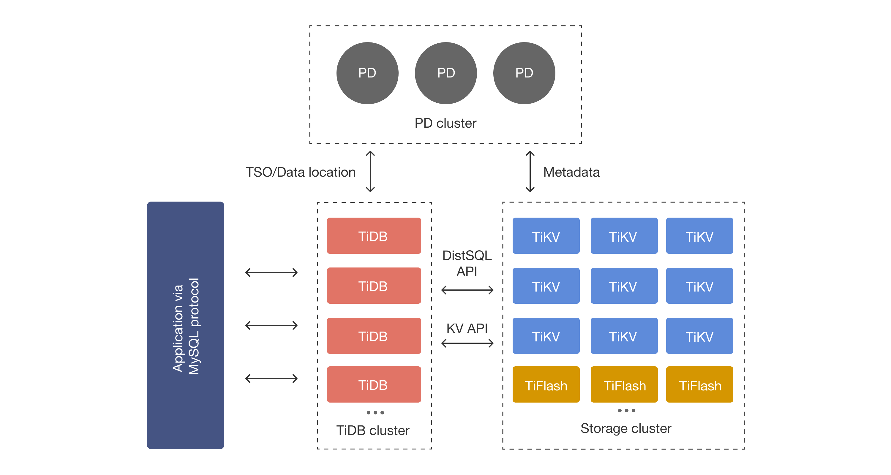

layout: draft
title: 在k8s集群中部署tikv
author: Nature丿灵然
tags:
  - k8s
  - tikv
  - 数据库
date: 2023-11-10 01:43:00
---
[tidb](https://github.com/pingcap/tidb)是[pingcap](https://www.pingcap.com/)开发的开源数据库

<!--more-->

其底层使用rust上层使用go开发，兼容mysql协议



#### 部署

- 部署crd

```shell
kubectl create -f https://raw.githubusercontent.com/pingcap/tidb-operator/master/manifests/crd.yaml
```

- 部署operator

```shell
helm repo add pingcap https://charts.pingcap.org/

kubectl create namespace tidb-admin

helm install --namespace tidb-admin tidb-operator pingcap/tidb-operator --version v1.5.1
```

- 部署一个官方示例的集群

```shell
kubectl create namespace tidb-cluster && \
    kubectl -n tidb-cluster apply -f https://raw.githubusercontent.com/pingcap/tidb-operator/master/examples/basic/tidb-cluster.yaml
```

- 查看集群

```shell
k get tc
# NAME    READY   PD                  STORAGE   READY   DESIRE   TIKV                  STORAGE   READY   DESIRE   TIDB                  READY   DESIRE   AGE
# basic   True    pingcap/pd:v7.1.1   1Gi       1       1        pingcap/tikv:v7.1.1   1Gi       1       1        pingcap/tidb:v7.1.1   1       1        45m
```

- 部署dashboard

```shell
kubectl -n tidb-cluster apply -f https://raw.githubusercontent.com/pingcap/tidb-operator/master/examples/basic/tidb-dashboard.yaml
```

- 部署监控

```shell
kubectl -n tidb-cluster apply -f https://raw.githubusercontent.com/pingcap/tidb-operator/master/examples/basic/tidb-monitor.yaml
```

#### 连接数据库

- 转发svc到本地，使用使用直接写对应的svc的地址和端口就好

```shell
kubectl port-forward -n tidb-cluster svc/basic-tidb 14000:4000 > pf14000.out &
```

- mysql连接

```shell
mysql --comments -h 127.0.0.1 -P 14000 -u root
# Welcome to the MariaDB monitor.  Commands end with ; or \g.
# Your MySQL connection id is 677
# Server version: 5.7.25-TiDB-v7.1.1 TiDB Server (Apache License 2.0) Community Edition, MySQL 5.7 compatible
# 
# Copyright (c) 2000, 2018, Oracle, MariaDB Corporation Ab and others.
# 
# Type 'help;' or '\h' for help. Type '\c' to clear the current input statement.
# 
# MySQL [(none)]>
```

- 创建一个表

```sql
use test;
create table hello_world (id int unsigned not null auto_increment primary key, v varchar(32));
```

- 查询版本号

```sql
select tidb_version()\G
```

- 查询存储状态

```sql
select * from information_schema.tikv_store_status\G
```

- 查询集群状态

```sql
select * from information_schema.cluster_info\G
```

- 查看监控的grafana，转发下grafana的svc然后打开浏览默认密码admin/admin,也可以将svc改成nodeport模式

```shell
# 转发
kubectl port-forward -n tidb-cluster svc/basic-grafana 3000 > pf12333.out &
```

- tidb的ui,默认没密码

```shell
kubectl port-forward -n tidb-cluster svc/basic-tidb-dashboard-exposed 12333 > pf12333.out &
```

#### 升级集群

```shell
kubectl patch tc basic -n tidb-cluster --type merge -p '{"spec": {"version": "<版本号>"} }'
```

#### 扩缩容

```shell
kubectl patch -n ${namespace} tc ${cluster_name} --type merge --patch '{"spec":{"pd":{"replicas":<副本数>}}}'
```

#### 参考资料

<https://docs.pingcap.com/zh/tidb-in-kubernetes/dev/get-started>
