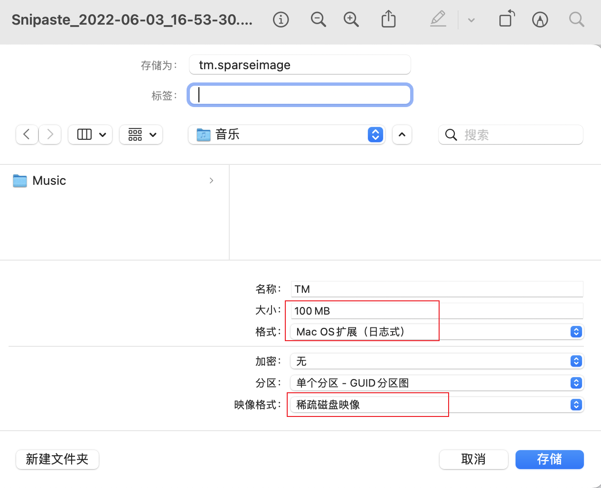

macos的时间机器备份很方便

<!--more-->

> 如果只是备份到优盘或者固态硬盘等设备上有的时候不够灵活，通过网络直接备份到smb文件服务器上

#### 创建smb共享文件夹

需要给读写权限

#### 创建磁盘映像文件

打开磁盘工具文件-->创建空白映像

这里注意`格式大小和容量`



将创建好的文件拷贝到共享文件夹里

#### 挂载时间机器

##### 1.双击共享文件夹里的创建的磁盘挂载

##### 2.命令行查看挂载路径

```shell
df -h
```

##### 3.设置时间机器备份磁盘

```shell
sudo tmutil setdestination <挂载路径>
```

##### 4.这个时候打开时间机器就可以看到我们创建的磁盘了
