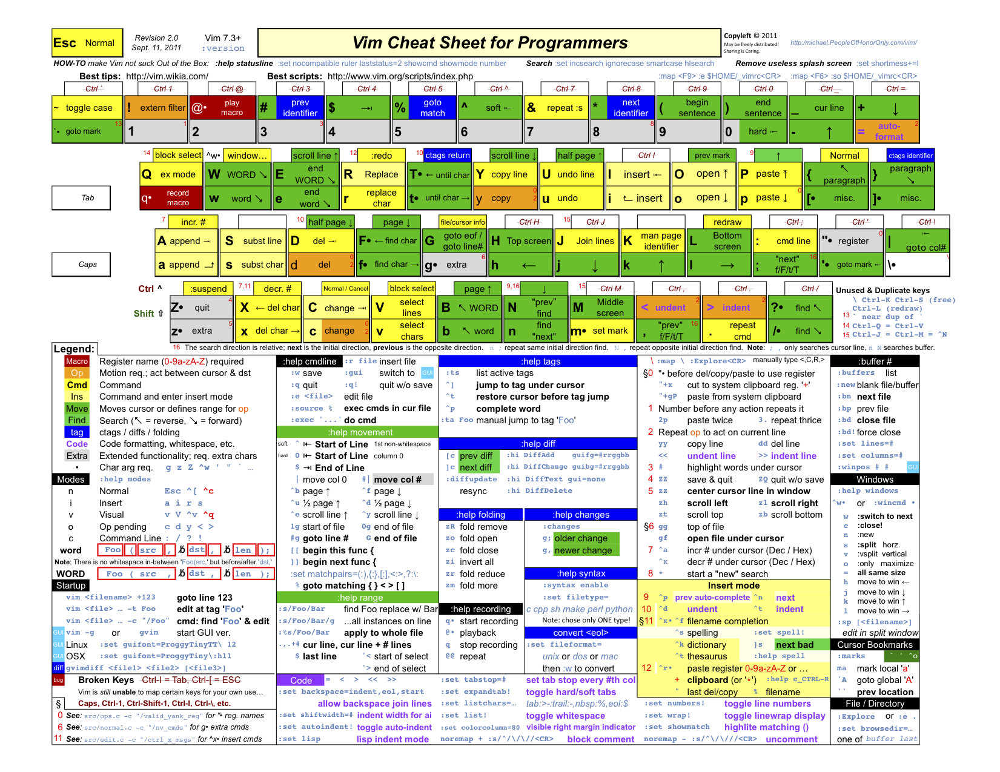

vim，命令行vscode等快捷键

<!--more-->
#### 命令行

|快捷键|说明|
|-|-|
|Tab            |自动补齐|
|Ctril   + C    |中断正在当前正在执行的程序|
|Ctril   + Z    |把当前进程放到后台（之后可用''fg''命令回到前台）|
|Ctril   + L    |清屏|
|Ctril   + M    |等效于回车|
|Ctril   + U    |删除当前输入的全部命令|
|Ctril   + P    |上一条命令，可以一直按表示一直往前翻|
|Ctril   + N    |下一条命令|
|Ctril   + R    |再按历史命令中出现过的字符串：按字符串寻找历史命令|
|Ctril   + A    |移动光标到命令行首|
|Ctril   + E    |移动光标到命令行尾|
|Ctril   + B    |光标后退|
|Ctril   + F    |光标前进|
|Alt/ESC + F    |光标前进一个单词(macs上是esc)|
|Alt/ESC + B    |光标后退一格单词(macs上是esc)|
|Ctril + ]      |从当前光标往后搜索字符串，用于快速移动到该字符串|
|Ctril + Alt ]  |从当前光标往前搜索字符串，用于快速移动到该字符串|
|Ctril + H      |删除光标的前一个字符|
|Ctril + D      |删除当前光标所在字符|
|Ctril + K      |除光标之后所有字符|
|Ctril + U      |清空当前键入的命令|
|Ctril + W      |删除光标前的单词(Word, 不包含空格的字符串)|
|Ctril + \      |删除光标前的所有空白字符|
|Ctril + Y      |粘贴Ctrl W或Ctrl K删除的内容|

#### vscode

|快捷键|说明|
|-|-|
|打开工程        |code + 路径|
|打开指定文件    |ctrl + p|
|打开/关闭终端   |ctrl + ` (1左边的按键)|
|跳转到行        |ctrl + g|
|按单词移动光标  |ctrl + 左右|
|选中单词        |ctrl + d （重复按可以多选）|
|选中行          |ctrl + l （重复按会同时选择下一行）|
|移动行          |alt + 上下|
|格式化代码      |ctrl + shift + i|
|跳转到定义      |f12|
|查看当前文件符号|ctrl + shift + o|
|剪切/复制当前行 |ctrl + x / ctrl + c （什么都不选的时候）|
|切换tab         |alt+数字|
|顺序切换tab     |ctrl + pageup / pagedown|
|关闭文件        |ctrl+w|
|关闭所有文件    |ctrl + k w （ctrl不松手）|

#### vim

|快捷键|说明|
|-|-|
|11j            |向下移动11行|
|11k            |向上移动11行|
|w              |按单词向后移动|
|b              |按单词向前移动|
|f + 字符       |跳转到指定字符（继续按f下一个，shift+f上一个）|
|s + 前缀       |跳转到指定前缀|
|] + e / [ + e  |跳转到上一个/下一个错误|
|] + a / [ + a  |跳转到上一个/下一个参数|
|i              |进入插入模式|
|dw / diw       |删除单词|
|cw / ciw       |删除单词后插入|
|vw / viw       |选中单词 （之后d删除，y复制）|
|p              |粘贴|
|di( / ci( / vi(|删除/修改/选中 括号内的内容|
|di” / ci” / vi”|删除/修改/选中 引号内的内容|
|u              |撤销|
|ctrl + r       |重做|
|2yy            |复制两行|
|p              |粘贴|
|o              |插入新行|
|shift + g      |跳转到最后一行|
|gg             |跳转到第一行|
|:w 或 ctrl + s |保存文件|
|ctrl + /       |打开命令行|

- 也可以参考下面的图

#### !(Bang)命令

|快捷键|说明|
|-|-|
|!!     |执行上一条命令|
|foobar |把上一条命令里的foo替换为bar，并执行|
|!wget  |执行最近的以wget开头的命令|
|!wget:p|仅打印最近的以wget开头的命令，不执行|
|!$     |上一条命令的最后一个参数， 与 Alt - . 和 $_ 相同|
|!*     |上一条命令的所有参|
|!*:p   |打印上一条命令是所有参数，也即 !*的内容|
|^abc   |删除上一条命令中的abc|
|foobar |将上一条命令中的 foo 替换为 bar|
|foobar^|将上一条命令中的 foo 替换为 bar|
|!-n    |执行前n条命令，执行上一条命令： !-1， 执行前5条命令的格式是： !-5|

#### 参考资料

<https://www.cnblogs.com/lvzhenjiang/articles/16655177.html>
<https://linuxstory.org/linux-terminal-keyboard-shortcut-list/>
