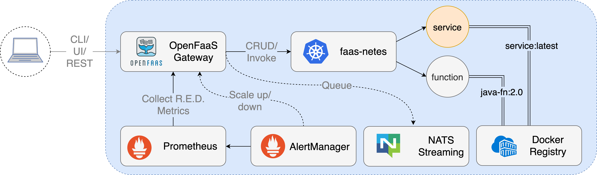
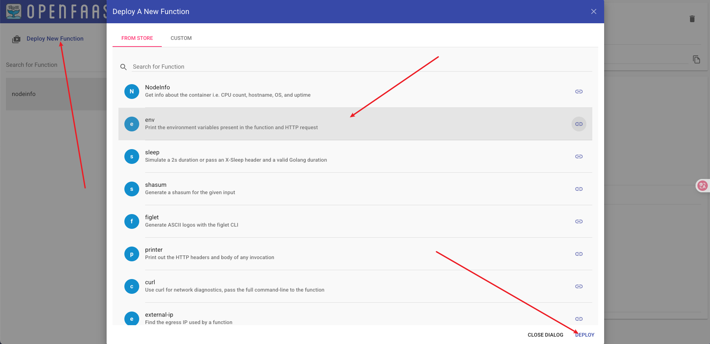
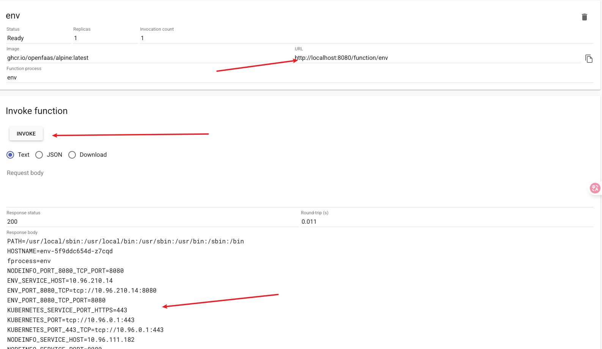

openfaas是一个开源的faas实现，需要注意的是pod缩减为0收费

<!--more-->

#### 架构



#### k8s部署openfaas

- 添加helm的repo

```shell
helm repo add openfaas https://openfaas.github.io/faas-netes/
```

- 部署faas

```shell
kubectl create ns openfaas-fn
helm repo update \
 && helm upgrade openfaas \
  --install openfaas/openfaas \
  --namespace openfaas
```

- 下载faas-cli命令行工具,也可以在[releases][]上下载

```shell
curl -sL cli.openfaas.com | sudo sh
```

#### 使用函数

- 获取登陆密码

```shell
PASSWORD=$(kubectl -n openfaas get secret basic-auth -o jsonpath="{.data.basic-auth-password}" | base64 --decode) && \
echo "OpenFaaS admin password: $PASSWORD"
```

- 转发服务地址到本地的8080，同时浏览器可以通过此地址访问后台ui

```shell
export OPENFAAS_URL=http://127.0.0.1:8080
k port-forward svc/gateway-external 8080:8080
```

- 登陆faas服务

```shell
echo -n $PASSWORD | faas-cli login -g $OPENFAAS_URL -u admin --password-stdin
faas-cli version
```

- webui默认带了一些Function

- 请求函数




- 也可以用curl来请求函数

```shell
curl http://localhost:8080/function/env
# PATH=/usr/local/sbin:/usr/local/bin:/usr/sbin:/usr/bin:/sbin:/bin
# HOSTNAME=env-5f9ddc654d-z7cqd
# fprocess=env
# NODEINFO_PORT_8080_TCP_PORT=8080
# ENV_SERVICE_HOST=10.96.210.14
# ENV_PORT_8080_TCP=tcp://10.96.210.14:8080
# ENV_PORT_8080_TCP_PORT=8080
# KUBERNETES_SERVICE_PORT_HTTPS=443
# KUBERNETES_PORT=tcp://10.96.0.1:443
# ...
```

- 使用客户端请求

```shell
faas-cli invoke env
# Reading from STDIN - hit (Control + D) to stop.
# PATH=/usr/local/sbin:/usr/local/bin:/usr/sbin:/usr/bin:/sbin:/bin
# HOSTNAME=env-5f9ddc654d-z7cqd
# fprocess=env
# NODEINFO_PORT_8080_TCP_PORT=8080
# ENV_SERVICE_HOST=10.96.210.14
# ...
```

#### 使用函数模板

> 官方提供了一个模板商店，提供了一些常用语言的函数模板方便开发

- 下载模版，会在当前目录下创建一个目录`template`

```shell
faas-cli template pull
```

- 查看模板商店

```shell
faas-cli template store list 
```

- 指定下载一个go模板

```shell
faas-cli template store pull golang-http
# Fetch templates from repository: https://github.com/openfaas/golang-http-template
# Wrote 2 template(s) : [golang-http golang-middleware] from https://github.com/openfaas/golang-http-template
```

- 下载了2个模板,结构如下，我们逻辑写在function/handler.go中

```shell
tree template 
# template
# ├── golang-http
# │   ├── Dockerfile
# │   ├── function
# │   │   ├── go.mod
# │   │   ├── go.sum
# │   │   └── handler.go
# │   ├── go.mod
# │   ├── go.sum
# │   ├── main.go
# │   ├── modules-cleanup.sh
# │   └── template.yml
# └── golang-middleware
#     ├── Dockerfile
#     ├── function
#     │   ├── go.mod
#     │   └── handler.go
#     ├── go.mod
#     ├── go.work
#     ├── main.go
#     └── template.yml
# 
# 5 directories, 16 files
```

- 使用golang-http模板创建一个函数

```shell
faas-cli new openfaas-demo --lang golang-http
```

- 会在当前目录下创建一个stack.yaml，可以一个目录也就是我们的函数项目

```shell
tree         
# .
# ├── openfaas-demo
# │   ├── go.mod
# │   ├── go.sum
# │   └── handler.go
# ├── stack.yaml
# └── template
```

- stack.yaml内容如下

```yaml
version: 1.0
provider:
  name: openfaas
  gateway: http://127.0.0.1:8080
functions:
  openfaas-demo:
    lang: golang-http
    handler: ./openfaas-demo
    image: naturelr/openfaas-demo:dev # 需要修改为自己的仓库
```

- 内容如下

```go
// openfaas-demo/handler.go

package function

import (
  "fmt"
  "net/http"  

  handler "github.com/openfaas/templates-sdk/go-http"
)

// Handle a function invocation
func Handle(req handler.Request) (handler.Response, error) {
  var err error

  message := fmt.Sprintf("Body: %s", string(req.Body))

  return handler.Response{
    Body:       []byte(message),
    StatusCode: http.StatusOK,
  }, err
}
```

- 执行编译

```shell
faas-cli build -f stack.yaml 
```

- 上传镜像到仓库

```shell
faas-cli push -f stack.yaml 
```

- 部署函数服务

```shell
faas-cli deploy -f stack.yaml
# Deploying: openfaas-demo.
# 
# Deployed. 202 Accepted.
# URL: http://127.0.0.1:8080/function/openfaas-demo
```

- 请求部署的函数

```shell
faas-cli invoke openfaas-demo        
# Reading from STDIN - hit (Control + D) to stop.
# xxxx
# Body: xxxx
```

##### 配置资源

```yaml
version: 1.0
provider:
  name: openfaas
  gateway: http://127.0.0.1:8080
functions:
  openfaas-demo:
    lang: golang-http
    handler: ./openfaas-demo
    image: naturelr/openfaas-demo:latest
    labels:
     #com.openfaas.scale.zero: true
     lable-test: test
    # 添加资源限制
    limits:
      memory: 40Mi
    requests:
      memory: 20Mi
```

#### 参考资料

- <https://github.com/openfaas/faas-netes/tree/master/chart/openfaas>

- [releases][]

[releases]: <https://github.com/openfaas/faas-cli/releases>
