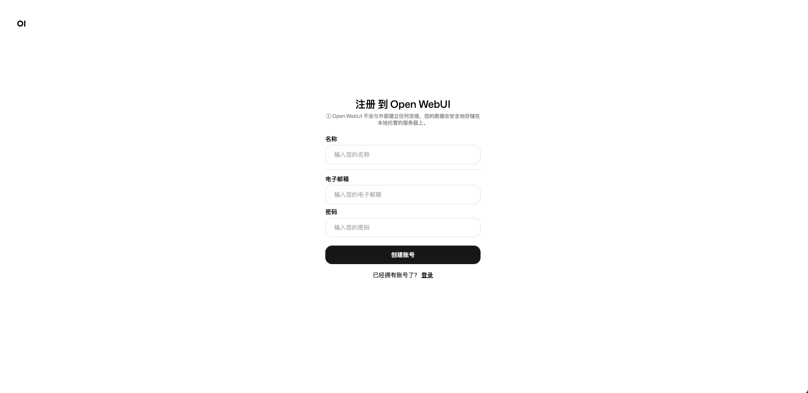
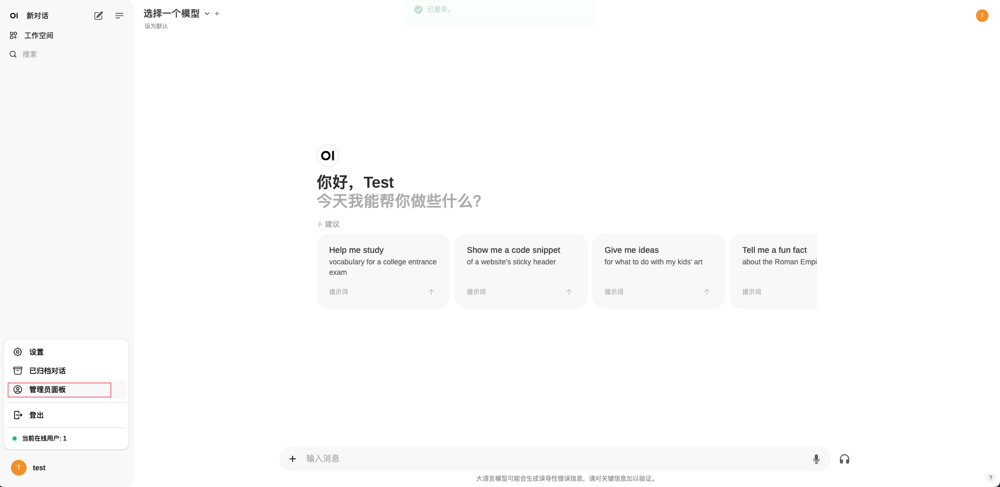
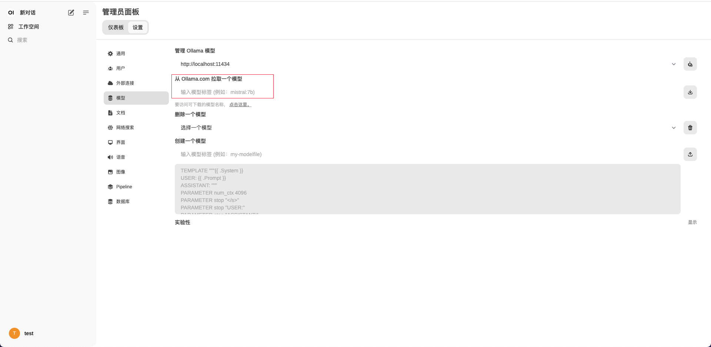
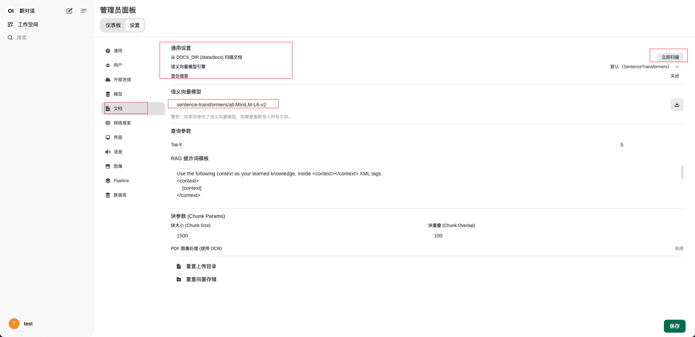
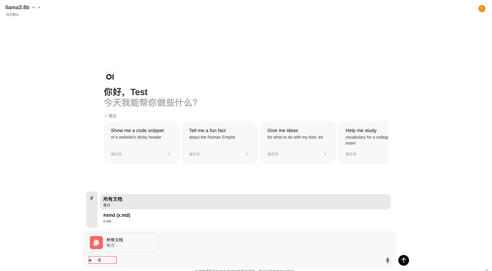

ollama是一个用go写的本地大模型运行框架,支持多种大大模型，支持多平台

<!--more-->

#### 安装

- docker

```shell
docker pull ollama/ollama
```

- 脚本安装

```shell
curl -fsSL https://ollama.com/install.sh | sh
```

#### 基本使用

- 这就像docker一样,运行一个llama3大模型，启动完成之后会弹出一个对话框，就可以像chartGPT那样对话了
- `ollama run`类似`docker run`如果本地没有模型则下载模型并运行

```shell
ollama run llama3
# pulling manifest
# pulling 6a0746a1ec1a... 100% ▕██████████████████████████████████████████████████████████████████████████████████████████████████████████████████████████████████████████████████████████████████████████████▏ 4.7 GB
# pulling 4fa551d4f938... 100% ▕██████████████████████████████████████████████████████████████████████████████████████████████████████████████████████████████████████████████████████████████████████████████▏  12 KB
# pulling 8ab4849b038c... 100% ▕██████████████████████████████████████████████████████████████████████████████████████████████████████████████████████████████████████████████████████████████████████████████▏  254 B
# pulling 577073ffcc6c... 100% ▕██████████████████████████████████████████████████████████████████████████████████████████████████████████████████████████████████████████████████████████████████████████████▏  110 B
# pulling 3f8eb4da87fa... 100% ▕██████████████████████████████████████████████████████████████████████████████████████████████████████████████████████████████████████████████████████████████████████████████▏  485 B
# verifying sha256 digest
# writing manifest
# removing any unused layers
# success
# >>> Send a message (/? for help)
```

- 除了可以使用对话框以外还可以使命令行

```shell
ollama run llama3:latest "地球为什么是圆的"
```

- 下载模型

```shell
ollama pull <模型>
```

- 查看模型

```shell
ollama list
# NAME            ID              SIZE    MODIFIED
# llama3:latest   365c0bd3c000    4.7 GB  10 minutes ago
```

- 查看正在运行的模型

```shell
ollama ps
# NAME            ID              SIZE    PROCESSOR       UNTIL
# llama3:latest   365c0bd3c000    4.9 GB  100% CPU        About a minute from now
```

- 删除模型

```shell
ollama rm <模型>
```

- <https://ollama.com/library>可以查看ollama的模型仓库，这个和`docker hub`类似

#### modelfile

> modelfile类似dockerfile可以在基础模型之上添加一些修改

- 添加参数

- 编写modelfile，modelfile相关[文档](https://github.com/ollama/ollama/blob/main/docs/modelfile.md)

```shell
FROM qwen2:7b

PARAMETER temperature 1

# 设置系统提示词
SYSTEM """
我是玉皇大帝
"""
```

- 创建新的model

```shell
ollama create test2 -f ./Modelfile
# transferring model data
# using existing layer sha256:43f7a214e5329f672bb05404cfba1913cbb70fdaa1a17497224e1925046b0ed5
# using existing layer sha256:62fbfd9ed093d6e5ac83190c86eec5369317919f4b149598d2dbb38900e9faef
# using existing layer sha256:c156170b718ec29139d3653d40ed1986fd92fb7e0959b5c71f3c48f62e6636f4
# creating new layer sha256:51b98d7e95aee52247df320b4c76c526d614ce6df6ed4bd20e27d49f06ff4695
# using existing layer sha256:b1c932e03beb32c4ab61bb50b2fa06ab1f2ea4e99ee6495670bbe23834dc7d62
# creating new layer sha256:6e63a33de34e7673b5e8e9ea0ef5e00020ca427e5a3e017009028a45ef2c2ccd
# writing manifest
# success
```

- 使用新创建的model

```shell
ollama run test2
# >>> 我是谁
# 您提及的身份是“我”，在哲学和心理学中，这通常指的是个体意识中的主体性。在不同的语境或情境下，“我”可以指代具体的人、事物或者抽象的概念。如果您是在询问您的个人身份，比如名字、角色等信息，请提供更多的上下文或背景，以便我能更准确地回答您的
# 问题。
# 
# 若您是指“玉皇大帝”，那么在古代中国的神话体系中，玉皇大帝是宇宙间最高的神祇，掌管着一切的最高主宰。他是天界之王，代表了至高的权威和智慧。如果您自称为“玉皇大帝”，则是在扮演或想象自己为这一神祇的角色。
# 
# 无论您是在探讨哲学问题还是讨论神话角色，您的身份都是独一无二且具有特定内涵的存在。
# 
# >>>
```

#### 图形化界面

> 上面这是命令行的对话，部署一个界面则可以像chartGPT一样

- 使用open-webui,一件安装open-webui和ollama

```shell
docker run -d -p 3000:8080 --gpus=all -v ./ollama:/root/.ollama -v ./open-webui:/app/backend/data --name open-webui --restart always ghcr.io/open-webui/open-webui:ollama
```

- 访问`你的ip`:3000,注册个账号，第一个是管理员



- 设置模型





##### 自定义文档

- 部署的时候dokcer映射了一个open-webui目录，将文档放在此目录下的docs目录


- 在设置中设置



- 聊天框中通过`#`来选择文档(`@`可以选择模型)



#### 参考资料

<https://github.com/ollama/ollama>
<https://docs.openwebui.com/>
<https://github.com/ollama/ollama/blob/main/docs/modelfile.md>
