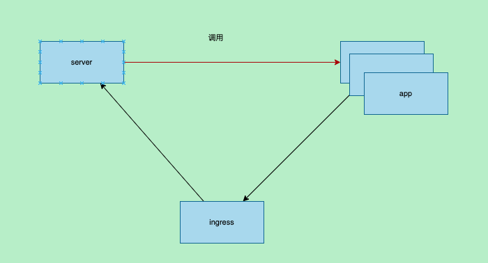
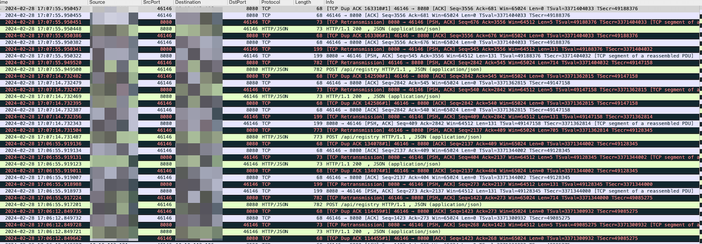
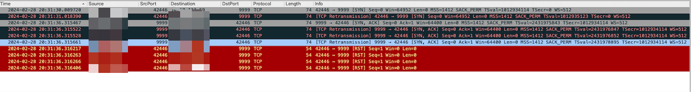
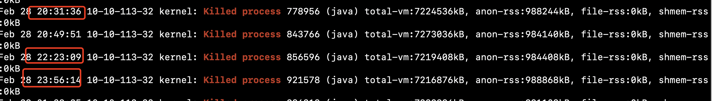

title: 记一次k8s节点网络重传排查
author: Nature丿灵然
tags:
  - 网络
  - 故障处理
date: 2024-03-05 15:05:00
---

值班的时候有用户报障他们的一个定时job有超时，他们自己抓包发现网络有重传认为我们的k8s网络有问题

看了下历史记录问，题是去年提出的，之前同事已经测试过长ping，且抓包未发现异常，他们发现访问的服务端和客户端的pod都在同一个节点上，怀疑用户业务自身问题

<!--more-->

#### 经过

年后来了之后，用户依然出现超时问题，查看用户集群有ingress询问用户是否经过ingress过到服务端，且用户反应出现此类问题的不只是这一个业务以及测试集群也有出现

从现象来看此时我也认为是客户自身业务导致，但是客户坚持认为和业务没关系

客户提供了一个是集群让我们测试，以及出问题的pod

于是就在客户的测试集群中使用ab测试出问题的那些pod的网络情况，并没有发现问题,因为ab没有按时间探测的功能所有把包给加大了，测试了同node和不同node

```shell
ab -c 10 -t 1000 -n 10000000 http://<ip>/
```

在测试3天之后发现ab中偶有超时最长是1000ms+，此时怀疑可能网络有问题了但不是那么的确定，因为重传有很多原因

同时登录上客户的机器看了cpu，内存等情况，发现客户的内存的free很少，网卡有丢包统计但是不是很多`ethtool -S etho`等命令查看队列等，没有发现太多相关性

客户表示出问题已经几个月且没有啥变更，同时我们和技术支持还有部门其他同事一块开了个会议，其他同事也进行了排查也没发现问题所在，且怀疑svc导致的得到的答复并没有svc，是pod和pod直接连接

同时我们提出试试重启pod来尝试下，我又用ab压测的同时抓包，且约了客户会议

抓包的结果有大量的rst，改下之后rst减少所以我认为这个属于压测问题

和客户会议得知客户的服务调用链和我们之前了解的略有出入,此时心中感觉有些希望

整个调用链中多了个ingress，我觉得可能是ingress导致的，查看了下ingress日志也没发现一些异常，询问用户是否可以排除ingress直接访问得到了否定的结果



和客户会议后的第二天客户表示问题依然出现，客户部署了监控之后我们看监控也是正常的

此时想抓出问题的时候的ingress包，则在客户的生产环境的node上执行了一个抓包，同时查看tcp重传相关

```shell
nohup  tcpdump -i any src host <src_ip> and dst host <dest_ip> -w test.pcap &
```

经过一夜抓包之后使用wireshark分析发现有大量的重传和重复确认的包，在分析包中的时候顺吧看了下系统日志,发现里面有一些oom且内存free较少，将oom和内存的情况反馈给客户



同时让客户看了下服务端的资源情况也没发现异常，客户反馈oom的是logstash并问是否有关系，我回复关系不大

此时将抓包的截图发给网络的同事让帮看看，网络的同事一看说你抓包有问题，因为在tcpdump中`-i`参数使用了any，机器内的包经过了2个网卡就会出现wireshark中有大量的重传和重复确认包

恍然大悟于是改进了抓包机制，只抓pod网卡的包摒弃了`-i any`参数

又抓了一夜的包。。。

不如意外故障依旧，但这次抓包中就没有满屏的重传和重复确认包，但是依然有重传且和客户超时的时间前后脚



同时将截图发给了网络的同事帮确认下，他们怀疑丢包，但是需要2端同时抓包来确认丢包

已经连续抓包了好几次这次想彻底一点，让网络的同事从底层抓包将所有的客户端和server都进行抓包

中途上厕所遇到了负责内核的同事，他也参加了和客户的会议，我将我这几天的情况告诉他，他说等会他看下

他登录到机器之后和我们之前一样查了下cpu，内存等资源，最后他在看日志的时候发现oom了，他说这个可能会导致网络超时，

我问他为啥 他说内核在执行oom的时候会放下其他工作专注杀死oom的进程，但是杀死的进程时间太长了就可能导致网络收发包出问题



没错就是那个oom的logstash！！！

于是让客户将这个logstash加大内存，客户加了内存之后k8s将其调度到其他地方

处理了oom第二天之后询问客户没有发现超时问题，为了防止被打脸就延长了网络的抓包时间

新的一周开始问客户是否还发生，结果没发生。

#### 总结

1. 应该及时和客户沟通获取业务的调用链

2. wireshark分析会被`-i any`干扰

3. 内核oom的时候会停止网络收发包等工作导致网络超时，至于oom事件过长是因为logstash有大约几百个线程

#### 参考资料

<https://cloud.tencent.com/developer/article/1404089>
